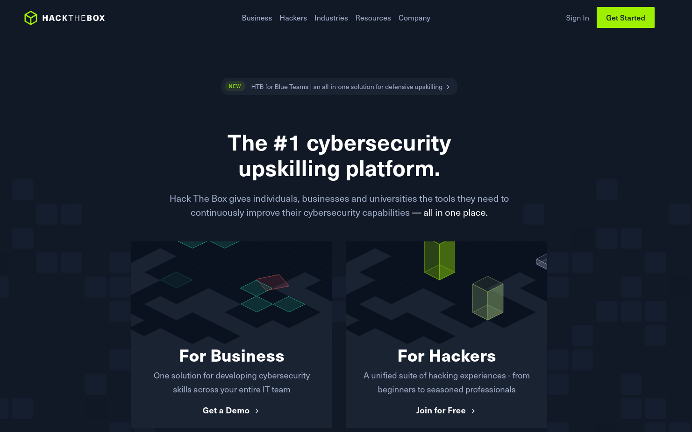

<h1 class="mume-header" id="mainindexhtml-nbspnbsp-contactcontacthtml"><a href="deusx7.github.io/index.html">Root</a>&#xA0;&#xA0;&#xA0; <a href="/Posts/THM/index.html">Tryhackme</a>&#xA0;&#xA0;&#xA0;</h1>

---
### HackTheBox

**Introduction:**

Hack The Box gives individuals, businesses and universities the tools they need to  
continuously improve their cybersecurity capabilities — all in one place.

**Why Choose HackTheBox:**

**Boxes & Challenges:**

- **Boxes:** Vulnerable virtual machines with different difficulty levels and diverse operating systems. Your mission is to discover vulnerabilities, obtain a user and root flag, and submit them before the flag rotation.
- **Challenges:** Bite-sized applications for pentesting techniques categorized as Easy, Medium, and Hard. Your goal is to attack and conquer these challenges, earning Points, Badges, and Respect.

**Ranks, Points, and Game Elements:**

- **Points System:** Earn Points based on completing Boxes, Challenges, Endgames, or Fortresses, contributing to global rankings. Points Formula determines the allocation.
- **Ranks:** Progress through Noob to Omniscient by increasing Ownership percentage, unlocking perks like Fortresses and Endgames at higher levels.

**Free and VIP Accounts:**

- **Free Account:** Access to 20 weekly Active Boxes, Challenges, and Helpdesk.
- **VIP Account:** Exclusive access to all Hack The Box content, including Retired Boxes, official write-ups, and videos. VIP accelerates the learning process with additional features.

**The Dashboard:**

- **User-Centric Design:** A redesigned Dashboard for an intuitive and captivating user experience.
- **Navigation Menu:** Explore profile stats, labs, rankings, careers, education, and social interactions.
- **Search Functionality:** Enhanced search allows filtering for Boxes, Challenges, Users, and Teams.
- **Profile Visibility:** Choose to make your profile public, showcasing progress, achievements, and a public profile link.

**Progress Analysis:**

- **Overview Tab:** Track your progress in labs, filterable by time period.
- **Skill Breakdown:** Analyze your skill development in Boxes, Challenges, Fortresses, and Endgames.
- **Pro Labs Progress Report:** View progress in Pro Labs with navigation arrows for different labs.

**Badges:**

- **Achievement Recognition:** Earn Badges for accomplishments, displayed on your public and community profiles.
- **Categories:** Badges are categorized, serving as proof of dedication, attention to detail, and curiosity.

**Join HackTheBox:**

Signup for the [HackTheBox](https://app.hackthebox.com/invite) platform and take your pen-testing and cyber security skills to the next level!

- [[Oct 21 2023]] [CozyHosting](https://deusx7.github.io/Posts/HTB/Writeups/CozyHosting/CozyHosting.html) `Command Injection, Linux Privilege Escalation, PostgreSQL, Session Hijacking, Hash Cracking`
