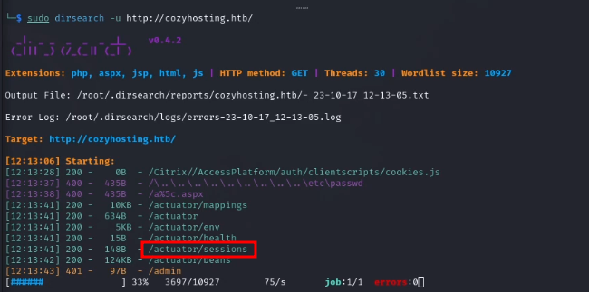

# CozyHosting 

DIFFICULTY: EASY 

# Introduction 

This is an easy-rated Linux machine from Hackthebox. It contains Directory Enumeration, Session Hijacking, PostgreSQL, Privilege Escalation, Hash Cracking, and Command Injection. 
# Initial Access 

To kick off our reconnaissance, I initiated a Nmap scan to discover open ports and services on the target machine. 

From the Nmap scan, we can see there are multiple services running on the machine including a HTTP server. I attempted to access the web server on port 80 and it was resolving to a domain cozyhosting.htb the page wasn't loading so I decided to add the IP address of our target to the /etc/hosts file in order for the page to load properly. 

 

after that, we are able to access the site. 

 

Going through the website and checking all links I landed at a login page requesting a username and password which I haven't yet obtained so I needed to find a way to log in. 

While I was checking through the page source code and doing some research to see if I could find any known exploits for the version of technologies in use on the website, I ran a directory enumeration scan in the background to see if I could find any hidden directory using dirsearch. 
 

I discovered a directory that contained session cookies which could be used to log in as an authorized user. 
 
 

so the next step is to copy the cookie, launch developer tools (ctrl + shift + i), navigate to storage, and replace the cookie there with the authorized one. 

Now all that's left to do is refresh the page and we gain access. 

 
Scrolling down the page there is a request to enter a hostname and username, looks like it's for an SSH connection. As I don't have any credentials I start to look around the webpage and find any clues or hints. I discovered that anything passed into the fields was being executed as an SSH command. So I started up Burpsuite to intercept the request in order to use a repeater to test various arbitrary commands. 

 
since I knew it could execute shell commands I decided to try and get a reverse shell by creating a shell.sh script containing simple bash reverse shell online from https://www.revshells.com/, starting a python server in the same directory as my script in order to host it so I can download it on the target machine using curl. After that change the permission to make sure it can be executed and lastly start a Netcat listener and run the script. Noticing that there can't be any space between the commands because burpsuite won't interpret the request properly, I instead add ${IFS} which basically equates to nothing so it can serve as a space. 
 
 

# Privilege Escalation 

Now that we have access to the machine, it's time to find flags and escalate our privilege to possibly root! After thoroughly examining the machine and finding no flag, I decided to transfer a Linpeas script to the target machine to help in the enumeration of privilege escalation vectors. After Linpeas finished running I decided to download a jar file I saw in the initial directory I was spawned in when I gained access. Downloaded the file from Target to my host machine and unzipped it. It extracted multiple folders containing lots of files so I just grepped for the word "password" using the command `egrep "passowrd" iR .` and ended up finding a password. 

 
With this password, I decided to use it to log in to the Postgresql database that I discovered from reading the Linpeas result and it can also be guessed that it is 
a database password by the "spring.datasource" in the above image. 

**NOTE**: If you're reading this for a guide remember to stabilize your shell or else you won't be able to log in. After logging into the database I discovered a database called cozyhosting and a table named users which contained password hashes that can be cracked. So I copied and pasted them to my attack machine to start cracking it using hashcat `hashcat -a 0 -m 3200 hash.txt /usr/share/wordlists/rockyou.txt` . 
 
 

with this password, I can try to ssh as Josh and get the first flag `ssh josh@10.10.11.230`. 
 

Now to escalate to root. User Josh has sudo permission for the /usr/bin/ssh binary. A quick search on https://gtfobins.github.io/ gives info on how to spawn a root shell `sudo ssh -o ProxyCommand=';sh 0<&2 1>&2' x` 

 

GGs 🤝
