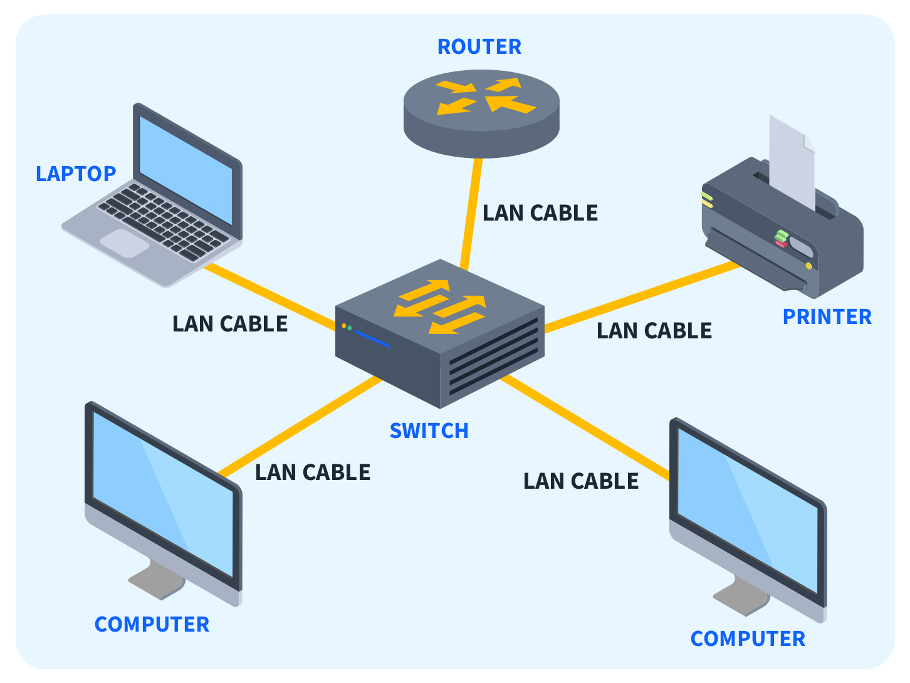
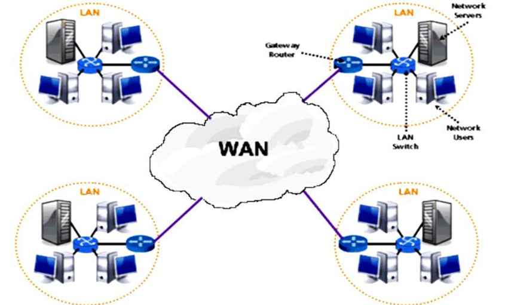
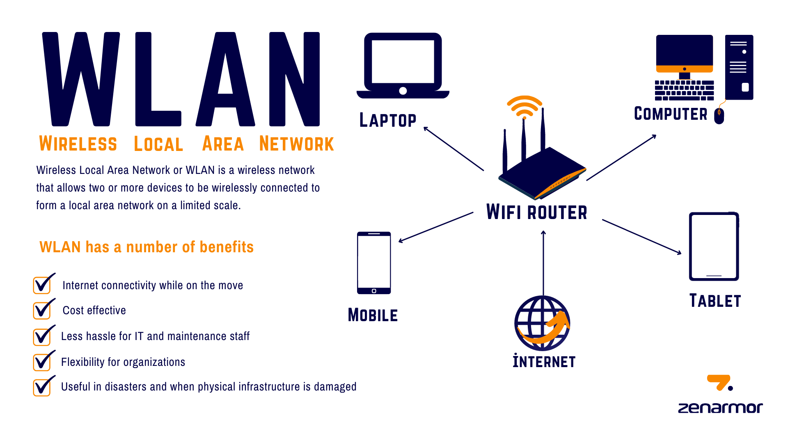
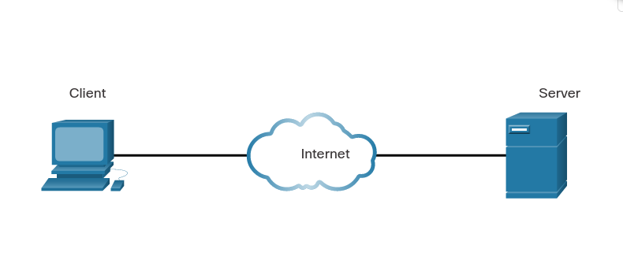
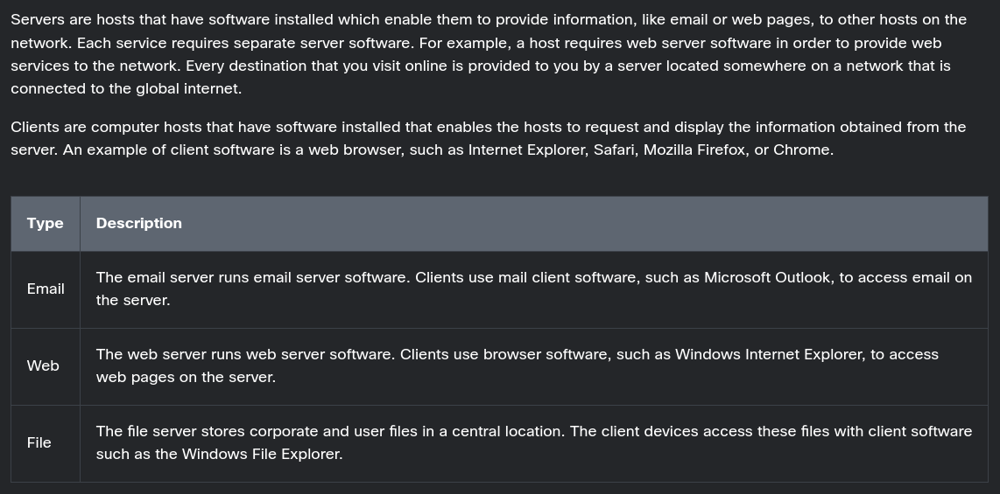
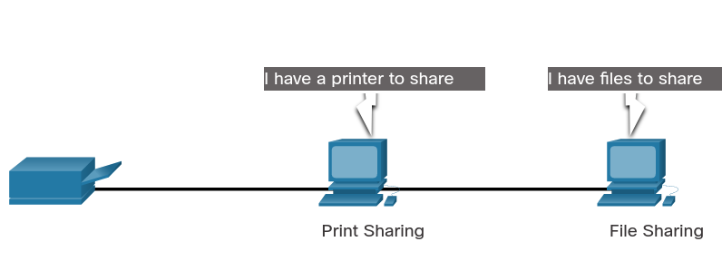
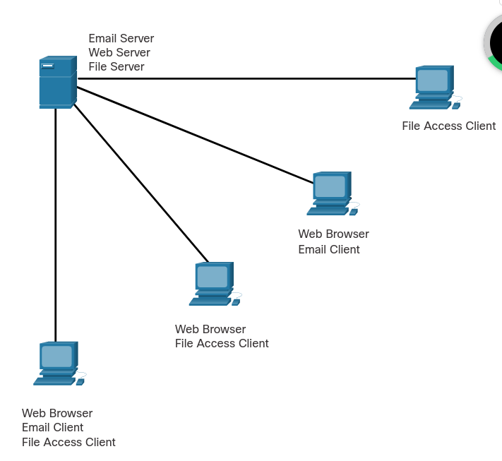
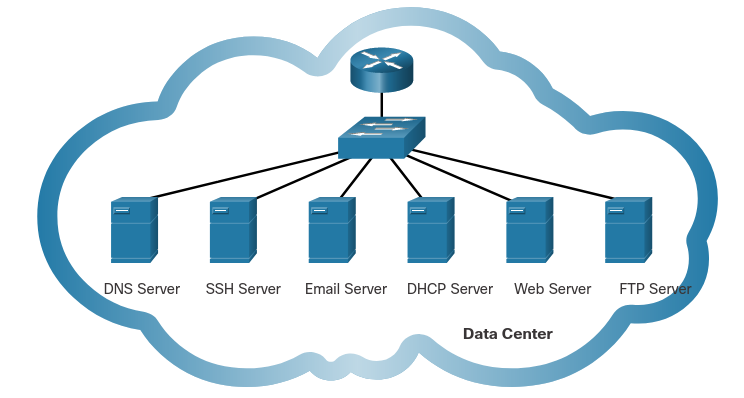

# Introduction to Networking

Networking is the foundation of modern communication, allowing devices to connect and share resources across different environments. Whether it's sending an email, browsing the web, or accessing files from a remote server, networking makes it all possible. In this course, we'll explore the basics of networking, covering essential concepts and technologies that power today's interconnected world.

# What is a Network?

A network is a collection of interconnected devices, such as computers, servers, and networking hardware, that communicate with each other to share resources and information. Networks can be as simple as a few devices connected in a home or as complex as thousands of machines spread across the globe.

# Types of Networks

## 1. Local Area Network (LAN)

A local area network, or LAN, is the most common network type. It allows users to connect within a short distance in a common area. Once they connect, users have access to the same resources. For example, you might use a LAN when you connect your laptop to the internet at your home and print a document from a printer on the same network.

 **Key Features:**
 
- High data transfer rates.
- Limited geographic range (usually within a single building or campus).
- Typically owned, controlled, and managed by a single organization.

## 2. Wide Area Network (WAN)

A wide area network, or a WAN, is an extensive network that's not confined to geographical space. Corporations and international companies may use WANs to provide a common network with far-reaching connectivity. For example, remote workers who use the internet to access information from their company make use of a WAN.

**Key Features:**

- Lower data transfer rates compared to LANs.
- Large geographic range, connecting different regions or countries.
- Often involves leased telecommunication lines or satellite links.
- Usually managed by multiple organizations or service providers.

## 3. Wireless local area network (WLAN)

A wireless local area network, or WLAN, operates similarly to a LAN because it transmits data within a small area. It's rarely necessary to have a wired connection for devices that use a WLAN. While typically less secure and slightly weaker than other networks, a WLAN provides users with the flexibility to use their devices in various locations. For example, a user might connect a baby monitor to a WLAN to ensure the device remains operational wherever their child sleeps.

**Key Features**:

- Wireless Communication
- Mobility
- Coverage Area
- Flexibility

## Differences Between LAN and WAN

- **Geographic Scope:**
    
    - **LAN:** Confined to a small geographic area (e.g., a single building or campus).
    - **WAN:** Covers large geographic areas, potentially across multiple cities or countries.
- **Speed:**
    
    - **LAN:** Generally faster with higher data transfer rates (up to 10 Gbps or more).
    - **WAN:** Slower due to the vast distances and the different technologies used (usually up to 100 Mbps).
- **Ownership:**
    
    - **LAN:** Typically owned, managed, and maintained by a single organization or individual.
    - **WAN:** Often maintained by multiple entities, such as Internet Service Providers (ISPs), and may require leased lines.
- **Cost:**
    
    - **LAN:** Lower setup and maintenance costs due to the limited scale.
    - **WAN:** Higher costs due to the need for more complex infrastructure and leased lines.

# IP Addresses

IPv4 (Internet Protocol version 4) and IPv6 (Internet Protocol version 6) are two versions of the Internet Protocol, which is the underlying protocol that enables communication on the internet. They are used to identify and locate devices on a network.

IPv4 addresses are 32-bit numerical addresses represented in a dotted-decimal format, such as "192.168.0.1". Each section, or octet, of the address consists of 8 bits and can range from 0 to 255. This allows for a total of approximately 4.3 billion unique addresses. However, due to the rapid growth of the internet, the number of available IPv4 addresses has become limited, leading to the development of IPv6.

IPv6 addresses are 128-bit addresses represented in a hexadecimal format, such as "2001:0db8:85a3:0000:0000:8a2e:0370:7334". The longer address length of IPv6 allows for a significantly larger number of unique addresses, approximately 3.4×10^38. IPv6 addresses are divided into eight groups of four hexadecimal digits, separated by colons. Leading zeros within a group can be omitted, and consecutive groups of zeros can be represented by a double colon (::) to simplify the address.

The transition from IPv4 to IPv6 is necessary due to the depletion of available IPv4 addresses. IPv6 provides a solution to the address shortage while also introducing improvements in security, auto-configuration, and other features. However, IPv4 and IPv6 are not directly compatible, so various mechanisms and transition technologies exist to enable communication between the two protocols.

In summary, IPv4 and IPv6 are versions of the Internet Protocol that provide unique addresses to devices on a network. IPv4 addresses are 32-bit, while IPv6 addresses are 128-bit. IPv6 offers a larger address space and additional features compared to IPv4.

# MAC Addresses 

A MAC (Media Access Control) address is a unique identifier assigned to network interface controllers (NICs) of network devices. It is a hardware address that is permanently assigned by the manufacturer and is stored in the device's firmware or read-only memory (ROM). MAC addresses are used at the data link layer of the OSI model to ensure that data is delivered to the correct device within a local network.

MAC addresses are typically 48 bits in length and are expressed as a sequence of six pairs of hexadecimal digits separated by colons or hyphens. For example, a MAC address may look like "00:1A:2B:3C:4D:5E". The first three pairs of digits identify the manufacturer of the network interface card, while the last three pairs provide a unique identifier for the specific device.

MAC addresses play a crucial role in Ethernet networks, as they allow devices to communicate with each other within a local area network (LAN). When data is sent from one device to another on the same network, it is encapsulated within Ethernet frames that contain the source and destination MAC addresses. Routers and switches use these MAC addresses to forward the data to the appropriate destination.

It's important to note that MAC addresses are specific to the local network and do not have global uniqueness like IP addresses. They are only relevant within the scope of the local network segment. When data needs to be transmitted beyond the local network, it is encapsulated in network packets that contain source and destination IP addresses.

In summary, a MAC address is a unique identifier assigned to the network interface controller of a device. It is used at the data link layer to facilitate communication within a local network. MAC addresses are hardware-based, manufacturer-specific, and differ from IP addresses, which are used for network communication on a larger scale.

# Network Infrastructure Devices

When starting in networking, it's essential to understand the different devices that make up a network's infrastructure. These devices are the backbone of any network, enabling communication between computers, servers, and other devices. Here's a basic overview of the key network infrastructure devices you need to know.

#### 1. **Router**

A router is a critical device in networking. It connects multiple networks and directs data packets between them. Routers operate at the network layer (Layer 3) of the OSI model. They determine the best path for data to travel from one network to another using routing tables and protocols. Routers are commonly used to connect home or office networks to the internet.

**Key Functions:**

- Forwarding data packets between different networks.
- Assigning IP addresses to devices within a network (if it has a DHCP server).
- Filtering traffic based on security rules.

![[attachments/Pasted image 20240813143652.png]]

#### 2. **Switch**

Switches are used to connect devices within a single network, typically within a Local Area Network (LAN). They operate at the data link layer (Layer 2) of the OSI model and use MAC addresses to forward data to the correct destination. Switches create a direct connection between the sending and receiving devices, ensuring that data only reaches the intended recipient.

**Key Functions:**

- Forwarding data to specific devices within a network.
- Reducing network congestion by dividing a network into segments.
- Enabling communication between multiple devices within the same network.

![[attachments/Pasted image 20240813143720.png]]

#### 3. **Hub**

A hub is a basic networking device that connects multiple devices in a network. Unlike a switch, a hub does not direct data to specific devices. Instead, it broadcasts data to all connected devices, regardless of the intended recipient. This can lead to network congestion and collisions, making hubs less efficient than switches. Hubs operate at the physical layer (Layer 1) of the OSI model.

**Key Functions:**

- Connecting multiple devices within a network.
- Broadcasting data to all devices in a network.
- Operating as a simple, low-cost solution for basic networking needs.

![[attachments/Pasted image 20240813143804.png]]
#### 4. **Access Point (AP)**

An access point is a device that allows wireless devices to connect to a wired network using Wi-Fi. It extends the wireless coverage of a network and is commonly used in homes, offices, and public places to provide internet access to mobile devices like smartphones, laptops, and tablets. Access points operate at the data link layer (Layer 2) of the OSI model.

**Key Functions:**

- Providing wireless connectivity to devices.
- Extending the range of a wired network.
- Managing connections and security for wireless clients.

![[attachments/Pasted image 20240813143902.png]]

#### 5. **Firewall**

A firewall is a network security device that monitors and controls incoming and outgoing network traffic based on predefined security rules. Firewalls can be hardware-based, software-based, or a combination of both. They are critical for protecting networks from unauthorized access, cyber threats, and data breaches. Firewalls typically operate at the network layer (Layer 3) but can also function at higher layers.

**Key Functions:**

- Blocking unauthorized access to the network.
- Allowing or denying traffic based on security policies.
- Protecting against malicious activities like hacking, viruses, and malware.

![[attachments/Pasted image 20240813144017.png]]
#### 6. **Network Interface Card (NIC)**

A Network Interface Card (NIC) is a hardware component that allows a computer or other device to connect to a network. NICs can be built into the device's motherboard or added as an expansion card. They can provide either wired (Ethernet) or wireless (Wi-Fi) connectivity. NICs operate at the data link layer (Layer 2) of the OSI model.

**Key Functions:**

- Enabling devices to connect to a network.
- Providing a physical interface for wired or wireless communication.
- Handling data transmission and reception between a device and the network.

![[attachments/Pasted image 20240813144038.png]]
#### 7. End Devices

End devices are the devices that users interact with directly and that generate or receive data in a network. These devices typically include computers, smartphones, tablets, printers, and IoT devices. They are the final point of communication within a network, either sending or receiving data. Examples of end devices (Computers, smartphones, printers, IoT devices).

**Key Functions:**

- Data Generation.
- Data Reception.
- User Interaction.
- Network Access.
![[attachments/Pasted image 20240813144148.png]]

# Networking Models

## TCP/IP Model

The TCP/IP model, also known as the Internet Protocol Suite, is the conceptual framework for communication protocols used on the internet and similar networks. It defines how data should be packetized, addressed, transmitted, routed, and received to reach its destination. The model is named after two of its most important protocols: the Transmission Control Protocol (TCP) and the Internet Protocol (IP).
Layers of the TCP/IP Model

The TCP/IP model is organized into four distinct layers, each responsible for specific aspects of data communication:

### 1. Application Layer

Purpose: The Application Layer is the topmost layer of the TCP/IP model and is closest to the end-user. It provides protocols that allow software applications to communicate with each other across the network.

Functions:

- Facilitates communication between applications on different devices.
- Provides protocols for email (SMTP), file transfer (FTP), web browsing (HTTP/HTTPS), and more.
- Manages application-specific data formats and ensures that data is properly packaged for transmission.

Examples of Protocols: HTTP, HTTPS, FTP, SMTP, DNS, Telnet.

### 2. Transport Layer

Purpose: The Transport Layer is responsible for ensuring reliable data transfer between devices. It manages end-to-end communication, error-checking, and flow control.

Functions:
- Provides connection-oriented communication using TCP, ensuring data is delivered reliably and in the correct order.
- Supports connectionless communication using UDP (User Datagram Protocol) for faster, but less reliable, data transmission.
-  Handles segmentation and reassembly of data into packets for transmission.
- Manages error detection and recovery, as well as flow control to prevent network congestion.

Examples of Protocols: TCP, UDP.

### 3. Internet Layer

Purpose: The Internet Layer is responsible for logical addressing, routing, and packet forwarding. It determines the best path for data to travel from the source to the destination.

Functions:

- Assigns IP addresses to devices on the network, ensuring that data is sent to the correct destination.
- Routes data packets across multiple networks and devices, using IP addresses to determine the best path.
-  Manages packet fragmentation and reassembly, breaking down large data packets into smaller ones for efficient transmission.

Examples of Protocols: IP (Internet Protocol), ICMP (Internet Control Message Protocol), ARP (Address Resolution Protocol), IGMP (Internet Group Management Protocol).

### 4. Network Access Layer (Link Layer)

Purpose: The Network Access Layer, also known as the Link Layer, is responsible for the physical transmission of data over the network. It deals with the hardware and media used to transmit data, such as cables, switches, and wireless signals.

Functions:
- Encapsulates data into frames for transmission over the physical medium.
- Handles MAC (Media Access Control) addresses to identify devices on the same local network.
- Manages access to the physical network, determining how data is placed onto the network medium.
- Detects and corrects errors that may occur during the physical transmission of data.

Examples of Protocols: Ethernet, Wi-Fi (IEEE 802.11), ARP (Address Resolution Protocol).

Importance of the TCP/IP Model

The TCP/IP model is foundational to the modern internet and has been widely adopted as the standard for networking protocols. It is simpler and more flexible than other networking models, such as the OSI (Open Systems Interconnection) model, which makes it more practical for real-world applications. Understanding the TCP/IP model is essential for anyone working in networking, cybersecurity, or IT infrastructure, as it underpins the protocols and technologies that keep the internet and other networks running smoothly.
##  The OSI Model

The OSI (Open Systems Interconnection) model is a conceptual framework that standardizes the functions of a communication system into seven distinct layers. Each layer has specific responsibilities and interacts with the layers above and below it. The OSI model provides a structured approach to understanding and designing network protocols and communication systems. Here's a brief overview of each layer:

1. Physical Layer: The physical layer is responsible for the transmission and reception of raw unstructured data bits over a physical medium. It defines the electrical, mechanical, and functional characteristics of the physical interface between devices.
2. Data Link Layer: The data link layer handles the reliable transmission of data frames between directly connected nodes over a physical link. It provides error detection and correction, flow control, and handles access to the physical medium. Ethernet, Wi-Fi, and PPP (Point-to-Point Protocol) are examples of data link layer protocols.
3. Network Layer: The network layer enables the routing of data packets across different networks. It deals with logical addressing and determines the best path for data delivery based on network conditions and routing protocols. The IP (Internet Protocol) is a key network layer protocol.
4. Transport Layer: The transport layer ensures the reliable and orderly delivery of data between end systems. It breaks data into smaller segments, manages end-to-end communication, and provides error recovery, flow control, and congestion control. TCP (Transmission Control Protocol) and UDP (User Datagram Protocol) operate at this layer.
5. Session Layer: The session layer establishes, manages, and terminates communication sessions between applications. It provides synchronization and dialog control mechanisms to enable seamless communication between devices. This layer also handles session checkpointing and recovery.
6. Presentation Layer: The presentation layer is responsible for data representation, encryption, compression, and formatting. It ensures that data sent by the application layer of one system is understandable by the application layer of another system. This layer deals with data syntax and semantics.
7. Application Layer: The application layer is the closest layer to the end-user and provides services directly to user applications. It includes protocols for various application-level services such as file transfer, email, web browsing, and remote access. Examples of protocols at this layer include HTTP, SMTP, FTP, and DNS.

The key idea behind the OSI model is to separate the complex task of network communication into manageable layers, with each layer focused on specific functions. This modular approach facilitates interoperability, ease of implementation, and troubleshooting in network systems.

It's important to note that the OSI model is a conceptual model and does not necessarily reflect the exact implementation of all networking systems, which often use a hybrid of various layers and protocols. However, the OSI model remains a useful reference for understanding network communication and protocols.
# Client and Server

All computers connected to a network that participate directly in network communication are classified as hosts. Hosts can send and receive messages on the network. In modern networks, computer hosts can act as a client, a server, or both, as shown in the figure. The software installed on the computer determines which role the computer plays.

Client and server software usually run on separate computers, but it is also possible for one computer to run both client and server software at the same time. In small businesses and homes, many computers function as the servers and clients on the network. This type of network is called a peer-to-peer (P2P) network.

The simplest P2P network consists of two directly connected computers using either a wired or wireless connection. Both computers are then able to use this simple network to exchange data and services with each other, acting as either a client or a server as necessary.

Multiple PCs can also be connected to create a larger P2P network, but this requires a network device, such as a switch, to interconnect the computers.

The main disadvantage of a P2P environment is that the performance of a host can be slowed down if it is acting as both a client and a server at the same time. The figure lists some of the advantages and disadvantages of peer-to-peer networks.

In larger businesses, because of the potential for high amounts of network traffic, it is often necessary to have dedicated servers to support the number of service requests.

The advantages and disadvantages of P2P networking are summarized in the figure.

The advantages of peer-to-peer networking:

- Easy to set up
- Less complex
- Lower cost because network devices and dedicated servers may not be required
- Can be used for simple tasks such as transferring files and sharing printers

The disadvantages of peer-to-peer networking:

- No centralized administration
- Not as secure
- Not scalable
- All devices may act as both clients and servers which can slow their performance

A computer with server software can provide services simultaneously to one or many clients, as shown in the figure.

Additionally, a single computer can run multiple types of server software. In a home or small business, it may be necessary for one computer to act as a file server, a web server, and an email server.

A single computer can also run multiple types of client software. There must be client software for every service required. With multiple clients installed, a host can connect to multiple servers at the same time. For example, a user can check email and view a web page while instant messaging and listening to internet radio.

# Why Protocols Matter

Just like humans, computers use rules, or protocols, in order to communicate. Protocols are required for computers to properly communicate across the network. In both a wired and wireless environment, a local network is defined as an area where all hosts must "speak the same language," which, in computer terms, means they must "share a common protocol."

If everyone in the same room spoke a different language, they would not be able to communicate. Likewise, if devices in a local network did not use the same protocols, they would not be able to communicate.

Networking protocols define many aspects of communication over the local network. As shown in the table, these include message format, message size, timing, encoding, encapsulation, and message patterns

| **Protocol Characteristic** | **Description**                                                                                                                                                                                                                                                                                                                                                                                                                                                     |
| --------------------------- | ------------------------------------------------------------------------------------------------------------------------------------------------------------------------------------------------------------------------------------------------------------------------------------------------------------------------------------------------------------------------------------------------------------------------------------------------------------------- |
| **Message format**          | When a message is sent, it must use a specific format or structure. Message formats depend on the type of message and the channel that is used to deliver the message.                                                                                                                                                                                                                                                                                              |
| **Message size**            | The rules that govern the size of the pieces communicated across the network are very strict. They can also be different, depending on the channel used. When a long message is sent from one host to another over a network, it may be necessary to break the message into smaller pieces in order to ensure that the message can be delivered reliably.                                                                                                           |
| **Timing**                  | Many network communication functions are dependent on timing. Timing determines the speed at which the bits are transmitted across the network. It also affects when an individual host can send data and the total amount of data that can be sent in any one transmission.                                                                                                                                                                                        |
| **Encoding**                | Messages sent across the network are first converted into bits by the sending host. Each bit is encoded into a pattern of sounds, light waves, or electrical impulses depending on the network media over which the bits are transmitted. The destination host receives and decodes the signals in order to interpret the message.                                                                                                                                  |
| **Encapsulation**           | Each message transmitted on a network must include a header that contains addressing information that identifies the source and destination hosts, otherwise it cannot be delivered. Encapsulation is the process of adding this information to the pieces of data that make up the message. In addition to addressing, there may be other information in the header that ensures that the message is delivered to the correct application on the destination host. |
| **Message pattern**         | Some messages require an acknowledgment before the next message can be sent. This type of request/response pattern is a common aspect of many networking protocols. However, there are other types of message patterns that do not require an acknowledgment, depending on the protocol and the situation.                                                                                                                                                          |
#  TCP, UDP, and the Three-Way Handshake

TCP (Transmission Control Protocol) and UDP (User Datagram Protocol) are two commonly used transport layer protocols in computer networks.

TCP is a connection-oriented protocol that provides reliable, ordered, and error-checked delivery of data packets over an IP network. It guarantees that data sent from one device is received correctly by the destination device. TCP achieves this reliability through mechanisms like acknowledgement, retransmission, and flow control. It breaks data into smaller packets, assigns sequence numbers to them, and ensures they are reassembled correctly at the receiving end. TCP is widely used for applications that require guaranteed delivery, such as web browsing, email, file transfer, and remote login.

UDP, on the other hand, is a connectionless protocol that does not provide the same level of reliability as TCP. It is simpler and more lightweight, making it suitable for applications that can tolerate some data loss or delay. UDP does not establish a connection or guarantee delivery of packets. It simply sends data packets from one device to another without waiting for acknowledgements or retransmissions. UDP is commonly used for real-time applications like streaming media, online gaming, DNS (Domain Name System), and VoIP (Voice over IP).

The three-way handshake is a process used by TCP to establish a connection between two devices. It is a sequence of three steps that takes place before data transmission can begin. Here's how the three-way handshake works:

1. SYN (Synchronize): The initiating device (often referred to as the client) sends a TCP packet with the SYN flag set to the destination device (often referred to as the server). This packet indicates the desire to establish a connection and includes an initial sequence number.
2. SYN-ACK (Synchronize-Acknowledge): Upon receiving the SYN packet, the destination device responds with a TCP packet that has both the SYN and ACK (acknowledge) flags set. This packet acknowledges the receipt of the initial SYN packet and also includes its own initial sequence number.
3. ACK (Acknowledge): Finally, the initiating device acknowledges the SYN-ACK packet by sending an ACK packet back to the destination. This packet confirms the establishment of the connection and typically contains an incremented sequence number.

Once the three-way handshake is complete, the connection is established, and both devices are ready to exchange data. The sequence numbers exchanged during the handshake are used to ensure that data is transmitted and received in the correct order.

In summary, TCP is a reliable, connection-oriented protocol that guarantees delivery of data, while UDP is a simpler, connectionless protocol that does not provide the same level of reliability. The three-way handshake is a process used by TCP to establish a connection between devices, involving the exchange of SYN, SYN-ACK, and ACK packets.

# Common Network Application Services

What are the most common internet services that you use on a regular basis? For most people, the list includes services such as internet searches, social media sites, video and audio streaming, on-line shopping sites, email, and messaging. Each of these services relies on protocols from the TCP/IP protocol suite to reliably communicate the information between the clients and the servers.

Some of the most common servers that provide these services are shown in the figure. A brief description of each service is shown in the table.

| Protocol                                   | Description                                                                                                                                 |
| ------------------------------------------ | ------------------------------------------------------------------------------------------------------------------------------------------- |
| Domain Name System (DNS)                   | Resolves internet names to IP addresses.                                                                                                    |
| Secure Shell (SSH)                         | Used to provide remote access to servers and networking devices.                                                                            |
| Simple Mail Transfer Protocol (SMTP)       | Sends email messages and attachments from clients to servers and from servers to other email servers.                                       |
| Post Office Protocol (POP)                 | Used by email clients to retrieve email and attachments from a remote server.                                                               |
| Internet Message Access Protocol (IMAP)    | Used by email clients to retrieve email and attachments from a remote server.                                                               |
| Dynamic Host Configuration Protocol (DHCP) | Used to automatically configure devices with IP addressing and other necessary information to enable them to communicate over the internet. |
| Hypertext Transfer Protocol (HTTP)         | Used by web browsers to request web pages and web servers to transfers the files that make up web pages of the World Wide Web.              |
| File Transfer Protocol (FTP)               | Used for interactive file transfer between systems.                                                                                         |

# Common Ports and Protocols

Here are some commonly used ports and the protocols associated with them in computer networking:

- FTP (File Transfer Protocol): Port 21 (TCP)
- SSH (Secure Shell): Port 22 (TCP)
- Telnet: Port 23 (TCP)
- SMTP (Simple Mail Transfer Protocol): Port 25 (TCP)
- DNS (Domain Name System): Port 53 (TCP and UDP)
- HTTP (Hypertext Transfer Protocol): Port 80 (TCP)
- HTTPS (Hypertext Transfer Protocol Secure): Port 443 (TCP)
- DHCP (Dynamic Host Configuration Protocol): Port 67 (UDP) and Port 68 (UDP)
- POP3 (Post Office Protocol version 3): Port 110 (TCP)
- IMAP (Internet Message Access Protocol): Port 143 (TCP)
- SNMP (Simple Network Management Protocol): Port 161 (UDP)
- RDP (Remote Desktop Protocol): Port 3389 (TCP)
- NTP (Network Time Protocol): Port 123 (UDP)
- SMB (Server Message Block): Port 445 (TCP)
- FTPS (FTP over SSL/TLS): Port 990 (TCP)
- TFTP (Trivial File Transfer Protocol): Port 69 (UDP)
- LDAP (Lightweight Directory Access Protocol): Port 389 (TCP and UDP)
- MySQL: Port 3306 (TCP)
- RDP (Remote Desktop Protocol): Port 3389 (TCP)

Please note that some protocols use both TCP and UDP, depending on the specific functionality and requirements. Additionally, these port assignments are not exhaustive, and other applications and services may use different ports as well.

# Binary

Did you know that computers and networks only work with binary digits, zeros and ones? It can be difficult to imagine that all of our data is stored and transmitted as a series of bits. Each bit can only have one of two possible values, 0 or 1. The term bit is an abbreviation of “binary digit” and represents the smallest piece of data. Humans interpret words and pictures, computers interpret only patterns of bits.

A bit is stored and transmitted as one of two possible discrete states. This can include two directions of magnetization, two distinct voltage or current levels, two distinct levels of light intensity, or any other physical system of two discrete states. For example, a light switch can be either On or Off; in binary representation, these states would correspond to 1 and 0 respectively.

Every input device (mouse, keyboard, voice-activated receiver) will translate human interaction into binary code for the CPU to process and store. Every output device (printer, speakers, monitors, etc.) will take binary data and translate it back into human recognizable form. Within the computer itself, all data is processed and stored as binary.

Computers use binary codes to represent and interpret letters, numbers and special characters with bits. A commonly used code is the American Standard Code for Information Interchange (ASCII). With ASCII, each character is represented by eight bits. For example:

- **Capital letter:** A = 01000001
- **Number:** 9 = 00111001
- **Special character:** # = 00100011

Each group of eight bits, such as the representations of letters and numbers, is known as a byte.

Codes can be used to represent almost any type of information digitally including computer data, graphics, photos, voice, video, and music.

# Networks and Hosts

The logical 32-bit IPv4 address is hierarchical and is made up of two parts, the network and the host. In the figure, the network portion is blue, and the host portion is red. Both parts are required in an IPv4 address. Both networks have the subnet mask 255.255.255.0. The subnet mask is used to identify the network on which the host is connected.

As an example, there is a host with an IPv4 address 192.168.5.11 with a subnet mask of 255.255.255.0. The first three octets, (192.168.5), identify the network portion of the address, and the last octet, (11) identifies the host. This is known as hierarchical addressing because the network portion indicates the network on which each unique host address is located. Routers only need to know how to reach each network, rather than needing to know the location of each individual host.

With IPv4 addressing, multiple logical networks can exist on one physical network if the network portion of the logical network host addresses is different. For example: three hosts on a single, physical local network have the same network portion of their IPv4 address (192.168.18) and three other hosts have different network portions of their IPv4 addresses (192.168.5). The hosts with the same network number in their IPv4 addresses will be able to communicate with each other, but will not be able to communicate with the other hosts without the use of routing. In this example, there is one physical network and two logical IPv4 networks.

Another example of a hierarchical network is the telephone system. With a telephone number, the country code, area code, and exchange represent the network address and the remaining digits represent a local phone number.
# Subnetting 

Resources for this video:

Seven Second Subnetting: [https://www.youtube.com/watch?v=ZxAwQB8TZsM](https://www.youtube.com/watch?v=ZxAwQB8TZsM)

Subnet Guide: [https://drive.google.com/file/d/1ETKH31-E7G-7ntEOlWGZcDZWuukmeHFe/view](https://drive.google.com/file/d/1ETKH31-E7G-7ntEOlWGZcDZWuukmeHFe/view)

Subnetting is the process of dividing a network into smaller subnetworks called subnets. It allows for more efficient use of IP addresses and facilitates network management and routing. Subnetting is commonly used in IPv4 networks.

Subnetting involves borrowing bits from the host portion of an IP address to create a subnet identifier. By doing this, a network can be divided into multiple subnets, each with its own range of IP addresses.

CIDR (Classless Inter-Domain Routing) notation is a method used to represent IP addresses and their corresponding subnet masks. It specifies the network prefix length, which indicates the number of bits used for the network portion of the IP address. CIDR notation is expressed by appending a forward slash (/) followed by the prefix length to the IP address.

Here's an example to illustrate subnetting and CIDR notation:

Consider an IP address: 192.168.0.0/24

In this example, the IP address is in the format of "192.168.0.0" and the "/24" represents the prefix length, indicating that the first 24 bits represent the network portion of the IP address, while the remaining 8 bits represent the host portion.

With a /24 prefix length, the subnet mask for this network would be 255.255.255.0. This means that the first three octets are reserved for the network, and the last octet can be used for addressing hosts within the subnet.

To subnet this network further, additional bits can be borrowed from the host portion. For instance, if we borrow 2 bits, we can create 4 subnets. The subnet mask would become 255.255.255.192 (in binary: 11111111.11111111.11111111.11000000).

The four resulting subnets would be:

1. Subnet 1: 192.168.0.0/26 (network range: 192.168.0.0 - 192.168.0.63)
2. Subnet 2: 192.168.0.64/26 (network range: 192.168.0.64 - 192.168.0.127)
3. Subnet 3: 192.168.0.128/26 (network range: 192.168.0.128 - 192.168.0.191)
4. Subnet 4: 192.168.0.192/26 (network range: 192.168.0.192 - 192.168.0.255)

Each subnet can then be assigned to a different segment or used for different purposes within the network.

CIDR notation provides a concise way to represent networks and subnets by specifying the prefix length. It allows for flexibility in defining network boundaries and enables efficient address allocation in IP networking.