# Web Application Penetration Testing Report

**Prepared for**: OWASP Juice Shop
**Prepared By**: Odunmbaku Adedeji Ibrahim 
**Date**: January 22, 2024

# Executive Summary

The OWASP Juice Shop penetration test was conducted to assess the security posture of the web application. The objective was to identify and analyze potential vulnerabilities and provide recommendations for improving the overall security of the application.

## Scope

The scope of this assessment, as provided by Juice Shop, was `http://ubuntu-server:8002/`. It was also stated that all paths on the site are in scope and are to be fully tested.

## Classification of Vulnerabilities

Classification of vulnerabilities ranges from High to Informational as seen in the chart above.

## Summery of Vulnerability Alerts

A total of 13 vulnerabilities were discovered with 11 being High and 2 Medium.

# Vulnerability Details:

List of vulnerabilities discovered:

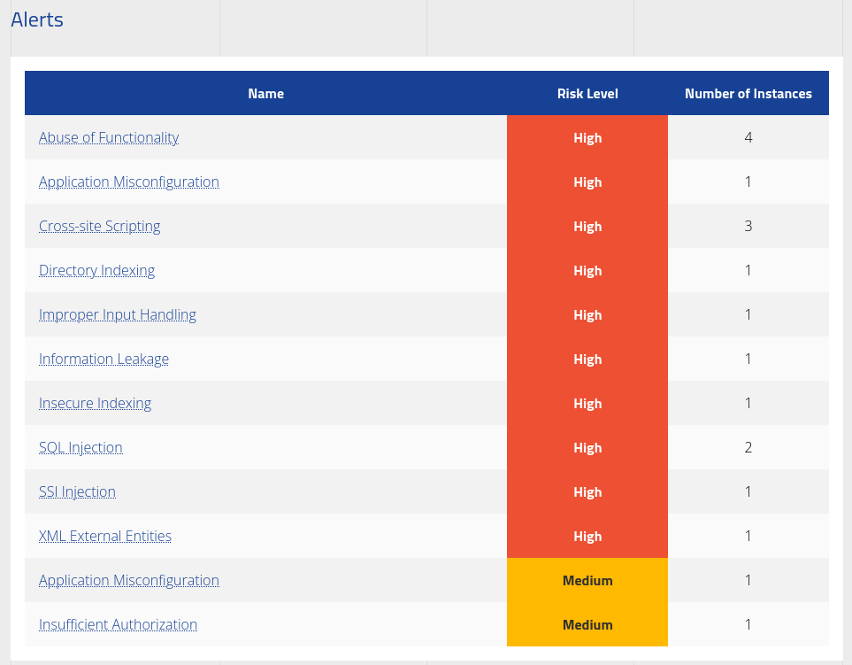

# Activity Log

The penetration Test started by working through the standard methodology of `Enumeration → Discovery → Exploitation → Remediation`.  Throughout the engagement, several types of activities were carried out on each of the web interfaces within the web application. The following list details the high-level activities and considerations carried out during the engagement. This list is not inclusive of every test performed:

- Conducted both manual and automatic enumeration using various tools.
- Conducted mapping of all paths in the application.
- Carried out critical code analysis of the web application, both client and server side code.
- Evaluated for common web flaws such as:
	- Cross-Site Scripting Injection flaws
	- SQL Injection flaws
	- Header Poisoning attacks
	- Authorization Bypasses
	- Privileged Escalation
	- Fuzzing parameters
	- Application Misconfiguration
	- Various Client and Server side filter bypass
	- In-depth API testing
	- In-depth source code analysis for Client and Server side code
- Testing for OWASP 10 vulnerabilities

As part of the enumeration phase, manual and automated enumeration was carried out, exploring all functionalities of the web application. Starting by creating a normal user account while taking note of potentially vulnerable areas:

# Phase 1 & 2: Enumeration & Discovery
## Directory Indexing

Logging into the newly created user account and performing a manual directory search by looking for a `robots.txt` file to find any restricted directory. A robots. txt file contains instructions for bots that tell them which webpages they can and cannot access. Robots. txt files are most relevant for web crawlers from search engines like Google.

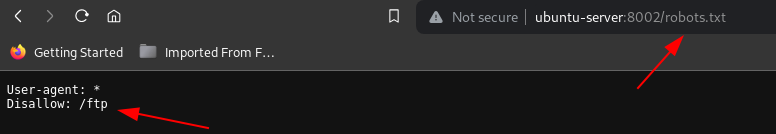
## Information Leakage

Proceeding to the /ftp directory some confidential documents were disclosed:

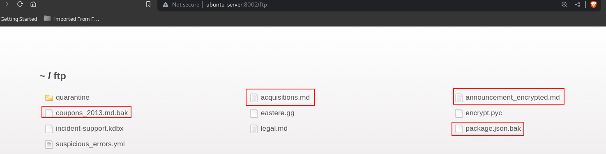

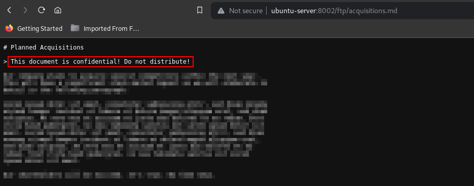

## Improper Input Handling

Moving over to perform an automated enumeration with the use of a directory brute-force automated tool called `feroxbuster`. 
*Directory brute-forcing is a method where an attacker systematically tries to discover hidden or sensitive files and directories on a web server by guessing their names.*

List  of discovered directories and files:

 
 with this information in hand the scope of the testing increases significantly because there are new pages to test for vulnerabilities and new files to check for vital information.

Switching back to the manual enumeration, some additional paths/directories were discovered in the main.js file during the analysis of source code:

Extracting the paths discovered:

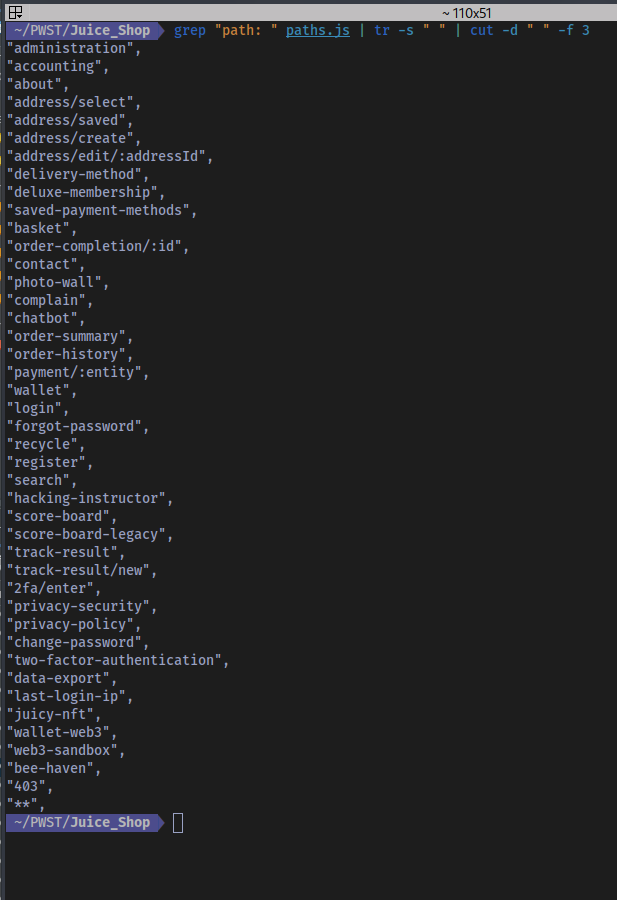

Some of these paths will be referred to later on in the testing.

A file named `package.json.bak` earlier discovered in the `/ftp` directory was the next thing to investigate.

*The package.json file is a file that enables npm (node package manager) to start your project, run scripts, install dependencies, publish to the NPM registry, and many other useful tasks.*

This package.json.bak file could potentially contains versions of dependencies running on the server side, If the contents are disclosed then vulnerabilities for those specific versions could be discovered.

Trying to access the file shows that a server side filter is in place to block any file without the extension of `.md and .pdf`. 

Bypassing this filter involved having to leverage a Null Byte Bypass. 

*Null byte is a bypass technique for sending data that would be filtered otherwise. It relies on injecting the null byte characters (`%00`, `\x00`) in the supplied data. Its role is to terminate a string.*

Injecting the character `%25` which is a % in URL encoding followed by `00` along with the `.md` extension in the request Header allowed for easy bypass of this server side filter:

Response to the Request gives the output of the file contents:

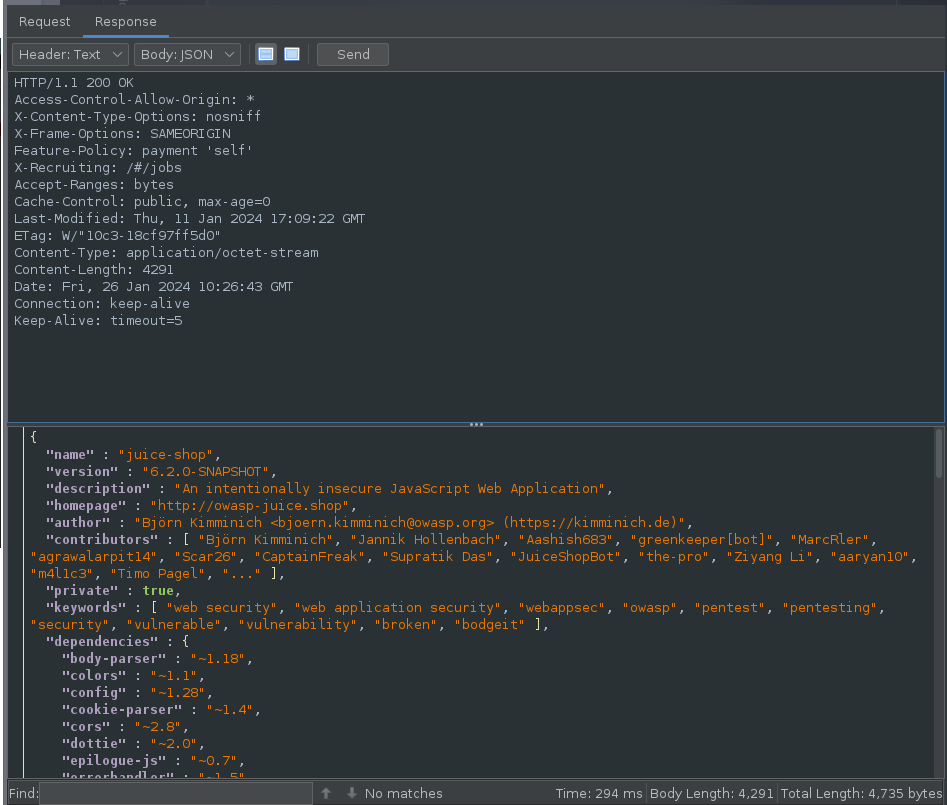

## Application Misconfiguration

Navigating to the `/metrics` directory discloses some sensitive information that should not be made publicly accessible:

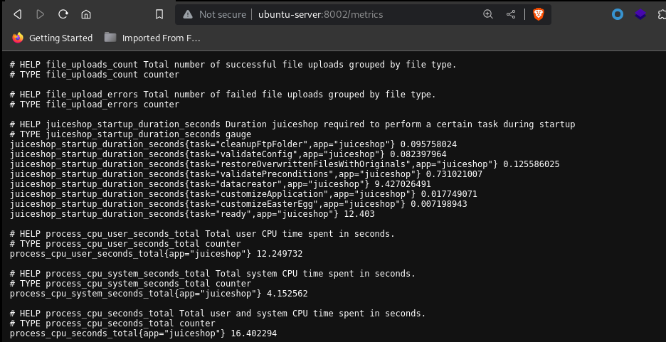

It contains detailed statistics about the server.
# Phase 3: Exploitation

## SQL Injection

First thing that was tested in this phase was the login form `/rest/user/login` API using a basic SQL injection payload `' or 1=1 --`:

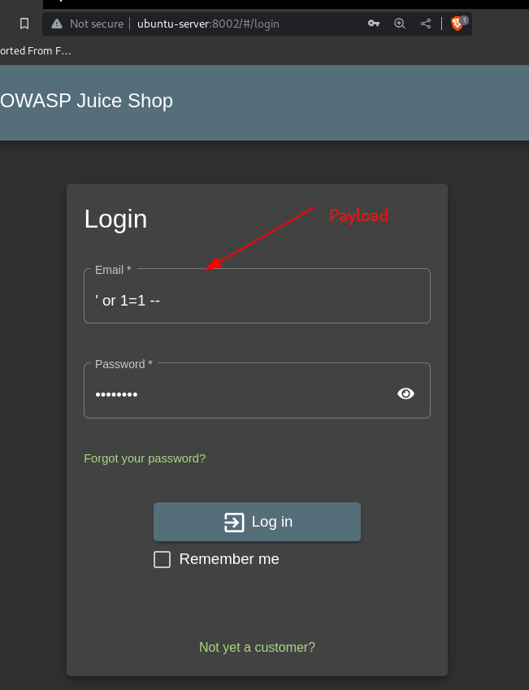

Entering the payload as the email and a random password gives admin access to the site:

## Privilege Escalation

Moving on to the next step, when a user is created on the site a POST request is sent to the `/api/Users` endpoint:

In the body of the response a 'role' for that users is automatically added and default as "customer":
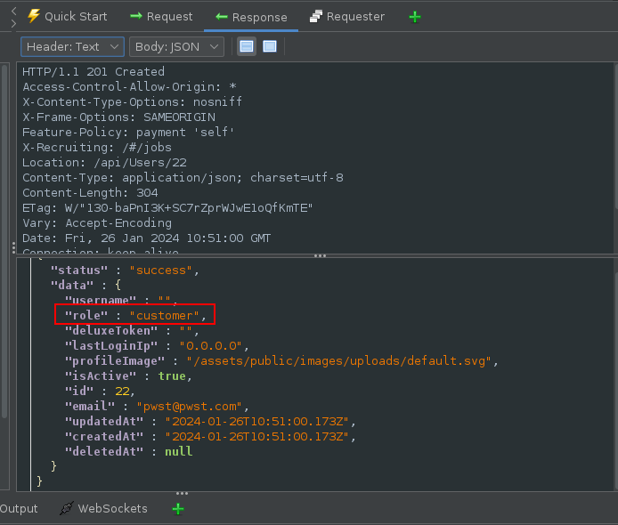

Adding the role of admin to the body of the request ended up giving the user admin privileges:

Request:

Response:

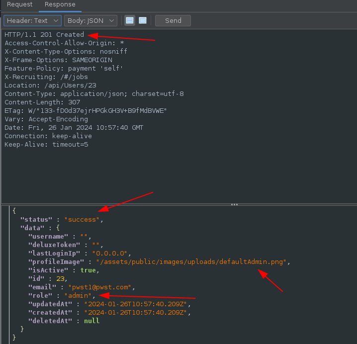

Login as the user:

The user is able to access the administration panel only for admins

This led to a successful Privilege Escalation from the role of customer to the role of admin

## Insufficient Authorization

Next vulnerability discovered was the **Insufficient Authorization** vulnerability.
When a user logs in a GET request is sent to the `/rest/user/admin` endpoint with an Authorization Header set:

Removing the header, still results in a successful response and login:

## Reflected Cross-Site Scripting (XSS)

A Reflected Cross-Site Scripting (XSS) vulnerability was discovered in the parameter `q`
for the search function:
Payload: ``

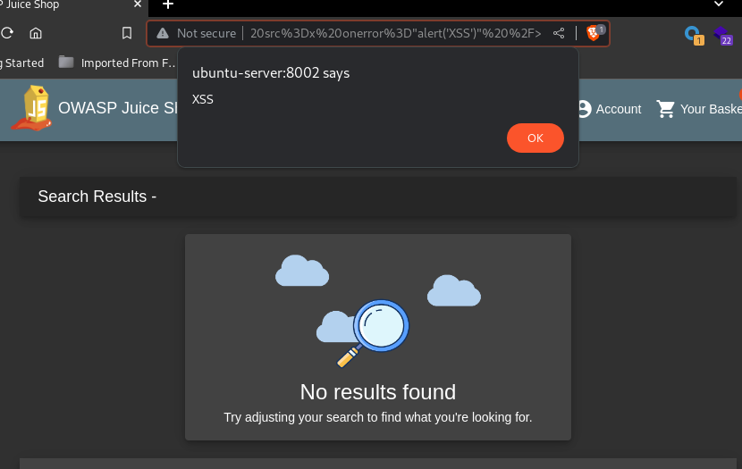

## Application Misconfiguration

Checking the stored cookies on the site reveals there is no HttpOnly flag set on the token:

Using the payload: `` the user's cookie is disclosed:

Checking the GET request sent to `/rest/user/whoami` shows the Authorization token is the same as the cookie value:

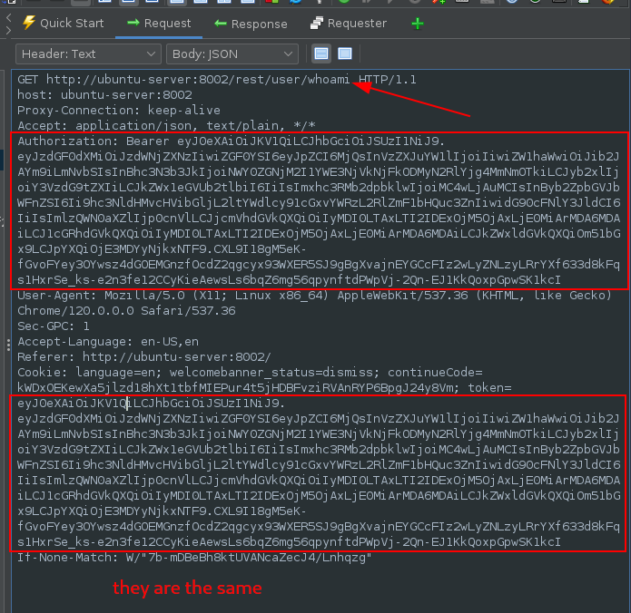

With the token disclosed, it is possible for an attacker to perform any amount of API requests and login as the user. 

## SQL Injection

Another SQL Injection vulnerability was discovered at  `/rest/products/search?q=`. Performing an automated using SQLmap led to the discovery of an SQLite database in use:

Dumping the tables:

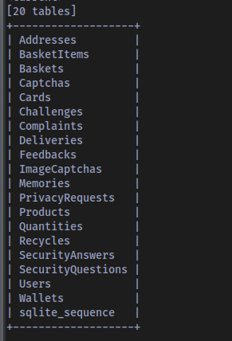

Reveals all the tables in the database.

## Weak Hashing Algorithm

Following up on this by dumping the contents of the Users table, some password hashes were extracted and cracked to get the plain text passwords:

Hashes:

Cracked:

These hashes were easily cracked because they are using a weak hashing algorithm (MD5) and  a weak password. The admin email and password was successfully extracted with this attack and the admin account became accessible:

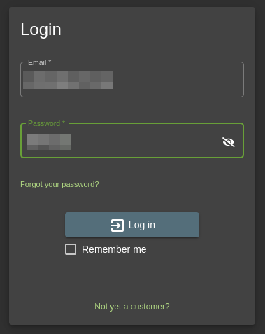

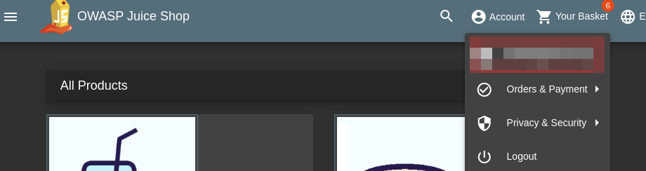

## Insecure Indexing

When adding an item to basket in the homepage, there is a request made to /rest/basket/ID:

Fuzzing the ID value:

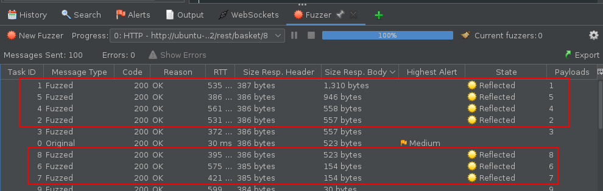

other ID are detected and accessible. This is an IDOR vulnerability (Insecure direct Object referencing)

## Abuse of Functionality by HTTP Parameter Pollution

Looking at the request made to /BasketItems:

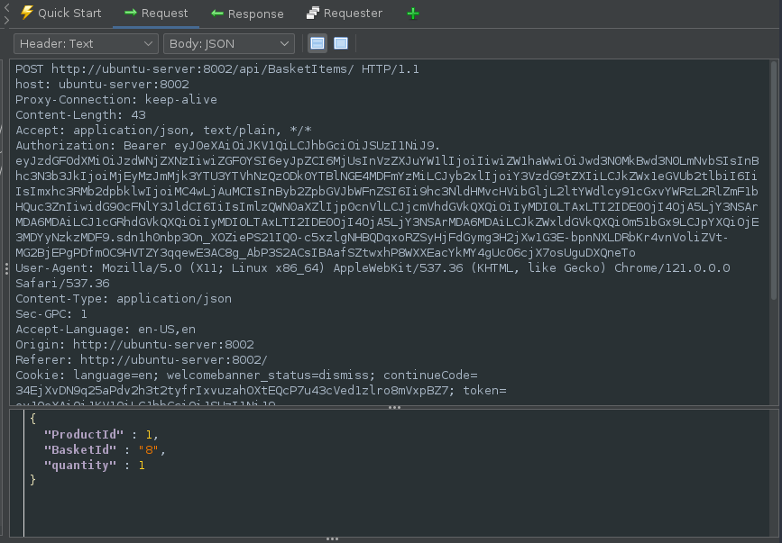

Manipulating the request  body and putting a negative value as the quantity and also changing the method to PUT:

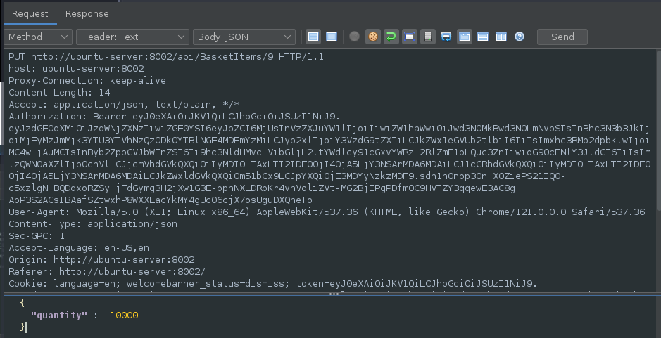

Results in changing the total price and the quantity:

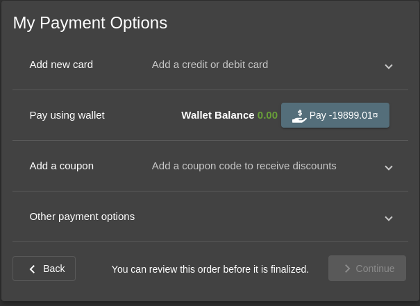

## Time based Vulnerability on Coupons

Testing the coupon section for any vulnerabilities involved inspecting the source code and checking for the `applyButton` function:

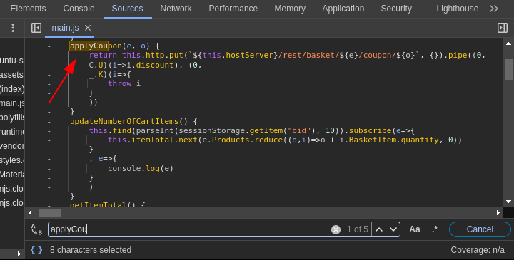

Clicking on the `redeem` button sends a PUT request to `/rest/basket/ID/coupon/ID`:

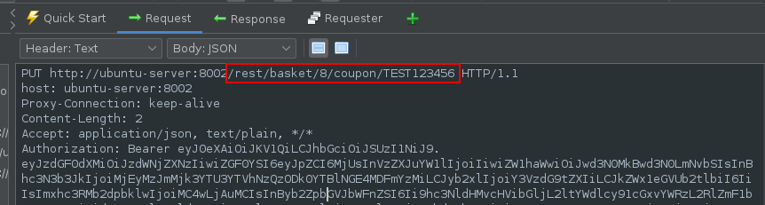

The `/ftp` directory discovered earlier contained a file which had old coupons which were tested but didn't work due to a verification going on in the code for date:

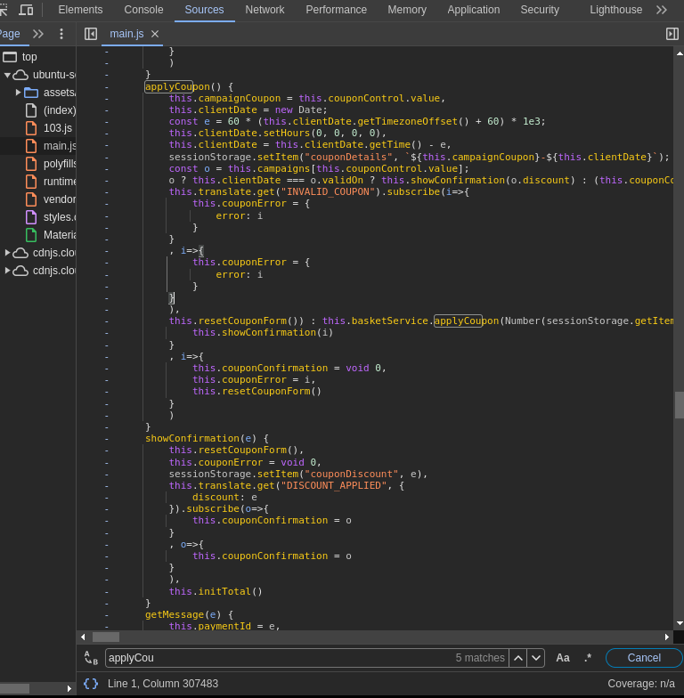

Coupons and their date in milliseconds:

To bypass this all that was done was to change the `clientDate` value to the date of the coupon

Which resulted in a 2019 coupon being used in 2024 to get a 75% discount:

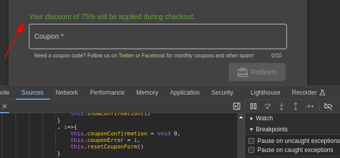

## Abuse of Functionality

The customer feedback section:

At the frontend of the application giving 0-star review is not possible but by manipulating request it was made possible:

Request body changed the rating from 3 to 0:

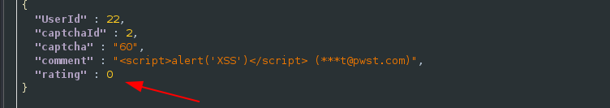

Response:

O-star reviews:

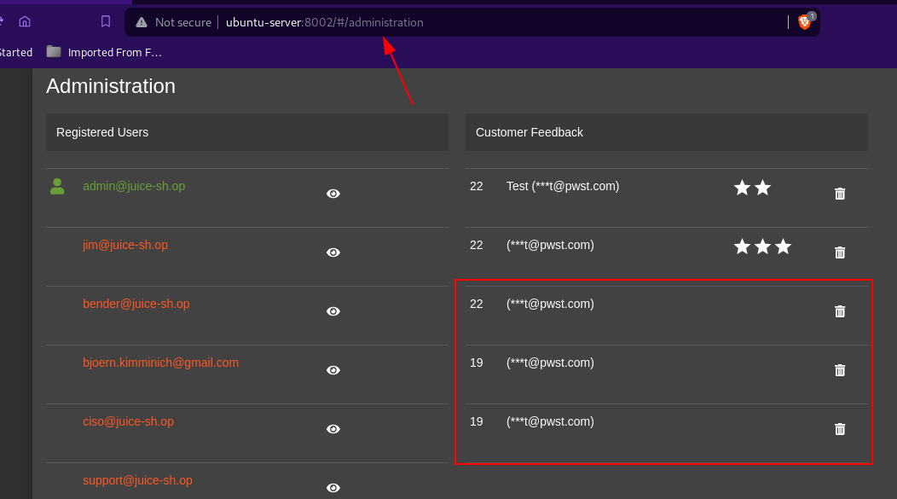

This is an **Abuse of Functionality**.

Another vulnerability discovered was in the complaint section, this section has a file upload capability and only allows PDF, XML and ZIP files. But it was discovered other extensions were also allowed when reviewing the source code:

It accepts XML files. Therefore an XXE attack was carried out. Using this payload to try and read the system's `passwd` file which contains user information on the server:

Uploading the file and sending the request:

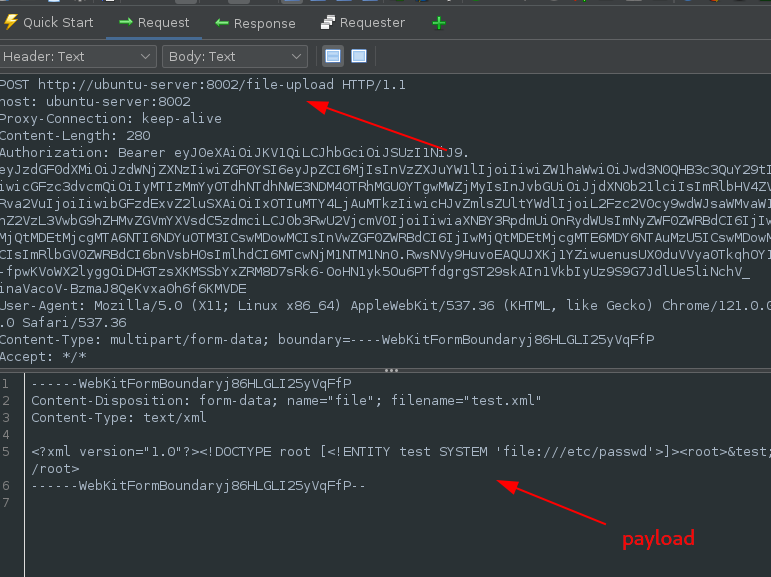

In the body of the response, the contents of the `passwd` file is displayed: 

## Stored XSS through Header Poisoning

Taking a look at the Last Login IP section which is used to display the IP address of the user that last logged in:

By manipulating the Request Header, it was possible to set the IP to any value specified:

Using the header `True-Client-IP` which was discovered from the server source code located at the github repository:

In the Response the lastloginIP value has been set to the specified value:

Using this vulnerability it was possible to get a Stored XSS vulnerability by putting the payload in the header:

Response:

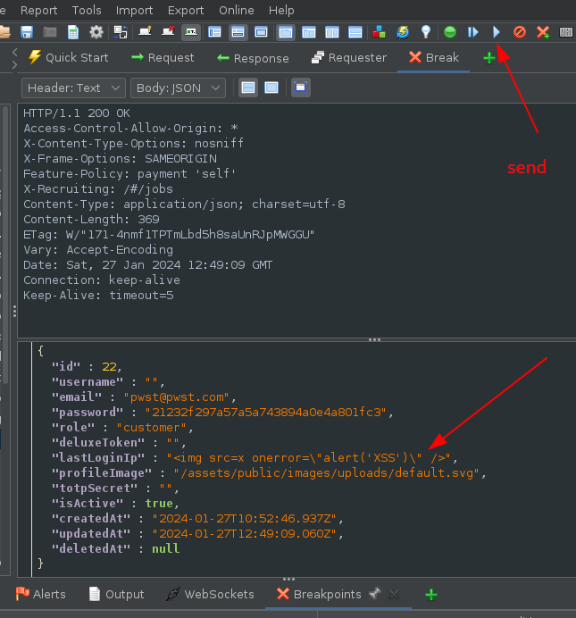

When clicking on the LastLoginIP button the payload was executed which leads to stored XSS:

This was only be possible because the server side source code is available to the public.

## Abuse of Functionality by Modifying products via PUT request as a normal user 

Performing a PUT request to the  `/api/products` endpoint to change the name of a product:

Adding the Content-Type Header:

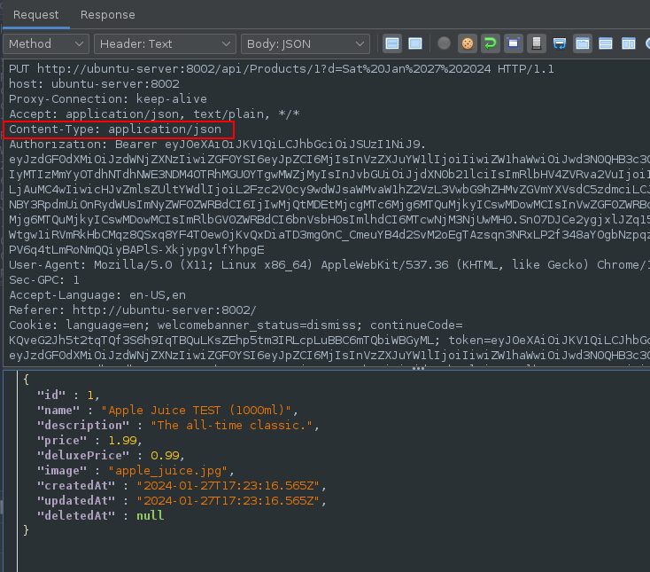

Gives the ability to change product names:

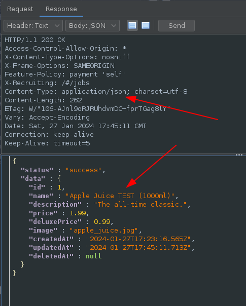

It was also discovered that creation of new products was possible using a POST request:

Request:

Response:

Reloading the site shows the new product:

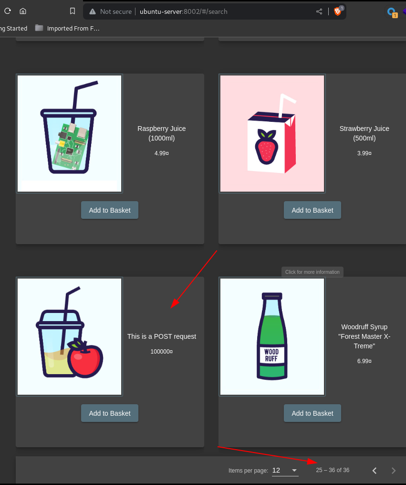

## Abuse of Functionality

The next test was at the product review section. The ability to change product review of all products on the site was discovered. 

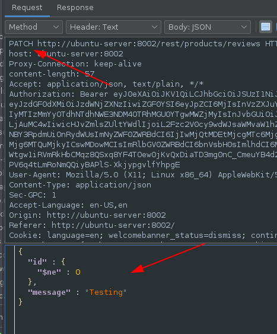

Using the specific header which will change review on all products and making a PATCH request to the `/rest/products/reviews` endpoint:

Response:

Evidence:

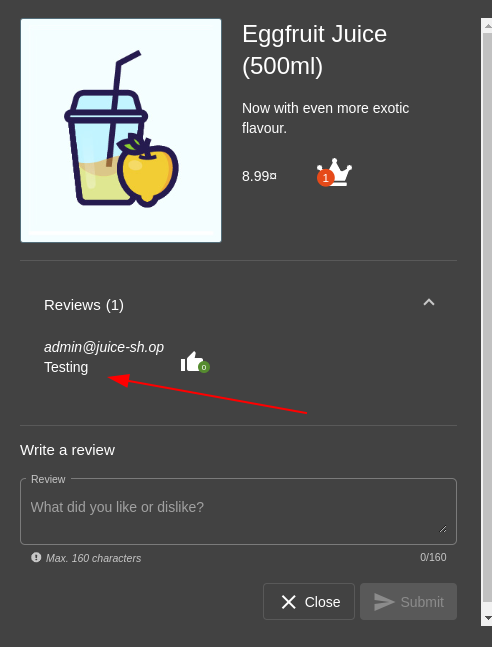

## Cross-Site Scripting (XSS)

Going back to the package.json file discovered earlier in the `/ftp` directory, There were a list of packages and dependencies running on the server and their versions that could be vulnerable. After much investigation, it was discovered that the `"sanitize-html": "1.4.2"`
is  vulnerable. Searching online for the vulnerability, a specific payload was discovered and used to get a XSS attack:

Modifying the payload and using the Customer Feedback section tot test this:

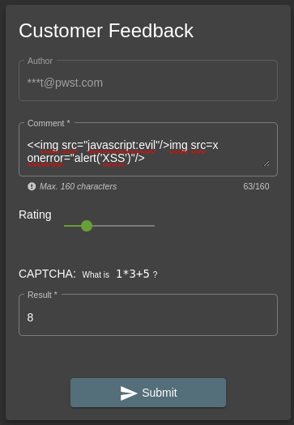
An XSS alert was possible indicating a successful XSS attack:

## Server-Side Template Injection

At a point during the pentest, it was discovered that the `/profile` page was making use of PUG.

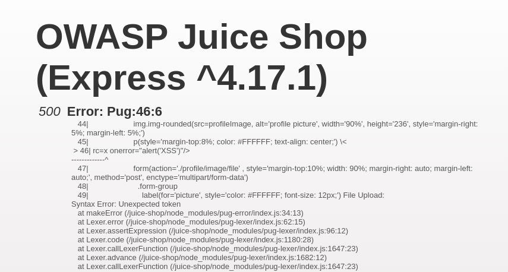

 Pug is **a template engine that allows you to write cleaner templates with less repetition**. With this knowledge in hand it was possible to carry out a SSTI attack.
 
A server-side template injection attack (SSTI) is **when a threat actor exploits a template's native syntax and injects malicious payloads into the template**.

Testing the  page:

Injecting the payload results in a output on the page:

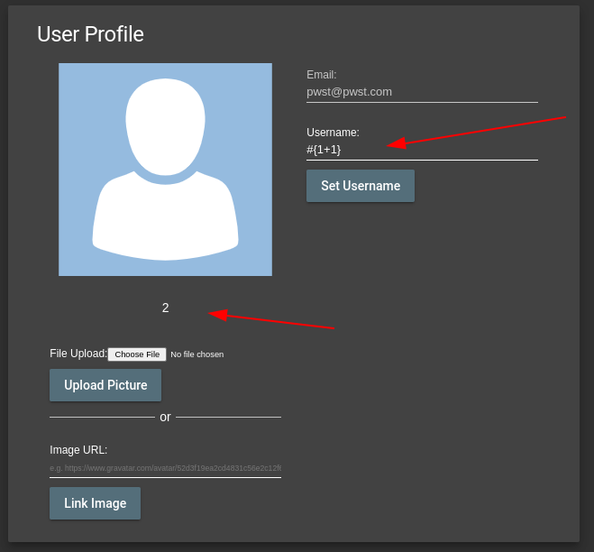

# Remediation
## Abuse of Functionality

Abuse of Functionality is an attack technique that uses a web site's own features and functionality to attack itself or others. Abuse of Functionality can be described as the abuse of an application's intended functionality to perform an undesirable outcome. These attacks have varied results such as consuming resources, circumventing access controls, or leaking information. The potential and level of abuse will vary from web site to web site and application to application. Abuse of functionality attacks are often a combination of other attack types and/or utilize other attack vectors.

**Solution** : Always utilize APIs in the specified manner.

**Reference**: 
[https://cheatsheetseries.owasp.org/cheatsheets/Abuse_Case_Cheat_Sheet.html](https://cheatsheetseries.owasp.org/cheatsheets/Abuse_Case_Cheat_Sheet.html)  
[https://cwe.mitre.org/data/definitions/227.html](https://cwe.mitre.org/data/definitions/227.html)
## Application Misconfiguration

Application Misconfiguration attacks exploit configuration weaknesses found in web applications. Many applications come with unnecessary and unsafe features, such as debug and QA features, enabled by default. These features may provide a means for a hacker to bypass authentication methods and gain access to sensitive information, perhaps with elevated privileges.

Likewise, default installations may include well-known usernames and passwords, hard-coded backdoor accounts, special access mechanisms, and incorrect permissions set for files accessible through web servers. Default samples may be accessible in production environments. Application-based configuration files that are not properly locked down may reveal clear text connection strings to the database, and default settings in configuration files may not have been set with security in mind. All of these misconfigurations may lead to unauthorized access to sensitive information.

**Solution**: 
* Ensure that debug and QA features are deactivated.
* Ensure the error messages doesn't leak sensitive and debug information.
* Follow the best practices and security guidelines for your specific application tech stack.

**Reference**:
[https://cwe.mitre.org/data/definitions/16.html](https://cwe.mitre.org/data/definitions/16.html)
## Cross-site Scripting

Cross-site Scripting (XSS) is an attack technique that involves echoing attacker-supplied code into a user's browser instance. A browser instance can be a standard web browser client, or a browser object embedded in a software product such as the browser within WinAmp, an RSS reader, or an email client. The code itself is usually written in HTML/JavaScript, but may also extend to VBScript, ActiveX, Java, Flash, or any other browser-supported technology.

When an attacker gets a user's browser to execute his/her code, the code will run within the security context (or zone) of the hosting web site. With this level of privilege, the code has the ability to read, modify and transmit any sensitive data accessible by the browser. A Cross-site Scripted user could have his/her account hijacked (cookie theft), their browser redirected to another location, or possibly shown fraudulent content delivered by the web site they are visiting. Cross-site Scripting attacks essentially compromise the trust relationship between a user and the web site. Applications utilizing browser object instances which load content from the file system may execute code under the local machine zone allowing for system compromise.

**Solution**:

**Phase: Architecture and Design**

Use a vetted library or framework that does not allow this weakness to occur or provides constructs that make this weakness easier to avoid.

Examples of libraries and frameworks that make it easier to generate properly encoded output include Microsoft's Anti-XSS library, the OWASP ESAPI Encoding module, and Apache Wicket.

	
 Read more

	
**Phases: Implementation; Architecture and Design**

Understand the context in which your data will be used and the encoding that will be expected. This is especially important when transmitting data between different components, or when generating outputs that can contain multiple encodings at the same time, such as web pages or multi-part mail messages. Study all expected communication protocols and data representations to determine the required encoding strategies.

For any data that will be output to another web page, especially any data that was received from external inputs, use the appropriate encoding on all non-alphanumeric characters.

Consult the XSS Prevention Cheat Sheet for more details on the types of encoding and escaping that are needed.

**Phase: Architecture and Design**

For any security checks that are performed on the client side, ensure that these checks are duplicated on the server side, in order to avoid CWE-602. Attackers can bypass the client-side checks by modifying values after the checks have been performed, or by changing the client to remove the client-side checks entirely. Then, these modified values would be submitted to the server.

If available, use structured mechanisms that automatically enforce the separation between data and code. These mechanisms may be able to provide the relevant quoting, encoding, and validation automatically, instead of relying on the developer to provide this capability at every point where output is generated.

**Phase: Implementation**

For every web page that is generated, use and specify a character encoding such as ISO-8859-1 or UTF-8. When an encoding is not specified, the web browser may choose a different encoding by guessing which encoding is actually being used by the web page. This can cause the web browser to treat certain sequences as special, opening up the client to subtle XSS attacks. See CWE-116 for more mitigations related to encoding/escaping.

To help mitigate XSS attacks against the user's session cookie, set the session cookie to be HttpOnly. In browsers that support the HttpOnly feature (such as more recent versions of Internet Explorer and Firefox), this attribute can prevent the user's session cookie from being accessible to malicious client-side scripts that use document.cookie. This is not a complete solution, since HttpOnly is not supported by all browsers. More importantly, XMLHTTPRequest and other powerful browser technologies provide read access to HTTP headers, including the Set-Cookie header in which the HttpOnly flag is set.

Assume all input is malicious. Use an "accept known good" input validation strategy, i.e., use an allow list of acceptable inputs that strictly conform to specifications. Reject any input that does not strictly conform to specifications, or transform it into something that does. Do not rely exclusively on looking for malicious or malformed inputs (i.e., do not rely on a deny list). However, deny lists can be useful for detecting potential attacks or determining which inputs are so malformed that they should be rejected outright.

When performing input validation, consider all potentially relevant properties, including length, type of input, the full range of acceptable values, missing or extra inputs, syntax, consistency across related fields, and conformance to business rules. As an example of business rule logic, "boat" may be syntactically valid because it only contains alphanumeric characters, but it is not valid if you are expecting colors such as "red" or "blue."

Ensure that you perform input validation at well-defined interfaces within the application. This will help protect the application even if a component is reused or moved elsewhere.

**Reference**:
[https://owasp.org/www-community/attacks/xss/](https://owasp.org/www-community/attacks/xss/)  
[https://cwe.mitre.org/data/definitions/79.html](https://cwe.mitre.org/data/definitions/79.html)
## Directory Indexing

Automatic directory listing/indexing is a web server function that lists all of the files within a requested directory if the normal base file (index.html/home.html/default.htm/default.asp/default.aspx/index.php) is not present. When a user requests the main page of a web site, they normally type in a URL such as: https://www.example.com/directory1/ - using the domain name and excluding a specific file. The web server processes this request and searches the document root directory for the default file name and sends this page to the client. If this page is not present, the web server will dynamically issue a directory listing and send the output to the client. Essentially, this is equivalent to issuing an "ls" (Unix) or "dir" (Windows) command within this directory and showing the results in HTML form. From an attack and countermeasure perspective, it is important to realize that unintended directory listings may be possible due to software vulnerabilities (discussed in the example section below) combined with a specific web request.

**Solution**:

Recommendations include restricting access to important directories or files by adopting a need to know requirement for both the document and server root, and turning off features such as Automatic Directory Listings that could expose private files and provide information that could be utilized by an attacker when formulating or conducting an attack.

Reference: 
[https://owasp.org/www-community/attacks/Path_Traversal](https://owasp.org/www-community/attacks/Path_Traversal)  
[https://cwe.mitre.org/data/definitions/548.html](https://cwe.mitre.org/data/definitions/548.html)

## Improper Input Handling

Improper input handling is one of the most common weaknesses identified across applications today. Poorly handled input is a leading cause behind critical vulnerabilities that exist in systems and applications.

Generally, the term input handing is used to describe functions like validation, sanitization, filtering, encoding and/or decoding of input data. Applications receive input from various sources including human users, software agents (browsers), and network/peripheral devices to name a few. In the case of web applications, input can be transferred in various formats (name value pairs, JSON, SOAP, etc...) and obtained via URL query strings, POST data, HTTP headers, Cookies, etc... Non-web application input can be obtained via application variables, environment variables, the registry, configuration files, etc... Regardless of the data format or source/location of the input, all input should be considered untrusted and potentially malicious. Applications which process untrusted input may become vulnerable to attacks such as Buffer Overflows, SQL Injection, OS Commanding, Denial of Service just to name a few.

One of the key aspects of input handling is validating that the input satisfies a certain criteria. For proper validation, it is important to identify the form and type of data that is acceptable and expected by the application. Defining an expected format and usage of each instance of untrusted input is required to accurately define restrictions.

Validation can include checks for type safety and correct syntax. String input can be checked for length (min and max number of characters) and character set validation while numeric input types like integers and decimals can be validated against acceptable upper and lower bound of values. When combining input from multiple sources, validation should be performed during concatenation and not just against the individual data elements. This practice helps avoid situations where input validation may succeed when performed on individual data items but fails when done on a combined set from all the sources.

**Solution**: 

**Phase: Architecture and Design**

Use an input validation framework such as Struts or the OWASP ESAPI Validation API.

Understand all the potential areas where untrusted inputs can enter your software: parameters or arguments, cookies, anything read from the network, environment variables, reverse DNS lookups, query results, request headers, URL components, e-mail, files, databases, and any external systems that provide data to the application. Remember that such inputs may be obtained indirectly through API calls.

For any security checks that are performed on the client side, ensure that these checks are duplicated on the server side. Attackers can bypass the client-side checks by modifying values after the checks have been performed, or by changing the client to remove the client-side checks entirely. Then, these modified values would be submitted to the server.

Even though client-side checks provide minimal benefits with respect to server-side security, they are still useful. First, they can support intrusion detection. If the server receives input that should have been rejected by the client, then it may be an indication of an attack. Second, client-side error-checking can provide helpful feedback to the user about the expectations for valid input. Third, there may be a reduction in server-side processing time for accidental input errors, although this is typically a small savings.

	
Read more

Do not rely exclusively on deny list validation to detect malicious input or to encode output. There are too many ways to encode the same character, so you're likely to miss some variants.

When your application combines data from multiple sources, perform the validation after the sources have been combined. The individual data elements may pass the validation step but violate the intended restrictions after they have been combined.

Assume all input is malicious. Use an "accept known good" input validation strategy, i.e., use an allow list of acceptable inputs that strictly conform to specifications. Reject any input that does not strictly conform to specifications, or transform it into something that does. Do not rely exclusively on looking for malicious or malformed inputs (i.e., do not rely on a deny list). However, deny lists can be useful for detecting potential attacks or determining which inputs are so malformed that they should be rejected outright.

When performing input validation, consider all potentially relevant properties, including length, type of input, the full range of acceptable values, missing or extra inputs, syntax, consistency across related fields, and conformance to business rules. As an example of business rule logic, "boat" may be syntactically valid because it only contains alphanumeric characters, but it is not valid if you are expecting colors such as "red" or "blue."

**Phase: Implementation**

Be especially careful to validate your input when you invoke code that crosses language boundaries, such as from an interpreted language to native code. This could create an unexpected interaction between the language boundaries. Ensure that you are not violating any of the expectations of the language with which you are interfacing. For example, even though Java may not be susceptible to buffer overflows, providing a large argument in a call to native code might trigger an overflow.

Directly convert your input type into the expected data type, such as using a conversion function that translates a string into a number. After converting to the expected data type, ensure that the input's values fall within the expected range of allowable values and that multi-field consistencies are maintained.

Inputs should be decoded and canonicalized to the application's current internal representation before being validated. Make sure that your application does not inadvertently decode the same input twice. Such errors could be used to bypass allow list schemes by introducing dangerous inputs after they have been checked. Use libraries such as the OWASP ESAPI Canonicalization control.

Consider performing repeated canonicalization until your input does not change any more. This will avoid double-decoding and similar scenarios, but it might inadvertently modify inputs that are allowed to contain properly-encoded dangerous content.

When exchanging data between components, ensure that both components are using the same character encoding. Ensure that the proper encoding is applied at each interface. Explicitly set the encoding you are using whenever the protocol allows you to do so.

**Reference**:  
[https://owasp.org/www-community/vulnerabilities/Improper_Data_Validation](https://owasp.org/www-community/vulnerabilities/Improper_Data_Validation)  
[https://cheatsheetseries.owasp.org/cheatsheets/Input_Validation_Cheat_Sheet.html](https://cheatsheetseries.owasp.org/cheatsheets/Input_Validation_Cheat_Sheet.html)  
[https://cwe.mitre.org/data/definitions/89.html](https://cwe.mitre.org/data/definitions/89.html)

## Information Leakage

Information Leakage is an application weakness where an application reveals sensitive data, such as technical details of the web application, environment, or user-specific data. Sensitive data may be used by an attacker to exploit the target web application, its hosting network, or its users. Therefore, leakage of sensitive data should be limited or prevented whenever possible. Information Leakage, in its most common form, is the result of one or more of the following conditions: A failure to scrub out HTML/Script comments containing sensitive information, improper application or server configurations, or differences in page responses for valid versus invalid data.

Failure to scrub HTML/Script comments prior to a push to the production environment can result in the leak of sensitive, contextual, information such as server directory structure, SQL query structure, and internal network information. Often a developer will leave comments within the HTML and/or script code to help facilitate the debugging or integration process during the pre-production phase. Although there is no harm in allowing developers to include inline comments within the content they develop, these comments should all be removed prior to the content's public release.

Software version numbers and verbose error messages (such as ASP.NET version numbers) are examples of improper server configurations. This information is useful to an attacker by providing detailed insight as to the framework, languages, or pre-built functions being utilized by a web application. Most default server configurations provide software version numbers and verbose error messages for debugging and troubleshooting purposes. Configuration changes can be made to disable these features, preventing the display of this information.

Pages that provide different responses based on the validity of the data can also lead to Information Leakage; specifically when data deemed confidential is being revealed as a result of the web application's design. Examples of sensitive data includes (but is not limited to): account numbers, user identifiers (Drivers license number, Passport number, Social Security Numbers, etc.) and user-specific information (passwords, sessions, addresses). Information Leakage in this context deals with exposure of key user data deemed confidential, or secret, that should not be exposed in plain view, even to the user. Credit card numbers and other heavily regulated information are prime examples of user data that needs to be further protected from exposure or leakage even with proper encryption and access controls already in place.

**Solution** :

Compartmentalize your system to have "safe" areas where trust boundaries can be unambiguously drawn. Do not allow sensitive data to go outside of the trust boundary and always be careful when interfacing with a compartment outside of the safe area.

**Reference**: 
[https://cwe.mitre.org/data/definitions/200.html](https://cwe.mitre.org/data/definitions/200.html)

## Insecure Indexing 

Insecure Indexing is a threat to the data confidentiality of the web-site. Indexing web-site contents via a process that has access to files which are not supposed to be publicly accessible has the potential of leaking information about the existence of such files, and about their content. In the process of indexing, such information is collected and stored by the indexing process, which can later be retrieved (albeit not trivially) by a determined attacker, typically through a series of queries to the search engine. The attacker does not thwart the security model of the search engine. As such, this attack is subtle and very hard to detect and to foil - it’s not easy to distinguish the attacker’s queries from a legitimate user’s queries.

**Solution**: 

Implement measures to secure indexing processes and prevent unauthorized access to sensitive information. The following strategies can be considered:

1. **Access Controls:** Review and restrict access permissions for the indexing process to ensure it only accesses and indexes files that are intended to be publicly available.

2. **Robot Exclusion Standard (robots.txt):** Use the robots.txt file to explicitly specify which areas of the website should not be indexed by search engines.

3. **Authentication Requirements:** Implement authentication mechanisms for accessing sensitive files, ensuring that only authorized users or processes can retrieve them.

4. **File Encryption:** Encrypt sensitive files to protect their content, even if an unauthorized user gains access to the files.

5. **URL Redaction:** Avoid including sensitive information in URLs or filenames that might be exposed during indexing.

6. **Security Headers:** Utilize security headers (e.g., Content Security Policy) to control how browsers and search engines interact with your website.

A proactive and layered approach to security is crucial for safeguarding against Insecure Indexing.

## SQL Injection

SQL Injection is an attack technique used to exploit applications that construct SQL statements from user-supplied input. When successful, the attacker is able to change the logic of SQL statements executed against the database.

Structured Query Language (SQL) is a specialized programming language for sending queries to databases. The SQL programming language is both an ANSI and an ISO standard, though many database products supporting SQL do so with proprietary extensions to the standard language. Applications often use user-supplied data to create SQL statements. If an application fails to properly construct SQL statements it is possible for an attacker to alter the statement structure and execute unplanned and potentially hostile commands. When such commands are executed, they do so under the context of the user specified by the application executing the statement. This capability allows attackers to gain control of all database resources accessible by that user, up to and including the ability to execute commands on the hosting system.

**Solution**: 

**Phase: Architecture and Design**

Use a vetted library or framework that does not allow this weakness to occur or provides constructs that make this weakness easier to avoid.

For example, consider using persistence layers such as Hibernate or Enterprise Java Beans, which can provide significant protection against SQL injection if used properly.

If available, use structured mechanisms that automatically enforce the separation between data and code. These mechanisms may be able to provide the relevant quoting, encoding, and validation automatically, instead of relying on the developer to provide this capability at every point where output is generated.

Process SQL queries using prepared statements, parameterized queries, or stored procedures. These features should accept parameters or variables and support strong typing. Do not dynamically construct and execute query strings within these features using "exec" or similar functionality, since you may re-introduce the possibility of SQL injection.

Run your code using the lowest privileges that are required to accomplish the necessary tasks. If possible, create isolated accounts with limited privileges that are only used for a single task. That way, a successful attack will not immediately give the attacker access to the rest of the software or its environment. For example, database applications rarely need to run as the database administrator, especially in day-to-day operations.

Specifically, follow the principle of least privilege when creating user accounts to a SQL database. The database users should only have the minimum privileges necessary to use their account. If the requirements of the system indicate that a user can read and modify their own data, then limit their privileges so they cannot read/write others' data. Use the strictest permissions possible on all database objects, such as execute-only for stored procedures.

**Phase: Implementation**

If you need to use dynamically-generated query strings or commands in spite of the risk, properly quote arguments and escape any special characters within those arguments. The most conservative approach is to escape or filter all characters that do not pass an extremely strict allow list (such as everything that is not alphanumeric or white space). If some special characters are still needed, such as white space, wrap each argument in quotes after the escaping/filtering step. Be careful of argument injection (CWE-88).

Instead of building your own implementation, such features may be available in the database or programming language. For example, the Oracle DBMS ASSERT package can check or enforce that parameters have certain properties that make them less vulnerable to SQL injection. For MySQL, the mysql real escape string() API function is available in both C and PHP.

	
Read more

	
Assume all input is malicious. Use an "accept known good" input validation strategy, i.e., use an allow list of acceptable inputs that strictly conform to specifications. Reject any input that does not strictly conform to specifications, or transform it into something that does. Do not rely exclusively on looking for malicious or malformed inputs (i.e., do not rely on a deny list). However, deny lists can be useful for detecting potential attacks or determining which inputs are so malformed that they should be rejected outright.

When performing input validation, consider all potentially relevant properties, including length, type of input, the full range of acceptable values, missing or extra inputs, syntax, consistency across related fields, and conformance to business rules. As an example of business rule logic, "boat" may be syntactically valid because it only contains alphanumeric characters, but it is not valid if you are expecting colors such as "red" or "blue."

When constructing SQL query strings, use stringent allow lists that limit the character set based on the expected value of the parameter in the request. This will indirectly limit the scope of an attack, but this technique is less important than proper output encoding and escaping.

Note that proper output encoding, escaping, and quoting is the most effective solution for preventing SQL injection, although input validation may provide some defense-in-depth. This is because it effectively limits what will appear in output. Input validation will not always prevent SQL injection, especially if you are required to support free-form text fields that could contain arbitrary characters. For example, the name "O'Reilly" would likely pass the validation step, since it is a common last name in the English language. However, it cannot be directly inserted into the database because it contains the "'" apostrophe character, which would need to be escaped or otherwise handled. In this case, stripping the apostrophe might reduce the risk of SQL injection, but it would produce incorrect behavior because the wrong name would be recorded.

When feasible, it may be safest to disallow meta-characters entirely, instead of escaping them. This will provide some defense in depth. After the data is entered into the database, later processes may neglect to escape meta-characters before use, and you may not have control over those processes.

**Reference**:
[https://owasp.org/www-community/attacks/SQL_Injection](https://owasp.org/www-community/attacks/SQL_Injection) [https://cheatsheetseries.owasp.org/cheatsheets/SQL_Injection_Prevention_Cheat_Sheet.html](https://cheatsheetseries.owasp.org/cheatsheets/SQL_Injection_Prevention_Cheat_Sheet.html)

## SSI Injection

SSI Injection (Server-side Include) is a server-side exploit technique that allows an attacker to send code into a web application, which will later be executed locally by the web server. SSI Injection exploits a web application's failure to sanitize user-supplied data before they are inserted into a server-side interpreted HTML file.

Before serving an HTML web page, a web server may parse and execute Server-side Include statements before providing it to the client. In some cases (e.g. message boards, guest books, or content management systems), a web application will insert user-supplied data into the source of a web page.

If an attacker submits a Server-side Include statement, he may have the ability to execute arbitrary operating system commands, or include a restricted file's contents the next time the page is served. This is performed at the permission level of the web server user.

**Solution**:
Disable SSI execution on pages that do not require it. For pages requiring SSI ensure that you perform the following checks

- Only enable the SSI directives that are needed for this page and disable all others.

- HTML entity encode user supplied data before passing it to a page with SSI execution permissions.

- Use SUExec to have the page execute as the owner of the file instead of the web server user.

## XML External Entities 

This technique takes advantage of a feature of XML to build documents dynamically at the time of processing. An XML message can either provide data explicitly or by pointing to an URI where the data exists. In the attack technique, external entities may replace the entity value with malicious data, alternate referrals or may compromise the security of the data the server/XML application has access to.

Attackers may also use External Entities to have the web services server download malicious code or content to the server for use in secondary or follow on attacks.

**Solution**:

XML External Entities vulnerabilities arise because the application's XML parsing library supports potentially dangerous XML features. To prevent XML External Entities vulnerabilities disable the resolution of external entities and the support for XInclude.

**Reference**:

[https://owasp.org/www-community/vulnerabilities/XML_External_Entity_(XXE)_Processing](https://owasp.org/www-community/vulnerabilities/XML_External_Entity_(XXE)_Processing)[https://cheatsheetseries.owasp.org/cheatsheets/XML_External_Entity_Prevention_Cheat_Sheet.html](https://cheatsheetseries.owasp.org/cheatsheets/XML_External_Entity_Prevention_Cheat_Sheet.html)  
[https://cwe.mitre.org/data/definitions/611.html](https://cwe.mitre.org/data/definitions/611.html)

## Application Misconfiguration

Application Misconfiguration attacks exploit configuration weaknesses found in web applications. Many applications come with unnecessary and unsafe features, such as debug and QA features, enabled by default. These features may provide a means for a hacker to bypass authentication methods and gain access to sensitive information, perhaps with elevated privileges.

Likewise, default installations may include well-known usernames and passwords, hard-coded backdoor accounts, special access mechanisms, and incorrect permissions set for files accessible through web servers. Default samples may be accessible in production environments. Application-based configuration files that are not properly locked down may reveal clear text connection strings to the database, and default settings in configuration files may not have been set with security in mind. All of these misconfigurations may lead to unauthorized access to sensitive information.

**Solution**:

* Ensure that debug and QA features are deactivated.

* Ensure the error messages doesn't leak sensitive and debug information.

* Follow the best practices and security guidelines for your specific application tech stack.

## Insufficient Authorization 

Insufficient Authorization results when an application does not perform adequate authorization checks to ensure that the user is performing a function or accessing data in a manner consistent with the security policy. Authorization procedures should enforce what a user, service or application is permitted to do. When a user is authenticated to a web site, it does not necessarily mean that the user should have full access to all content and functionality.

**Insufficient Function Authorization**

Many applications grant different application functionality to different users. A news site will allows users to view news stories, but not publish them. An accounting system will have different permissions for an Accounts Payable clerk and an Accounts Receivable clerk. Insufficient Function Authorization happens when an application does not prevent users from accessing application functionality in violation of security policy.

A very visible example was the 2005 hack of the Harvard Business School's application process. An authorization failure allowed users to view their own data when they should not have been allowed to access that part of the web site.

**Insufficient Data Authorization**

Many applications expose underlying data identifiers in a URL. For example, when accessing a medical record on a system one might have a URL such as:

`https://example.com/RecordView?id=12345`

If the application does not check that the authenticated user ID has read rights, then it could display data to the user that the user should not see.

Insufficient Data Authorization is more common than Insufficient Function Authorization because programmers generally have complete knowledge of application functionality, but do not always have a complete mapping of all data that the application will access. Programmers often have tight control over function authorization mechanisms, but rely on other systems such as databases to perform data authorization.

**Solution**:

**Phases: Architecture and Design; Operation**

Very carefully manage the setting, management, and handling of privileges. Explicitly manage trust zones in the software.

**Phase: Architecture and Design**

Ensure that appropriate compartmentalization is built into the system design and that the compartmentalization serves to allow for and further reinforce privilege separation functionality. Architects and designers should rely on the principle of least privilege to decide when it is appropriate to use and to drop system privileges.

**Reference**:

[https://cheatsheetseries.owasp.org/cheatsheets/Authorization_Cheat_Sheet.html](https://cheatsheetseries.owasp.org/cheatsheets/Authorization_Cheat_Sheet.html)  
[https://cwe.mitre.org/data/definitions/284.html](https://cwe.mitre.org/data/definitions/284.html)  
[https://cwe.mitre.org/data/definitions/285.html](https://cwe.mitre.org/data/definitions/285.html)

# Recommendations

1. **Immediate Remediation:**
    
    - Address the 11 High and 2 Medium vulnerabilities as highlighted in the report promptly.
    - Prioritize the remediation based on the criticality and potential impact on the system.

2. **Secure Configuration:**
    
    - Review and secure configurations across the entire application stack, including web servers, databases, and third-party components.
    - Regularly update and patch all software and libraries to mitigate known vulnerabilities.

3. **User Authentication and Authorization:**
    
    - Implement strong input validation and sanitize user inputs to prevent SQL injection attacks.
    - Enhance user authentication mechanisms, ensuring robust password policies and secure storage using strong hashing algorithms.
    - Conduct regular reviews of user roles and privileges to prevent unauthorized access.

4. **Secure API Practices:**
    
    - Implement proper authentication and authorization mechanisms for all API endpoints.
    - Validate and sanitize input data received through API requests to prevent injection attacks.

5. **Web Application Firewall (WAF):**
    
    - Deploy a Web Application Firewall to monitor and filter HTTP traffic between a web application and the Internet.
    - Configure the WAF to detect and block common web application attacks.

6. **Session Management:**
    
    - Enforce secure session management practices, including the use of secure cookies and token mechanisms.
    - Implement the HttpOnly flag on session cookies to prevent client-side script access.

7. **Code Analysis and Review:**
    
    - Conduct regular code reviews, both static and dynamic, to identify and remediate vulnerabilities in the application code.
    - Implement secure coding practices and educate developers about potential security pitfalls.

8. **Incident Response Plan:**
    
    - Develop and maintain an incident response plan to address security incidents promptly.
    - Regularly test the incident response plan through simulated exercises to ensure readiness.

9. **Security Awareness Training:**
    
    - Provide comprehensive security awareness training to all personnel involved in the development, deployment, and maintenance of the application.
    - Educate users about common security threats, phishing attacks, and best practices for secure computing.

10. **Continuous Monitoring:**
    
    - Implement continuous monitoring for security events and anomalies.
    - Utilize intrusion detection systems and regularly review logs for suspicious activities.

11. **Regular Penetration Testing:**
    
    - Conduct regular penetration testing to identify and address new vulnerabilities as the application evolves.
    - Engage with professional penetration testers to simulate real-world attack scenarios.

12. **Vendor and Dependency Management:**
    
    - Regularly assess and update third-party libraries and components to patch known vulnerabilities.
    - Implement a robust vendor management process to ensure the security of external dependencies.

13. **Compliance:**
    
    - Align security practices with industry standards and regulatory requirements.
    - Regularly audit and assess the application against compliance frameworks.

14. **Secure File Uploads:**
    
    - Review and enhance the file upload functionality, ensuring proper validation of file types and preventing malicious uploads.
    - Implement content-disposition headers to control how files are treated by the browser.

15. **Educate Users on Security Best Practices:**
    
    - Provide users with guidelines on secure practices, such as choosing strong passwords, recognizing phishing attempts, and reporting suspicious activities.

16. **Documentation:**
    
    - Maintain up-to-date documentation detailing security measures, configurations, and incident response procedures.