# Biohazard

Difficulty: Medium

# Info

A CTF room based on the old-time survival horror game, Resident Evil. Can you survive until the end?


# Task 1: Introduction

Welcome to Biohazard room, a puzzle-style CTF. Collecting the item, solving the puzzle and escaping the nightmare is your top priority. Can you survive until the end?

If you have any question, do not hesitate to DM me on the discord channel.

**How many open ports?** 

First off we start our enumeration with an Nmap scan to discover open ports and services running on our target machine.

Nmap scan result:


we can see we have 3 ports open. Let's first take a look at the website running on port 80.

**What is the team name in operation**


# Task 2: The Mansion

Collect all necessary items and advanced to the next level. The format of the Item flag:

**Item_name{32 character}**

Some of the doors are locked. Use the item flag to unlock the door.

Tips: It is better to record down all the information inside a notepad

**What is the emblem flag**

Taking a look at the page's source code we can't find any info there, so we click on the "mansion" link and it takes us to another page

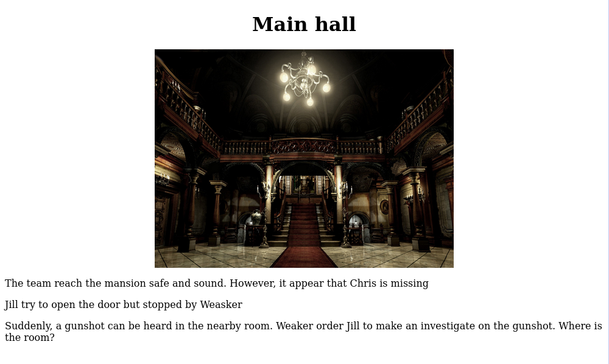

Taking a look at the source code for this page we have some information on another directory named "/diningRoom/"


Navigating to that directory:


Here we have another link, but before clicking on it we can take at this page's source code for any info:

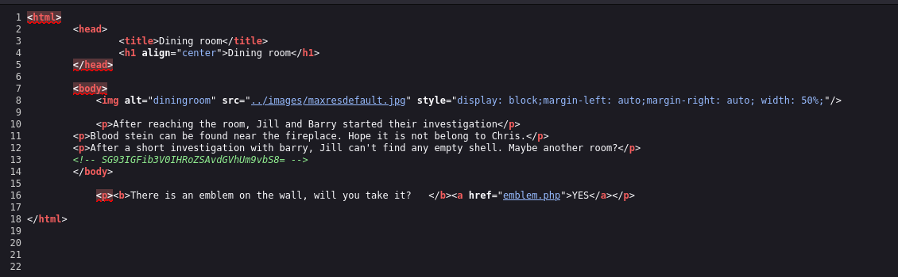

Yes we do. It's a base64 code which we can easily decode in our terminal


Taking a look at the site:

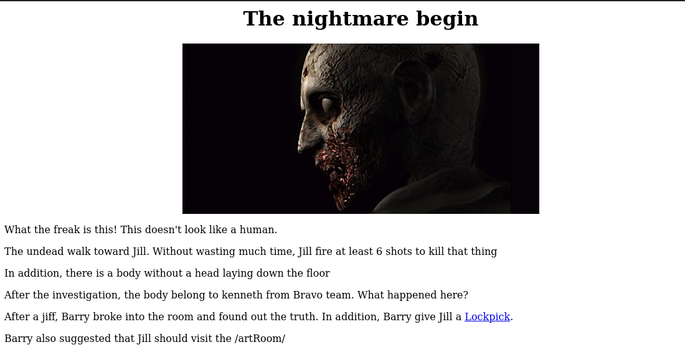


we can see another directory "/artRoom/" and  a link.

Clicking the link takes us to the first Flag:

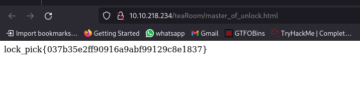

Now to click on the link in /dinningRoom/ dir:


navigating to the /artRoom/ directory takes us to this page:

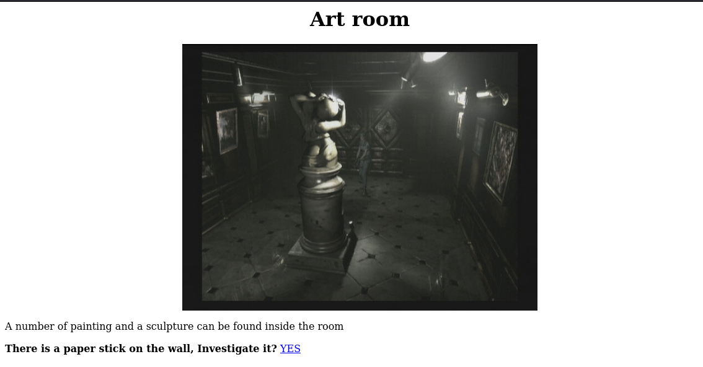

following the link takes us to a page filled with list of directories:


first directory to check is the /barRoom/ since we have already checked the rest


we can submit the flag we got earlier


click on the link:


Identify the code using [this](https://www.dcode.fr/cipher-identifier)


now we can submit the flag and it'll take us to another page


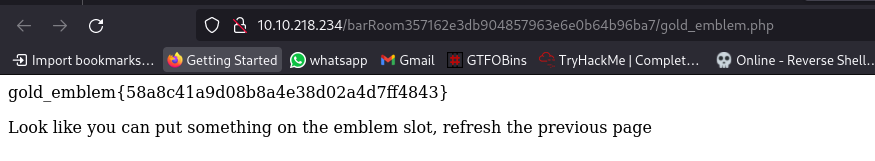

so we are told to refresh  the previous page 


They are requesting for the emblem so we submit it:
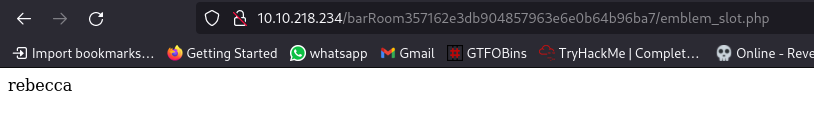
it just says "rebecca" nothing else. Maybe it'll be usefull later on. Let's continue.

Navigating to the directory 'dinningRoom2F':

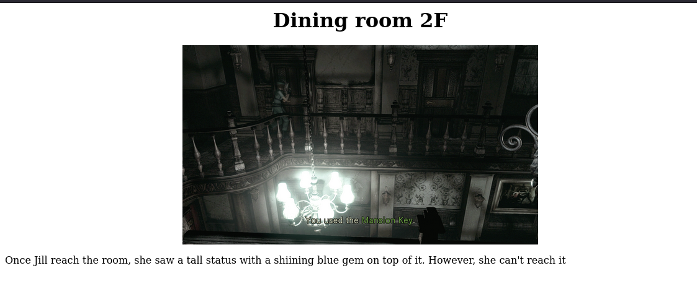

Check the source code:

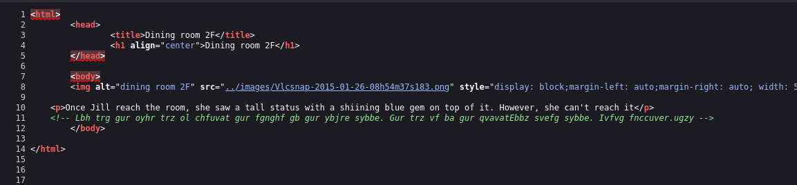

Identify the code using the tool used earlier:

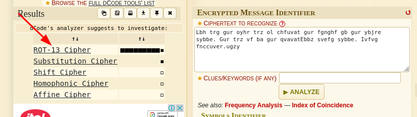


*You get the blue gem by pushing the status to the lower floor. The gem is on the diningRoom first floor. Visit sapphire.html*


Next up visiting the /galleryRoom/ dir:

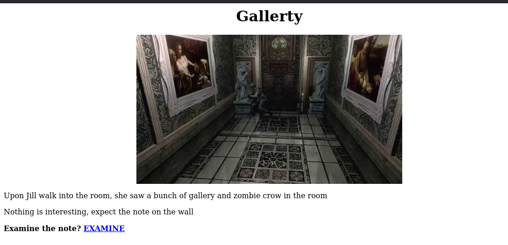

click the link:


```
crest 2:
GVFWK5KHK5WTGTCILE4DKY3DNN4GQQRTM5AVCTKE
Hint 1: Crest 2 has been encoded twice
Hint 2: Crest 2 contanis 18 letters
Note: You need to collect all 4 crests, combine and decode to reavel another path
The combination should be crest 1 + crest 2 + crest 3 + crest 4. Also, the combination is a type of encoded base and you need to decode it
```

Going back to the /diningRoom/ dir and entering the gold emblem key, it takes us to another page with a code:


Identify and decode it:

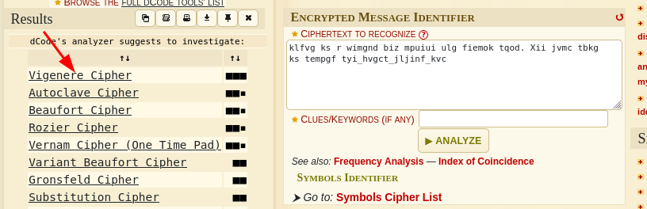


*there is a shield key inside the dining room. The html page is called the_great_shield_key*

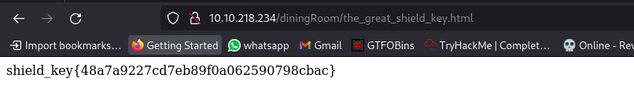

Navigating to the /armourRoom/:

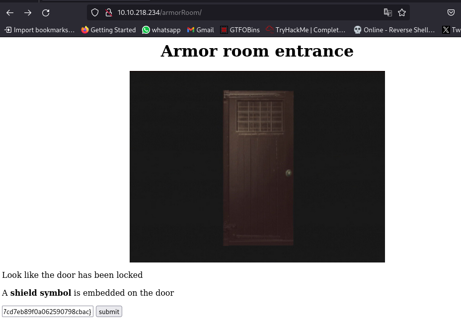

Submit the shield key

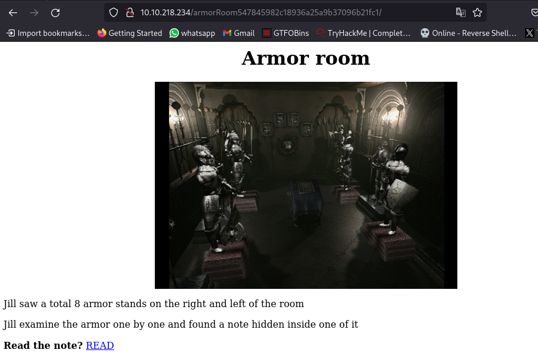

nothing in source code so lets visit the link:

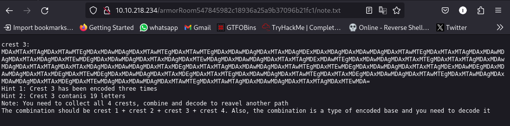
we now have the 3rd and 2nd crest. Remains the first and fourth.

```
crest 3:
MDAxMTAxMTAgMDAxMTAwMTEgMDAxMDAwMDAgMDAxMTAwMTEgMDAxMTAwMTEgMDAxMDAwMDAgMDAxMTAxMDAgMDExMDAxMDAgMDAxMDAwMDAgMDAxMTAwMTEgMDAxMTAxMTAgMDAxMDAwMDAgMDAxMTAxMDAgMDAxMTEwMDEgMDAxMDAwMDAgMDAxMTAxMDAgMDAxMTEwMDAgMDAxMDAwMDAgMDAxMTAxMTAgMDExMDAwMTEgMDAxMDAwMDAgMDAxMTAxMTEgMDAxMTAxMTAgMDAxMDAwMDAgMDAxMTAxMTAgMDAxMTAxMDAgMDAxMDAwMDAgMDAxMTAxMDEgMDAxMTAxMTAgMDAxMDAwMDAgMDAxMTAwMTEgMDAxMTEwMDEgMDAxMDAwMDAgMDAxMTAxMTAgMDExMDAwMDEgMDAxMDAwMDAgMDAxMTAxMDEgMDAxMTEwMDEgMDAxMDAwMDAgMDAxMTAxMDEgMDAxMTAxMTEgMDAxMDAwMDAgMDAxMTAwMTEgMDAxMTAxMDEgMDAxMDAwMDAgMDAxMTAwMTEgMDAxMTAwMDAgMDAxMDAwMDAgMDAxMTAxMDEgMDAxMTEwMDAgMDAxMDAwMDAgMDAxMTAwMTEgMDAxMTAwMTAgMDAxMDAwMDAgMDAxMTAxMTAgMDAxMTEwMDA=
Hint 1: Crest 3 has been encoded three times
Hint 2: Crest 3 contanis 19 letters
Note: You need to collect all 4 crests, combine and decode to reavel another path
The combination should be crest 1 + crest 2 + crest 3 + crest 4. Also, the combination is a type of encoded base and you need to decode it
```

Let's find the 1st  and 4th crest and  decode them all and combine them.

Going to the /attic/ dir and submitting the shield key:


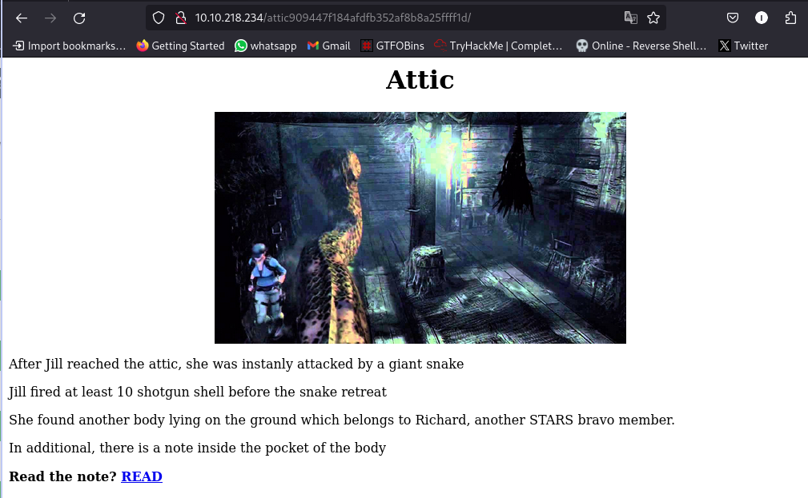

Nothing in the source code so lets click the link.


```
crest 4:
gSUERauVpvKzRpyPpuYz66JDmRTbJubaoArM6CAQsnVwte6zF9J4GGYyun3k5qM9ma4s
Hint 1: Crest 2 has been encoded twice
Hint 2: Crest 2 contanis 17 characters
Note: You need to collect all 4 crests, combine and decode to reavel another path
The combination should be crest 1 + crest 2 + crest 3 + crest 4. Also, the combination is a type of encoded base and you need to decode it
```

we have the 4th crest, remaining the 1st!!!

Going to the /tigerStatusRoom/ and submitting the blue_jewel we get the final crest:


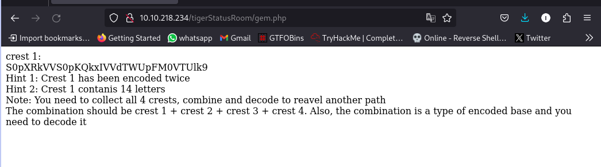

```
crest 1:  
S0pXRkVVS0pKQkxIVVdTWUpFM0VTUlk9  
Hint 1: Crest 1 has been encoded twice  
Hint 2: Crest 1 contanis 14 letters  
Note: You need to collect all 4 crests, combine and decode to reavel another path  
The combination should be crest 1 + crest 2 + crest 3 + crest 4. Also, the combination is a type of encoded base and you need to decode it
```

Now to decode them and combine

Crest 1:
base64 > base32 > final
`RlRQIHVzZXI6IG`

Crest 2:
base32 > base58 > final
`h1bnRlciwgRlRQIHBh`

Crest 3:
base64 > binary > HEX > final
`c3M6IHlvdV9jYW50X2h`

Crest 4:
base58 > HEX > final
`pZGVfZm9yZXZlcg==`

use dcode for identification and cyberchef for decoding, especially for HEX

Final code: 
`RlRQIHVzZXI6IGh1bnRlciwgRlRQIHBhc3M6IHlvdV9jYW50X2hpZGVfZm9yZXZlcg==` (base64)

Decode:
`FTP user: hunter, FTP pass: you_cant_hide_forever`

Now we can login!!!!

# Task 3: The guard house

After gaining access to the FTP server, you need to solve another puzzle.

Where is the hidden directory mentioned by Barry
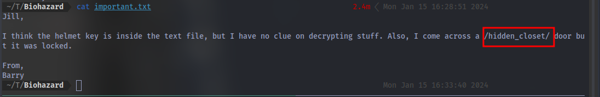

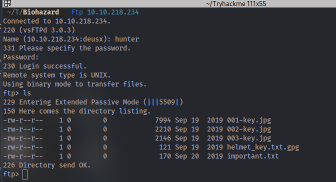

After logging in we can see some file we can download to our local machine to work on. use the command `get <filename>` to download files

we have 3 images, 1 text file and an encrypted file.

For the images we can extract info from them

First image: 

`steghide extract -sf <image_name>`

Second image:
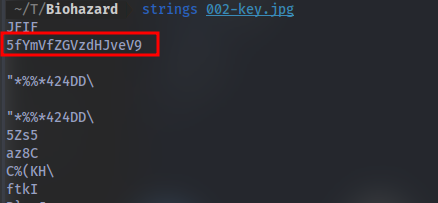

`strings <image_name>`

Third image:

`binwalk -e <image_name>`
`unzip <image_name>`

combine all 3 codes together:
`cGxhbnQ0Ml9jYW5fYmVfZGVzdHJveV93aXRoX3Zqb2x0` (base64)

Decode:

`plant42_can_be_destroy_with_vjolt`

Now we can decrypt the gpg file.
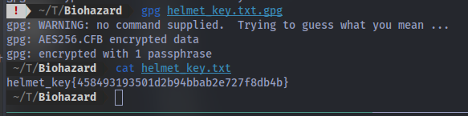

Navigating to the /hidden_closet/ dir we can submit the flag:


# Task 4: The Revisit

Done with the puzzle? There are places you have explored before but yet to access.


Nothing in the source code but we have 2 links. Let's check each.

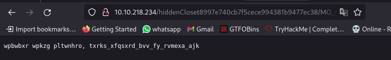
Lets identify and decode:
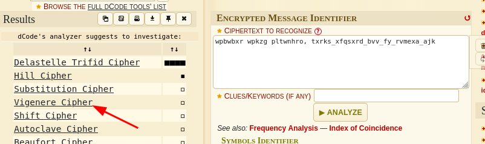


`weasker login password, stars_members_are_my_guinea_pig`

Second link:


*What is the SSH login username*

Next up we visit the /studyRoom/ dir and submit the helmet key:

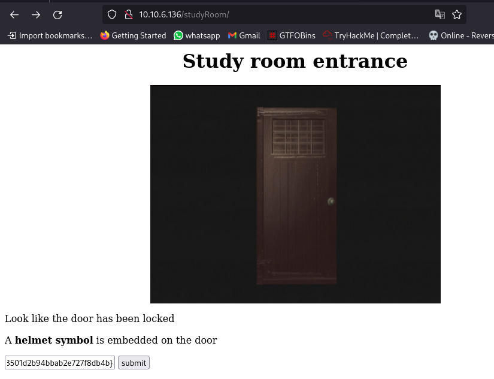


We now have access to the study room, nothing in the source code so let's check the link:
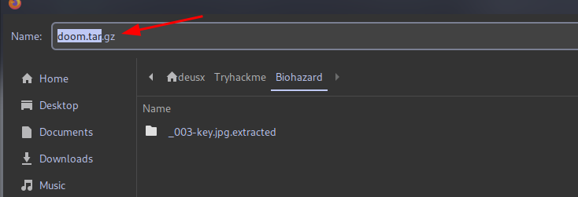

we download a compressed file. Let's take a look


after using `gunzip doom.tar.gz` we get doom.tar, then we use `tar -xvf doom.tar`
and we get a .txt file that contains the ssh username.

*Who the STARS bravo team leader*

You can just google search this:

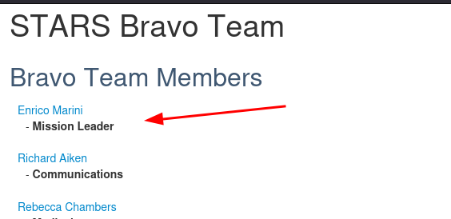

# Task 5: Underground laboratory

Time for the final showdown. Can you escape the nightmare?

*Where you found Chris*
After logging in via ssh with the creds we got we can find the answer:

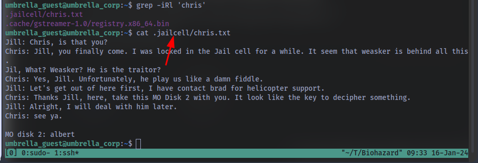

`grep iRl 'chris'` will find the text chris in all files and folders in our current dir.

*Who is the traitor*
we can also get this answer from the message above

*The login password for the traitor*

Remember we got the password earlier:


we can login as weasker using his name and the password "stars_members_are_my_guinea_pig"

*The name of the ultimate form*


*The root flag*

check for sudo privileges using `sudo -l`

we can run all commands.....well that was easy. This means we can just spawn a bash shell as root using `sudo /bin/bash`

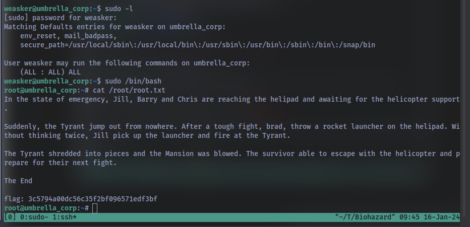

and we have the final  flag... GGs 🤝

Thanks for reading to the end, Have a nice day!

