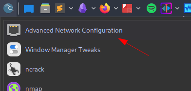

# Enumerating Active Directory

![[attachments/Pasted image 20240510095503.png]]

This room covers various Active Directory enumeration techniques, their use cases as well as drawbacks.

In this write-up, I'll only be covering sections people might have difficulty with.

# Task 1: Why AD Enumeration

Here is how you can setup your machine if you are making use of **OpenVPN** on Kali Linux

First up go to the [access page](https://tryhackme.com/r/access)

Next is to download the OpenVPN configuration file for this room.

Select Networks > "adenumeration" 

![[attachments/Pasted image 20240510095738.png]]

Download configuration file

![[attachments/Pasted image 20240510095818.png]]

Connect using configuration file:

```shell
sudo openvpn <config_file>
```


![[attachments/Pasted image 20240510095907.png]]

Confirm connectivity by checking the access page:

![[attachments/Pasted image 20240510100011.png]]

Next is to configure DNS.

Search for "Advanced Network Configuration"



Double click on the network connection you're using


Go to IPv4 settings and set:

Additional DNS servers - `THMDCIP`

The IP for THMDC can be found here:

![[attachments/Pasted image 20240510103054.png]]

Set Additional search domains - `1.1.1.1` as instructed in the room

![[attachments/Pasted image 20240510103145.png]]

Next up open your terminal and edit the `/etc/hosts` file using any text editor of your choice. Then enter this entry  `THMDCIP   za.tryhackme.com`

![[attachments/Pasted image 20240510103815.png]]

Go to your terminal and run the command:

```shell
sudo systemctl restart NetworkManager
```

Test if everything is working fine by running:

```shell
nslookup thmdc.za.tryhackme.com
```

![[attachments/Pasted image 20240510104057.png]]

Note: Remember to start the network

![[attachments/Pasted image 20240510104151.png]]

![[attachments/Pasted image 20240510104230.png]]

Next thing is to navigate to http://distributor.za.tryhackme.com/creds and get your credentials 

![[attachments/Pasted image 20240510130303.png]]

![[attachments/Pasted image 20240510130329.png]]

To connect via ssh, use the syntax:

```shell
ssh za.tryhackme.com\\rachel.dunn@thmjmp1.za.tryhackme.com
```

![[attachments/Pasted image 20240510131141.png]]

![[attachments/Pasted image 20240510130523.png]]

To connect via RDP with `xfreerdp`, use this syntax:

```shell
xfreerdp /v:THMJMP1.za.tryhackme.com /u:rachel.dunn /p:Bmlj9838 /cert:ignore +clipboard /dynamic-resolution
```


![[attachments/Pasted image 20240510131411.png]]

![[attachments/Pasted image 20240510131435.png]]

# Task 3: Enumeration through Microsoft Management Console

Login via RDP as show in the previous tasks.

Click on Start Menu and Open CMD

Type the following to open a Command prompt as a domain joined user `za.tryhackme.com\rachel.dunn`

```shell
runas.exe /netonly /user:za.tryhackme.com\rachel.dunn cmd.exe
```

![[attachments/Pasted image 20240511101559.png]]

![[attachments/Pasted image 20240511141633.png]]

Next is to start MMC:

![[attachments/Pasted image 20240511141721.png]]

![[attachments/Pasted image 20240511141741.png]]

Next objective is to attach the AD RSAT Snap-In

File > Add/Remove Snap-in

![[attachments/Pasted image 20240511141840.png]]

ADd all three AD Snap-ins and Select OK

![[attachments/Pasted image 20240511142014.png]]

Right-click on **Active Directory Domains and Trusts** and select **Change Forest**

![[attachments/Pasted image 20240511142122.png]]

Enter _za.tryhackme.com_ as the **Root domain** and Click **OK**

![[attachments/Pasted image 20240511142148.png]]

Similar thing for the other 2.

**Active Directory Sites and Services**

![[attachments/Pasted image 20240511142239.png]]

![[attachments/Pasted image 20240511142303.png]]

**Active Directory Users and Computers**

![[attachments/Pasted image 20240511142450.png]]

![[attachments/Pasted image 20240511142545.png]]

Click on **Active Directory Users and Computers** in the left hand pane then on the top task bar click on **View > Advanced Features**

![[attachments/Pasted image 20240511143140.png]]

![[attachments/Pasted image 20240511143209.png]]

Ensure everything is setup completely

![[attachments/Pasted image 20240511143457.png]]

