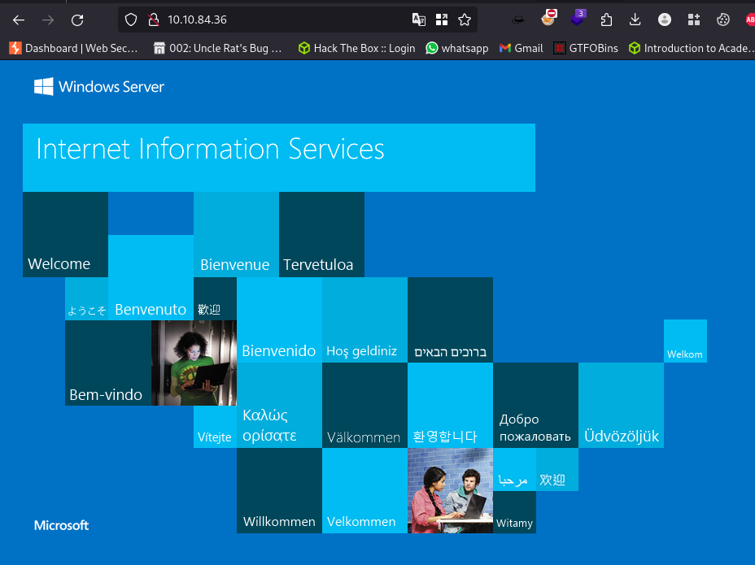
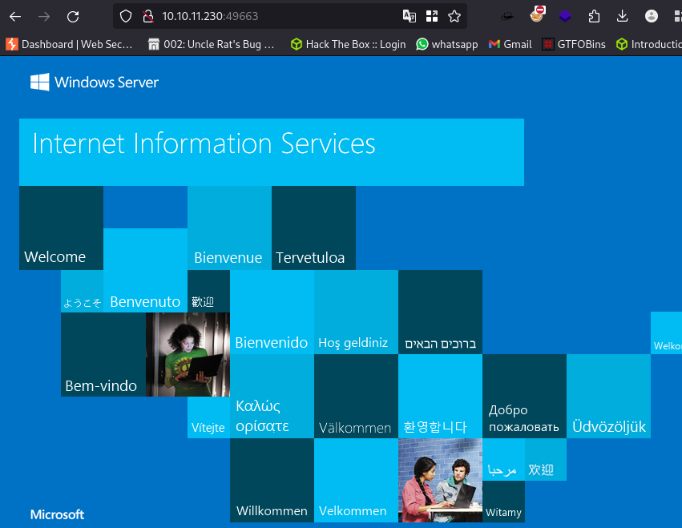
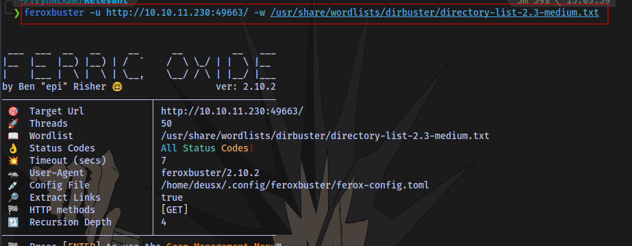
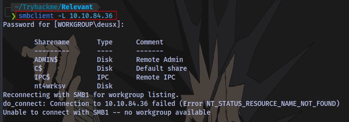
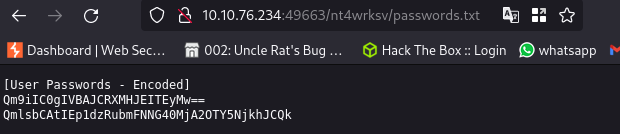
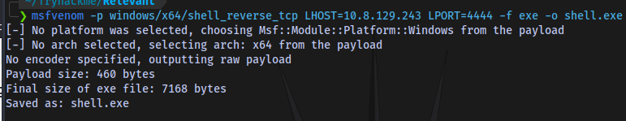
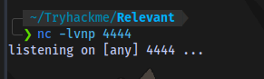
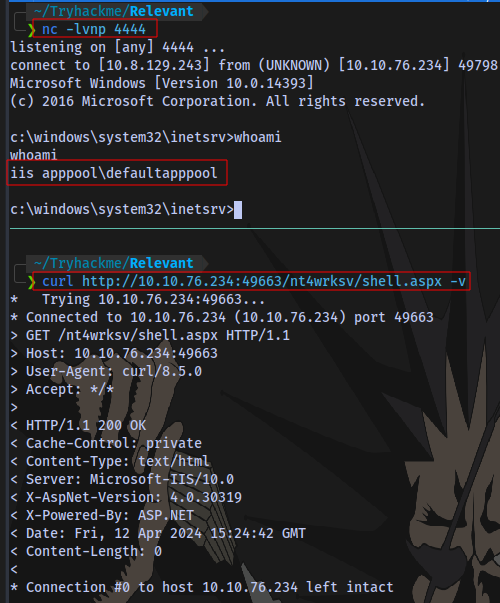
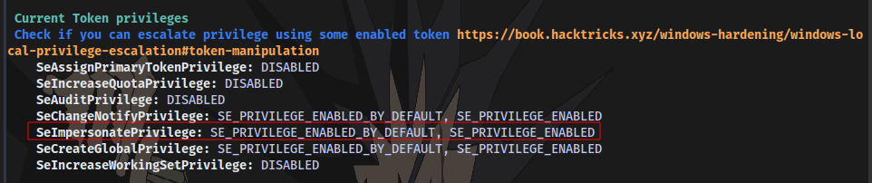
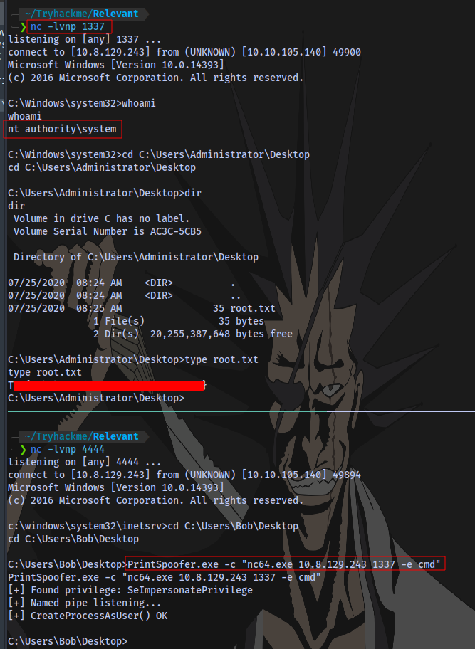

# Relevant


**Difficulty:** `Medium`

**OS:** `Windows`

**Category:** `Pentest, Privilege Escalation, Security Misconfiguration`

**Description:** 

```
You have been assigned to a client that wants a penetration test conducted on an environment due to be released to production in seven days. 

**Scope of Work**

The client requests that an engineer conducts an assessment of the provided virtual environment. The client has asked that minimal information be provided about the assessment, wanting the engagement conducted from the eyes of a malicious actor (black box penetration test).  The client has asked that you secure two flags (no location provided) as proof of exploitation:

- User.txt
- Root.txt  
    

Additionally, the client has provided the following scope allowances:

- Any tools or techniques are permitted in this engagement, however we ask that you attempt manual exploitation first  
    
- Locate and note all vulnerabilities found
- Submit the flags discovered to the dashboard
- Only the IP address assigned to your machine is in scope
- Find and report ALL vulnerabilities (yes, there is more than one path to root)

(Roleplay off)

I encourage you to approach this challenge as an actual penetration test. Consider writing a report, to include an executive summary, vulnerability and exploitation assessment, and remediation suggestions, as this will benefit you in preparation for the eLearnSecurity Certified Professional Penetration Tester or career as a penetration tester in the field.

Note - Nothing in this room requires Metasploit

Machine may take up to 5 minutes for all services to start.  

****Writeups will not be accepted for this room.****
```

# User Flag

**NOTE**: I had to reset the machine multiple times so you'll notice different target IPs being used, just know it's the same target.

**Nmap Scan**

```shell
# Nmap 7.94SVN scan initiated Fri Apr 12 10:12:27 2024 as: nmap -sCV -A -p- -T4 --min-rate=1000 -O -oN scan 10.10.84.36
Nmap scan report for 10.10.84.36
Host is up (0.23s latency).
Not shown: 65527 filtered tcp ports (no-response)
PORT      STATE SERVICE            VERSION
80/tcp    open  http               Microsoft HTTPAPI httpd 2.0 (SSDP/UPnP)
| http-methods: 
|_  Potentially risky methods: TRACE
|_http-title: IIS Windows Server
|_http-server-header: Microsoft-IIS/10.0
135/tcp   open  msrpc              Microsoft Windows RPC
139/tcp   open  netbios-ssn        Microsoft Windows netbios-ssn
445/tcp   open  microsoft-ds       Windows Server 2016 Standard Evaluation 14393 microsoft-ds
3389/tcp  open  ssl/ms-wbt-server?
|_ssl-date: 2024-04-12T09:17:07+00:00; 0s from scanner time.
| ssl-cert: Subject: commonName=Relevant
| Not valid before: 2024-04-11T09:05:41
|_Not valid after:  2024-10-11T09:05:41
| rdp-ntlm-info: 
|   Target_Name: RELEVANT
|   NetBIOS_Domain_Name: RELEVANT
|   NetBIOS_Computer_Name: RELEVANT
|   DNS_Domain_Name: Relevant
|   DNS_Computer_Name: Relevant
|   Product_Version: 10.0.14393
|_  System_Time: 2024-04-12T09:16:26+00:00
49663/tcp open  http               Microsoft HTTPAPI httpd 2.0 (SSDP/UPnP)
| http-methods: 
|_  Potentially risky methods: TRACE
|_http-title: IIS Windows Server
|_http-server-header: Microsoft-IIS/10.0
49667/tcp open  msrpc              Microsoft Windows RPC
49669/tcp open  msrpc              Microsoft Windows RPC
Warning: OSScan results may be unreliable because we could not find at least 1 open and 1 closed port
Device type: general purpose
Running (JUST GUESSING): Microsoft Windows 2016 (88%)
OS CPE: cpe:/o:microsoft:windows_server_2016
Aggressive OS guesses: Microsoft Windows Server 2016 (88%)
No exact OS matches for host (test conditions non-ideal).
Network Distance: 2 hops
Service Info: OSs: Windows, Windows Server 2008 R2 - 2012; CPE: cpe:/o:microsoft:windows

Host script results:
| smb2-security-mode: 
|   3:1:1: 
|_    Message signing enabled but not required
| smb2-time: 
|   date: 2024-04-12T09:16:30
|_  start_date: 2024-04-12T09:06:38
| smb-security-mode: 
|   account_used: guest
|   authentication_level: user
|   challenge_response: supported
|_  message_signing: disabled (dangerous, but default)
| smb-os-discovery: 
|   OS: Windows Server 2016 Standard Evaluation 14393 (Windows Server 2016 Standard Evaluation 6.3)
|   Computer name: Relevant
|   NetBIOS computer name: RELEVANT\x00
|   Workgroup: WORKGROUP\x00
|_  System time: 2024-04-12T02:16:28-07:00
|_clock-skew: mean: 1h24m00s, deviation: 3h07m51s, median: 0s

TRACEROUTE (using port 445/tcp)
HOP RTT       ADDRESS
1   249.50 ms 10.8.0.1
2   249.87 ms 10.10.84.36

OS and Service detection performed. Please report any incorrect results at https://nmap.org/submit/ .
# Nmap done at Fri Apr 12 10:17:08 2024 -- 1 IP address (1 host up) scanned in 280.31 seconds

```

Website running on port 80:



Same website running on port 49663:



Directory scan on site 80 reveals nothing.

Scanning the site running on port 49663 using feroxbuster



We have a directory `nt4wrksv`


Accessing the directory shows nothing:


Let's move on to other enumeration for now.

Listing SMB Shares with `smbclient`:



The share `nt4wrksv` contains a `password.txt` file


We also have write access to the share:


Confirming if the password file exist on the website running on port `49663`:



`passwords.txt` file contains base64 code of user credentials


`Bob - !P@$$W0rD!123` &  `Bill - Juw4nnaM4n420696969!$$$`

Trying to login using psexec and the credentials obtained but no luck.


Using nmap smb scripts to scan the target reveals it is vulnerable to `CVE-2017-0143`


We can try uploading a reverse shell to the smb share and executing it by navigating to it on the website.

Generating a payload using msfvenom



Upload the payload


Start netcat listener



Execute the payload


It doesn't work. Let's try an aspx payload instead


Upload it and execute it



And we have shell access

User Flag


# Root Flag

Now for the privilege escalation

Transfer the winpeas script to the target 


Checking through the result, we have `SeImpersonatePrivilege` enabled



**SeImpersonatePrivilege**

This is privilege that is held by any process allows the impersonation (but not creation) of any token, given that a handle to it can be obtained. A privileged token can be acquired from a Windows service (DCOM) by inducing it to perform NTLM authentication against an exploit, subsequently enabling the execution of a process with SYSTEM privileges. This vulnerability can be exploited using various tools, such as [juicy-potato](https://github.com/ohpe/juicy-potato), [RogueWinRM](https://github.com/antonioCoco/RogueWinRM) (which requires winrm to be disabled), [SweetPotato](https://github.com/CCob/SweetPotato), and [PrintSpoofer](https://github.com/itm4n/PrintSpoofer).

First up i will transfer a windows [netcat binary](https://github.com/int0x33/nc.exe/blob/master/nc64.exe) and [PrintSpoofer](https://github.com/dievus/printspoofer/blob/master/PrintSpoofer.exe) executable to the target then use printspoofer to gain a reverse shell on my machine.

And we are NT Authority System. 



Root Flag obtained. The End.

