# Tokyo Ghoul

Help kaneki escape jason room

# Task 1: About the room

   

wzebi dyalmn????

This room took a lot of inspiration from [psychobreak](https://tryhackme.com/room/psychobreak) , and it is based on Tokyo Ghoul anime.

Alert: This room can contain some spoilers 'only s1 and s2 ' so if you are interested to watch the anime, wait till you finish the anime and come back to do the room 

The machine will take some time, just go grab some water or make a coffee.

**This room contains some non-pg13 elements in the form of narrative descriptions. Please proceed only at your own comfort level.**

# Task 2: Where am i?

## Use nmap to scan all ports

Nmap scan:

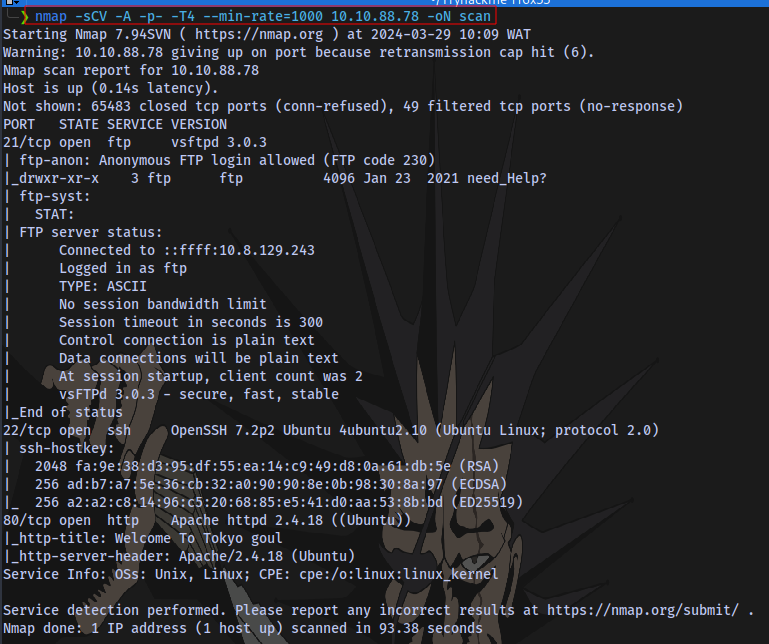

```shelll
nmap -sCV -A -p- -T4 --min-rate=1000 IP -oN scan
```

## How many ports are open ?

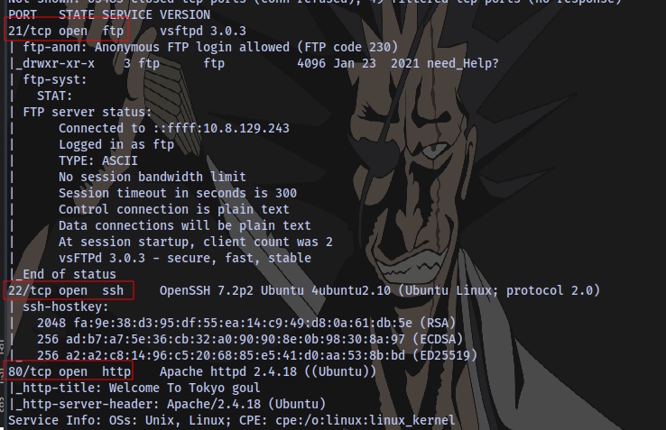

##  What is the OS used ?


# Task 3: Planning to escape

  


Try to look around any thing would be useful .

## Did you find the note that the others ghouls gave you? where did you find it ?

Navigate to the website running on port 80:

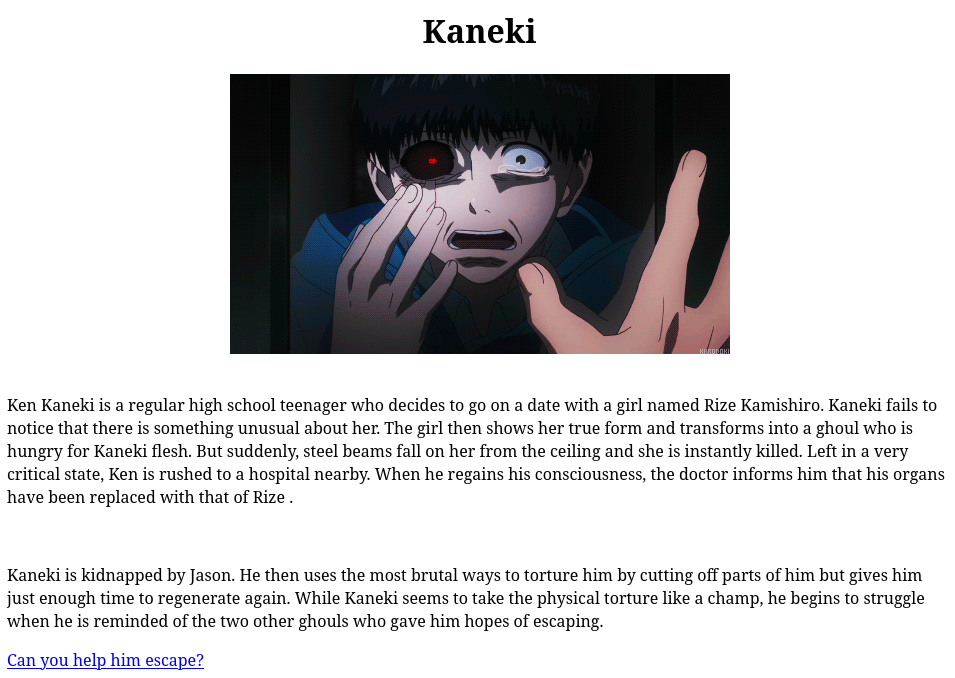

Checking the page source, we have a comment telling us to login as anonymous via ftp.

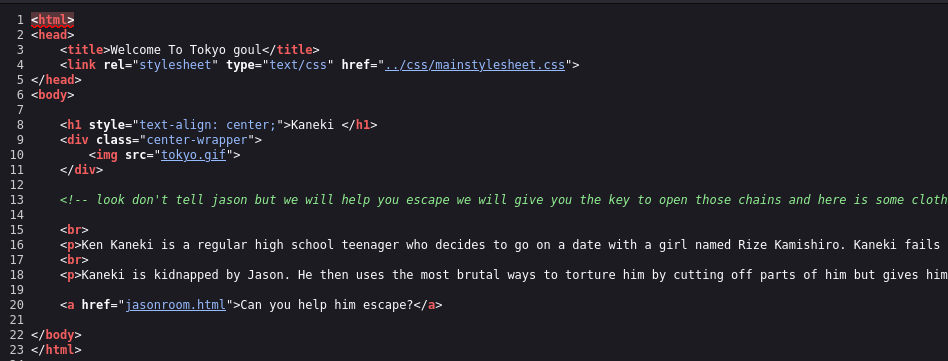

```
<!-- look don't tell jason but we will help you escape we will give you the key to open those chains and here is some clothes to look like us and a mask to look anonymous and go to the ftp room right there -->
```

We can take a loot at the link on the website:

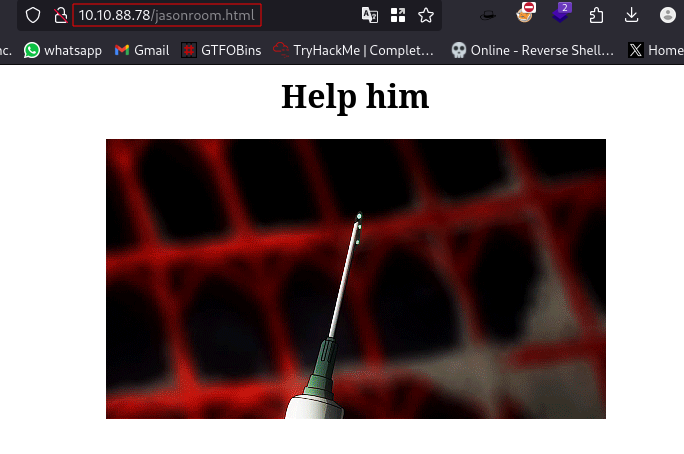

It takes us to a webpage `jasonroom.html`

Checking the source, we find a similar comment like before:

```
<!-- look don't tell jason but we will help you escape , here is some clothes to look like us and a mask to look anonymous and go to the ftp room right there you will find a freind who will help you -->
```

**Answer**: `jasonroom.html`

Anonymous login allowed on the FTP server, which means we can login with the username `anonymous` and no password.

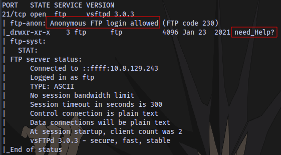

Login and download all files in all directories:

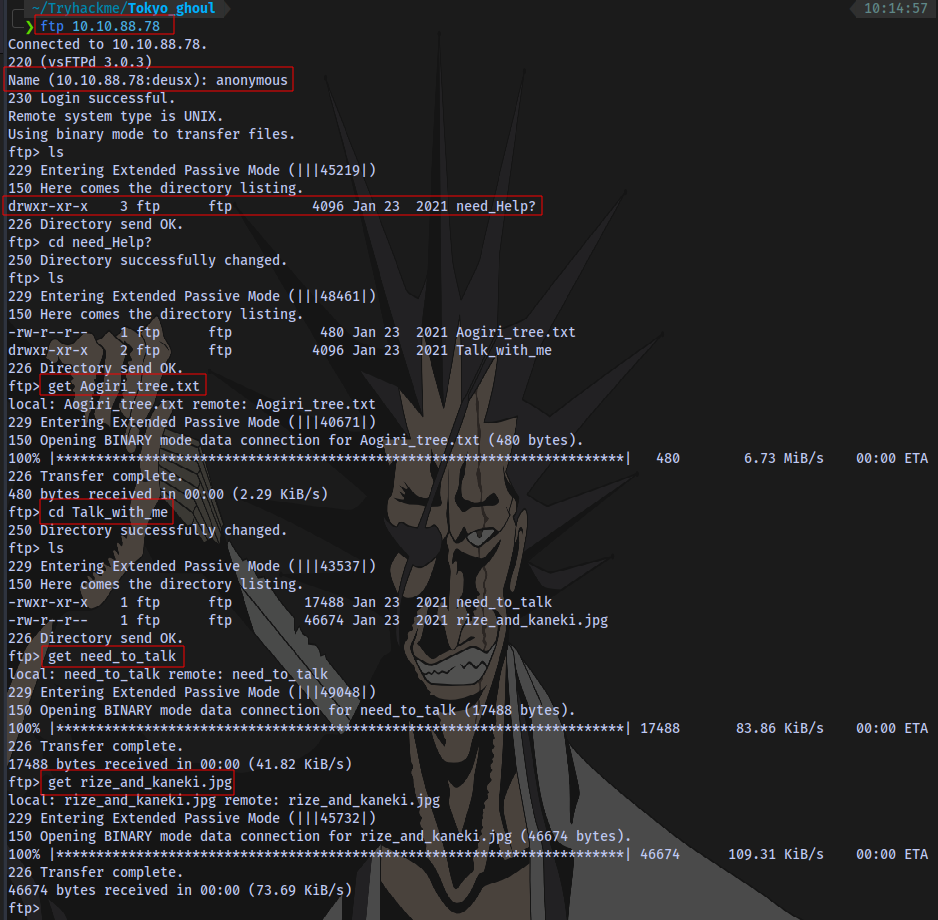

We have a note, a linux executable and a jpeg file. 

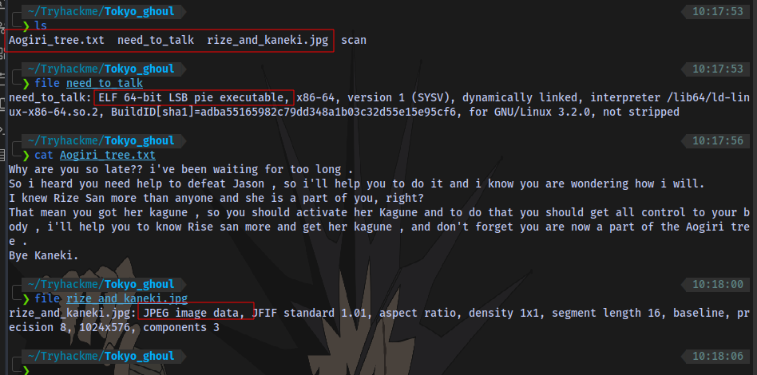

## What is the key for Rize executable?

Next up is to give the executable file executable permission so we can run it.

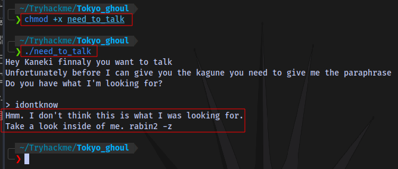

```
chmod +x file (add executable permission)
./file (run the file)
```

As we can see it is requesting for a passphrase which we don't know yet. At the end of the message it says to "look inside of me", so let's cat the file:

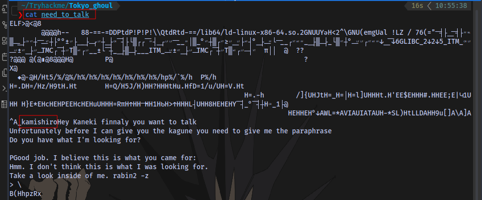

We can see a word `kamishiro` which could be the potential passphrase because when we run the executable it starts with "Hey Kaneki" and not "KamishiroHey Kaneki". So the word "kamishiro" is probably the passphrase, let's try it.

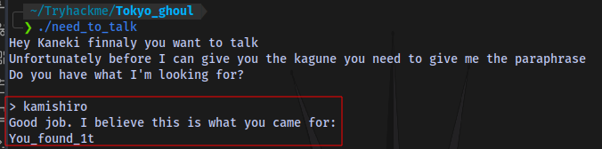

It works and we got a passphrase `You_found_1t`

## Use a tool to get the other note from Rize .

We also obtained a picture, we can try checking for any hidden information in it using stenography tools like Steghide.

```
steghide extract -sf file
```

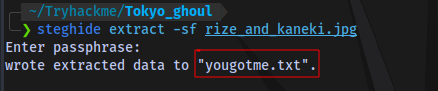

Enter the passphrase `You_found_1t` when prompted and we get a note.

# Task 4: What Rize is trying to say?


  

You should help me , i can't support pain aghhhhhhh

##  What the message mean did you understand it ? what it says?

Checking the contents of the file, we have what looks like Morse code. We can decode it using [dcode](https://gchq.github.io/CyberChef/)

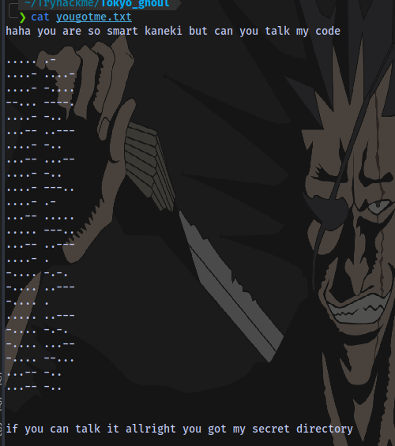

From Morse code to Hex:

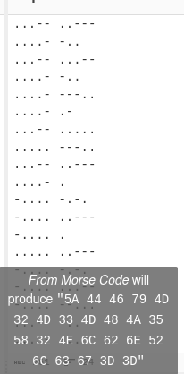

Morse - Hex:

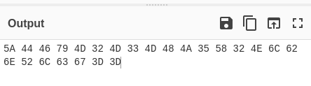

Hex - Base64:

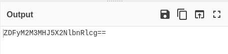

Base64 to Plaintext:


## Can you see the weakness in the dark ? no ? just search

Navigate to the directory `d1r3c70ry_center` on the website

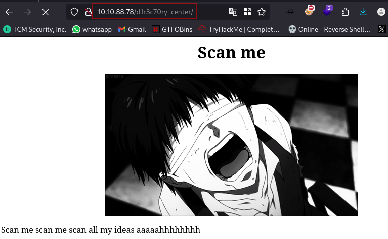

Performing a directory bruteforce SCAN, we can find a directory `/claim` 

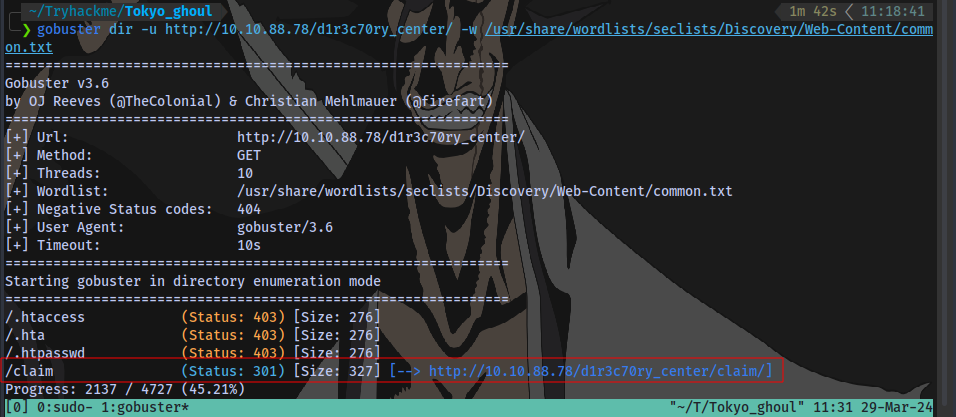


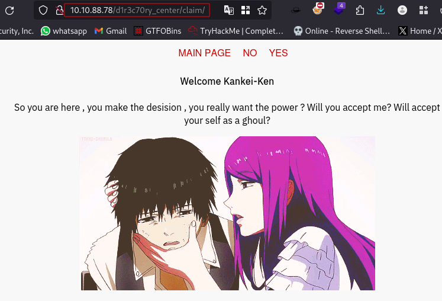

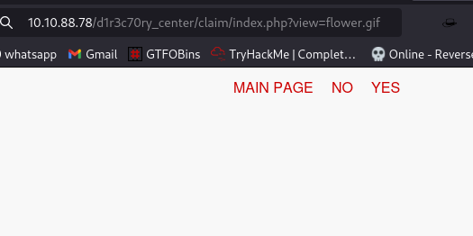

Selecting YES or NO takes us to a blank page but looking at the url we have `index.php?view=flower.gif`
This seems to be getting the file `flower.gif`. We could for possible LFI (local file inclusion).

Trying to view the `/etc/passwd` file as a common test for LFI, we get this message:

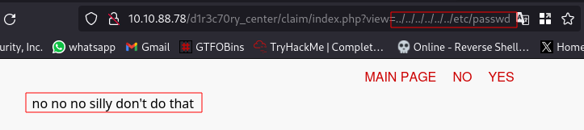

It seems there is some sort of filter in place, therefore we can try using a PHP LFI filter bypass. Tried using some payloads from this [site](https://github.com/swisskyrepo/PayloadsAllTheThings/blob/master/File%20Inclusion/README.md) but none worked until i modified a payload to only encode the dots and slashes and it worked. 

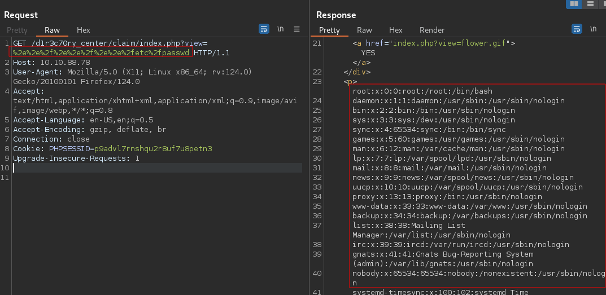

We are able to read contents of `/etc/passwd`.

## What did you find something ? crack it

We are also able to obtain a username `kamishiro` and a password hash:

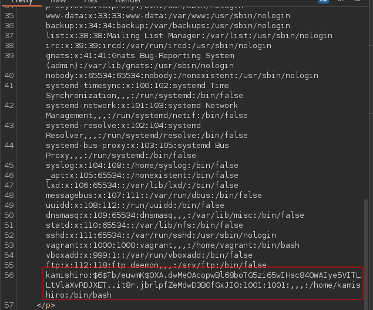

We can try to crack the hash. Place the entire thing in a file

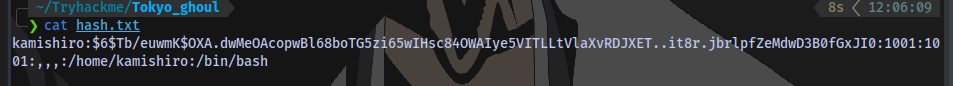

I will use hashcat to crack it.

Checking this [site](https://hashcat.net/wiki/doku.php?id=example_hashes), we can get the hashcat mode for the hash:

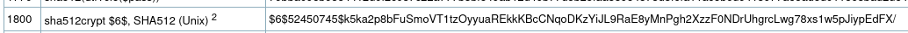

## what is rize password ?

Now to crack it:

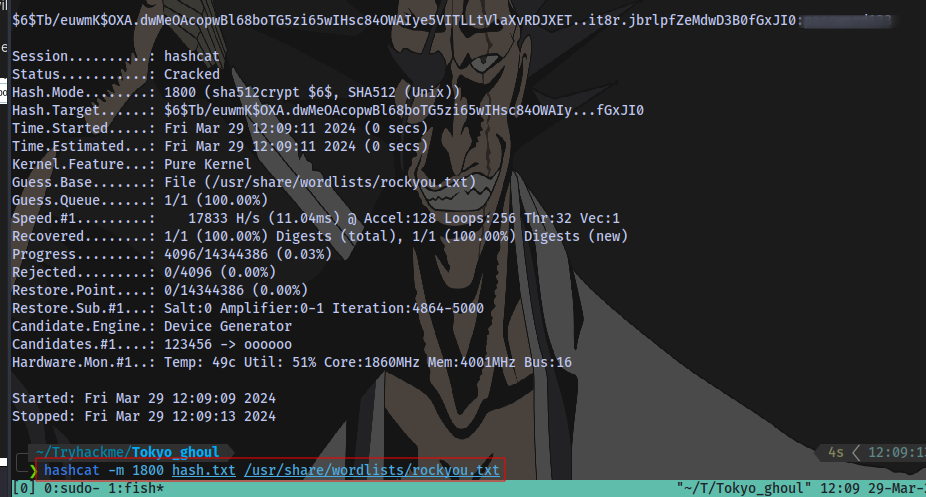

```
hashcat -m 1800 hash.txt /usr/share/wordlists/rockyou.txt
```

# Task 5: Fight Jason

  

Finnaly i got Rize kagune help me fight Jason and get root .

Now with a username and password, we can login as the user `kamishiro` via ssh

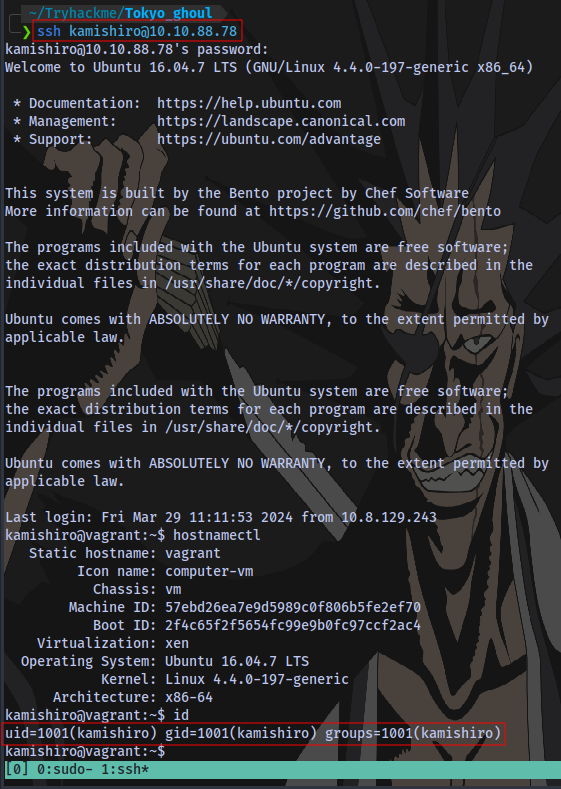
## user.txt

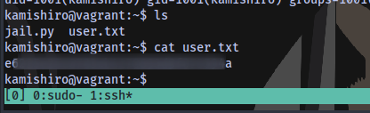

## root.txt

Checking sudo privileges:


The owner of the `jail.py` script is root and wr can run it with sudo.

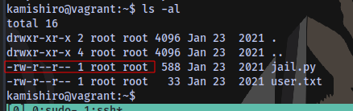

 with sudo. Let's see the contents of the script.

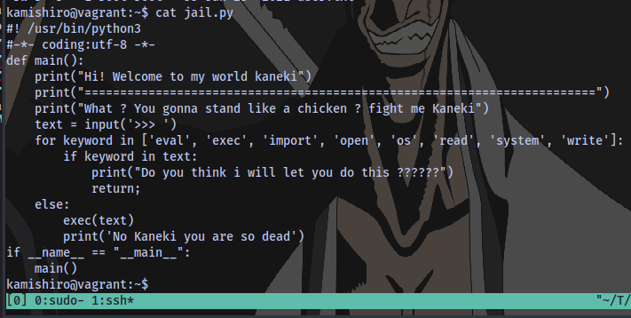

This script accepts user input and if the input contains any of those keywords it won't execute.

So we have to find a way to spawn a shell without using any of those keywords.

Searching on google on "how to escape python jail" took me to this [blog post](https://anee.me/escaping-python-jails-849c65cf306e) and i was able to read the root.txt file to get the flag.

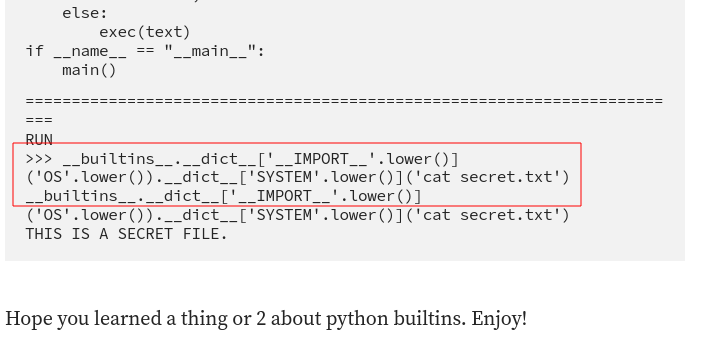

```python
__builtins__.__dict__['__IMPORT__'.lower()]('OS'.lower()).__dict__['SYSTEM'.lower()]('cat file.txt')
```


OR

We can spawn a bash shell `/bin/bash` as root:

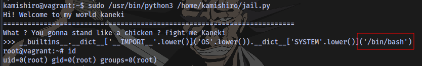

```python
__builtins__.__dict__['__IMPORT__'.lower()]('OS'.lower()).__dict__['SYSTEM'.lower()]('/bin/bash') 
```

The End.

