# Watcher


**Difficulty**: `Medium`

**OS**: `Linux`

**Category**: `Privilege Escalation, LFI, Web, Security`

**Description**: `A boot2root Linux machine utilising web exploits along with some common privilege escalation techniques.`

# Flag 1:


**Nmap Scan**:

```shell
# Nmap 7.94SVN scan initiated Sat Apr 13 19:21:21 2024 as: nmap -sCV -A -p- -T4 --min-rate=1000 -oN scan 10.10.179.219
Warning: 10.10.179.219 giving up on port because retransmission cap hit (6).
Nmap scan report for 10.10.179.219
Host is up (0.13s latency).
Not shown: 65529 closed tcp ports (conn-refused)
PORT      STATE    SERVICE  VERSION
21/tcp    open     ftp      vsftpd 3.0.3
22/tcp    open     ssh      OpenSSH 7.6p1 Ubuntu 4ubuntu0.3 (Ubuntu Linux; protocol 2.0)
| ssh-hostkey: 
|   2048 e1:80:ec:1f:26:9e:32:eb:27:3f:26:ac:d2:37:ba:96 (RSA)
|   256 36:ff:70:11:05:8e:d4:50:7a:29:91:58:75:ac:2e:76 (ECDSA)
|_  256 48:d2:3e:45:da:0c:f0:f6:65:4e:f9:78:97:37:aa:8a (ED25519)
80/tcp    open     http     Apache httpd 2.4.29 ((Ubuntu))
|_http-server-header: Apache/2.4.29 (Ubuntu)
|_http-generator: Jekyll v4.1.1
|_http-title: Corkplacemats
3629/tcp  filtered escvpnet
35961/tcp filtered unknown
45963/tcp filtered unknown
Service Info: OSs: Unix, Linux; CPE: cpe:/o:linux:linux_kernel

Service detection performed. Please report any incorrect results at https://nmap.org/submit/ .
# Nmap done at Sat Apr 13 19:22:54 2024 -- 1 IP address (1 host up) scanned in 92.85 seconds
```

Website running on Port 80

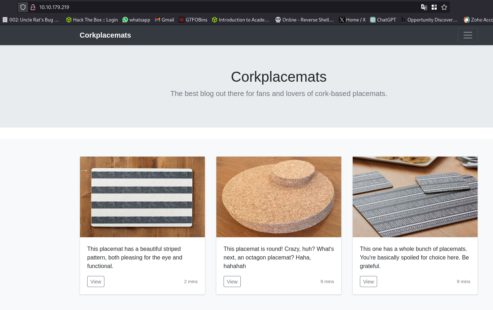

**Directory Scan**:

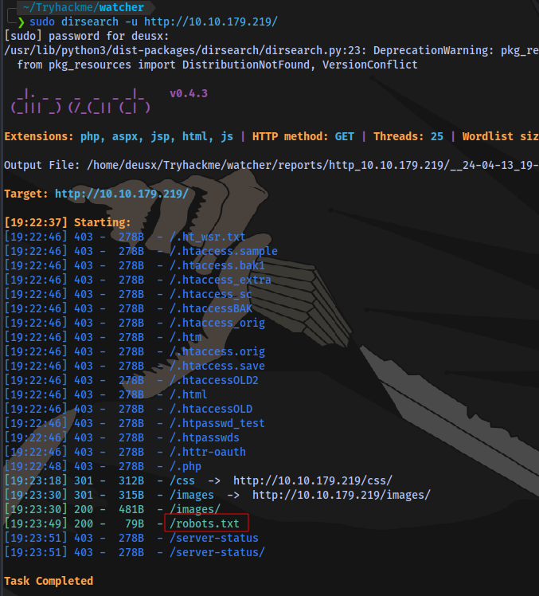

contents of `robots.txt`

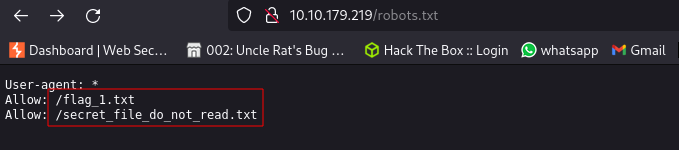

Flag 1 obtained

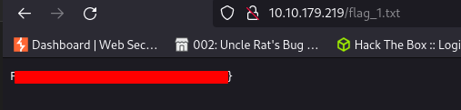


# Flag 2

No access to secret file

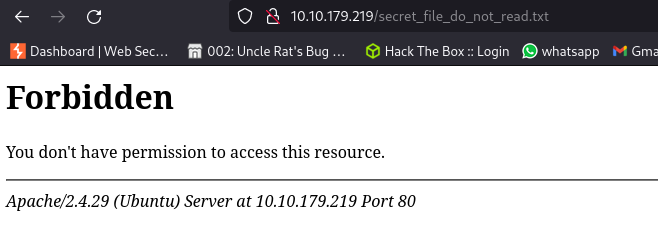

Viewing a product on the site home page:

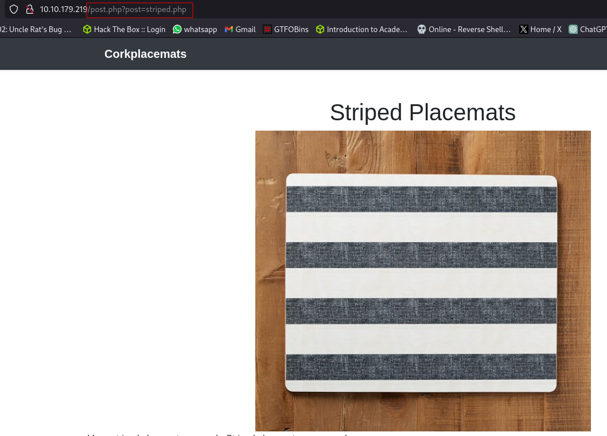

The URL is taking a value for the post parameter.

Testing for local file inclusion using burp

**Request**

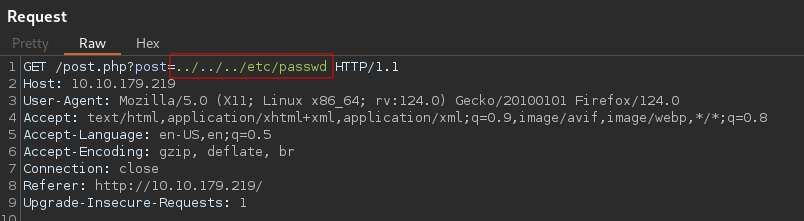

**Response**

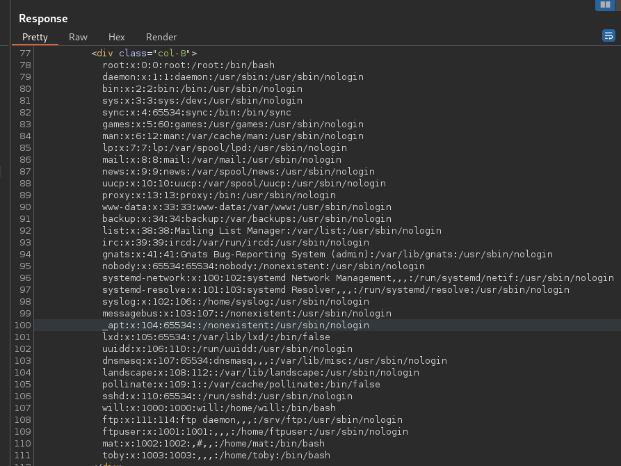

LFI exists.

Using this vulnerability to read the secret file

**Request**

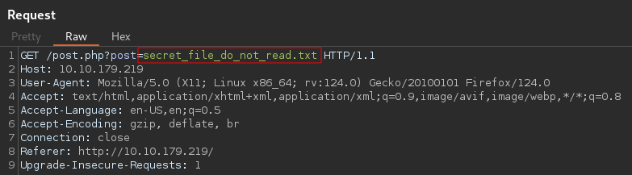

**Response**

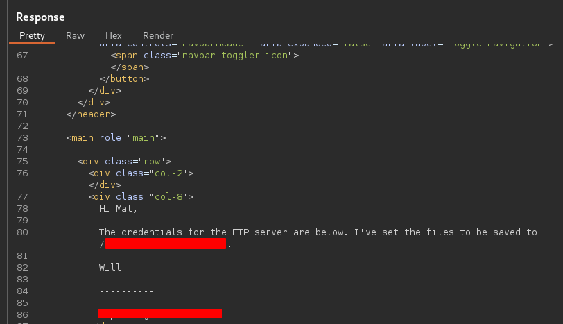

We have FTP login creds.

Login to FTP server

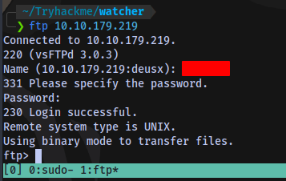

Second flag located 

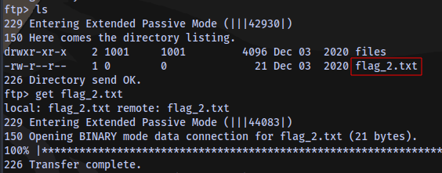

the `files` directory is empty.

Second Flag obtained


# Flag 3

We have write access to the files directory in the ftp server 

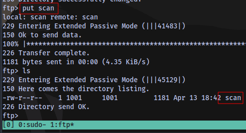

And we know the location of this directory from the secret message we got earlier:

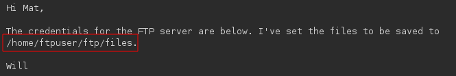

Which means we can upload a reverse shell and execute it using LFI.

To confirm i will try reading the file `scan` i uploaded

**Request**

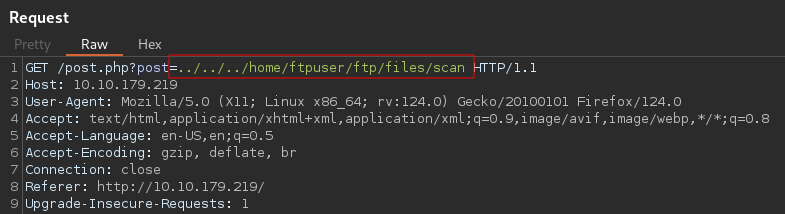

**Response**

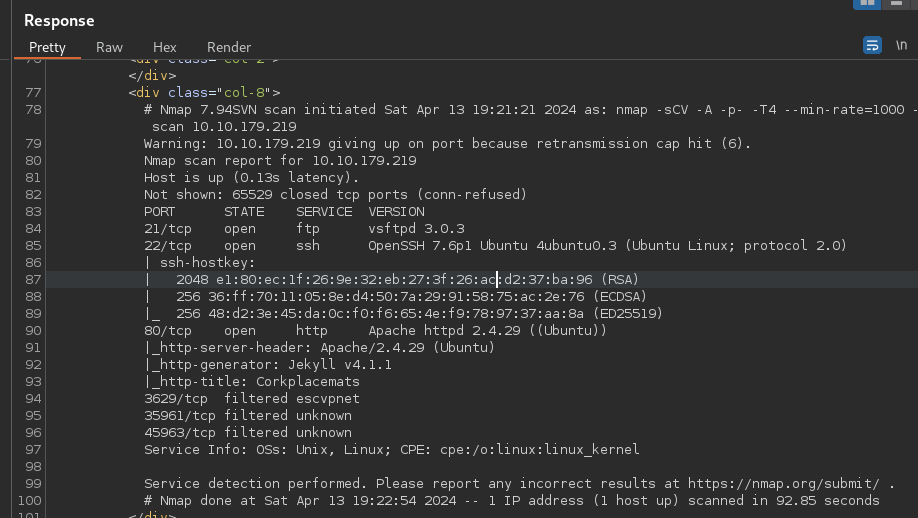

It works.

Uploading the shell. I will be using [this](https://github.com/pentestmonkey/php-reverse-shell/blob/master/php-reverse-shell.php) php reverse shell payload


Start a netcat listener and execute the shell

**Request**

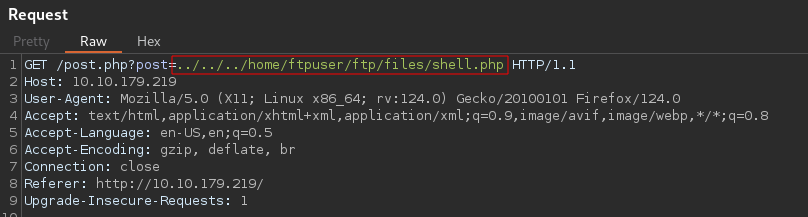

Shell access

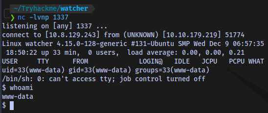

Stabilize shell

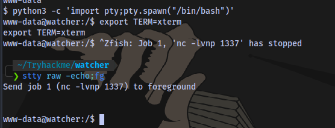

```shell
python3 -c 'import pty;pty.spawn("/bin/bash")'
export TERM=xterm
Ctrl + Z (background shell)
stty raw -echo;fg
Press ENTER
```

Flag 3 obtained

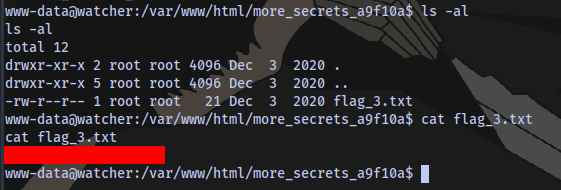

# Flag 4

4 Users in home directory

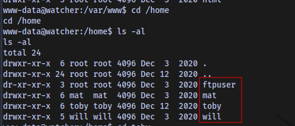

Content of `note.txt` in toby's home directory

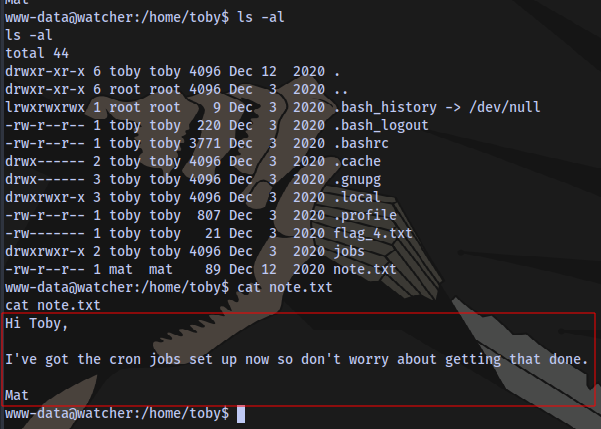

content of the script `cow.sh` located in the `jobs` directory 

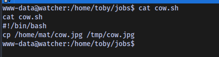

Checking for sudo permissions `sudo -l`

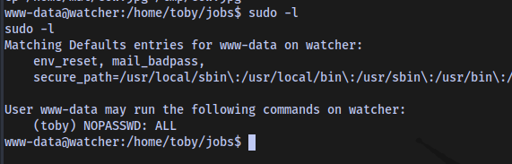

We can run any command as toby using `sudo` with no password.

So we can just spawn a bash shell as toby


Fourth Flag obtained

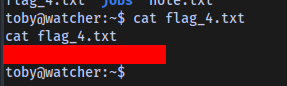

# Flag 5

Cronjob running as the user mat

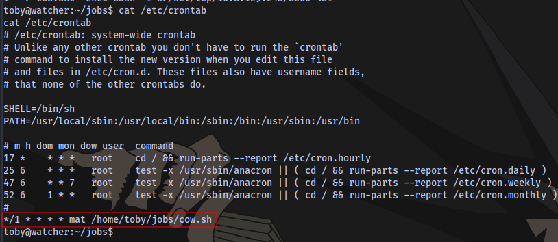

Insert a rev shell payload into the script and gain a shell as the user mat

Payload

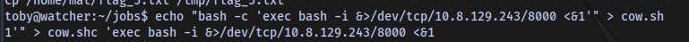

Shell access

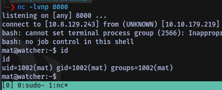

Flag 5 obtained 

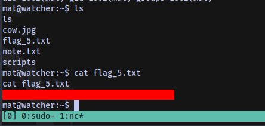

# Flag 6

The user mat can use sudo to run the python script `will_script.py`

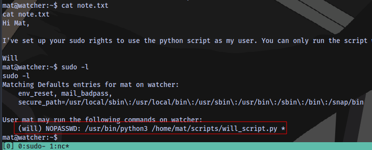

Content of the script

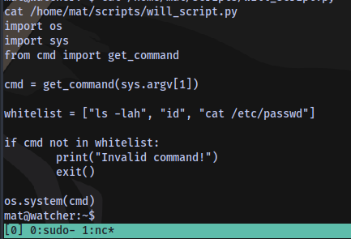

Content of the second script `cmd.py`

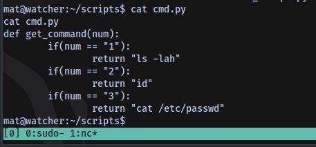

This is basically a function that collect an input and if any number from 1 - 3 is specified, it'll perform the respective function `ls -lah, id, cat /etc/passwd`

Testing the script

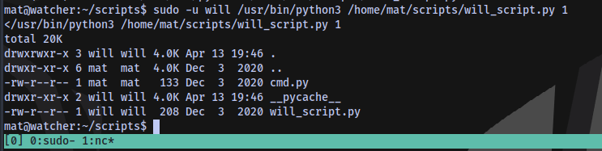

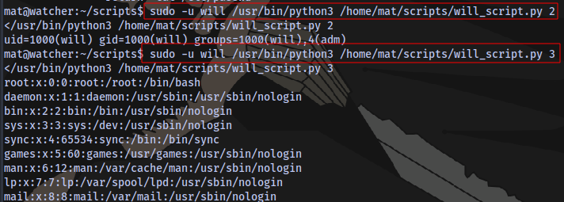

We own the script `cmd.py`

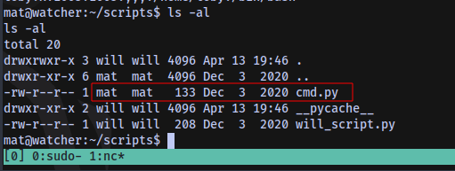

Since we have write access we can insert a python reverse shell payload into the script, setup a netcat listener, run the script and catch a shell as the user will

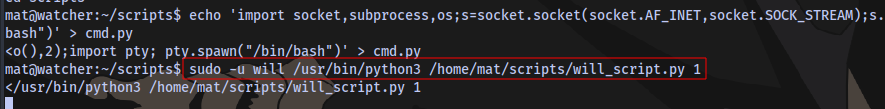

Shell access

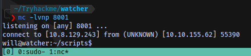

Sixth flag obtained 

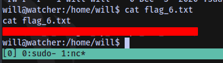

# Flag 7

Running a linpeas scan lead to the discovery of a sub directory inside of the opt directory

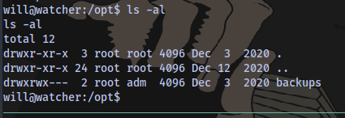

Since our user is in the `adm` group then we have full access

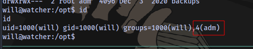

inside we have a base 64 code

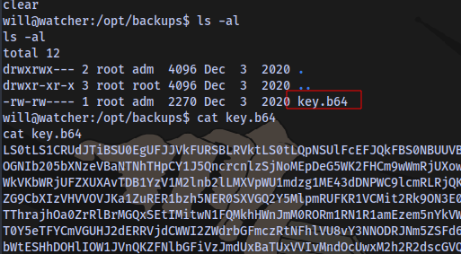

Decoding it using cyberchef

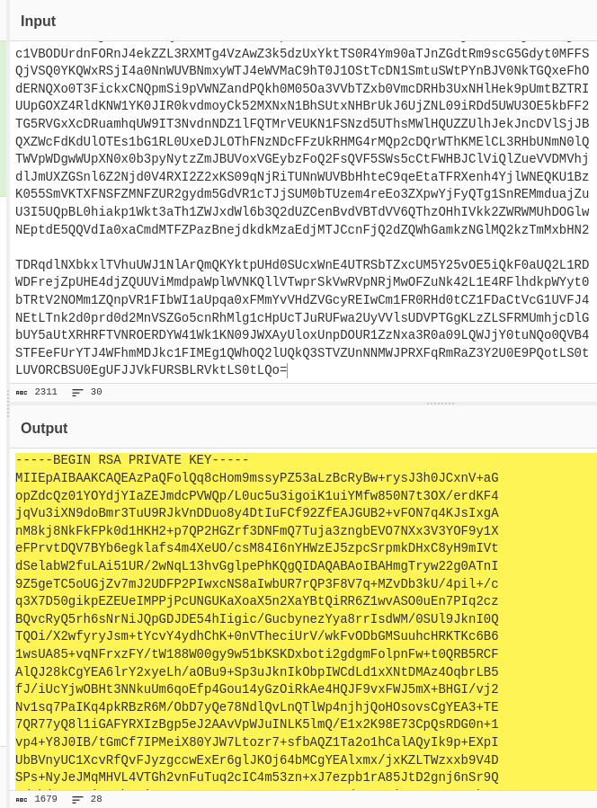

we have a private key.

Next steps. Save the key into a file named `id_rsa`, Crack it using John The Ripper to get the passhrase, login using the key and the username root.

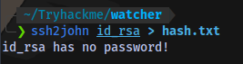

Trying to convert the key to JTR hash format reveals that there is no password.

So we can just login with the key via ssh

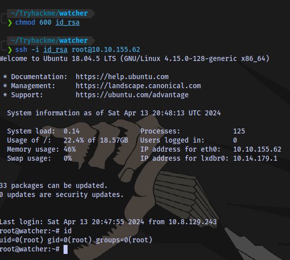

Seventh and Final flag obtained

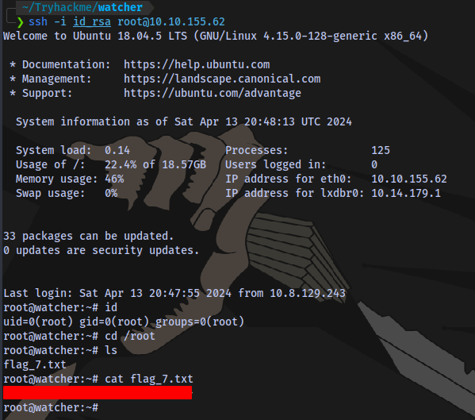

The End.

