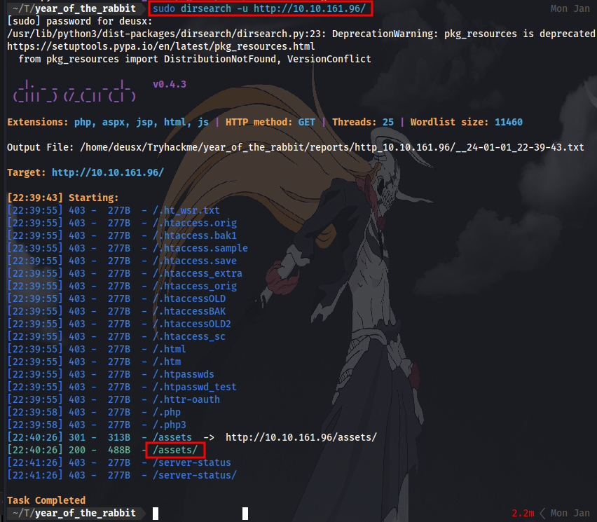
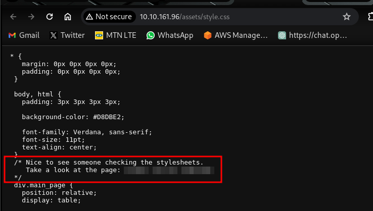
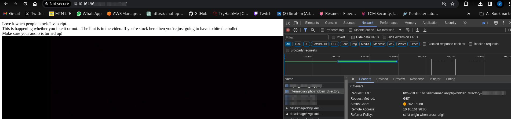
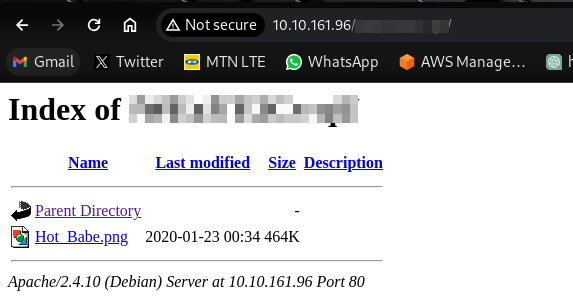
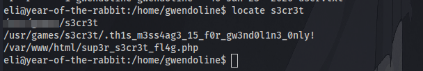
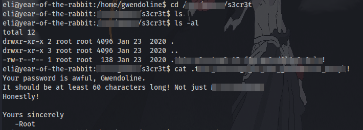

# Year of the Rabbit
Difficulty: Easy

# Introduction

  

Let's have a nice gentle start to the New Year!  
Can you hack into the Year of the Rabbit box without falling down a hole?

**_(Please ensure your volume is turned up!)_**

# Enumeration
First up, We perform an Nmap scan to discover open port and services running on the target machine.

Nmap scan result:

Here we have 3 open ports. An ftp port but no anonymous login enabled, An ssh port for remote access to the machine, and a http website running on port 80. Navigating to the website, we are met with an Apache2 default page with no vital info.

Next up is to perform a directory brute-force to discover hidden webpages.

Using the tool "dirsearch":

only the directory "/assets" was discoverd.

There are only 2 files here, a video named "RickRolled" lol, and a css document. 

carefully looking through the css document, there is a hidden directory given to us there. 

navigating to it, there is a popup that advises us to turn off javascript in our browser. To do that in firefox:

type in `about:config` in the URL bar, accept warning and then disable javascript.

For chrome:

type in the following into the URL bar: `chrome://settings/content/javascript?search=javasc` and disable it.

successfully doing that and navigating to the directory, we have some saying there is a hint in the video but after watching the video, at the :56 second mark a voice speaks and tells us we are looking in the wrong place, which means there's something else we have to look for. 

After much searching i discovered in the Network tab that there was a request being sent to  a hidden directory which retrieves the video and then redirects us to the current page:

Navigating to this discovered directory:

We have a .png image file here. Downloading the image, we have a picture of a "Hot Babe" but no vital information for us. Next up is to try and extract possible hidden information using some steganography. Using the command `strings <filename>` we might get some valuable information hidden in the image.

scrolling to the bottom of the line we get the username for FTP and a list of possible passwords. we can use this list to create a wordlist and then use hydra to brute-force for the password of the FTP service. So we can just copy and paste everything from line 6282 to the end and create a new file called 'wordlist.txt' and use hydra to brute-force using the syntax: 
`hydra -l <username> -P wordlist.txt ftp://IP`

we have a password and can login to the FTP server using `ftp <IP>`

after logging in, there is a file which most probably contains some useful credentials. Download it to your local machine using `get <filename>`, then you can exit out of ftp using `exit` command.

It seems to contain some kind of code. we can identify and decode it using my favorite [tool](https://www.dcode.fr/cipher-identifier) 

The most likely code result is "Brainfuck", totally agree.
Clicking on it takes us to a page to decode it, paste it in and execute.

we now have actual credentials. Possibly ssh login creds. Lets test them.
# Initial Access

After logging in we are greeted with a message from the  root user talking about a hidden message. Let's first try and find the flag. After searching around the system the first flag can be located in Gwendoline's home directory but we have no read access which means we have to look for a way to login as the user.
Note: commands like `clear` might not work for you, to fix just enter the following `export TERM=xterm`

Going back to the message we were greeted with after logging in via ssh it says a hidden message is in a leet s3cr3t hiding place. After searching around the system for a while i decided to use the locate command to find the file or folder "s3cr3t" using `locate s3cr3t`

the first result happened to be the be the one.

navigating to the folder, there is a hidden file which contains Gwendoline's password.

With that we are able to obtain the first flag:

# Privilege Escalation

Now time to escalate to root to get the final flag.

First up entering the command `sudo -l`:

it reveals the user can run the following but not as root. Checking [GTFObins](https://gtfobins.github.io/gtfobins/vi/#sudo)

entering the command didn't work after trying multiple ways. After a long exhausting research i found out the sudo version is vulnerable to [CVE-2019-14287](https://www.exploit-db.com/exploits/47502)

there is a detailed explanation on how the exploit works but all we need is to edit this line from `sudo -u#-1 /bin/bash` to `sudo -u#-1 /usr/bin/vi /home/gwendoline/user.txt` which opens up vi, the we  enter the following and press enter to spawn a bash shell as root:

And we are root and can cat the final flag in /root.

GGs 🤝 Happy Hacking!

