# Specter


Welcome to **Specter**! This machine is crafted to push your hacking skills to the limit. Your challenge is to uncover hidden vulnerabilities, exploit them, and ultimately gain root access to capture the flag. Please start the machine and give it 5 minutes to fully boot up. Dive in, think creatively, and get to root. Good luck!

# How many ports are open?

```shell
# Nmap 7.94SVN scan initiated Thu May 30 13:27:06 2024 as: nmap -sCV -p- --min-rate=1000 -T4 -oN scan -vv 10.10.30.244
Warning: 10.10.30.244 giving up on port because retransmission cap hit (6).
Nmap scan report for 10.10.30.244
Host is up, received reset ttl 63 (0.20s latency).
Scanned at 2024-05-30 13:27:06 WAT for 134s
Not shown: 65532 closed tcp ports (reset)
PORT   STATE SERVICE REASON         VERSION
21/tcp open  ftp     syn-ack ttl 63 vsftpd 3.0.3
| ftp-syst: 
|   STAT: 
| FTP server status:
|      Connected to ::ffff:10.8.129.243
|      Logged in as ftp
|      TYPE: ASCII
|      No session bandwidth limit
|      Session timeout in seconds is 300
|      Control connection is plain text
|      Data connections will be plain text
|      At session startup, client count was 4
|      vsFTPd 3.0.3 - secure, fast, stable
|_End of status
| ftp-anon: Anonymous FTP login allowed (FTP code 230)
| -rw-r--r--    1 110      114           393 May 28 13:30 note
|_-rw-r--r--    1 110      114            42 May 28 13:19 remenber_this
22/tcp open  ssh     syn-ack ttl 63 OpenSSH 7.6p1 Ubuntu 4ubuntu0.7 (Ubuntu Linux; protocol 2.0)
| ssh-hostkey: 
|   2048 bd:38:aa:fc:03:e8:9f:5b:42:31:a6:01:33:86:c2:71 (RSA)
| ssh-rsa AAAAB3NzaC1yc2EAAAADAQABAAABAQC1W220rizxHG+LFjX4wFElbpk3BD9iztGbZ0355e28D4/I/6wm8RqqcujKD6gQReXfO0lKei1aMV9sUOSknGGM4Yrnjf/UW78rMJm5bT2bVyDeqHOlIQanrRBNpXUXGDawKBUumfl5NErcFxlQMCJfIgoPPqFLHstfzM3i3lZQKk5QIOJ+MRn9rW3NqiUk72RRSFUaiUCTkZCLslCGt/xswf1D5KCCK6nYy5a50yrR+z1QSLjGRmT1958k2/DQ+bBIjrGPk4f5Bag5/WD/pV7BJOlBsz4zZIECn7ORRPZ1t+J61hwQiwUNyIu+t6Trd9R4Qec6b4vYP/QHRQFj9Fo/
|   256 21:f4:94:a5:b9:d6:d4:48:c4:2f:34:f7:65:4e:33:4e (ECDSA)
| ecdsa-sha2-nistp256 AAAAE2VjZHNhLXNoYTItbmlzdHAyNTYAAAAIbmlzdHAyNTYAAABBBBwHf+nuu9B51KWxDpjIS14pka/zCuEgduIDGOecNg/tNH9xeBp3sZCOXOZ+MJ6CYtaD1RVU6cgZBSMptP5fJkg=
|   256 e5:df:43:3d:67:69:01:08:7b:45:f0:11:7f:83:b6:b7 (ED25519)
|_ssh-ed25519 AAAAC3NzaC1lZDI1NTE5AAAAIN/qYvmRC3isEU12uHrxEf+b/j7p6Pbpzwmr3PG+Ypfq
80/tcp open  http    syn-ack ttl 63 Apache httpd 2.4.29 ((Ubuntu))
|_http-title: SparoHack - Penetration Testing Learning Platform
| http-methods: 
|_  Supported Methods: GET POST OPTIONS HEAD
| http-robots.txt: 1 disallowed entry 
|_/page004555456.php
|_http-server-header: Apache/2.4.29 (Ubuntu)
Service Info: OSs: Unix, Linux; CPE: cpe:/o:linux:linux_kernel

Read data files from: /usr/bin/../share/nmap
Service detection performed. Please report any incorrect results at https://nmap.org/submit/ .
# Nmap done at Thu May 30 13:29:20 2024 -- 1 IP address (1 host up) scanned in 134.64 seconds
```

```shell
nmap -sCV -p- --min-rate=1000 -T4 IP -oN scan -vv
```

3 ports are open
- FTP File Transfer Protocol (21)
- SSH Secure Shell (22)
- HTTP Hypertext Transfer Protocol (80)

# What is the hidden directory?

Since HTTP is running on port 80 it means there is a website there.

Copy and paste the IP into the URL bar 


To find hidden directories, we can perform a directory scan, You can use any tool but i'll be using `dirsearch` with it's default wordlist

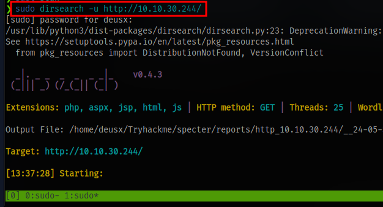

```shell
sudo dirsearch -u URL
```

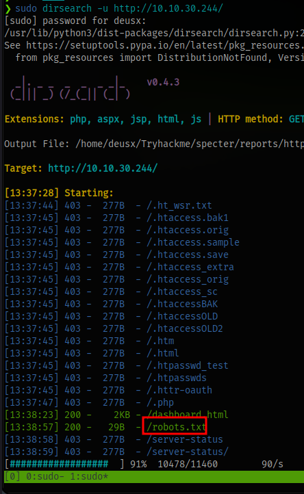

We are able to find a robots.txt file. 

What is robots.txt file?

A robots.txt file **tells search engine crawlers which URLs the crawler can access on your site**.

Checking out the contents of this file in our web browser we can see a disallowed directory and this is our hidden directory

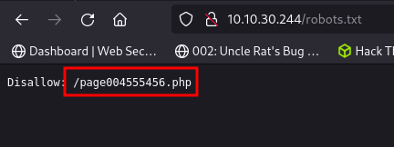


# Who is the user with weak credentials?

Taking a step back, before visiting this webpage. Looking back at the nmap scan it show that we have anonymous login enabled for the FTP server. This means we can login with the username `anonymous` and no password

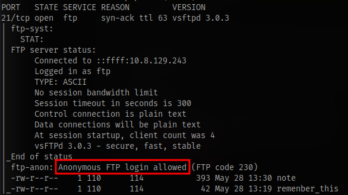

Login to the ftp server and download all files using the command `mget *`

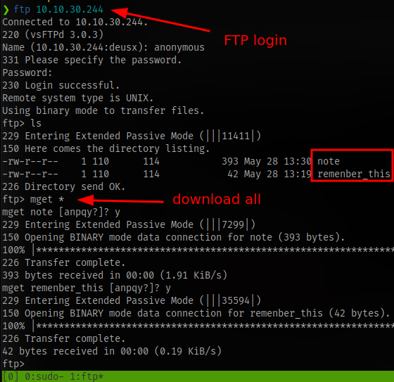

Checking the contents of the files

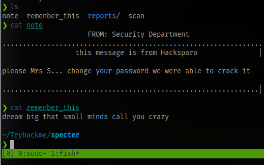

We have an incomplete username and the message says the password for the user was easily crackable. This means if we are able to get the full username, we can perform a brute force attack on the SSH service running on the machine and gain access.

Going back to the webpage we found `/page004555456.php`

Visiting the webpage shows there is an LFI (Local File Inclusion) vulnerability present in the URL

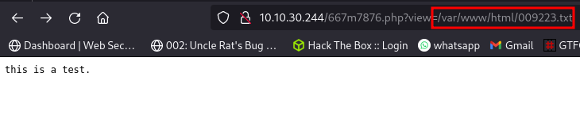

This vulnerability will basically allow us to read file on the server by specifying the path to the file.

The view parameter is the vulnerable parameter so let's say we want to check the file that contains list of users on a linux system (/etc/passwd) which is accessible to every user, we can do so by just supplying the path to the view parameter

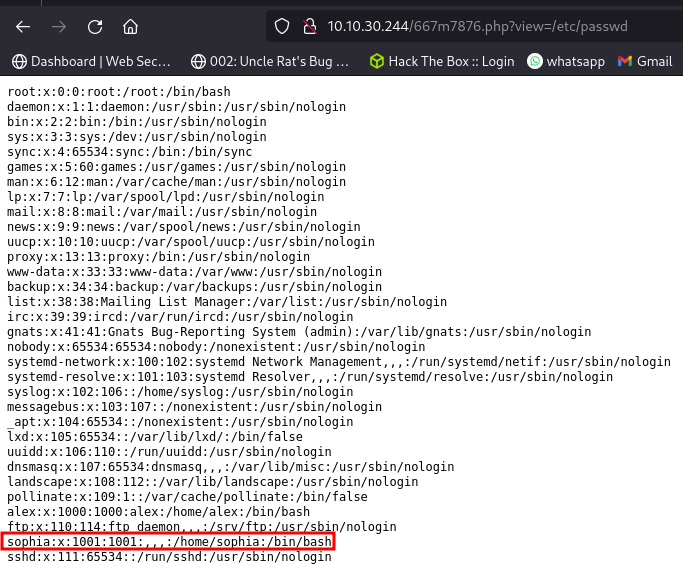

We can see 2 users `alex` and `sophia`

Remember the message from earlier the user's name started with an S which means the user is `sophia`. So this answers the question.

# What is the user's password?

Time to brute force SSH using hydra for sophia's password

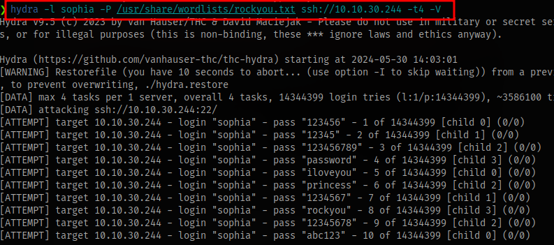

```shell
hydra -l sophia -P /usr/share/wordlists/rockyou.txt ssh://IP -t4 -V
```

After a couple minutes, we get the password

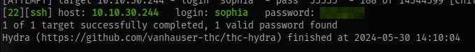

Next step is to ssh into the machine

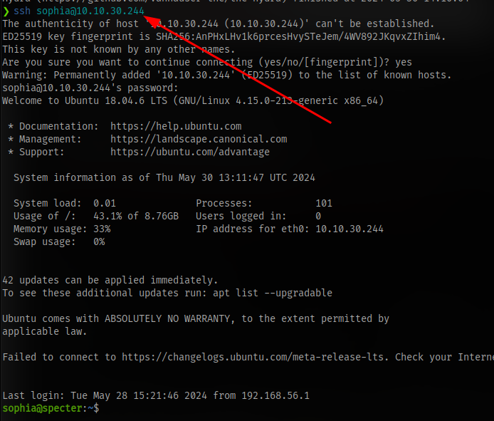

# What is the user flag? 

Next up is to find the flag, we can see the flag is in alex's home directory

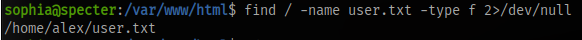

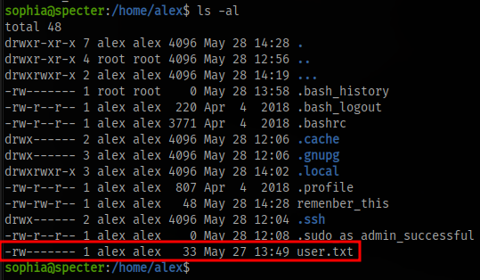

But we can see only alex can read the file, which means we have to pivot to alex.

Checking commands our user can run with sudo

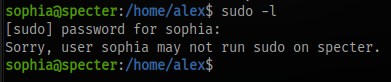

we can't run anything.

To make things easier, we can use a script called [linpeas](https://linpeas.sh/) to automate the lateral privilege escalation enumeration

- Download the script
- Start a python server on your machine
- use wget to download the script to the target machine
- give the script executable permission
- run the script

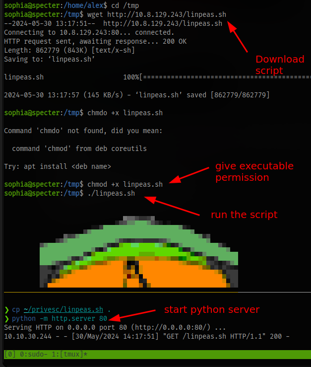

Checking through the results, you can see a directory

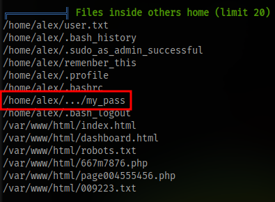

I somehow missed this initially, there is an actual directory with the name `...` in alex's home direcotory

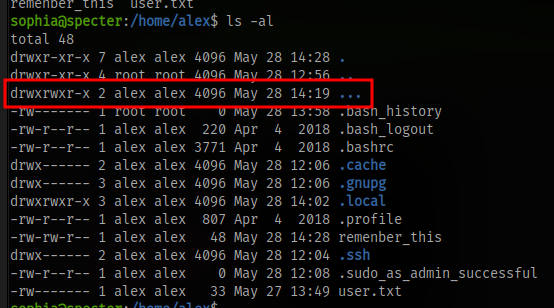

inside here we can find the password for alex

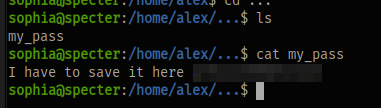

Switch to the alex user using the `su` command and obtain the flag

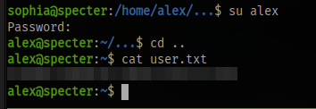

# What is the root flag?

Checking for sudo permissions as the user alex we can see the user alex can run the curl command without a password

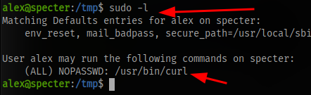

One easy way to exploit this is to just read the flag directly

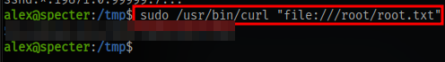

```shell
sudo /usr/bin/curl "file:///root/root.txt"
```

GGs 🤝