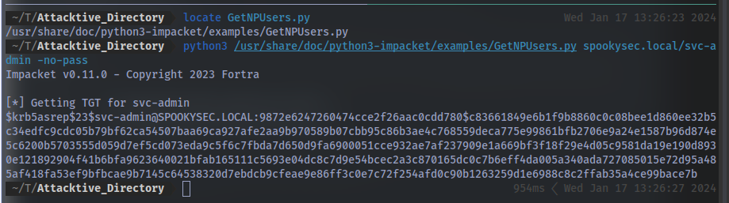
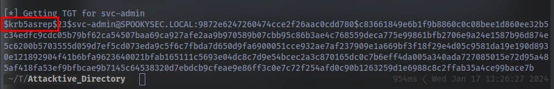
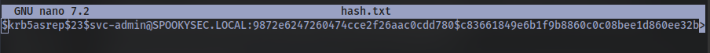
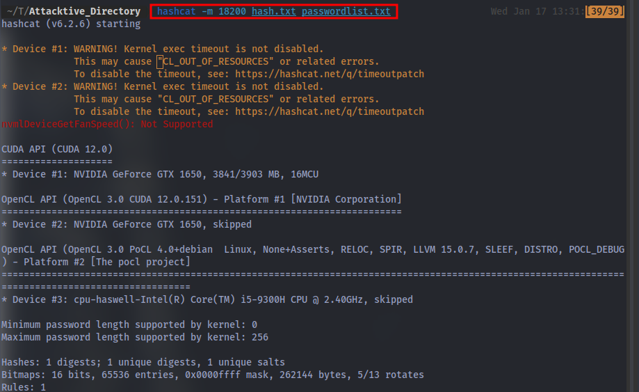
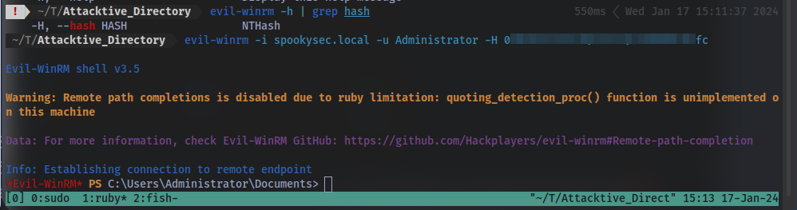
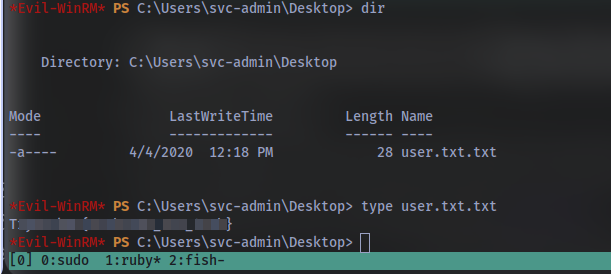

# Attacktive Directory

99% of Corporate networks run off of AD. But can you exploit a vulnerable Domain Controller?

# Task 1 Intro Deploy The Machine

*Deploy Machine*
# Task 2: Intro Setup

*Install Impacket, Bloodhound and Neo4j*

# Task 3: Enumeration Welcome to Attacktive Directory

***Welcome to Attacktive Directory***

*Welcome Dear User!*

*Thank you for doing my first room. I originally created this room for my final project in my Cyber Security degree program back in 2019. Since then, I've gone on to make several other rooms, even a Network for THM. In May 2021, I made the decision to renovate this room and make it more guided and less challenge based so there are more learning opportunities for others. I hope you enjoy it.*

*Love,*

*[Spooks](https://twitter.com/NekoS3c)*

*Enumeration*  

*Basic enumeration starts out with an **nmap scan**. Nmap is a relatively complex utility that has been refined over the years to detect what ports are open on a device, what services are running, and even detect what operating system is running. It's important to note that not all services may be deteted correctly and not enumerated to it's fullest potential. Despite nmap being an overly complex utility, it cannot enumerate everything. Therefore after an initial nmap scan we'll be using other utilities to help us enumerate the services running on the device.*

*For more information on nmap, check out the [nmap room](https://tryhackme.com/room/furthernmap).*

***Notes_:_* Flags for each user account are available for submission. You can retrieve the flags for user accounts via RDP (Note: the login format is spookysec.local\User at the Window's login prompt) and Administrator via Evil-WinRM.*

*What tool will allow us to enumerate port 139/445?* enum4linux

*enum4linux is a Linux-based tool designed for network enumeration and information gathering. It's commonly used in penetration testing and vulnerability assessments*

Let's perform a scan using this tool.

*What is the NetBIOS-Domain Name of the machine?*

Using enum4linux:

Using Nmap:

*What invalid TLD do people commonly use for their Active Directory Domain?*

# Task 4: Enumeration Enumerating Users via Kerberos

***Introduction:***

*A whole host of other services are running, including **Kerberos**. Kerberos is a key authentication service within Active Directory. With this port open, we can use a tool called [Kerbrute](https://github.com/ropnop/kerbrute/releases) (by Ronnie Flathers [@ropnop](https://twitter.com/ropnop)) to brute force discovery of users, passwords and even password spray!*

***Note:** Several users have informed me that the latest version of Kerbrute does not contain the UserEnum flag in Kerbrute, if that is the case with the version you have selected, try a older version!*

***Enumeration:***

*For this box, a modified [User List](https://raw.githubusercontent.com/Sq00ky/attacktive-directory-tools/master/userlist.txt) and [Password List](https://raw.githubusercontent.com/Sq00ky/attacktive-directory-tools/master/passwordlist.txt) will be used to cut down on time of enumeration of users and password hash cracking. It is **NOT** recommended to brute force credentials due to account lockout policies that we cannot enumerate on the domain controller.*

To install kebrute:
- go to this [link](https://github.com/ropnop/kerbrute/releases/tag/v1.0.2) and download this file:

- Open your terminal and navigate to the directory where you downloaded to.
- Run the command `mv kerbrute_linux_amd64 kerbrute`
- Next command `chmod +x kerbrute` to make it an executable
- Now you can run it with `./kerbrute`

*What command within Kerbrute will allow us to enumerate valid usernames?* 

*What notable account is discovered? (These should jump out at you)*

Make sure to edit your /etc/hosts file to add the entry for the AD domain "spookysec.local"

`sudo nano /etc/hosts`
enter your machine's IP and the domain

Next up make sure to download the [user list](https://raw.githubusercontent.com/Sq00ky/attacktive-directory-tools/master/userlist.txt) and the [password list](https://raw.githubusercontent.com/Sq00ky/attacktive-directory-tools/master/passwordlist.txt)

Now to start our user enumeration using kerbrute:

The notable account is "svc-admin"

*What is the other notable account is discovered? (These should jump out at you)* 
"backup"

# Task 5 Exploitation Abusing Kerberos

***Introduction***

*After the enumeration of user accounts is finished, we can attempt to abuse a feature within Kerberos with an attack method called **ASREPRoasting.** ASReproasting occurs when a user account has the privilege "Does not require Pre-Authentication" set. This means that the account **does not** need to provide valid identification before requesting a Kerberos Ticket on the specified user account.*

***Retrieving Kerberos Tickets***

*[Impacket](https://github.com/SecureAuthCorp/impacket) has a tool called "GetNPUsers.py" (located in impacket/examples/GetNPUsers.py) that will allow us to query ASReproastable accounts from the Key Distribution Center. The only thing that's necessary to query accounts is a valid set of usernames which we enumerated previously via Kerbrute.*

***Remember:**  Impacket may also need you to use a python version >=3.7. In the AttackBox you can do this by running your command with `python3.9 /opt/impacket/examples/GetNPUsers.py`.*

*We have two user accounts that we could potentially query a ticket from. Which user account can you query a ticket from with no password?*

`python3 /usr/share/doc/python3-impacket/examples/GetNPUsers.py spookysec.local/svc-admin -no-pass`

*Looking at the Hashcat Examples Wiki page, what type of Kerberos hash did we retrieve from the KDC? (Specify the full name)*

Go to this [site](https://hashcat.net/wiki/doku.php?id=example_hashes) and search for it:

*What mode is the hash?* 18200

*Now crack the hash with the modified password list provided, what is the user accounts password?*

First up copy the entire hash and put it in a file:

Now use this hashcat syntax to crack it:
`hashcat -m 18200 <hash_file> <wordlist>`

# Task 6 Enumeration  Back to the Basics

**Enumeration:**

With a user's account credentials we now have significantly more access within the domain. We can now attempt to enumerate any shares that the domain controller may be giving out.

*What utility can we use to map remote SMB shares?* smbclient

*smbclient is samba client with an "ftp like" interface. It is a useful tool to test connectivity to a Windows share. It can be used to transfer files, or to look at share names. In addition, it has a nifty ability to 'tar' (backup) and restore files from a server to a client and visa versa.*

Which option will list shares? -L 

How many remote shares is the server listing?

There is one particular share that we have access to that contains a text file. Which share is it?

What is the content of the file?

we can use the command `get <filename>` to download the file to our local machine, then use the command `exit` to leave and cat the file which will be in our current directory.

Decoding the contents of the file, what is the full contents?
It's a base64 code which can be decoded in our terminal using `echo "<base64_code>" | base64 -d`

# Task 7 Domain Privilege Escalation Elevating Privileges within the Domain

**Let's Sync Up!**

Now that we have new user account credentials, we may have more privileges on the system than before. The username of the account "backup" gets us thinking. What is this the backup account to?

Well, it is the backup account for the Domain Controller. This account has a unique permission that allows all Active Directory changes to be synced with this user account. This includes password hashes

  

Knowing this, we can use another tool within Impacket called "secretsdump.py". This will allow us to retrieve all of the password hashes that this user account (that is synced with the domain controller) has to offer. Exploiting this, we will effectively have full control over the AD Domain.

What method allowed us to dump NTDS.DIT? 

`python3 /usr/share/doc/python3-impacket/examples/secretsdump.py spookysec.local/backup:backup2517860@<IP>`

From the output we can see the DRSUAPI method is used to get NTDS.DIT secrets.

What is the Administrators NTLM hash? `[REDACTED]`

What method of attack could allow us to authenticate as the user without the password? pass the hash

*pass the hash is a hacking technique that allows an attacker to authenticate to a remote server or service by using the underlying NTLM or LanMan hash of a user's password, instead of requiring the associated plaintext password as is normally the case.*

Using a tool called Evil-WinRM what option will allow us to use a hash? -H

# Task 8 Flag Submission Flag Submission Panel

**Flag Submission Panel**

Submit the flags for each user account. They can be located on each user's desktop.  

If you enjoyed this box, you may also enjoy my [blog post!](https://blog.spookysec.net/kerberos-abuse/)

svc-admin

backup

Administrator

The End. GGs 🤝. Thanks for reading to the end and have a nice day !